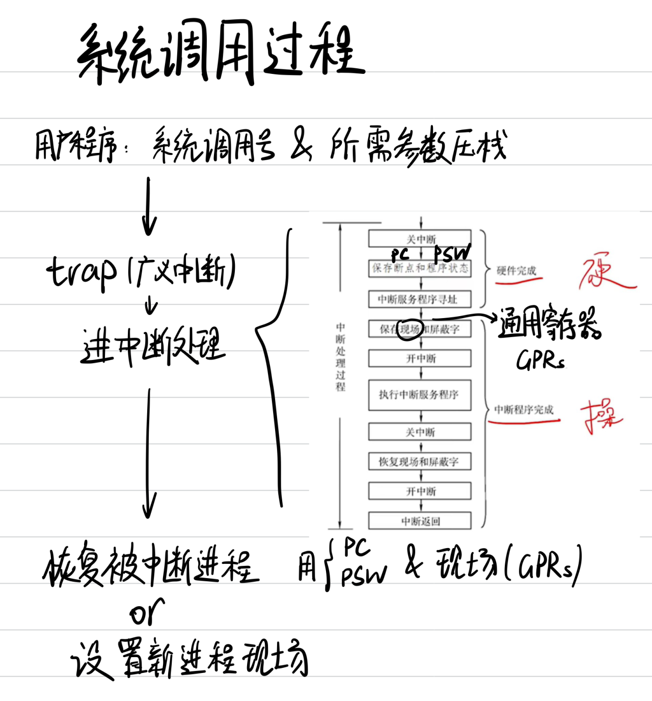
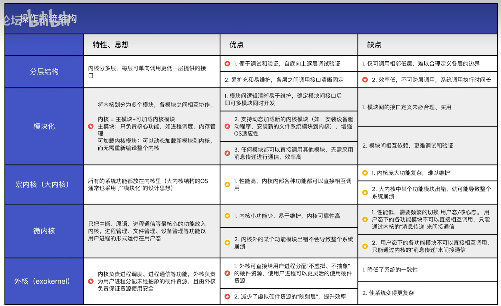

# 第一章 操作系统概述

## 目录
- [第一章 操作系统概述](#第一章-操作系统概述)
  - [目录](#目录)
- [1.0 错题速览](#10-错题速览)
- [1.1 操作系统的基本概念](#11-操作系统的基本概念)
  - [1.1.3 OS的特征](#113-os的特征)
    - [并发](#并发)
    - [共享](#共享)
    - [虚拟](#虚拟)
    - [异步](#异步)
- [1.2 OS发展历程](#12-os发展历程)
    - [手工操作阶段](#手工操作阶段)
    - [批处理阶段 —— 单道批处理系统](#批处理阶段--单道批处理系统)
    - [多道批处理 —— OS诞生](#多道批处理--os诞生)
    - [分时操作系统](#分时操作系统)
    - [实时操作系统](#实时操作系统)
    - [其他集中](#其他集中)
  - [考点易错点](#考点易错点)
- [1.3 操作系统的运行环境](#13-操作系统的运行环境)
  - [1.3.1 处理器应用程序](#131-处理器应用程序)
  - [1.3.2 中断和异常](#132-中断和异常)
    - [中断的作用](#中断的作用)
    - [中断机制实现原理](#中断机制实现原理)
  - [1.3.3 系统调用](#133-系统调用)
    - [系统调用的过程](#系统调用的过程)
    - [中断处理过程vs子程序调用过程](#中断处理过程vs子程序调用过程)
  - [补充概念及信息](#补充概念及信息)
    - [子程序调用vs中断处理](#子程序调用vs中断处理)
    - [硬件完成的内容](#硬件完成的内容)
- [1.4 操作系统体系结构](#14-操作系统体系结构)
    - [大内核](#大内核)
    - [微内核](#微内核)
    - [考点](#考点)
- [1.5 操作系统引导](#15-操作系统引导)
- [1.6 虚拟机](#16-虚拟机)
    - [第一、二类虚拟机管理程序](#第一二类虚拟机管理程序)

# 1.0 错题速览

- 1.1 无

- 1.2 T3、13、19

- 1.3 T1、4、13、17、21、31

- 1.456 T3、5、8、15、18

# 1.1 操作系统的基本概念

操作系统的概念

- 硬件->OS->应用程序->用户

操作系统的功能和目标

- 系统资源的管理者 —— 安全、高效
  - 处理机管理 —— CPU
  - 存储器管理 —— 内存
  - 文件管理
  - 设备管理

- 向上层提供方便易用的服务
  - GUI —— 用户用
  - 命令接口 —— 用户用
    - 交互式/联机命令接口
    - 批处理/脱机命令接口
  - 程序接口 —— 程序员用
    - **系统调用**（广义指令）
  - 狭义的用户接口
    - 仅包含命令接口、程序接口
    - 不含GUI

- 实现对计算机资源的扩充
  - 裸机
  - 扩充机器/虚拟机

## 1.1.3 OS的特征

### 并发

- 并发：宏观同时发生，微观交替发生

- 并行：同一时刻发生
- OS并发性：“同时”允许多个程序 —— OS和程序并发一起诞生
- 单核CPU：各程序只能并发执行
- 多核CPU：多个程序可以并行执行

### 共享

- 互斥共享方式：一段时间一个进程访问资源

- 同时共享方式：多个进程“同时”访问
  - 同时：宏观上
  - 而微观上：可能分时共享，也可能同时使用
- 若失去并发性，则共享性失去存在意义
- 若失去共享性，则无法实现并发

### 虚拟

- 时分复用
- 空分复用
- 没有并发性，虚拟性失去意义

### 异步

- 进程以不可预知的速度推进

# 1.2 OS发展历程

关注、理解各类操作系统想解决什么问题，及各自优缺点

### 手工操作阶段

缺点：

- 用户独占使用
- 人机速度矛盾，资源利用率极低

### 批处理阶段 —— 单道批处理系统

脱机输入/输出，监督程序

- 缓解人机速度矛盾，提升资源利用率
- 但是CPU仍有大量时间等待I/O完成

### 多道批处理 —— OS诞生

每次往内存读入多道程序，支持多道程序并发运行

- 共享计算机资源，资源利用率大幅提升
- 但是没有人机交互功能
- **中断**

### 分时操作系统

时间片为单位轮流为各个用户/作业服务

- 解决人机交互问题，用户请求即时响应
- 允许多个用户同时使用一台计算机
- 但是不能优先处理紧急任务

### 实时操作系统

- 及时性可靠性
- 硬实时系统 —— 导弹
- 软实时系统

### 其他集中

网络操作系统

分布式

个人计算机

## 考点易错点

- 多道程序设计特点
  - 引入多道程序后，程序的执行失去封闭性和顺序性
    - 失去封闭性：一道程序执行过程中转而执行另一个程序
    - 失去顺序性：ohyes，它们调度并没有一定的顺序
  - 有制约性
    - 因为共享资源，需要相互协同相互制约
- 多任务操作系统
  - 具有并发和并行的特点
  - 并行：CPU和I/O设备并行
  - 需要实现对共享资源的保护
- IBM-PC中，操作系统被称为：微型计算机操作系统

# 1.3 操作系统的运行环境

## 1.3.1 处理器应用程序

- 内核程序 v.s. 应用程序
- 内核：最接近硬件的部分
- OS的功能未必都在内核中，例如GUI
- 特权指令 v.s. 非特权指令
  - CPU设计时能判断指令类型
  - 但是它如何区分此时运行的是内核程序还是应用程序？
  - CPU状态：内核态、用户态，PSW二进制位标识
- 用户态=目态；内核态=核心态=管态
- 内核态 --一条**特权指令**-> 用户态，从而运行用户程序
- 用户态 --**中断**->内核态，硬件自动完成变态
- 需要OS介入的事件都会触发中断

## 1.3.2 中断和异常

### 中断的作用

CPU上运行两种程序：OS内核程序，应用程序

- 中断：OS内核夺回CPU使用权唯一途径
- 如果没有中断机制，则无法实现并发
- 内核执行特权指令变为用户态

中断类型

- 内中断 —— 异常
  - 来自CPU内部，与当前执行指令有关
    - 用户态执行特权指令
    - 除数为0
    - 应用请求内核服务——陷入指令trap
    - 系统调用通过trap实现
  - 分类：
    - trap —— 程序主动引发3
    - 故障 —— 如缺页，可能被修复
    - 终止 —— 致命错误，整数除以0、非法使用特权指令，直接干掉
- 外中断 —— 中断
  - 来自CPU外部，与当前指令无关
    - 时钟中断，实现多道程序并发运行
    - I/O中断请求
    - 每条指令执行结束，CPU例行执行是否有外中断信号

### 中断机制实现原理

中断向量表

## 1.3.3 系统调用

程序接口由一组系统调用组成

和共享资源有关的操作，都必须通过系统调用的方式请求内核完成

- 设备管理
- 文件管理
- 进程控制
- 进程通信
- 内存管理

### 系统调用的过程

### 中断处理过程vs子程序调用过程

| 子程序调用                                                   | 中断处理                                             |
| ------------------------------------------------------------ | ---------------------------------------------------- |
| 子程序主程序是同一程序两部分，主从关系                       | 无                                                   |
| CALL指令引起                                                 | 随机产生                                             |
| 完全软件处理过程                                             | 需要硬件电路                                         |
| CALL指令地址码给出                                           | 入口地址由硬件向量法产生 由向量地址找到入口地址 |
| 需要保存PC，由CALL指令完成 执行CALL时，CPU将PC入栈，再设置PC | 需要保存PC，由中断隐指令完成                         |
| 无需                                                         | 需对同时到达的多个中断请求进行裁决                   |

## 补充概念及信息

常见指令

- 直接管理系统资源
  - 设置时钟
  - 启动/关闭硬件设备
  - 切换进程
  - 设置中断
- 系统状态修改
  - 中断向量表
  - 切换CPU运行状态
- 系统控制指令
  - 重启
  - **停机**

通用操作系统

- 使用时间片轮转法，程序不需预先预定运行时间
- OS执行程序，必须从起始地址开始执行

通道：I/O通道

- 实际上是一个特殊的处理器

操作系统必须提供的功能：中断

库函数vs系统调用

- 通常认为库函数是用户态的内容
- 库函数易替换，系统调用不方便替换

页置换完全由OS完成，而不是通过系统调用

- **区别OS自主完成和请求OS完成**

### 子程序调用vs中断处理

- 中断处理完成后可能返回到原来位置继续执行，需要保存PSW
- 而子程序调用，跳转过去不跳回来了，PSW失去意义了，不用保存

### 硬件完成的内容

- 保存断点、程序状态字
- CPU模式改为内核态

# 1.4 操作系统体系结构

### 大内核

- 高性能
- 难维护

### 微内核

- 方便维护
- 频繁切换内核态用户态，效率低

OS：

- **内核**：
  - 时钟管理、中断管理、**原语 ** —— 必定在内核态
  - 进程管理、存储管理、设备管理 —— 按大内核、微内核在内核态/用户态
- 非内核

原语

### 考点

- 可加载内核模块：驱动程序

- 外核：直接分配物理硬件资源，并保证硬件资源安全
- **微内核**：分块设计、**并不分层**、C/S模式、面向对象
  - 绝对不能说更高效，只能说更方便维护
- **模块化**：分模块开发，但是是一个整体，相互直接引用

# 1.5 操作系统引导

1. 激活CPU。CPU读取**ROM**中的boot程序，PC置为**BIOS**第一条指令
   - ROM包含：ROM引导程序，即自举程序
2. 硬件自检。**BIOS**在**内存**中构建中断向量表，接下来通电自检（POST），过程中需要用到中断。然后通电自检，检查硬件是否出现故障
3. 加载带有操作系统的硬盘。BIOS将磁盘第一块，即MBR读入内存，执行磁盘引导程序，扫描分区表
   - MBR包含：磁盘引导程序、分区表
4. 从活动分区（主分区，安装了操作系统的分区）读入分区引导记录PBR，执行其中程序
5. 从根目录下找到完整的操作系统初始化程序并执行，完成开机

**过程主语分析**

- BIOS交给启动设备
- CPU加载该设备MBR，MBR检查分区表、活动分区
- MBR将分区引导记录PBR加载到内存执行

# 1.6 虚拟机

### 第一、二类虚拟机管理程序

- 虚拟内核态
  - 上层OS想执行特权指令，由VMM截获并处理
- 客户操作系统
- 宿主操作系统
- 一类性能更好、可迁移性更差
  - 特权指令进一步细分，ring0（最高特权级）、ring1
- 二类性能差、可迁移性更好，只需要打包成ISO
  - 用户进程系统调用，二类VMM截获并申请OS进行相关处理

VMM功能没有OS复杂，所以代码量比OS少