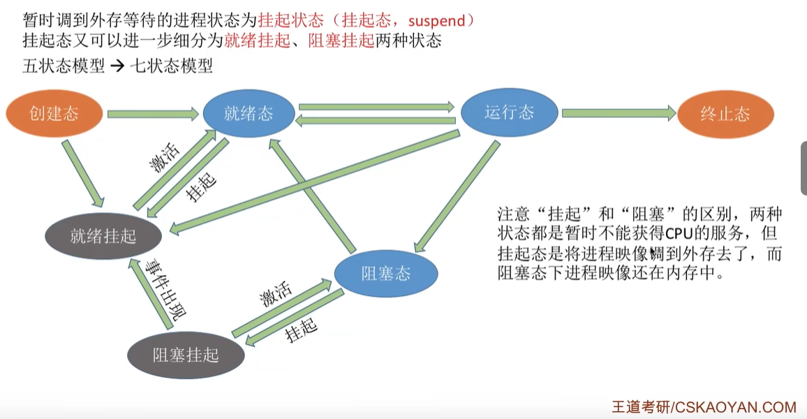
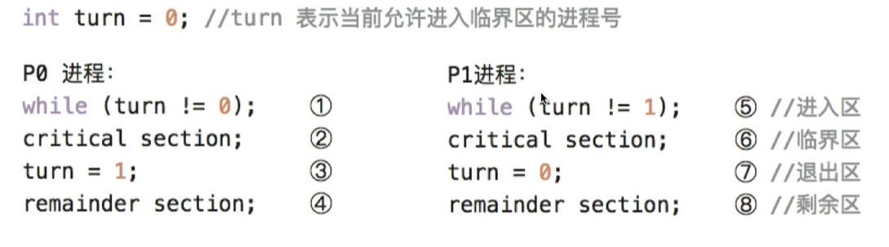
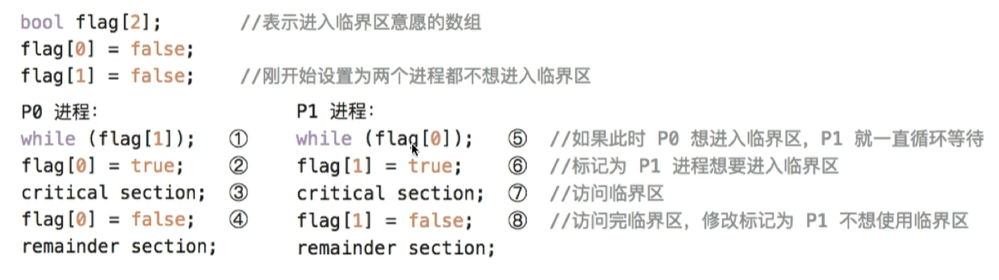
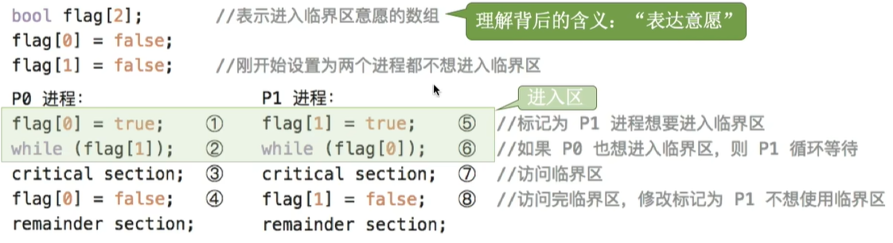
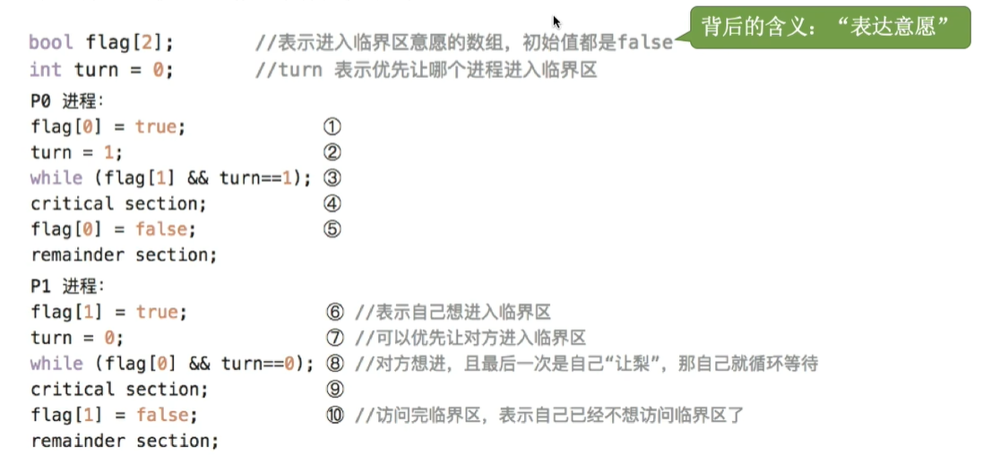
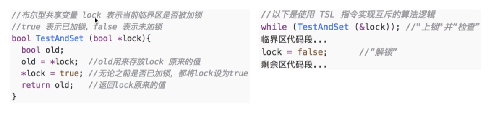
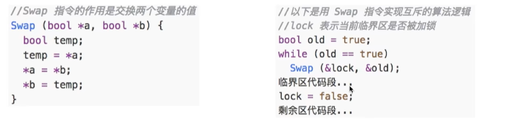
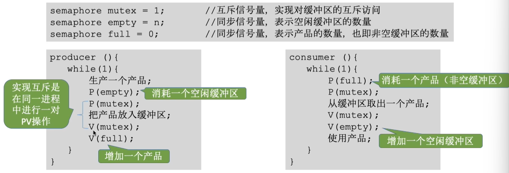
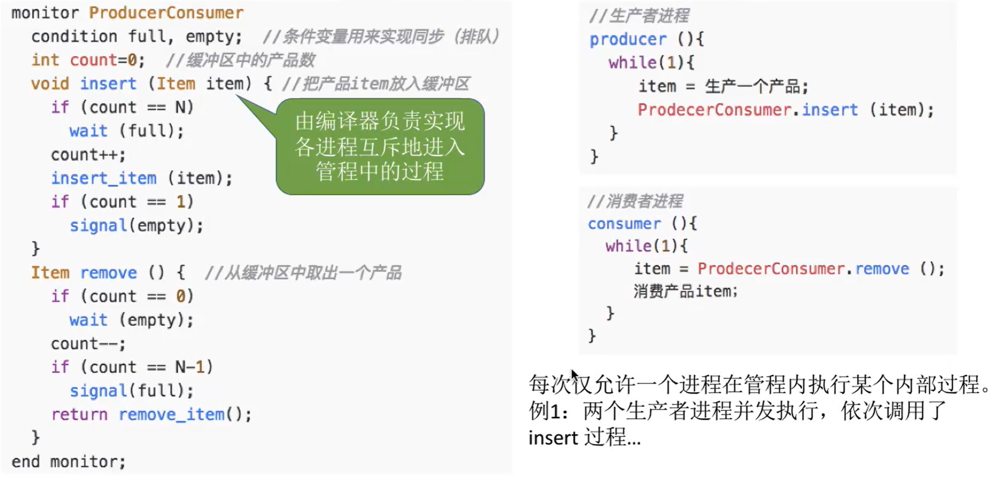

# 第二章 进程与线程

## 目录
- [第二章 进程与线程](#第二章-进程与线程)
  - [目录](#目录)
- [2.0 错题速览](#20-错题速览)
- [2.1 进程与线程](#21-进程与线程)
  - [2.1.1 进程的概念与特征](#211-进程的概念与特征)
  - [2.1.3 进程的状态与转换](#213-进程的状态与转换)
    - [五个状态](#五个状态)
    - [程序状态转换基本事件](#程序状态转换基本事件)
    - [进程组织方式](#进程组织方式)
  - [2.1.4 进程控制](#214-进程控制)
    - [创建](#创建)
    - [终止](#终止)
    - [阻塞、唤醒](#阻塞唤醒)
  - [2.1.5 进程的通信](#215-进程的通信)
    - [共享存储](#共享存储)
    - [消息传递](#消息传递)
    - [管道通信](#管道通信)
    - [信号](#信号)
  - [2.1.6 线程和多线程模型](#216-线程和多线程模型)
    - [基本概念](#基本概念)
    - [进程线程的比较](#进程线程的比较)
    - [线程的属性](#线程的属性)
    - [实现方式](#实现方式)
      - [用户级线程 —— 多对一模型](#用户级线程--多对一模型)
      - [内核级线程 —— 一对一模型](#内核级线程--一对一模型)
      - [组合方式 —— 多对多](#组合方式--多对多)
    - [理解](#理解)
  - [2.1.7 整理](#217-整理)
    - [进程与程序](#进程与程序)
    - [进程基本状态](#进程基本状态)
    - [PCB](#pcb)
    - [信号相关](#信号相关)
    - [线程](#线程)
    - [关于进程状态的转换](#关于进程状态的转换)
    - [终止进程的操作](#终止进程的操作)
- [2.2 CPU调度](#22-cpu调度)
  - [2.2.1 调度的概念](#221-调度的概念)
    - [调度的层次](#调度的层次)
  - [2.2.2\&4 调度的实现](#2224-调度的实现)
    - [时机](#时机)
    - [进程调度方式](#进程调度方式)
    - [调度器/调度程序](#调度器调度程序)
    - [闲逛进程](#闲逛进程)
  - [2.2.3 调度的目标](#223-调度的目标)
    - [CPU利用率](#cpu利用率)
    - [系统吞吐量](#系统吞吐量)
    - [周转时间](#周转时间)
    - [等待时间](#等待时间)
    - [响应时间](#响应时间)
  - [2.2.5 调度算法](#225-调度算法)
    - [先来先服务FCFS](#先来先服务fcfs)
    - [短作业优先SJF/SPF](#短作业优先sjfspf)
    - [抢占式最短作业优先/最短剩余时间优先](#抢占式最短作业优先最短剩余时间优先)
    - [高响应比优先HRRN](#高响应比优先hrrn)
    - [时间片轮转](#时间片轮转)
    - [优先级调度算法](#优先级调度算法)
    - [多级反馈队列调度算法](#多级反馈队列调度算法)
    - [多级队列调度算法](#多级队列调度算法)
    - [**多处理机调度(important)**](#多处理机调度important)
      - [方案一：公共就绪队列](#方案一公共就绪队列)
      - [方案二：私有就绪队列](#方案二私有就绪队列)
  - [整理](#整理)
    - [进程进入临界区在退出前，状态变化](#进程进入临界区在退出前状态变化)
    - [线程进程切换需要进行的操作](#线程进程切换需要进行的操作)
    - [满足实时性的调度方法](#满足实时性的调度方法)
    - [多级反馈队列的特点](#多级反馈队列的特点)
    - [改变进程优先级的时机](#改变进程优先级的时机)
    - [可以处理机调度的时机](#可以处理机调度的时机)
    - [调度的次数](#调度的次数)
  - [2.3 同步与互斥](#23-同步与互斥)
  - [2.3.1 基本概念](#231-基本概念)
    - [同步](#同步)
    - [互斥](#互斥)
  - [2.3.2 实现临界区互斥基本方法](#232-实现临界区互斥基本方法)
    - [软件实现](#软件实现)
      - [单标志法](#单标志法)
      - [双标志先检查法](#双标志先检查法)
      - [双标志后检查法](#双标志后检查法)
      - [Peterson算法](#peterson算法)
    - [硬件实现方法](#硬件实现方法)
      - [中断屏蔽](#中断屏蔽)
      - [TestAndSet](#testandset)
      - [Swap指令](#swap指令)
  - [2.3.3 互斥锁](#233-互斥锁)
  - [2.3.4 信号量机制](#234-信号量机制)
    - [整型信号量](#整型信号量)
    - [记录型信号量](#记录型信号量)
      - [信号量机制实现互斥](#信号量机制实现互斥)
      - [信号量机制实现同步](#信号量机制实现同步)
      - [信号量实现前驱](#信号量实现前驱)
  - [2.3.5 经典同步问题](#235-经典同步问题)
    - [生产者消费者 —— 同步关系](#生产者消费者--同步关系)
      - [样例1：最基础的生产者消费者](#样例1最基础的生产者消费者)
      - [样例2：爸妈放水果](#样例2爸妈放水果)
    - [读者写者 —— 复杂互斥](#读者写者--复杂互斥)
    - [哲学家进餐 —— 死锁](#哲学家进餐--死锁)
  - [2.3.6 管程](#236-管程)
    - [定义和基本特征](#定义和基本特征)
      - [管程解决生产者消费者问题](#管程解决生产者消费者问题)
    - [条件变量](#条件变量)
  - [2.3.7 整理](#237-整理)
    - [概念辨析](#概念辨析)
    - [管程](#管程)
    - [PV操作的概念](#pv操作的概念)
    - [Peterson算法中while条件](#peterson算法中while条件)

# 2.0 错题速览

- 2.1 T3、4、9、13、24、32、35、38、42、51、72、74
- 2.2 T2、3、6、9、12、27、33、38、41、52

# 2.1 进程与线程

程序：静态

进程：动态

## 2.1.1 进程的概念与特征

进程实体：

- 程序段：存放指令序列
- 相关数据段：
- PCB
  - 进程描述信息，PID&用户标识符
  - 分配的资源
  - 运行情况：CPU使用时间、磁盘使用情况、网络流量使用情况
  - 处理机相关信息：即CPU上下文，各寄存器的值。以便重新执行时，能从断点继续执行

特征：

- 动态性
- 并发性：与其他进程并发
- 独立性：独立运行、独立获得资源、独立接受调度
- 异步性 ：与其他进程独立、不可预知
- 结构性

## 2.1.3 进程的状态与转换

### 五个状态

前3个为基本状态

1. 运行态
2. 就绪态 —— 就绪队列
3. 阻塞态 —— 因等待I/O完成或各种阻塞原因
4. 创建态 —— 尚未完成创建工作
5. 终止态 —— 等待资源释放和回收

### 程序状态转换基本事件

- 就绪态 -> 运行态：获得CPU资源
- 运行态 -> 就绪态：时间片用完/被剥夺CPU
- 运行态 -> 阻塞态：请求资源的使用分配/等待某一事件完成（如I/O完成）  **系统调用**
- 阻塞态 -> 就绪态：进程等待的事件到来，阻塞变就绪

### 进程组织方式

链接方式：

- 按状态将PCB分为多个队列
- OS持有指向各个队列的指针

索引方式

- 索引表
- 持有指向各个索引表的指针

## 2.1.4 进程控制

实现创建进程、进程状态转换、撤销已有进程

原语：具有原子性，一气呵成不可中断

- 关中断、开中断实现

### 创建

- 父进程子进程：子进程可继承父进程所拥有的资源，终止时还给父进程
- 创建原语：
  - 分配PID，申请空白PCB（若申请PCB失败则创建失败）
  - 分配所需资源
  - 初始化PCB
  - PCB插入就绪队列 —— 创建态->就绪态
- 引起创建进程的事件：
  - 用户登录：用户登录成功就会创建
  - 作业调度
    - 作业：外存中等待调入内存执行的程序
  - 提供服务
    - 申请打开终端etc.
  - 应用请求

### 终止

- 撤销原语
  - 找到PCB
  - 剥夺CPU
  - 终止其所有子进程
  - 资源还给其父进程/OS
  - 将PCB从队列（链表）删除

- 引起进程终止的事件
  - 正常结束，exit系统调用
  - 异常结束（abort）
  - 用户干预

### 阻塞、唤醒

- 阻塞原语
  - 找到PCB
  - 保护进程运行现场，阻塞态，终止进程运行
  - PCB插入相关阻塞队列

- 切换原语 —— 改变两个进程的state
  - 保存运行环境，存入PCB
  - PCB移入相应队列
  - 选另一个进程执行，更新其PCB
  - 根据PCB恢复其运行环境

- 唤醒原语 —— 事件出现后，调用唤醒原语，将等待该事件的进程唤醒
  - 在事件的等待队列中找到相应进程的PCB
  - 将其从等待队列中移出，变就绪态
  - PCB插入就绪队列

## 2.1.5 进程的通信

需要OS支持，因为各进程内存地址空间相互独立，不可以读取其他进程的数据

### 共享存储

- 直接通过共享存储区实现

- 互斥访问

- Linux中

  - shm_open

  - mmap系统调用，通过增加页表项/段表项，将这片共享内存区映射到各自的地址空间中

- 分类

  - 基于数据结构的共享 —— 低级通信（限制太多了）
  - 基于存储区的共享

### 消息传递

- 格式化消息
- 发送、接收消息两个原语进行交换
- 消息头|消息体
- 分类
  - 直接通信方式，指明进程ID
    - P发送给Q，使用发送原语send
    - msg进入进程Q的消息队列
    - Q接收原语receive（需要点名发送方P）
    - OS检查Q的消息队列，找到P发的
  - 间接通信方式，通过信箱 —— 也叫信箱通信方式
    - P发送给中间实体（信箱），Q从信箱接收
    - 只指明信箱，不指明进程id

### 管道通信

特殊共享文件，pipe，大小固定，单向传输（半双工通信）

需要实现双工通信，需要两个管道

一个管道允许多个写进程，**一个读进程** —— systemV

- 但Linux是允许多个写、多个 读，OS让各个进程轮流读

管道非空，可读；管道非满，可写

提供三种能力

- 互斥：一个进程读写时，其他进程必须等待
- 同步：写一定数量后，写进程阻塞，直到读出后才将写唤醒
- 确定对方存在

子进程也可继承父进程的管道

### 信号

用于通知进程发生某个事件的机制，不同系统时间对应不同信号类型 —— **实现进程间通信**

**信号的保存**

- N种信号，不少于N bit的位向量
- pending位向量：待处理信号
- 还有blocked位向量：信号掩码（屏蔽哪些信号）
  - 1表示阻塞
  - pendign & ~blocked

**信号发送两种方式**

- 内核给某个进程发送信号
  - 内核检测到某个特定系统事件，就给进程发送信号（例如进程使用非法指令，发送SIGILL信号(序号4)）
- 一个进程给另一个进程发送信号
  - 要求内核发送一个信号到目的进程
  - 也可以给自己发送信号

**信号处理方式**

- 执行默认信号处理程序
- 执行进程定义的信号处理程序
  - 进程自己可以定义收到信号的行为

**什么时候处理信号**

- 进程从内核态转为用户态时，例行检查是否有待处理信号
- 运行完处理程序，通常返回程序的下一条指令，除非阻塞/终止

**信号vs异常？**

- 信号可以作为异常的配套机制，进程对OS的异常处理进行补充
- 有些异常可由内核完全全部处理 —— 不需信号机制
- 有些无法全部处理，需用户进程配合
  - 比如计算机程序**整数除以0**
  - 接收OS的相关信号不终止进程，而是打印出某个信息以通知除以0

## 2.1.6 线程和多线程模型

### 基本概念

轻量级线程，最基本的CPU执行单元

- 线程ID
- PC
- 寄存器集合和堆栈（保存局部变量和返回地址）
- 就绪、阻塞、运行三种基本状态

进程作为CPU外系统资源的分配单元；线程作为CPU的分配单元

### 进程线程的比较

|          | 进程                                   | 线程                                                         |
| -------- | -------------------------------------- | ------------------------------------------------------------ |
| 调度     | 每次调度需上下文切换                   | 线程是独立调度的基本单位                                     |
| 并发性   | 进程间可并发                           | 进程中的线程也可并发，提高系统资源利用率吞吐量               |
| 拥有资源 | 系统资源                               | 不独立拥有，但可以访问隶属进程的系统资源<br />若它拥有资源则线程失去意义了 |
| 独立性   | 独立                                   | 共享                                                         |
| 系统开销 | 创建撤销开销大<br />切换时需上下文切换 | 切换只需保存、设置少量寄存器内容<br />同步通信实现非常容易   |

### 线程的属性

线程主要属性

- CPU调度单位
- 多CPU每个线程可占用不同CPU
- TCB、线程ID
  - 线程标识符
  - PC
  - 其他寄存器 —— 计算中间结果
  - 堆栈指针
  - 线程运行状态 —— 运行就绪阻塞
  - 优先级 —— 线程调度、资源分配的参考
- 几乎不拥有系统资源
- 共享
- 同一进程中线程切换，不引起进程切换
- 不同进程中线程切换，引起进程切换
- 切换同进程线程，系统开销小

### 实现方式

#### 用户级线程 —— 多对一模型

特点：

- 线程管理：进程完成，并非OS完成

- 线程切换：不需要CPU变态

- OS意识不到线程存在 —— 仅用户能感知到

优点：

- 开销小、效率高——不需要CPU切换状态

缺点：

- 一个用户级线程阻塞，整个进程都会被阻塞，并发度不高

#### 内核级线程 —— 一对一模型

特点：

- OS实现线程管理
- 切换：CPU变态
- OS能察觉到

优点：

- 并发能力强 —— 多线程可在多核处理机上并行执行

缺点

- 调度开销较大 —— 因为线程调度管理在内核实现

#### 组合方式 —— 多对多

### 理解

- 用户级线程：代码逻辑的载体
- 内核级线程：运行机会的载体 —— 它才是处理机分配的单位

## 2.1.7 整理

### 进程与程序

- 进程与程序的根本区别：动态与静态
  - 引入进程：从变化角度动态分析和研究程序的执行
- 进程与程序的一些说法
  - 一个进程在生命周期中可执行多个程序
  - 一个进程同一时刻不可能同时执行多个程序
  - 一个程序的多次运行可形成多个不同进程
  - 一个程序一次执行也可能产生多个进程，fork(), create(), etc.

### 进程基本状态

- n个进程，1CPU
  - 同时最多n-1个就绪态，1个必定在运行态
  - 同时最多n个阻塞态 —— 死锁
  - 系统中若没有运行进程，**则必定没有就绪进程**，因为系统不会允许

### PCB

PCB包含CPU现场，即有CPU状态

全局变量仅依赖于用户代码，并不存在于PCB中

### 信号相关

- 有些信号的处理只能执行OS默认处理程序
  - **不能**被用户自定义
- OS内核对每种信号都有default处理程序
  - 为空也算有

### 线程

- 线程包含CPU现场，可以独立执行程序
  - CPU现场包含PC，PSW，GPRs，栈指针
  - 线程是CPU调度的基本单位，是可以独立执行程序的
- 同一线程之间通信方式
  - 共享存储区
  - 线程库提供的通信接口
- 线程的优点
  - 提高系统并发性
  - 节约系统资源 —— **优化了进程调度的时间，节省的比浪费多得多**
  - 便于进程通信
- 缺点
  - 没之前安全了 —— 一个线程出错影响整个进程
- 内核级线程vs用户级线程
  - 注意是它俩相互比较，是要看相互之间的优点的

### 关于进程状态的转换

- 一些操作的状态变化
  - 阻塞进程、CPU调度、唤醒进程
    - 前：用/内
    - 执行中：内
    - 后：用/内
  - 执行系统调用
    - 前：用户使用系统调用申请系统完成
    - 中：内核态
    - 后：返回原进程下一条指令/新进程

### 终止进程的操作

- 回收：设备、内存
- 释放PCB
- **不一定**终止子进程 —— 有的操作系统不这么设计

# 2.2 CPU调度

## 2.2.1 调度的概念

### 调度的层次

- 高级调度：**作业调度**
  - 作业：某一具体任务 —— 让OS启动一个程序，处理一个具体的任务
  - 从外存作业后备队列挑选一个作业调入内存，并创建进程
  - 每个作业在生命周期只**调入一次，调出一次**
- 中级调度：内存调度
  - 内存不足：进程暂时调到外存
  - 调到外存的进程状态挂起状态，进程PCB组织程挂起队列
  - 挂起态 -> 就绪态
- 低级调度：**进程调度**
  - 最基本的调度，频率很高
- 进程挂起态与七状态模型



## 2.2.2&4 调度的实现

### 时机

**进程主动放弃处理机**

- 正常终止
- 运行中异常而终止
- 主动阻塞（等待I/O）

**被动放弃处理机**

- 时间片用完
- 更紧急的事需要处理（I/O中断）
- 更高优先级进程进入就绪队列

**不能进行的情况**

- 处理中断的过程中
- 进程在OS内核程序临界区中不能调度切换
  - 临界资源：互斥访问
  - 内核程序临界区 vs 临界区
  - 内核程序临界区：访问某种内核数据结构（例如进程就绪队列），需要尽快执行完并释放，否则极有可能死锁etc
  - 临界区：例如打印机，应该进行进程调度，并且不会影响到OS的正常运行，理应让出
- 原子操作过程中

**进程切换与过程**

- 狭义进程调度：从就绪队列中选中一个要运行的进程
  - 可以是刚刚暂停的，也可以是另一个
- 进程切换：必定是让另一个进程占用处理机
- 广义进程调度：选择一个进程&进程切换
  - 元进程各种数据保存
  - 新进程数据恢复
  - PC、PSW、各寄存器等处理机现场信息
- 进程切换是有代价的

### 进程调度方式

- 非剥夺调度，非抢占方式
  - 无法及时处理紧急任务
  - 实现简单，调度开销小
- 剥夺调度方式，抢占方式

### 调度器/调度程序

调度程序

- 调度算法
- 时间片大小

触发调度程序

- 创建新进程
- 进程退出
- 进程阻塞
- I/O中断发生（可能唤醒某些阻塞进程）
- **只要就绪队列改变就会触发**
- 若抢占式，则每个时钟中断/k个时钟中断，都会触发

### 闲逛进程

Idle Process

- 优先级最低
- 0地址指令，无需访存、访问寄存器 —— 能耗低
- 指令末尾例行检查中断

## 2.2.3 调度的目标

学会&计算

### CPU利用率

- CPU利用率 = 忙碌时间/总时间
- 其他设备利用率

- 甘特图

### 系统吞吐量

- 吞吐量 = 总完成作业数量/总完成时间

### 周转时间

- 作业提交 到 作业完成 的时间
  - 等待作业调度的时间
  - 就绪队列等待时间 —— 多次
  - CPU执行时间 —— 多次
  - 进程等待I/O完成时间 —— 多次
- 周转时间 = 完成 - 提交
- 平均周转时间 = 各周转时间之和 / 作业数
- 带权周转时间 = 作业周转时间 / 实际运行时间  >= 1
  - 越小越好
- 平均带权周转时间

### 等待时间

- 进程：建立进程后等待被服务时间之和（但是不能计入等待I/O的时间）

- 作业：建立进程等待时间 + 作业在外存后备队列中等待时间

- 平均等待时间

### 响应时间

- 提交请求到首次响应所用时间

## 2.2.5 调度算法

调度算法学习思路：

- 思想
- 规则
- 适用于作业调度/进程调度
- 抢占式/非抢占式
- 优点/缺点
- 饥饿？

### 先来先服务FCFS

- 公平角度
- 按到达时间
- 作业调度 & 进程调度

- 非抢占
- 优缺点
  - 实现简单、效率低
  - 利于长作业，短作业不利
  - 利于CPU繁忙型作业，不利于I/O繁忙型作业
- 不会饥饿
- **计算小心**：
  - 有I/O操作的话，等待时间=周转-运行-I/O操作时间

### 短作业优先SJF/SPF

- 最短平均等待时间，最少平均周转时间，最少平均带权周转时间
- 后备队列中选估计运行时间最短的作业/进程调度
- 非抢占式
  - 也有抢占式版本：最短剩余时间优先SRTN
- 优缺点
  - 平均等待时间、平均周转时间、平均带权周转时间最短
  - 不一定能真正短作业优先
- 饥饿

### 抢占式最短作业优先/最短剩余时间优先

- 若题目未说明，则默认**非抢占式**

- 每当有进程加入就绪队列时，发生调度；进程完成时也需要调度
- 新到达进程比正在运行进程剩余时间更短，则抢占

### 高响应比优先HRRN

兼顾等待时间&运行时间

- 调度时，计算响应比，选最高的
  - 响应比 = （等待时间+要求服务时间）/要求服务时间
- 非抢占：结束/主动阻塞时，才需要调度

- 不会饥饿

### 时间片轮转

- 公平服务
- 进程调度 —— 关于处理机的时间片
- 一个进程下处理机、同时刻新进程到达，默认新到达进程先进入就绪队列
- 时间片太小：切换过于频繁（切换到开销不超过1%）
- 时间片太大：退化成FCFS
- 优点
  - 公平、响应快，分时OS
- 缺点：不适于紧急

### 优先级调度算法

- 作业调度&进程调度 —— 之后的I/O调度
- 抢占&非抢占
- **优先数**越大，**优先级**越高
- 就绪队列未必只有一个
- 静态优先级：创建进程确定，之后一直不变
- 动态优先级：初值&之后动态调整
  - 追求公平、提升资源利用率来调整
  - 如等待时间长
  - 占用CPU时间长
  - 频繁I/O操作
- 优先级
  - 系统进程高于用户进程
  - 前台进程高于后台进程
  - OS偏好I/O型进程（早进I/O早并行，尽早让I/O设备开始工作）
- 会饥饿

### 多级反馈队列调度算法

- 抢占式算法：被抢占的放回它之前在的位置

- 设置多级就绪队列
  - 优先级高到低，**时间片**小到大
  - 只有上面队列都为空的时候，才会为后面的进程分配时间片

- 优点
  - 各类进程相对公平
  - 响应较快
  - 短进程较少时间可完成
  - 不必估计运行时间
  - 可灵活调整优先级 —— 进程因I/O阻塞，则阻塞完成后放回原队列
- 会导致饥饿

### 多级队列调度算法

- 设置多个队列
- 固定优先级
  - 系统进程
  - 交互式进程
  - 批处理进程
- 时间片划分
  - 50%，40%，10%
- 各队列不同调度策略

### **多处理机调度(important)**

- 单处理机vs多处理机调度
  - 哪个先上
  - 上哪个CPU
- 目标：
  - **负载均衡**——每个CPU都同等忙碌
  - **处理机亲和性**——一个进程调入同一个CPU上运行，充分发挥CPU缓存作用

#### 方案一：公共就绪队列

- 所有CPU共享同一个就绪进程队列（内核区）
- 每个CPU时运行调度程序，访问公共就绪队列，选择一个进程运行
  - 公共就绪队列需要**上锁**
- 优点
  - 天然实现负载均衡
- 缺点
  - 频繁切换CPU，亲和性不好
- 如何提升亲和性？
  - 调度程序尽量保证亲和性 —— 软亲和 
  - 用户进程通过系统调用，主动要求OS分配固定CPU，确保亲和性 —— 硬亲和

#### 方案二：私有就绪队列

- 每个CPU都有一个私有就绪队列
- CPU空闲时调度，从私有就绪队列选一个
- 如何负载均衡？
  - Push策略：负载不均衡，从忙碌CPU的就绪队列中推一些就绪进程到空闲CPU的就绪队列 —— 包工头
  - Pull策略：CPU周期性检查自身负载与其他CPU负载，如果CPU负载低，从忙的拉一些过来 —— 有爱的同事们
- 天然实现亲和性

## 整理

### 进程进入临界区在退出前，状态变化

临界区分为两种

- 系统临界区：此时不可被调度，应迅速执行完当前操作
- I/O等慢速设备：进入后阻塞，应主动让出cpu，进入阻塞态，需要进行一次调度

### 线程进程切换需要进行的操作

- 线程
  - 更新PC
  - 更新栈基址寄存器 —— 因为线程需要用到栈
- 进程

### 满足实时性的调度方法

- 先选抢占式的优先级调度
  - 需要保证实时性的任务设置高优先级就可以
- 实在不行再时间片

### 多级反馈队列的特点

- 优点
  - 资源利用率高
    - 保证大小任务都可以得到较好的实现，同时也不会饥饿
  - 响应速度快
    - 刚来的都先跑一个小时间片
  - 并发度高
- 缺点
  - 系统开销大（但是值得）

### 改变进程优先级的时机

- 进程时间片用完 —— 降低优先级
  - 而不是刚从就绪态转为运行态
- 进程刚完成I/O操作进入队列 —— 提高
  - 因为它是I/O密集型
- 进程长期就绪队列 —— 提高

### 可以处理机调度的时机

- 进程结束
- 进程阻塞（也属于**进入临界区**）
- 系统调用完成返回用户态
- 创建新进程 —— 有时候抢占式需要新进程就调度

### 调度的次数

- 注意从没有进程运行到找到第一个进程运行**也是一次**

## 2.3 同步与互斥

## 2.3.1 基本概念

异步性：不可预知

需要制定一定的机制来约束进程，让它们按照一定顺序完成

### 同步

直接制约关系，源于进程的相互合作，需要协调运行次序

### 互斥

间接制约关系

- 临界资源：一个时间段只允许一个进程使用

临界资源互斥访问逻辑如下

1. 进入区 —— 检查能否访问，访问则上锁
2. 临界区 —— 访问临界资源的代码（仅这里访问临界代码）
3. 退出区 —— 解锁
4. 剩余区 —— 其他处理

实现原则

- 空闲让进
- 忙则等待
- 有限等待：保证不会饥饿
- 让权等待：不能进临界区，则应该立即释放处理机，防止忙等待

## 2.3.2 实现临界区互斥基本方法

### 软件实现

#### 单标志法

每个进程进入临界区权限仅能被另一个进程赋予



- 对方一直不使用？自己则用不了
- 违反空闲让进

#### 双标志先检查法



- 可能会同时进入，如1->5->2->6
  - 检查&上锁不是一气呵成（通过硬件则可以实现）
- 违反忙则等待

#### 双标志后检查法



- 1526，都进不去
- 违反空闲让进、有限等待
- 产生饥饿

#### Peterson算法



进入区

1. 表示进入意愿
2. 主动谦让 （1、2是软件实现互斥的基本思想）
3. 检查对方是否想使用

仍未遵循让权等待 —— 进程进不了则卡在while循环，占用CPU资源

- 好但是不够好
- 忙等待

### 硬件实现方法

#### 中断屏蔽

关中断 临界区 开中断

- 不适于多处理机，一个CPU中断了，但是另一个CPU可以访问它
- 内核态：仅适用于OS

#### TestAndSet

TS/TSL（lock）

TSL逻辑



- 实现了双标志先检查
- 优点：实现简单，无需检查逻辑漏洞；适用于多处理机环境
- 不满足让权等待，忙等待

#### Swap指令

也叫Exchange，XCHG



- 逻辑同TSL

## 2.3.3 互斥锁

互斥锁

```c
acquire() {
    while(!available); // 忙等待
    available = false; // 获得锁
}
release() {
    available = true; // 释放锁
}
```

- 循环忙等待的互斥锁 —— **自旋锁**
  - TSL指令、Swap指令、单标志法

特性

- 忙等，时间片用完即下处理机
- 优点：等待期间**不用切换进程上下文**，多处理器系统中，若上锁时间短，则等待代价很低
  - 一个核忙等，其他核释放，则该核进入
- 不太适用于单处理机，忙等过程不太可能解锁

## 2.3.4 信号量机制

检查上锁无法一气呵成&无法实现让权等待，使用信号量机制

信号量机制：一对原语对信号量进行操作

- 信号量就是一个变量
- 表示系统中资源的数量
- 原语
  - S为信号量，作为原语的参数
  - wait(S)/P(S)
  - signal(S)/V(S)

信号量实现：进程互斥、进程同步、进程前驱关系

### 整型信号量

整数型变量作为信号量，仅三种操作：初始化、P、V

```c
int S = 1;

// 原语wait
void wait(int &S) {
    // 教材认为：它不会一直占用处理机
    // 尽管它关中断了
    while(S <= 0); // 检查，忙等待
    S = S-1; // 上锁
}
void signal(int &S) {
    S = S+1
}

P0, P1, ..., Pn:
...
wait(S);
use;
signal(S);
...
```

考察的是两个信号量的对比

### 记录型信号量

- 解决忙等待

```c
typedef struct {
    int value; // 剩余资源数
    struct process *L; // 等待队列
} semaphore;

void wait(semaphore S) {
    S.value--;
    // 这里判断条件是考试重点
    if (S.value < 0) { // 没有资源
        // block原语：当前进程进入阻塞态
        // 并且进程挂到S的阻塞队列中
        block(S.L);
    }
}
void signal(semaphore S) {
    S.value++;
    if (S.value <= 0) {
        wakeup(S.L);
        // wakeup原语：释放资源后，若有等待
        // 则唤醒等待队列中的一个进程
        // 阻塞态 -> 就绪态
    }
}
```

- value负的时候，其绝对值表示多少进程正在等待

#### 信号量机制实现互斥

实现：

1. 分析并发进程关键活动，划分临界区
2. 设置互斥信号量，mutex，确定初值
3. 进入区P
4. 退出区V
5. 不同资源使用不同信号量

```c
semaphore mutex = 1;
P1() {
    ...
    P(mutex);
    代码段
    V(mutex);
    ...
}
P2() {
    ...
    P(mutex);
    dosth
    V(mutex);
    ...
}
```

#### 信号量机制实现同步

```c
semaphore S=0;
P1() {
    x;
    V(S);
    ...
}
P2() {
    ...
    P(S);
    y; // 保证了y一定在x之后执行
    ...
}
```

#### 信号量实现前驱

每对都是一个同步关系，每对前驱设置一个同步信号量

- jyy说拓扑排序哦呵呵

## 2.3.5 经典同步问题

### 生产者消费者 —— 同步关系

#### 样例1：最基础的生产者消费者

基本要求

- 缓冲区未满->生产者生产

- 缓冲区不空->消费者取产品
- 生产者和消费者访问缓冲区需要**互斥**（缓冲区是临界区） —— 使用互斥信号量
- 而生产者消费者需要满足一定的**同步关系** —— 使用同步信号量
  - 同步关系：前V后P


PV操作题目分析步骤：

1. 关系分析，找出题目各个进程，分析同步、互斥关系
2. 根据操作进程确定PV操作大致顺序

```c
semaphore mutex = 1; // 互斥信号量，缓冲区互斥访问
semaphore empty = n; // 同步信号量，表示空闲缓冲区数量
semaphore full = 0;  // 同步信号量，表示产品的数量，即非空缓冲区的数量
```



- 改变PP会发生死锁，**互斥的P一定要在同步的P之后**
- V不会导致进程阻塞，两个V操作可以交换

#### 样例2：爸妈放水果

题目描述：

- 一个盘子（临界区），每次只能放入一个水果（容量为1）
- 爸爸向盘子放苹果，妈妈向盘子放橘子
- 儿子专吃橘子，女儿专吃苹果
- 空盘时爸妈才可以放；有自己吃的水果时儿子/女儿才可以取

分析

- 互斥：盘子互斥访问
- 同步
  - 父亲放入苹果，女儿才能取
  - 目前放入橘子，儿子才能取
  - 盘子空 -> 可以放
  - **盘子为空**（儿子女儿触发），触发之后才允许父亲、母亲放水果

信号量分析

```c
sem plate = 1; // 盘子可放多少个水果，如果plate=2则需要mutex了
sem apple = 0; // 表示是否有苹果
sem orange = 0; // 表示是否有橘子
sem mutex = 1; 需要吗？
// 本题不需要，因为apple、orange、plate信号量中最多只有一个是1，保证最多只有一个进程的P不会阻塞

father() {
    while(1) {
        准备一个苹果;
    	P(plate);
        苹果放入盘子
    	V(apple);
    }
}
mother() {
    while(1) {
    	P(plate);
    	V(orange);
    }
}
son() {
    while(1) {
    	P(orange);
    	V(plate);
    }
}
daughter() {
    while(1) {
        P(apple);
        V(plate);
    }
}
```

- 注意while(1)
- 注意父亲进程中的那个中文，实际写题是要写的，表示进行的操作
- 如果plate=2，则**需要mutex**
  - 加上mutex必定没错（但是注意别引起死锁）
  - 实现**互斥的P**必定在**同步的P** **之后**

### 读者写者 —— 复杂互斥

描述

- 多个读者多个写者，共享一个文件
- 允许多个读者同时读 —— 读者不会改变共享文件的数据
- 只允许一个写者写
- 任一写者完成前不允许其他读者写者工作
- 执行写之前，应让已有读者写者全部退出

实现

```c
sem rw = 1; // 实现对共享文件的互斥访问
int count = 0; // 记录当前几个读者在访问
sem mutex = 1; // 保证count变量互斥访问
writer() {
    while(1) {
        P(rw);
        写文件
        V(rw); // 实现读者写者的互斥
    }
}
reader() {
    while(1) {
        // 但是count会出现数据竞争，所以使用mutex保护
        P(mutex);
        if(count == 0) // 由第一个读进程负责枷锁
            P(rw);
        count++;
        V(mutex);
        读文件
        P(mutex);
        count--;
        if(count == 0) // 最后一个读，负责解锁
            V(rw);
        V(mutex);
    }
}
```

- 这种实现方法中：读进程优先，可能导致写进程饿死
- 设置写优先的信号量w

```c
sem rw = 1;
int count = 0;
sem mutex = 1;
sem w = 1;

writer() {
    while(1) {
        P(w);
        P(rw);
        写文件
        V(rw);
        V(w);
    }
}

reader() {
    while(1) {
        P(w);
        P(mutex);
        if (count == 0)
            P(rw);
        count++;
        V(mutex);
        V(w); // 这个保证了读者同时可读
        // 同时读者读时，w=1，写者可以到P(rw)，等待读完
        // 而此时w=0，再到来读进程的话，读会停在P(w)的位置
        读文件
        P(mutex);
        count--;
        if (count == 0)
            V(rw);
    	V(mutex);
    }
}
```

分析如下情况

- 读 读
- 写 写
- 写 读
- 读 写 读
- 写 读 写

**实现了先来先服务的原则**

***需要注意的思维方式***

- count来处理第一个/最后一个读进程，做出不同处理
- count需要一起呵成，使用互斥信号量
- 如何处理写进程饥饿

### 哲学家进餐 —— 死锁

- 哲学家思考的时候不动，饥饿时，试图去拿左右两根筷子，若筷子在别人手上，需要等待；直到拿到两根筷子才开始进餐，结束后继续思考

关系分析

- 左右邻居对筷子都是互斥的

```c
sem chop[5] = {1,1,1,1,1};
sem mutex = 1;
Phy_i () {
	while(1) {
        // P(mutex);
		P(chop[i]);
		P(chop[(i+1)%5]); // 按序查找，会死锁
        // V(mutex);
		吃饭
		V(chop[i]);
		V(chop[(i+1)%5]);
		思考
	}
}
```

如何避免死锁？

- 最多允许四个哲学家同时进餐sem eating = 4
- 奇数哲学家先拿左手，偶数哲学家拿右手
- 保证取筷子的互斥 —— 如上注释

## 2.3.6 管程

信号量问题：编写困难，易出错；所以引入管程，高级同步机制

### 定义和基本特征

管程是特殊的软件模块，有部分如下：

- 局部于管程的**共享数据结构**说明
- 对该数据结构进行操作的一组**过程**（过程其实就是函数）
- 对局部于管程的共享数据设置初始值的语句
- 管程的名称
- 实际就是：数据结构 + 其操作方法

基本特征

- 局部于管程的数据只能被局部于管程的过程访问
- 一个进程只有通过**调用**管程内的过程**才能**进入管程访问共享数据
  - 面向对象
- 每次仅允许一个进程在管程内执行某个内部过程

一点点举例

- 消费者问题中缓冲区定义为管程内的数据结构
- 基本特征第三点保证了互斥访问



#### 管程解决生产者消费者问题

1. 管程中定义共享数据（例如生产者消费者的缓冲区）
2. 需要在管程中定义访问这些数据的入口 —— 即一些函数
   1. 一个函数将产品放入缓冲区
   2. 再定义一个函数用于从缓冲区中取出
3. 特定入口才能访问共享数据
4. 有很多入口，每次开放一个入口，只能让一个进程或线程进入
   - 互斥特性由编译器负责实现
5. 设置条件变量及等待/唤醒操作以解决同步问题

### 条件变量

阻塞原因定义为条件变量condition，条件变量只能进行两种操作（wait，signal）

- x.wait：条件变量x对应条件不满足时，调用管程的进程使用x.wait，将自己插入x条件等待队列，并释放管程
- x.signal：唤醒一个因x而阻塞的进程

## 2.3.7 整理

### 概念辨析

临界相关

- 临界资源
- 临界区：访问临界资源的代码
- 这俩需要分清楚

临界vs共享

- 临界资源：共享的数据区、公用队列etc.
- 共享资源：磁盘etc.

### 管程

- 管程的signal操作是针对条件变量的，若不存在因该条件阻塞的进程，则signal不会产生任何影响

### PV操作的概念

- 是低级进程通信原语
- **不是**系统调用

### Peterson算法中while条件

`while(flag[0]&&turn==1);`

