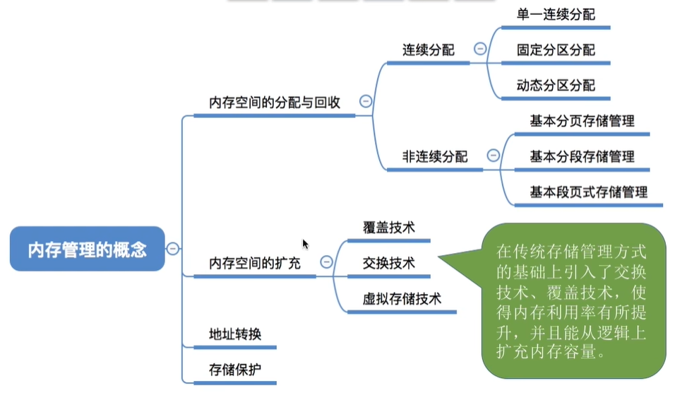
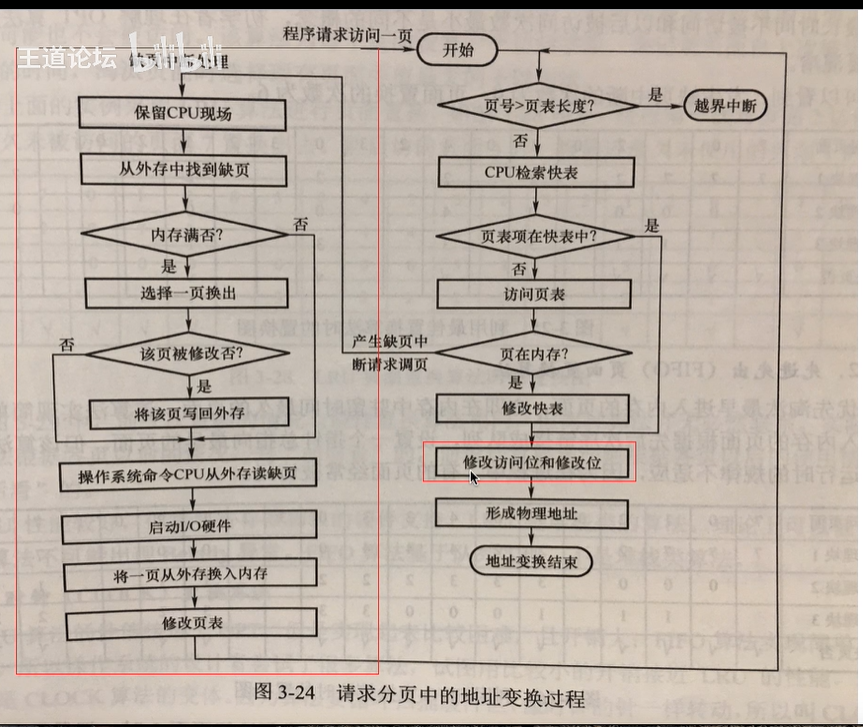
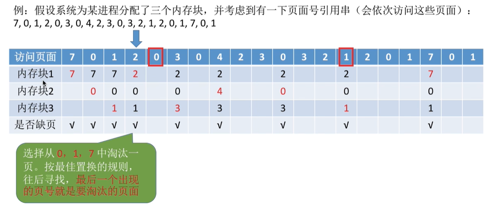
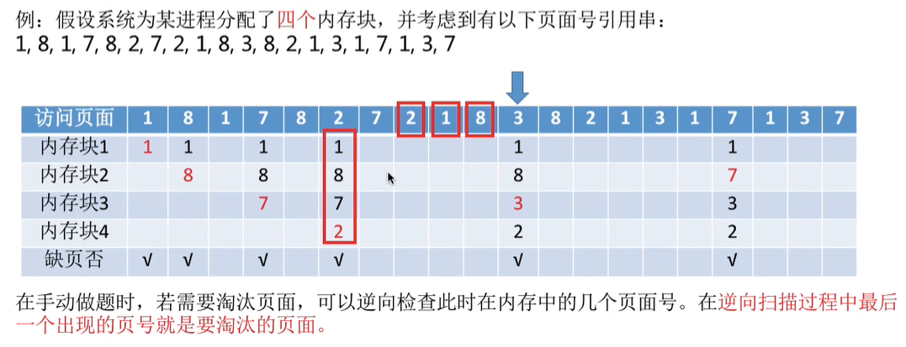
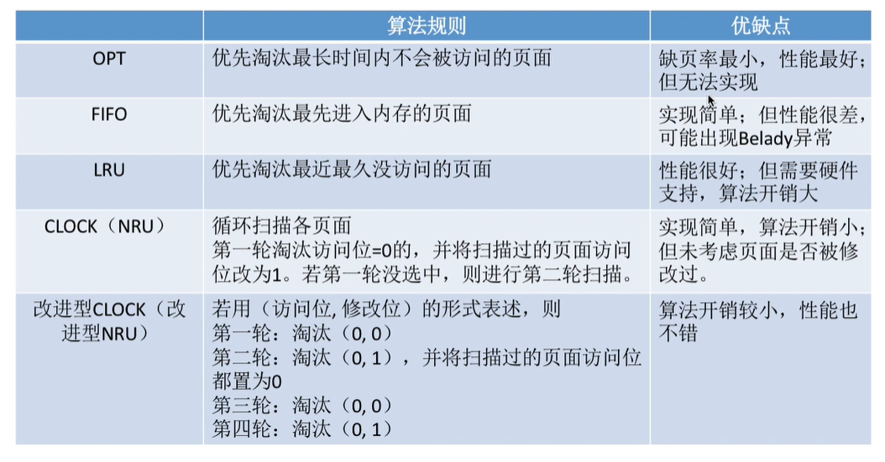
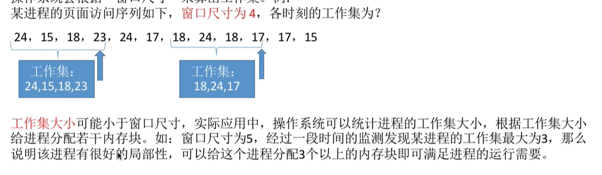

# 第三章 内存管理

## 目录

- [第三章 内存管理](#第三章-内存管理)
  - [目录](#目录)
- [3.0 错题速览](#30-错题速览)
- [3.1 内存管理概念](#31-内存管理概念)
  - [3.1.1 内存管理的基本原理和要求](#311-内存管理的基本原理和要求)
    - [基本功能](#基本功能)
    - [基本概念](#基本概念)
    - [装入](#装入)
    - [链接](#链接)
    - [内存保护](#内存保护)
    - [内存共享](#内存共享)
  - [3.1.2 连续分配管理方式](#312-连续分配管理方式)
    - [单一连续分配](#单一连续分配)
    - [固定分区分配](#固定分区分配)
    - [动态分区分配](#动态分区分配)
    - [四种动态分区分配算法](#四种动态分区分配算法)
- [3.1.3 基本分页存储管理](#313-基本分页存储管理)
    - [分页存储基本概念](#分页存储基本概念)
    - [基本地址变换机构](#基本地址变换机构)
    - [快表](#快表)
    - [两级页表](#两级页表)
  - [3.1.4 基本分段存储管理](#314-基本分段存储管理)
    - [分段](#分段)
    - [段表](#段表)
  - [3.1.5 段页式](#315-段页式)
  - [整理](#整理)
    - [动态重定位](#动态重定位)
    - [硬件地址变换机构](#硬件地址变换机构)
    - [各进程互不干扰的实现](#各进程互不干扰的实现)
    - [发展为页式管理的动力](#发展为页式管理的动力)
    - [发展成段式管理的动力](#发展成段式管理的动力)
    - [段式存储管理中共享段表](#段式存储管理中共享段表)
    - [查找页表的工作](#查找页表的工作)
    - [可重入程序的优点](#可重入程序的优点)
    - [动态分区](#动态分区)
    - [源代码到可装载文件](#源代码到可装载文件)
    - [多级页表](#多级页表)
- [3.2 虚拟内存管理](#32-虚拟内存管理)
  - [3.2.1 基本概念](#321-基本概念)
  - [3.2.2 请求分页管理方式](#322-请求分页管理方式)
    - [页表机制](#页表机制)
    - [缺页中断机构](#缺页中断机构)
    - [相对于基本分页管理](#相对于基本分页管理)
    - [地址变换机构](#地址变换机构)
  - [3.2.4 页面置换算法](#324-页面置换算法)
    - [最佳置换OPT](#最佳置换opt)
    - [先进先出FIFO](#先进先出fifo)
    - [最近最久未使用LRU](#最近最久未使用lru)
    - [时钟置换CLOCK/NRU](#时钟置换clocknru)
      - [普通时钟置换算法](#普通时钟置换算法)
      - [改进型时钟算法](#改进型时钟算法)
    - [小总结](#小总结)
  - [3.2.3 页框分配](#323-页框分配)
    - [驻留集](#驻留集)
    - [三种策略](#三种策略)
      - [固定分配局部置换](#固定分配局部置换)
      - [可变全局](#可变全局)
      - [可变局部](#可变局部)
      - [小区别](#小区别)
    - [调入时间、位置](#调入时间位置)
      - [预调页](#预调页)
      - [请求调页策略](#请求调页策略)
      - [何处？](#何处)
    - [抖动（颠簸）](#抖动颠簸)
    - [工作集](#工作集)
  - [3.2.7 内存映射文件](#327-内存映射文件)
  - [整理](#整理-1)
    - [LRU算法](#lru算法)
    - [驻留集工作集](#驻留集工作集)
    - [地址转换流程](#地址转换流程)
    - 

---

# 3.0 错题速览

- 3.1 T12、15、19、25、27、32、34、36、38、55、64
- 3.2 T15、22、28、29、30、40、51、54

# 3.1 内存管理概念

## 3.1.1 内存管理的基本原理和要求

### 基本功能

- 内存分配回收
  - 连续分配
    - 单一连续分配
    - 固定分区
    - 动态分区
  - 非连续分配
- 内存空间扩充
  - 覆盖技术
    - 程序多段，常用的常驻内存，不常用的需要时才调入
    - 常用区，覆盖区
    - 必须由程序员声明覆盖结构，只适用早期OS
  - 交换技术
    - 调度策略：中级调度
  - 虚拟存储技术
- 地址转换
- 存储保护

### 基本概念

- 存储单元
- 字、字长、字节、按字编址
- 内存：1GB = 2^10B = 2^13bits

### 装入

绝对装入

- 单道程序环境
- 绝对地址（编译程序产生/程序员赋予）
- 逻辑地址与实际内存地址完全相同

可重定位装入（静态重定位）

- 分配空间连续，装入时分配全部内存空间
- 作业进入内存后不能再移动，不能再申请空间

动态运行时装入（动态重定位）

- 地址转换推迟到程序要执行时才进行
- 需要重定位寄存器的支持（存放模块起始地址）
- 逻辑地址+重定位寄存器 = 执行时位置
- 程序可不连续分配，装入速度快，可动态申请分配内存，便于程序段共享etc.

### 链接

- 静态链接，形成一个完整装入模块
- 装入时动态链接，装入时边装入边链接
- 运行时动态链接，执行到目标模块时才进行链接

### 内存保护

两种方法

- CPU上下限寄存器，存放用户进程在主存中的下限地址和上限地址
- 重定位寄存器（基地址寄存器）、界地址寄存器（限长寄存器）进行越界检查
  - 重：进程起始的物理地址
  - 界：进程最大逻辑地址

检查：

1. 逻辑地址 vs 界地址寄存器
2. 未地址越界(<)，则 逻辑+重定位寄存器 = 物理地址
3. 交给内存单元进行访存

### 内存共享

可重入代码

段表项：段共享简单易行

## 3.1.2 连续分配管理方式

### 单一连续分配

- 系统区、用户区
- 内存中仅能一道用户程序
- 简单，无外部碎片，可采用覆盖技术，不一定需要内存保护（因为系统只需要运行一个用户程序）
- 只适用单用户，内部碎片，存储器利用率极低

### 固定分区分配

- 用户空间分为若干**固定大小**的区，每个分区一道作业
  - 分区大小相等/分区大小不等
- 相等：缺乏灵活性，但适用于一台计算机控制多个相同对象
- 不等：增加灵活性，少量大分区、适中中分区、大量小分区
- 分区说明表（表项 + 数组实现）
  - 分区号、大小、起始地址、状态（已分配未分配）
- 无外部碎片
- 太大的程序，必须覆盖技术，降低性能；内部碎片

### 动态分区分配

也叫可变分区分配

- 根据进程大小动态建立分区

常见问题

- 什么数据结构记录？
- 选择哪个空闲分区？
- 分区的分配回收？

数据结构

- 空闲分区表、空闲分区链

四种动态分区分配算法

动态分区分配、回收

- 经常考分配时空闲分区数量、大小的变化
- 回收时分区数量、大小变化

优点

- 无内部碎片

缺点

- 有外部碎片
  - 紧凑技术（拼凑，Compaction）
  - 紧凑后需要动态重定位，修改进程起始地址（放入基址寄存器）

### 四种动态分区分配算法

首次适应

- 地址递增排列

- 每次低地址查找，找到第一个能满足的空闲分区
- 剩余空间作为新表项（链项）插入，从起始地址分起

最佳适应

- 找到比需求大的最小空间
- 空闲分区按容量递增依次链接（依次排号，不按起始地址排了）
- 很多外部碎片（留下越来越多、很小的小碎片）

最坏适应

- 容量递减次序排列，基本就是选第一个就行
- 大进程无处可用

邻近适应

- 空闲分区按**地址递增**排序（不用重新排列）

- 查找从上次结束位置开始查找
- 更有可能会用掉高地址部分大分区

# 3.1.3 基本分页存储管理

**高频考点**

### 分页存储基本概念

- 物理地址空间：页框=页帧=内存块=物理块=物理页面；页框号
- 逻辑地址空间：页=页面；页号

- 页表
  - 页表项：（页号，块号）
  - 页面 -> 页框
  - 页表项大小？如何实现逻辑地址->物理地址转化？
- e.g. 内存块 = 页面大小 = 4KB
  - 4GB内存分为2^20个内存块
  - 块号0~2^20-1，块号20bit，至少要用3B来表示块号
  - 页号可以是隐含的，**页表项连续存放**，i号页表项地址=X+3*i
  - 只需要存储块号即可
  - 存储整个页表至少需要3*(n+1)B  (0页 to n页)

- 访问逻辑地址A （地址变换）
  1. 找到A对应页号P
  2. 查页表，找到P号页面在内存中的起始地址
  3. 确定逻辑地址A的页内偏移量W
  4. A物理地址 = P页号在内存中起始地址+页内偏移量
- e.g. 页面大小50B，某进程逻辑地址空间大小为200B，逻辑地址110对应页号、页内偏移量是多少？
  - 页号 = 逻辑地址 / 页面长度（右移）
  - 页内偏移量 = 逻辑地址 % 页面长度（取余）
  - 物理地址 = 内存块号 ^ 页内偏移量
  - 每个页面 $2^K$ B，末尾K位为页内偏移量；其余部分是页号

- 于是页大小2的整数次幂，逻辑地址结构如下

  `|31~12 页号P|11~0 页内偏移量W|`

  - M位表示页号，2^M个页面
  - 页面大小 2^W B

### 基本地址变换机构

- 页表寄存器PTR，存放页表在内存中起始地址F和页表长度M
  - 进程未执行时，进程拥有的页表始址、页表长度存放在PCB中
  - 进程被调度时，OS内核将它们放到页表寄存器中
- 得到一个逻辑地址A
  - A算出页号P、页内偏移量W
  - 用P<M判断是否合法，不合法则抛出越界中断
    - = / >都是非法
  - 合法，页表项地址 = F + P * 页表项长度，找到内存块号b
  - 得到物理地址b^W并访存（E = b*L + W）
- 页式管理地址是一维的：只要给一个逻辑地址，系统就可以自动计算出页号、偏移量两个部分，不需要显示告诉系统页内偏移量占多少位
  - 因为页框大小已知
- 一个页面4KB：能存1365个页表项，但会剩余1B页内碎片，1365号页表项存放地址为 X + 3 * 1365 + 1
  - 所以页表项扩展到4B（方便查询）

### 快表

- 联想寄存器，高速缓存（不是内存，访问TLB不算访存），存放最近访问页表项的副本
- CPU内部：寄存器&高速缓存
- 进程切换时，快表内容需要清除
- e.g. 逻辑地址(0, 0)，未越界
  - 快表未命中，访问慢表，得到内存块号，并复制一份放入快表
  - 进程访问(0, 4)，快表命中，直接知道内存块号
  - 得到物理地址

- 快表一次命中，读取内存，一次访存
- 未命中，两次访存
- 计算平均耗时（小心系统支持快慢表同时查找）

局部性原理

- 时间局部性
  - 执行某条指令，不久后再次执行
- 空间局部性
  - 访问某个存储单元，不久后其附近存储单元也可能被访问

### 两级页表

单级页表问题：

- 32位逻辑地址->20位表示页号->一个进程2^20个页表项->一个页表最大需要2^20*4B = 2^22 B，需要 2^22/2^12=2^10个页框存储该页表
- 页表连续存放，需占用很多连续页框
- 没必要整个页表常驻内存，局部性原理

解决：

- 每个页面存1K个**页表项**，刚好占一个内存块
- 为离散分配的页表再建立一张页表，**页目录表**/外层页表/顶层页表

两级页表地址结构：

`|31~ 22 一级页号|21~12 二级页号|11~0 页内偏移量|`

​	

地址变换：

1. 逻辑地址拆三部分
2. PCB读出页目录表始地址，根据一级页号查找页目录表，找到下一级存放位置
3. 根据二级页号查表，找到最终想访问的内存块号
4. 结合页内偏移量计算物理地址

解决页表常驻内存？

- 存在位&缺页中断

**考法**

1. 多级页表机制，各级页表不能超过一个页面
   - 40位逻辑地址，页面4KB，页表项4B，几级页表，页内偏移量几位？
   - 12位页内偏移量
   - 页号 = 40 - 12 = 28位
   - 每个页面存放 2^12/4 = 2^10个页表项
   - 28位的页号需要3级页表，8位一级、10位二级、10位三级
2. 访存次数分析
   - 两级页表，三次访存
   - 快表命中，通通一次访存

## 3.1.4 基本分段存储管理

### 分段

- 按逻辑关系分段，每个段一个段名（程序员编程使用）

- 内存分配以段位单位，段占连续空间，各段之间可以不相邻
  - 编程更方便，程序可读性更高

- 段号决定段数，段内地址位数决定段最大长度

### 段表

- 段表项：（段号，段长，本段在主存始址）
- 短号可隐藏
- 32位逻辑地址：16位段号，16位段内偏移量；32位物理始地址，段表项最少48位
  - 段表起始地址M，K号段，段表项存放地址M+K*6
- 段表寄存器：存放进程的段表始地址F，段表长度M （由内核恢复）

地址变换

1. 根据逻辑地址得到段号S、段内地址W
2. 判断是否越界，S>=M即越界
3. 查询段表，找到段表项（F+S*长度）
4. **检查段内地址是否超过段长**（和页不同）
5. 计算得到物理地址b+W
6. 访问目标内存单元

页vs段

- 页是OS行为，用户不可见
- 段是信息逻辑单位，对用户可见，用户编程需要显式给出段名
  - 段地址空间是二维的，给定段名&段内地址
  - 段更易信息共享保护
  - 两次访存
    - 查询段表
    - 访问目标内存单元
    - 快表

## 3.1.5 段页式

- 分页：不会外部碎片、少量内部碎片，不方便信息共享保护
- 分段：外部碎片，方便信息保护

段页式

- 进程按逻辑分段，再将各段分页
- 每个进程一张段表，段表项（页表长度，页表始址）
- 每个段一张页表，页表项（块号）
- CPU段表寄存器
- 地址空间是二维的，给出段号，和剩下的逻辑地址

## 整理

### 动态重定位

程序执行中才将逻辑地址转换为物理地址

依赖于

- 可重定位装入程序
- 重定位寄存器
- 地址变换机构

目标程序：可执行文件，可以看作当前正在执行的文件，它怎么变换是影响不到这个重定位过程的

### 硬件地址变换机构

整个系统只有一个重定位寄存器

- 属于现场信息，每个进程会保存/恢复这个寄存器的值

### 各进程互不干扰的实现

通过**内存保护**

- 内存保护是OS提供的一种机制，保证进程只能访问到自己的地址空间
- 保证进程进程之间不会相互干扰

而地址映射：是实现虚拟地址的机制

### 发展为页式管理的动力

提高内存利用率

- 因为原来的连续分配方式，需要分配大量连续内存，限制巨大

### 发展成段式管理的动力

分段存储管理，便于程序链接

便于编程

便于用户使用

### 段式存储管理中共享段表

多个进程共享同一段代码或数据

实现：

- 单独共享段表描述这些段
- 多个进程共享同一段物理内存空间不需要用到共享段表，只需要各自段表指向相同物理地址即可

### 查找页表的工作

由硬件实现

1. 所以说地址转换需要软件硬件的协同
2. 硬件实现能保证速度和效率

### 可重入程序的优点

减少对程序段的调入调出，因为就用内存中现成的，它可共享访问

### 动态分区

在作业装入时动态建立

- 作业创建是提交一个作业，在之后由OS装入并执行

### 源代码到可装载文件

- 源代码

  预处理、编译

- 汇编代码

  汇编

- .o可重定位文件（只有相对于模块的逻辑地址）

  链接

- 可执行文件（经过链接形成完整的逻辑地址空间）

  装载

- 进程 —— 形成物理地址

### 多级页表

一级页表 = 顶级页表

- 再多级比如二级页表，是由一级页表索引来的页表

# 3.2 虚拟内存管理

传统存储管理缺点：

- 一次性：作业必须全部装入内存才可运行
  - 大作业无法运行
  - 内存可装入的作业数量减少，多道程序并发度下降
- 驻留性：作业在一个时间段内，只需要访问一小段数据，其他的在之后被访问到但是现在不会
  - 由于局部性原理

## 3.2.1 基本概念

三大特征

- 多次性：作业分多次装入内存
- 对换性：作业运行无需一直常驻内存，运行运行中换入换出内存
- 虚拟性：逻辑上扩充内存 —— 必须建立在离散分配内存
  - 请求分页、分段、段页式
  - 主要区别：访问信息不在内存时，由OS将所需信息从外存调入内存 —— 请求调页（调段）功能
  - 内存不够时，OS将内存中暂时用不到的信息换出到外存 —— 页面置换（段置换）功能

## 3.2.2 请求分页管理方式

### 页表机制

相对于基本分页管理，页表需要增加功能：

- 知道是否每个页面已调入内存
- 换出页面是否修改过，未修改过则不再浪费时间写回外存

页表项增加内容：

- 状态位：是否调入内存
- 访问字段：记录最近访问过几次/上次访问时间，供页面置换算法参考
- 修改位
- 外存地址

### 缺页中断机构

缺页中断机构：要访问的页面不在内存时，产生一个缺页中断，由OS的缺页中断处理程序处理中断

- 此时缺页的进程阻塞，放入**阻塞队列**，调页完成后将其唤醒
- 如果内存有空闲块，则为进程**分配一个空闲块**，将所缺页面装入该块，并修改页表中相应页表项
- 如果内存没有空闲块，**页面置换算法选择一个页面淘汰**，若选中页面在内存期间被修改过，则将其写回外存，未修改则不用写回

缺页中断：故障，内中断

一条指令执行过程中，可能产生多次缺页中断

### 相对于基本分页管理

新增步骤：

1. 请求调页（查到页表项时进行判断）
2. 页面置换（需要调入页面，只D在没有空闲内存块时进行）
3. 需要**修改**请求页表中新增表项

- 关注红框区域即可
- 只有写指令，才需要修改页面的修改位，可以减少访存次数
- 和普通中断处理一样，缺页中断需要保留CPU现场
- 换入换出需要启动I/O操作，如果换入换出频繁，开销很大
- 页面调入内存后，需修改慢表、同时也需要将表项复制到快表

### 地址变换机构

访问逻辑地址发生缺页时，步骤如下

1. 查快表——未命中
2. 查慢表——未调入内存
3. 调页
4. 查快表命中
5. 访问目标内存单元

## 3.2.4 页面置换算法

### 最佳置换OPT

淘汰的页面：以后永不使用/最长时间内不再被访问

- 如这里访问页面2，发现缺页，往后找是0、1、7，那么淘汰7
- 整个过程**缺页中断**9次、**页面置换**6次 —— 缺页未必页面置换，有可用空闲内存块则不需要页面置换
- 无法实现，理想化

### 先进先出FIFO

按调入顺序排成队列，需要换出页面时选择队头页面

**Belady（贝拉迪）异常**：为进程分配的物理块数增大的情况下，缺页次数不减反增

- 仅FIFO算法产生
- 性能很差

### 最近最久未使用LRU

Least recently used

- 页表项访问字段记录上次访问以来经历的时间t，选t最大的进行淘汰

- 需要硬件支持，实现困难，算法开销大
- 但是性能好

### 时钟置换CLOCK/NRU

#### 普通时钟置换算法

Not recently used

页表项增加一个**访问位**

内存中页面通过链接指针链接成一个循环队列，某页访问时，访问位设为1；需要淘汰时，只需要检查页面的访问位

扫描流程 —— 最多2轮

- 选择置换页

  - 从**队首**开始扫描，d

  - 是0则换出

  - 是1则置0

  - 若第一轮扫描全是1，则置0后进行第二次扫描

  - 找到0置换出

- 置换

  - 将需要的页面装入页框
  - 指针指向当前页框的下一个页

#### 改进型时钟算法

增加对页面修改的考虑，页面增加修改位

（访问位，修改位）

扫描流程 —— 最多四轮

- 找置换页面
  - 第一轮：找（0，0），不修改任何标志位
  - 第二轮开始：找（0，1），本轮扫过的访问位都设为0
  - 第三轮：找（0，0），不修改任何
  - 第四轮：找（0，1）
- 置换
  - 装入页框
  - 指向下一个
- （0，0）<（0，1）<（1，0）<（1，1）

### 小总结

可能考各算法优缺点

## 3.2.3 页框分配

### 驻留集

一般小于进程总大小，给进程分配的物理块的集合

- 太小则缺页频繁
- 太大则多道程序并发度下降

两种分配策略：

- 固定分配
- 可变分配：驻留集大小可变

置换：

- 局部置换：用自己的
- 全局置换：用自己的、其他的、全局的

|          | 局部置换 | 全局置换 |
| -------- | -------- | -------- |
| 固定分配 |          | 无       |
| 可变分配 |          |          |

- 全局置换意味着进程拥有物理块必然改变，不可能是固定分配

### 三种策略

#### 固定分配局部置换

- 灵活性低

#### 可变全局

- 锁定页面：内核数据

- 进程缺页，立马可以获得新物理块
- 被选中的进程拥有物理块减少，缺页率增加 —— 不合理

#### 可变局部

- 缺页，进程选自己物理块换出外存
- 若频繁换页，系统为它多分配几个物理块

#### 小区别

可变全局vs可变局部

- 全局：缺页就分配新的
- 局部：根据缺页频率动态增加减少进程的物理块

### 调入时间、位置

#### 预调页

- 预测不久后可能访问的页面（局部性原理），预测成功率~50%
- 主要用于进程首次调入
- **运行前调入**

#### 请求调页策略

- 运行期间发现缺页才将所缺页面调入内存

#### 何处？

对换区：读写速度更快，连续分配

文件区：更慢，离散分配

- 系统拥有足够对换区空间：
  - 页面调入、调出都是在内存与swap进行
  - 可以保证页面调入、调出速度很快
  - 进程运行前，需要将**进程相关数据**从文件区复制到对换区

- 系统缺少足够对换区空间：
  - 不会被修改的从文件区调入（因为不用写回）
  - 可能被修改的**在换出时**写回swap，下次需要再从swap调入
- UNIX：运行前进程有关数据全部放在文件区，未使用的从文件区调入，使用过的换出写回对换区，下次从对换区调入

### 抖动（颠簸）

主要原因：分配给进程物理块不够

为了研究这个，提出工作集的概念

### 工作集

概念：

- 驻留集：请求分页存储管理中给进程分配的内存块的集合

- 工作集：某段时间间隔里，进程实际访问页面的集合

OS根据窗口尺寸算出工作集：

- 驻留集 >= 工作集

## 3.2.7 内存映射文件

内存映射文件：OS向程序员提供，系统调用

- 方便程序员访问文件数据
- 方便多进程共享同一个文件

传统文件访问方式：open->seek->read->write

内存映射：open->mmap（文件映射到虚拟地址空间）

- 以访问内存的方式访问文件数据
- OS自动完成read
- 进程关闭文件：close调用，OS自动写回

多个进程映射同一个文件，实现共享

- 同一个文件映射到不同进程地址空间中

## 整理

### LRU算法

实现起来耗费高

- **原因**：需要对所有页进行排序
- **结果**：需要硬件的支持

### 驻留集工作集

- 驻留集：已装入内存的页面的集合
- 工作集：某段时间内，进程运行需要访问页面的集合
- 工作集不一定时驻留集的子集 —— 可能有些工作集的页面未调入内存/已换出，只有工作集完全包含在驻留集，才能保证进程不缺页中断

### 地址转换流程

- 先检查越界 —— 如果越界则报错了，不会进行后面的检查
- 再检查是否缺页
  - 如果知道缺页，那么这次访问必定没有越界

### 
