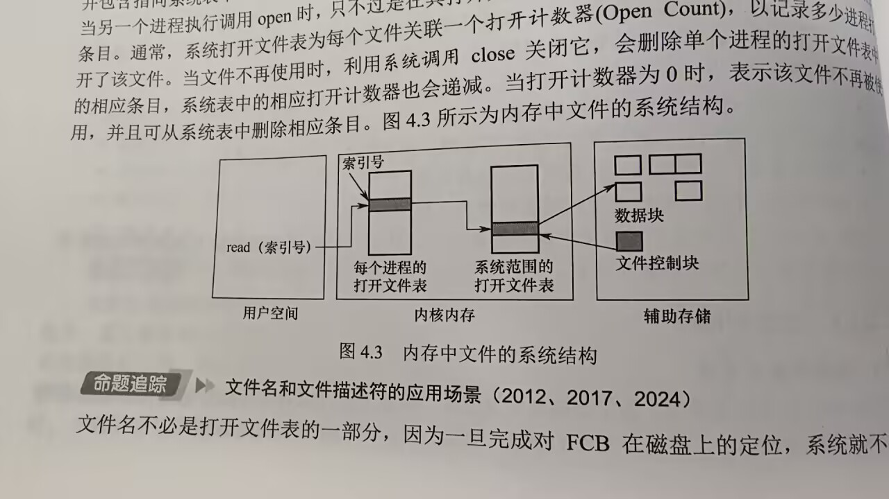
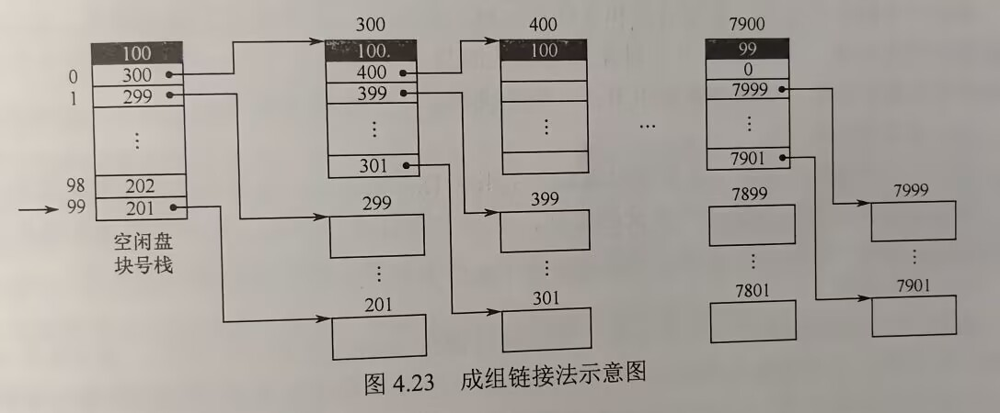

# 第四章 文件管理

## 目录
- [第四章 文件管理](#第四章-文件管理)
  - [目录](#目录)
  - [4.1 文件系统基础](#41-文件系统基础)
    - [4.1.1 文件的基本概念](#411-文件的基本概念)
      - [文件的定义](#文件的定义)
      - [文件的属性](#文件的属性)
      - [文件的分类](#文件的分类)
    - [4.1.2 文件控制块和索引节点](#412-文件控制块和索引节点)
      - [文件控制块](#文件控制块)
      - [索引节点](#索引节点)
    - [4.1.3 文件的操作](#413-文件的操作)
      - [文件基本操作（考：详细过程）](#文件基本操作考详细过程)
      - [文件的打开与关闭](#文件的打开与关闭)
    - [4.1.4 文件逻辑结构](#414-文件逻辑结构)
      - [无结构文件](#无结构文件)
      - [有结构文件](#有结构文件)
    - [4.1.5 文件的物理结构](#415-文件的物理结构)
      - [连续分配](#连续分配)
      - [链接分配](#链接分配)
      - [索引分配](#索引分配)
    - [4.1.6 文件保护](#416-文件保护)
      - [访问类型](#访问类型)
      - [访问控制](#访问控制)
      - [口令和密码](#口令和密码)
      - [多级目录结构](#多级目录结构)
    - [考点\&易错点整理](#考点易错点整理)
  - [4.2 目录](#42-目录)
    - [4.2.1 目录的概念](#421-目录的概念)
    - [4.2.2 目录的操作](#422-目录的操作)
    - [4.2.3 目录结构](#423-目录结构)
      - [单级目录结构](#单级目录结构)
      - [两级文件目录](#两级文件目录)
      - [树形目录结构](#树形目录结构)
      - [无环图目录结构](#无环图目录结构)
    - [4.2.4 目录实现（不在考纲）](#424-目录实现不在考纲)
    - [4.2.5 文件共享](#425-文件共享)
      - [基于索引节点的共享方式（硬链接）](#基于索引节点的共享方式硬链接)
      - [利用符号链实现文件共享（软链接）](#利用符号链实现文件共享软链接)
    - [考点\&易错点整理](#考点易错点整理-1)
  - [4.3 文件系统](#43-文件系统)
    - [4.3.1 文件系统结构](#431-文件系统结构)
    - [4.3.2 文件系统布局](#432-文件系统布局)
      - [文件系统在磁盘中结构](#文件系统在磁盘中结构)
      - [文件系统在内存中结构](#文件系统在内存中结构)
    - [4.3.3 文件存储空间管理](#433-文件存储空间管理)
      - [基本概念](#基本概念)
      - [空闲表法](#空闲表法)
      - [空闲链表法](#空闲链表法)
      - [位示图法](#位示图法)
      - [成组链接法](#成组链接法)
    - [4.3.4 虚拟文件系统](#434-虚拟文件系统)
      - [4.3.5 文件系统挂载](#435-文件系统挂载)
    - [考点\&易错点整理](#考点易错点整理-2)

## 4.1 文件系统基础
区分文件的逻辑结构&物理结构

### 4.1.1 文件的基本概念
**文件**：硬盘为载体的存储在计算机上的信息集合
- 系统运行时
  - 进程是资源调度和分配的基本单位
  - 文件是用户输入和输出的基本单位
- 文件系统：实现对文件的维护管理

#### 文件的定义
- 对文件的理解
  - 文件必定包括存储空间中的数据
  - OS管理大量的数据 -> 文件必定包含分类和索引信息
  - 不同用户对数据访问权限不同 -> 文件必定包含访问权限的信息
- 文件系统是OS的重要组成部分
  - 用户关心：如何命名、分类、查找文件，如何保证数据安全性，对哪些文件可以进行哪些操作
  - 文件系统：提供二级存储相关资源的抽象，让用户能不了解文件的各种属性、文件存储介质特征、存储介质上具体位置等情况下，仍能方便快捷使用文件。
  - 用户使用文件系统建立文件，用于应用程序的输入、输出，对资源进行管理
- 文件的结构（自底向上定义）
  - **数据项**：文件系统中最低级的数据组织形式
    - **基本数据项**：用于描述一个对象某个属性的一个值，数据中的**最小逻辑单位**
    - **组合数据项**：多个基本数据项组成
  - **记录**：一组相关数据项的集合，描述一个对象在某方面的属性
  - **文件**：**创建者**定义的，**具有文件名**的一组相关元素的集合
    - 有结构文件，文件由若干个相似的记录组成，如一个班的学生记录
    - 无结构文件，字符流，比如一个二进制文件或字符文件
- 虽然给出结构化的表述，但是文件并无严格定义
  - OS中，通常将程序和数据组织成文件，文件可以是数字、字符或二进制代码，基本访问单元可以是字节或记录
  - 文件可以
    - 长期存储在硬盘中
    - 允许可控制进程间共享访问
    - 能被组织成复杂的结构

#### 文件的属性
除了文件数据，OS还会保存与文件相关的信息，如所有者、创建时间等，这些附加信息称为**文件属性**或**文件元数据**

OS通过文件控制块维护文件元数据

通常还包括如下属性：
1. 名称。文件名称唯一，以容易读取的形式保存
2. 类型。被支持不同类型的文件系统使用
3. 创建者。文件创建者的ID
4. 所有者。文件当前所有者的ID
5. 位置。指向设备和设备上文件的指针
6. 大小。文件当前大小（字节、字或块表示），也可包含文件允许的最大值
7. 保护。对文件进行保护的访问控制信息
8. 创建信息、最后一次修改时间、最后一次存取时间。文件创建、上次修改和上次访问的相关信息，用于*保护和跟踪文件的使用*

#### 文件的分类
几种常见的文件分类方式：
1. 按性质和用途分类：系统文件、用户文件、库文件
2. 文件中数据的形式分类：源文件、目标文件、可执行文件
3. 存取控制属性分类：可执行文件、只读文件、读/写文件
4. 组织形式和处理方式分类：普通文件、目录文件、特殊文件

### 4.1.2 文件控制块和索引节点
与进程管理一样，便于文件管理，引入**文件控制块（File Control Block, FCB）**的数据结构

#### 文件控制块
- 文件控制块是用来存放控制文件需要的各种信息的数据结构 -> 实现**按名存储**
- 文件与FCB一一对应 -> FCB有序集合被称为**文件目录**
  - 一个FCB就是一个**一个文件目录项**
- 一个文件目录也被视为一个文件，称为**目录文件**
- 每创建一个新文件，系统就要为其建立一个FCB，如下是一个典型的FCB  
  |文件名|类型|文件权限（读，写）|文件大小|文件数据块指针|
- FCB主要包含以下信息：
  - 基本信息：如文件名、物理位置、逻辑结构、物理结构
  - 存取控制信息：包括文件主的存取权限、核准用户的存取权限及一般用户的存取权限
  - 使用信息：如建立时间、上次修改时间等

#### 索引节点
- 检索目录时，除文件名外的描述信息不会用到也不会调入内存 -> UNIX采用文件名和文件描述信息分离的方式：
  - **文件描述信息** 单独形成一个称为**索引节点（inode）**的数据结构，简称**i节点**（inode）
  - 文件目录中每个目录项仅由 *文件名* 和 相应 *索引节点号*（或*索引节点指针*） 组成
- 磁盘索引节点（存放在磁盘上的索引节点），包括以下内容
  - *文件主标识符*，拥有该文件的个人/组织的标识符
  - *文件类型*，如普通文件、目录文件或特别文件
  - *文件存取权限*，各用户对该文件的存取权限
  - *文件物理地址*， 每个索引节点含13各地址项，iaddr(0)~iaddr(12)，直接/间接给出数据文件所在盘块编号
  - *文件长度*，以字节为单位的文件长度
  - *文件链接计数*，指向该文件的文件名的指针计数
  - *文件存取时间*，包括创建时间、上次修改时间和上次访问时间
- 内存索引节点，存放在内存中的索引节点，文件被打开时，将磁盘索引节点复制到内存的索引节点中便于以后使用。添加了以下内容
  - *索引节点号*
  - *状态*，是否上锁or被修改
  - *访问计数*
  - *逻辑设备号*
  - *链接指针*
- FCB或索引节点相当于图书馆中图书的索书号

### 4.1.3 文件的操作

#### 文件基本操作（考：详细过程）
- 文件属于**抽象数据类型**，为正确定义文件，需要考虑对文件的操作
- OS提供一系列系统调用，实现文件的创建、删除、读写、打开、关闭等操作
  - 创建文件
    - 为新文件分配外存空间
    - 目录中创建一个目录项
  - 删除文件
    - 根据文件名查找目录，删除对应目录项和FCB，回收文件占用存储空间（磁盘+内存缓冲区）
  - 读文件
    - 查找目录，找到目录项，得到文件在外存中地址；目录项中还有一个指针用于文件读操作
  - 写文件
    - 查找目录，找到目录项，得到写指针对文件写操作；每发生写操作便更新写指针

#### 文件的打开与关闭
考：打开/关闭的过程，多进程同时打开文件的分析，文件名和文件描述符

为了避免多次重复检索目录，用户首次对文件发送操作请求时，使用*系统调用open*打开文件，系统维护一个包含**所有**打开文件信息的表，称为**打开文件表**（Open File Table, OFT）
- **打开**
  - 系统检索到执行文件目录项
  - 将目录项从外存复制到内存中打开文件表的一个表目中
  - 将打开文件表该表目的*索引号*（**文件描述符**）返回给用户
  - 用户再次对该文件发送操作请求时，直接使用该文件描述符找到文件信息，从而节省大量检索开销
- **关闭**
  - 用户对文件操作完成后，使用*系统调用close*关闭文件
  - 系统将打开文件表中该文件的表目删除
- **多进程同时打开文件**
  - 采用两级表：
    - 整个系统表
      - 包含进程无关信息，文件在磁盘上位置，访问日期，文件大小等
    - 每个进程表
      - 包含进程对文件使用信息，如文件当前读写指针，文件访问权限及指向系统表中适当条目的指针
  - 一旦有进程打开一个文件，系统表就包含该文件的条目；另一个进程执行调用open时，只是进程打开文件表中增加一个条目，并指向系统表相应条目
  - 系统打开文件表为每个文件关联一个**打开计数器**（Open Count）
  - 进程调用close，删除它的打开文件表中条目，同时系统表该文件的打开计数器减1
    - 打开计数器为0时，文件不再被使用，并且可从系统表中删除该条目
  - 内存中文件结构如下
    
    - 数据块、文件控制块存储在辅助存储中
    - 进程表&系统表存储在内核内存中
    - 索引号存储在用户空间中
- 文件名&文件描述符
  - 完成FCB在磁盘上的定位后，**系统不再使用文件名**，而是使用文件描述符来标识文件
  - UNIX称之为**文件描述符**
  - Windows称之为**文件句柄**
- 每个打开文件有如下关联信息
  - 文件指针
  - 文件打开计数
  - 文件磁盘位置
  - 访问权限

### 4.1.4 文件逻辑结构
逻辑结构：从用户角度出发看到的文件的组织形式  
物理结构：文件存储在外存上的存储组织形式，用户看不见的

逻辑结构分类如下：
#### 无结构文件
- 最简单的文件组织形式，字符流构成，也称**流式文件**
- 长度以字节为单位
- 读写指针指出下一个要访问的字节
- 系统中大量源程序、可执行文件、库函数等采用的都是无结构文件
- 没有结构，对无结构文件记录的访问只能通过**穷举搜索**的方式 -> 对很多应用不适用

#### 有结构文件
- 一个以上记录构成的文件，也称**记录式文件**
  - 定长记录
    - 所有记录长度都相同，各数据项都在记录中相同位置，具有相同长度
    - 检索记录的速度快，方便文件处理、数据处理
  - 变长记录
    - 文件中各记录长度不一定相同
    - 可能是记录中数据项数量不同/数据项本身长度不定
    - 顺序查找，速度慢

有结构文件按记录的组织形式分类如下
1. 顺序文件
   - 文件一个接一个顺序排列，记录可以是变长也可以是定长
   - 顺序文件中记录的排列有两种结构
     - 串结构：顺序与关键字无关，按存入先后时间排列，必须从头开始顺序依次查找
     - 顺序结构：按关键字顺序排列，对定长记录的顺序文件，可二分查找
   - 特点
     - 读写效率最高
     - 对于顺序存储设备（如磁带）是最有效的存储方式
     - 但高频率单个记录的查找修改删除，顺序文件性能较差
2. 索引文件
   - 变长记录的顺序文件只能顺序查找，效率低 -> 建立索引表，主文件每个记录设置一个索引表项
   - 索引表项包含
     - 指向记录的指针
     - 记录的长度
   - 索引表按关键字排序（它本身就是一个定长记录的顺序文件）
   - 变长记录顺序文件的**顺序检索** -> 定长记录索引文件的**随机检索**，加快了记录的检索速度
   - 索引文件需配置索引表，每个记录要一个索引项，增加了存储开销
3. 索引顺序文件
   - 顺序文件和索引文件的结合
   - 变长记录顺序文件分为若干组，为文件建立索引表，**每组第一个**记录建立一个索引项，包含该**记录的关键字**和**指向该记录的指针**
   - 同组内关键字可以无须（本来就是从变长记录顺序文件中来的）
   - **但是组与组间关键字必须有序**
   - 每组第一个记录的键及逻辑地址放入索引表，索引表按关键字顺序排列
   - 一级索引**检索**时：查找索引表（找该记录的组），然后在组内顺序查找
     - 平均共需$\sqrt{n} = \sqrt{n}/2 + \sqrt{n}/2$次查找
4. 直接文件/散列文件（Hash File）
   - 很高的存取速度
   - 容易引起冲突，不同关键字散列函数值可能相同

实际上有结构文件逻辑上的组织是为查找数据服务的（顺序查找、索引查找、索引顺序查找、hash查找）

### 4.1.5 文件的物理结构
物理结构：研究文件的实现，在物理存储设备上如何分布和组织？有如下两种回答
- 文件的分配方式：对磁盘非空闲块的管理
  - 对应文件的物理结构，如何为文件分配磁盘块（**注意区分文件的逻辑结构**）
    - 连续分配 （类似于线性表）
    - 链接分配 （类似于顺序表）
    - 索引分配 （类似于链表）
- 文件存储空间管理：对磁盘空闲块的管理
- 磁盘存储单元也被分为一个个块，称为**磁盘块**，大小与内存页面大小相同

#### 连续分配
- 要求每个文件在磁盘上占有一组连续的块
- 磁盘地址定义了磁盘上的一个**线性排序**，使得进程访问磁盘时需要的寻道数和寻道时间最小
- 优点：
  - 支持顺序访问&直接访问
  - 顺序访问容易且速度块，文件所占用的块可能位于一条或几条相邻的磁道上，磁头移动距离最小
- 缺点：
  - 连续存储空间 -> 很多外部碎片
  - 必须事先知道文件长度，无法满足文件动态增长的需要
  - 为保持有序性，删除&插入记录时，需要对相邻记录进行物理上的移动，效率低

#### 链接分配
离散分配方式
- 优点：
  - 消除磁盘外部碎片，提高磁盘利用率
  - 方便动态为文件分配磁盘块，无须事先知道文件大小
  - 文件插入、删除和修改也非常方便

链接分配分为*隐式链接*和*显式链接*
1. 隐式链接（指针分配于磁盘块中）
   - 隐式链接：目录项含有文件的第一块的指针（盘块号）和最后一块的指针
   - 每个文件对应一个磁盘块的链表，磁盘块分布在磁盘的任何地方
     - 除文件的最后一个盘块外，每个磁盘块中含有下一个磁盘块的指针（对用户是透明的）
   - 缺点：
     - 只支持顺序访问，随机访问效率很低
     - 稳定性问题：任何一个指针出问题，都会导致文件数据的丢失
     - 指向下一个盘块的指针也要耗费一定的存储空间
   - 按**簇**分配
     - 几个盘块组成一个簇（Cluster），作为分配的基本单位
     - 可以大幅减少查找时间，减小指针所占用存储空间
     - 但是增加了内部碎片

2. 显式链接
   - 显示链接：用于链接文件各物理块的指针，显示存放于内存的一张链接表中
     - 这个链接表在整个文件系统中仅一张，称为**文件分配表（File Allocation Table, FAT）**
   - 每个表项中存放指向下一个盘块的指针
   - 文件目录中只需记录该文件起始块号，后续块号可查FAT得到
   - **FAT**一些细节
     - FAT表项中仅两项：盘块号，下一块的盘块号
     - 下一块盘块号 = **-1** 时，标记为文件的最后一块
     - 下一块盘块号 = **-2**（或别的更负的数）时，表示该磁盘块空闲 -> OS可以通过FAT对磁盘空闲空间进行管理
   - 优点：
     - 支持顺序访问，也支持直接访问，访问i块无需访问前i-1块
     - FAT在系统启动时就被读入内存，检索记录是在内存中进行
       - 显著提高检索速度
       - 减少了访问磁盘的次数
   - 缺点：
     - FAT需要占用一定的存储空间

#### 索引分配
1. 单级索引分配方式（考：索引分配的应用和分析）
   - 思想：为每个文件分配一个索引块（表），索引块中存放该文件所有盘块号
     - 没有必要将整个FAT调入内存，应将每个文件所有盘块号集中放在一起
     - 访问到某个文件时，将文件对应盘块号一起调入内存即可
   - 优点：
     - 支持直接访问
     - 不会产生外部碎片
   - 缺点：
     - 增加了额外的存储空间开销
   - 主要问题：
     - 每个文件**必须**有一个索引块
       - 当文件很小时，索引块利用率很低
       - 当文件很大时，如果连盘块号都需要占用若干索引块，虽然可以按需链接索引块，但是很低效
2. 多级索引分配方式
   - 文件太大而索引块太多时，应为这些索引块再建立一级索引，称为**主索引**
   - 将第一个索引块的盘块号、第二个索引块的盘块号……填入主索引表，形成了*二级索引分配方式*
   - 原理类似**多级页表**
   - e.g. 盘块大小4KB，每个盘块号4B，一个索引可放1024个盘块号，若采用两级索引，则支持的最大文件为1024 x 1024 x 4KB = 4GB （每个文件一个主索引，然后看几级索引能够表示多少盘块号）
   - 优点：
     - 极大加快对大型文件的查找速度
   - 缺点：
     - 访问一个盘块时，所需启动磁盘次数随索引级数增加而增多，即使数量众多的小文件也是如此
3. 混合索引分配方式（考：原理，混合索引相关计算，多级索引块访问效率分析）
   - 全面照顾到小型、中型和大型文件的存储需求，采用混合索引分配方式
   - 分配方式如下：
     - 小文件 -> 盘块地址直接放入FCB，**直接寻址**
     - 中型文件 -> 盘块地址放入索引块，**单级索引**
       - 先从FCB中找到该文件索引表，从中获得盘块地址，即**一次间址**
     - 大型/特大型文件 -> 两级或三级索引分配
   - 相关计算
     - 直接地址：
       - 索引节点设置10个直接地址项，i.addr(0)~i.addr(9)存放直接地址（即文件数据块盘块号）
       - 假如盘块大小4KB，文件不大于40KB，便可直接从inode读出该文件全部盘块号
     - 一次间接地址：
       - 索引节点中i.addr(10)提供*一次间接地址*，记录了文件一次间址块号，一次间址块就是索引块，记录了文件数据块的盘块号。一次间址块可以存放1024个盘块号。
       - 同时采用直接地址和一次间址，允许文件最大长度 1024 x 4KB + 10 x 4KB = 4096KB + 40KB = 4MB + 40KB
     - 多次间接地址：
       - 文件长度大于4MB + 40KB时，i.addr(11)提供*二次间接地址*，记录了二次间址块号，二次间址块也是索引块，记录了一次间址块的盘块号
       - 直接地址 + 一次间址 + 二次间址: 4GB + 4MB + 40KB
       - 三次的话就是 4TB + 4GB + 4MB + 40KB

### 4.1.6 文件保护
为了防止文件共享可能导致文件被破坏或未经核准的用户修改文件，文件系统需解决对文件的读、写、执行的许可问题。
需要设立文件保护机制：
- *口令保护*、*加密保护*：防止用户文件被他人存取或窃取
- *访问控制*等：控制用户对文件的访问方式

#### 访问类型
可以控制的访问类型有如下几种：
- 读
- 写
- 执行
- 添加：新信息添加到文件结尾
- 删除
- 列表清单：列出文件名和文件属性
- 此外还有高层功能：重命名、复制、编辑，这些可以通过以上底层系统调用提供，保护仅在低层提供
  - 例如复制可以通过一系列读实现，有读权限的用户则有了复制和打印权限

#### 访问控制
根据用户身份进行控制，每个文件添加一个访问控制表（Access-Control List, ACL）

使用精简的访问控制列表：
- 拥有者：创建文件的用户
- 组：一组需要共享文件且有类似访问的用户
- 其他：系统内所有其他用户

#### 口令和密码
- 口令：建立一个文件时提供一个口令，系统建立FCB时附上口令，告诉允许共享文件的用户，访问时需提供相应口令，空间时间开销不多，但是口令直接存在系统内部，不安全
- 密码：用户对文件加密，文件访问时需要使用密钥。保密性强，节省存储空间，但是编码译码需要花费时间

#### 多级目录结构
不仅需要保护单个文件，还需要保护子目录内文件，需要目录保护机制

### 考点&易错点整理

- 打开文件操作
  - 将该文件的FCB存入内存的活跃文件目录表
    > 注：FCB随文件创建一起创建，它平常存在磁盘上，在打开文件时被调入内存  
  - **找到指定文件目录是打开文件之前的操作**

- open()系统调用
  - 在进程的打开文件表中增加一个条目，并返回该表目的索引号（文件描述符/文件句柄）
  - 系统的打开文件表并不一定会增加一个条目——如果该文件已经被打开，则只需增加进程的打开文件表中的条目
  - 不同文件名打开的可能是同一个文件实体——**文件硬链接**

- 关闭文件操作
  - 当前文件的**控制信息**从内存写回磁盘
  - 并不意味着将文件数据写回磁盘，**只有写文件操作才会写回磁盘**

- 读文件操作
  - 先找目录项
  - 按存取控制检查访问合理性
  - 逻辑记录号 -> 物理盘块号
  - 发出I/O请求，完成数据交换

- 目录文件是FCB的集合，目录中既可能有子目录有可能有数据文件 -> 目录文件中存放子目录和数据文件的信息

- FCB：文件目录项，文件控制块，索引节点，inode（全是等价的）
  - 文件基本信息
    - 文件名
    - 文件类型
    - 文件大小
    - 文件物理位置
    - ****
  - 存取控制信息
  - 使用信息

- 区分用户访问权限&用户优先级
  - 用户访问权限：有无权限访问文件
  - 用户优先级：多个用户请求该文件时优先满足谁

- 安全管理等级
  - **系统级：用户的注册和登录**
  - 文件级：文件的访问控制

- 外存分配方式适合＆不适合的操作
  - 连续分配
    - 适合：顺序访问、随机存取（直接访问）
    - 不适合：动态增长的文件
  - 链接分配
    - 适合：顺序访问
    - **不能够**：随机存取
  - 索引分配
    - 适合：顺序访问、随机存取
    - 不适合：小文件

- 连续分配
  - FCB关于物理位置的信息包括：
    - 文件起始块号
    - 文件长度（通常以盘块数进行计算）

- **文件的逻辑结构与文件的物理结构没有必然关系**
  - 文件放到存储介质上时，采用的组织形式与**存储介质特性**有关

- 多进程共享F，一个进程P关闭F时
  - 只对内存中F索引节点进行相关操作，**绝对不会影响到磁盘**

## 4.2 目录

### 4.2.1 目录的概念
- FCB的有序集合称为**文件目录**，一个FCB就是一个文件目录项
- 文件目录：与文件管理系统和文件集合相关联的是文件目录
  - 包含文件属性、位置和所有权等
- 目录管理的基本要求
  - 用户角度：
    - 目录在用户（程序）所需要的文件名和文件之间提供一种映射关系
    - 实现**按名存取**
    - 存取效率直接影响到系统性能 -> 提高对目录的检索速度
  - 多用户系统：
    - 允许多个用户共享一个文件 -> 提供用于控制访问文件的信息
    - 允许不同用户对不同文件采用相同名字

### 4.2.2 目录的操作
- 搜索——搜索文件找到文件对应目录项
- 创建文件——增加相应目录项
- 删除文件——删除相应目录项
- 创建目录——可创建用户文件目录，并可再创建子目录
- 删除目录
  - 不删除非空目录：删除目录中所有文件，并递归地删除子目录
  - 可删除非空目录：文件和子目录同时被删除
- 移动目录——文件/子目录在不同父目录间移动
- 显示目录——显示用户目录中所有文件及属性
- 修改目录——某些文件属性保存于目录中，这些属性变化需要改变目录项

### 4.2.3 目录结构

#### 单级目录结构
- 整个文件系统只建立一张目录表，每个文件占一个目录项
- 建立新文件时
  - 检索目录项，确保不重名
  - 在该目录中增设一项，将新文件的属性填入该项
- 访问文件时
  - 按文件名找到相应FCB
  - 经合法性检查后执行相应操作
- 删除文件时
  - 从目录中找到该文件目录项
  - 先回收文件占用存储空间
  - 然后清除该目录项
- 缺点
  - 虽然实现按名存取
  - 但查找速度慢
  - 不允许重名
  - 不便于文件共享
  - 对于多用户操作系统显然不适用

#### 两级文件目录
- 文件目录分为两级，
  - 主文件目录（Master File Directory, MFD）
    - 记录用户名及相应用户文件目录所在存储位置
  - 用户文件目录（User File Directory, UFD）
    - 记录该用户所有文件的FCB
- 用户欲访问文件时
  - 搜索该用户对应的UFD
- 优点
  - 提高检索速度
  - 解决了多用户之间文件重名问题
  - 文件系统可以在目录上实现访问控制
- 缺点
  - 缺乏灵活性
  - 不能对文件分类

#### 树形目录结构
- 用户访问某个文件时
  - 用文件路径标识文件
- **文件路径名**是个字符串
- **绝对路径**
- 每个进程设置一个**当前目录**（也称**工作目录**）
  - 用户要访问某个文件时，使用**相对路径**名标识文件
- 优点：
  - 很方便对文件分类
  - 层次结构清晰
  - 更有效进行文件的管理保护
- 缺点：
  - 查找文件需要按路径逐级访问中间节点，增加磁盘访问次数

#### 无环图目录结构
- 树形目录结构便于实现文件分类，不便于实现文件共享
- 在树形目录结构的基础上增加一些指向同一节点的有向边，成为一个**有向无环图**
- **共享计数器**
  - 图中增加对该节点的共享链时，计数器加1
  - 用户提出删除该节点时，计数器减1
  - 计数器为0时，才删除该节点，否则仅删除请求用户的共享链
- 实现文件共享，但是系统管理更加复杂

### 4.2.4 目录实现（不在考纲）
1. 线性列表
2. 哈希表

### 4.2.5 文件共享
文件共享使多个用户共享同一个文件，系统中只需要保留文件的一个副本

#### 基于索引节点的共享方式（硬链接）
- **硬链接**是基于索引节点的共享方式，它将文件的物理地址和属性等信息不放在目录项中，而是放在索引节点中，目录只存储文件名和指向索引节点的指针
- 索引节点中有一个**链接计数count**，也称**引用计数**
- 共享的过程如下
  - A创建一个新文件时，她是文件的所有者，count置为1
  - B要共享此文件时，在B的目录添加一个目录项，并设置一个指向该文件的索引节点
  - 此时文件主仍然是用户A，count=2
  - A不需要此文件时，**不能直接删除**，只是将count减1，然后删除自己的相应目录项
  - B仍可以使用该文件
  - 只有当count=0时，才删除该文件

#### 利用符号链实现文件共享（软链接）
- 含义
  - 为使用户B能共享用户A的文件F，由系统创建一个LINK类型的新文件L，并将文件L写入用户B的目录
  - 文件L只含有被链接文件F的路径名
  - 称为**符号链接**或**软链接** （类似于windows的快捷方式）
- B访问文件L时，OS看到L类型属于LINK，则根据路径名查询文件F，对F进行读/写操作
- 共享文件情况如下
  - 其他用户只拥有该文件目录名，不拥有指向其索引节点的指针
  - 当文件主将一个共享文件删除时，其他用户试图通过符号链访问时，会访问失败，于是再将符号链删除，不会产生任何影响
- 缺点
  - 其他用户读共享文件时，系统根据文件路径名依次查找目录，**需要多次读盘**，直到找到索引节点
    - 增加了访问开销
  - 符号链接也是一个文件，其索引节点也需要耗费一定空间
- 符号链接实现网络共享：只需提供该文件所在机器的网络地址及文件路径名

### 考点&易错点整理
- 软链接+硬链接时
  - **符号链接文件**自身引用计数为1（因为自己是一个文件，引用了自己）

## 4.3 文件系统

### 4.3.1 文件系统结构
- **文件系统**：提供高效和便捷的磁盘访问，以便允许存储、定位、提取数据
- 有两个设计问题
  1. 定义文件系统的用户接口
     - 定义文件及其属性
     - 允许的文件操作
     - 如何组织文件的目录结构
  2. 创建算法和数据结构，以便映射逻辑文件系统到物理外存设备
- 文件系统层次结构如下（从底到上）
- I/O控制层
  - **设备驱动程序**+**中断处理程序**，在**内存和磁盘系统**之间传输信息
  - 设备驱动程序将输入的**命令**翻译成**底层硬件的特定指令**
  - **硬件控制器**利用这些**指令**使I/O设备与系统交互
  - **设备驱动程序**告诉**I/O控制器**对设备的什么位置采取什么**行动**
- 基本文件系统
  - 向对应设备驱动程序发送**通用命令**，读取和写入磁盘的物理块
    - 每个物理块由磁盘地址标识
  - 管理内存缓冲区，各种文件系统、目录和数据块的缓存
- 文件组织模块
  - 组织文件的物理块、逻辑块
    - 逻辑块地址 -> 物理块地址
  - 空闲空间管理器
- 逻辑文件系统
  - 管理文件系统**元数据**信息
    - 元数据包括文件系统所有结构，不包括实际数据（或文件内容）
  - 管理目录结构
    - 根据给定文件名为文件组织模块提供需要的信息
  - 通过FCB维护文件结构
  - 文件保护

### 4.3.2 文件系统布局

#### 文件系统在磁盘中结构
- 主引导记录（Master Boot Record, MBR）
  - 位于磁盘的0号扇区，引导计算机
  - MBR后面是**分区表**，给出每个分区的起始和结束地址
  - 第一个分区标记为**活动分区**
  - 计算机启动时，BIOS读入并执行MBR，MBR做的第一件事就是确定活动分区并读入它的第一块（**引导块**）
- 引导块（boot block）
  - MBR执行引导块程序后，该程序负责启动该分区的操作系统
  - 每个分区都统一从一个引导块开始（不一定包含可启动的OS，后续也可能安装）
    - Windows称之分区**引导扇区**
- 超级块（super block）
  - 包含文件系统的所有关键信息，计算机启动/文件系统首次使用时读入内存
  - 典型信息
    - 分区的块的数量
    - 块大小
    - 空闲块数量及指针
    - 空闲FCB数量及指针
    - 卷信息
    - etc.
- 文件系统中空闲块信息
  - 位示图/指针链接形式给出
  - 后面可能跟**一组i节点**，每个文件对应一个i节点
  - 接着可能是**根目录**，存放文件系统目录树的根部
  - 磁盘其他部分存放了其他所有的目录和文件

#### 文件系统在内存中结构
- 内存中的信息用于管理文件系统并通过缓存来提高性能
  - 在安装文件系统时被加载、文件系统操作期间更新，卸载时丢弃
- 这些结构的类型包括：
  - 内存中安装表（mount table）
    - 每个已安装文件系统分区的有关信息
  - 内存中的目录结构的缓存
    - 最近访问目录的信息
  - 整个系统的打开文件表
    - 每个打开文件的FCB副本
    - 打开计数
    - 其他信息
  - 每个进程的打开文件表
    - 进程打开文件的文件描述符（Windows称之**文件句柄**）
    - 指向整个系统的打开文件表中对应表项的指针

### 4.3.3 文件存储空间管理

#### 基本概念
- 一个存储设备可以按整体用于文件系统，也可以细分（想想磁盘分区）
  - 一个磁盘可以划分多个分区，每个分区都可以有单独的文件系统
- 包含文件系统的分区称为**卷**（volume）
  - 卷可以是磁盘的一部分，也可以是整个磁盘，也可以是多个磁盘组成的RAID集
- 在卷中
  - 存放文件数据的空间（文件区）和FCB的空间（目录区）是分离的
  - 现代OS中有很多不同的文件管理模块，通过它们访问不同格式的卷中的文件
  - 卷提供服务前，需**由**对应的文件程序进行初始化，划分好**目录区和文件区**，建立**空闲空间管理表格**及存放卷信息的**超级块**
- 文件存储设备的管理本质上是
  - 对空闲块的组织和管理，包括空闲块的组织、分配与回收

磁盘空闲块管理的方法及特点：
#### 空闲表法
- 连续分配方式（类似内存的动态分区分配）
- 为外存上所有空闲区建立一张**空闲表**，每个空闲区对应一个**空闲表项**
  - 表项序号、该空闲区第一个空闲盘块号、该空闲区的空间盘块数等信息
  - 并按起始盘块号递增次序排列（**需要排序**）
- 盘块的分配：
  - 首次适应算法、最佳适应算法、最差适应算法等
  - 顺序检索空闲盘块表各表项
  - 找到第一个大小能满足要求的空闲区
  - 将该盘区分配给用户，同时修改空闲盘块表
- 盘块的回收：
  - 回收时，考虑回收区是否与空闲盘块表中插入点前区后区邻接，对相邻接的空闲区合并
- 优点：
  - 较高分配速度，减少访问磁盘的I/O频率
  - 较小文件（1~5个盘块）可以采用连续分配的方式分配**相邻几个盘块**

#### 空闲链表法
所有空闲盘块  拉成一条空闲链，分为如下两种
1. 空闲盘块链
   - 每个空闲盘块有指向下一个空闲盘块的指针
   - 分配时
     - 从链表头开始，依次摘下适当数量空闲盘块分给用户
   - 释放时
     - 回收的盘块依次插入空闲盘块链的末尾
   - 优点
     - 回收简单
   - 缺点
     - 分配盘块要重复操作多次，效率低
     - 空闲盘块链很长
2. 空闲盘区链
   - 磁盘上所有空闲盘区拉成一条链，每个盘区包含若干相邻盘块
   - 每个空闲盘区含义下一个空闲盘区的指针和本盘区的盘块数
   - 分配
     - 首次适应算法
   - 回收
     - 与相邻接的空闲盘区合并
   - 优点
     - 分配回收效率高
     - 空闲盘区链较短
   - 缺点
     - 分配与回收的过程复杂

#### 位示图法
- 磁盘上所有盘块使用一个二进制位与其对应，0空闲1占用
- 分配(本书中位示图行列都从1开始编号)
  - 顺序扫描位示图，找出一个或一组其值为“0”的二进制位
  - 二进制位 -> 盘块号，盘块号b = n(i-1) + j
  - 修改位示图，map[i, j] = 1
- 回收
  - 盘块号 -> 行号列号
    - i = (b-1) DIV n + 1
    - j = (b-1) MOD n + 1
  - 修改位示图，map[i, j] = 0
- 优点
  - 容易找到一个或一组相邻接的空闲盘块，
  - 占用空间很小
- 问题
  - 大小随磁盘增大而增大，适用于小型计算机

#### 成组链接法
- 思想：空闲盘块分为若干组，每组第一个盘块记录下一组的空闲盘块总数&空闲盘块号
- **各组的第一个盘块可以链接成一条链**
- **第一组**的空闲盘块总数和空闲盘块号保存在**内存**的专用栈中，**空闲盘块号栈**
- 
  - 系统空闲区201~7999号盘块
    - 1组 201~300；次末组 7801~7900；
    - 最末组 7901~7999
      - 这些块号记录在7900号盘块中
      - 可以看到7900盘块第一个盘块号是“0”，作为空闲盘块链的结束标志
    - 里面黑色框框表示它指向那一组的空闲盘块号
- 分配
  - 根据空闲盘块号栈的指针，将与之对应盘块分配给用户
  - 空闲盘块号栈pop
    - 栈指针移动
    - 空闲盘块数减一
  - 若指针指向的是栈底的盘块号，则其中对应盘块中保存的是下一组空闲盘块号
    - 将盘块内容入栈，作为新的空闲盘块号栈的内容
    - 并将原栈底盘块号对应的盘块分配出去（有用数据已全部入栈）
  - 例如：依次分配201~299，当需要分配300时，300存的内容入栈，再将300分配掉
- 回收
  - 将回收的盘块号压入空闲盘块号栈顶部，同时移动指针，栈中空闲盘块数加一
  - 达到100（这里假设100盘块一组）时，表示栈已满
    - 100个空闲盘块存入新回收的盘块
    - 该新回收的盘块号作为新栈底
    - 栈中空闲盘块数置1
- **超级块**
  - 表示空闲空间的的位向量表或空闲盘块号栈，卷中目录区、文件区划分信息都要存放在磁盘中
  - 一般放在卷头位置
  - UNIX系统中称为超级块
  - 卷中操作前，要先将超级块读入内存
  - **并经常保持主存超级块和磁盘卷中超级块的一致性**

### 4.3.4 虚拟文件系统
- VFS屏蔽了不同文件系统差异和操作细节，向上为用户提供文件操作的统一调用接口
- 面向对象思想
  - 抽象一个通用的文件系统模型，定义通用文件系统都支持的接口
  - 系统抽象了四种文件对象类型，每个对象都包含数据和函数指针，函数指针指向操作这些数据的文件系统的实现函数

1. 超级块对象
   - 表示已安装（或挂载）的特定文件系统
   - 对应于文件系统超级块，存储已安装文件系统的元信息
   - 方法：可在超级块对象上执行的操作
     - 分配inode
     - 销毁inode
     - 读inode
     - 写inode
     - etc.
2. 索引节点对象
   - 表示特定文件
   - 方法
     - 创建新索引节点
     - 创建硬链接
     - 创建新目录
3. 目录项对象
   - 是路径的组成部分
   - 在磁盘中没有对应数据结构
4. 文件对象
   - 与进程相关的已打开文件
   - 方法
     - open()
     - close()
     - ...

#### 4.3.5 文件系统挂载
- 文件系统在进程使用之前需要*安装*，称为**挂载**（Mounting）
  - 将设备（**逻辑上的设备**）中的文件系统挂载到某个目录后，即可通过这个目录访问该设备上的文件
- Windows系统维护一个扩展的两级目录结构，用驱动器字母表示设备和卷
  - 卷具有常规树结构的目录，与驱动器号相关联，还含有指向已安装文件系统的指针
- **安装点**：安装文件系统的这个目录称为安装点

### 考点&易错点整理
- 文件的索引结构放在——索引节点（inode）中
  - 注意区别超级块，超级块是文件系统的元信息

- 位示图是已学中唯一额外空间占用大小与空闲磁盘块数量无关的文件存储空间管理方法
  - 位示图的大小与磁盘块数量有关
  - 但是位示图的大小与空闲磁盘块数量无关

- 区别磁盘空间管理与主存空间管理（这里是指内存空间管理）
  - 磁盘空间管理：对磁盘空闲块的管理
  - 主存空间管理：对内存页面的管理，主要有：
    - 连续分配
    - 分页分配
    - 分段分配
    - 段页式分配
    - etc.

- 可以用于文件系统管理空闲块的数据结构
  - 位图
  - 空闲磁盘块链
  - 文件分配表FAT（属于是物理块的分配方式）
