# 第四章 文件管理

## 目录
- [第四章 文件管理](#第四章-文件管理)
  - [目录](#目录)
- [4.0 错题速览](#40-错题速览)
- [4.1 文件系统基础](#41-文件系统基础)
  - [4.1.1 文件基本概念](#411-文件基本概念)
    - [文件的属性](#文件的属性)
    - [文件内部数据组织](#文件内部数据组织)
    - [文件之间](#文件之间)
    - [OS向上层提供功能](#os向上层提供功能)
    - [文件如何存放在外存](#文件如何存放在外存)
  - [4.1.4 文件逻辑结构](#414-文件逻辑结构)
    - [无结构文件](#无结构文件)
    - [有结构文件（记录式文件）](#有结构文件记录式文件)
    - [考](#考)
  - [4.1.2 文件控制块 4.2.1/3 文件目录](#412-文件控制块-4213-文件目录)
    - [文件控制块](#文件控制块)
    - [目录结构——单级目录结构](#目录结构单级目录结构)
    - [两级目录结构](#两级目录结构)
    - [树型目录结构](#树型目录结构)
    - [无环图目录结构](#无环图目录结构)
    - [索引结点](#索引结点)
  - [4.1.5 文件物理结构](#415-文件物理结构)
    - [文件块磁盘块](#文件块磁盘块)
    - [文件分配方式——连续分配](#文件分配方式连续分配)
    - [链接分配](#链接分配)
      - [隐式链接](#隐式链接)
      - [显示链接](#显示链接)
    - [索引分配](#索引分配)
      - [考](#考-1)
  - [4.3.3 文件存储空间管理](#433-文件存储空间管理)
    - [存储空间的划分与初始化](#存储空间的划分与初始化)
    - [存储空间管理——空闲表法](#存储空间管理空闲表法)
    - [空闲链表法](#空闲链表法)
    - [位示图法](#位示图法)
    - [成组链接法](#成组链接法)
  - [4.1.7 文件基本操作](#417-文件基本操作)
    - [创建文件](#创建文件)
    - [删除文件](#删除文件)
    - [打开文件](#打开文件)
  - [4.1.8 文件共享](#418-文件共享)
    - [基于索引结点的共享（硬链接）](#基于索引结点的共享硬链接)
    - [基于符号链的共享（软链接）](#基于符号链的共享软链接)
  - [4.1.9 文件保护](#419-文件保护)
    - [口令保护](#口令保护)
    - [加密保护](#加密保护)
    - [访问控制](#访问控制)
  - [4.3.1 文件系统层次结构](#431-文件系统层次结构)
  - [4.3.2 文件系统布局](#432-文件系统布局)
    - [文件系统在磁盘结构](#文件系统在磁盘结构)
    - [文件系统在内存结构](#文件系统在内存结构)
  - [4.3.4 虚拟文件系统](#434-虚拟文件系统)
    - [文件系统挂载](#文件系统挂载)
- [4.x 整理](#4x-整理)
  - [4.1 文件系统基础](#41-文件系统基础-1)
    - [打开文件操作](#打开文件操作)
    - [关闭文件操作](#关闭文件操作)
    - [文件目录项](#文件目录项)
    - [逻辑文件](#逻辑文件)
    - [文件系统](#文件系统)
    - [UNIX文件系统相关](#unix文件系统相关)
    - [可用于管理空闲磁盘块的数据结构](#可用于管理空闲磁盘块的数据结构)
    - [对文件访问的限制](#对文件访问的限制)
    - [存取控制矩阵](#存取控制矩阵)

# 4.0 错题速览

- 4.1 T3、5、9、16、28、29、30、32、46、47、50
- 4.2 T5
- 4.3 T1、4、12、14、15、16

# 4.1 文件系统基础

文件有哪些属性，内部如何组织，之间如何组织，OS应提供什么功能，文件如何存储

## 4.1.1 文件基本概念

### 文件的属性

- 文件名
  - 同一目录下不允许有重名文件
- 标识符
  - 各文件标识符唯一，对用户毫无可读性，OS内部用于区分
- 类型
  - 指明文件的类型
- 位置
  - 存放路径（用户使用）
  - 外存中地址（OS使用，用户不可见）
- 大小、创建时间、上次修改时间、所有者
- 保护信息：对文件进行保护的访问控制信息
  - 用户分组
  - 创建者所有者

### 文件内部数据组织

- 无结构文件
  - 二进制/字符流，称为流式文件
- 有结构文件
  - 一组相似的**记录**，数据项
  - 表示方式应 顺序存放/索引表 ？

### 文件之间

目录：特殊的有结构文件，由记录组成

### OS向上层提供功能

- 创建文件
- 读文件
- 写文件
- 删除文件
- 打开/关闭文件
  - 使用前需要打开文件
  - 使用结束后需要关闭文件
- 文件共享
- 文件保护

### 文件如何存放在外存

- 外存分为存储单元，物理地址
- 磁盘块，2的整数幂个地址
  - OS以块为单位分配文件存储空间：即使文件10B，也需要占用1KB磁盘块
  - 外存中数据读入内存时同样以块为单位
- 文件逻辑地址（逻辑块号，块内地址）
  - OS需要将逻辑地址转换为外存的物理地址（物理块号，块内地址）
  - 块内地址位数取决于磁盘块大小
- 文件物理结构 & OS如何管理空闲磁盘块

## 4.1.4 文件逻辑结构

逻辑结构：用户看来文件内部数据如何组织起来

### 无结构文件

流式文件

### 有结构文件（记录式文件）

每条记录有一个数据项可作为关键字

记录分类：

- 定长记录
- 可变长记录
  - 容易存储空间浪费
  - 如何组织呢？

逻辑结构

- 顺序文件

  - 定长/可变长
  - 顺序存储or链式存储
  - 顺序文件分类
    - 串结构：记录顺序与关键字无关
    - 顺序结构：顺序按关键字顺序排列
  - 思考
    - 已知第一个记录存放位置
    - 随机存取？
    - 根据关键字快速找到记录？

  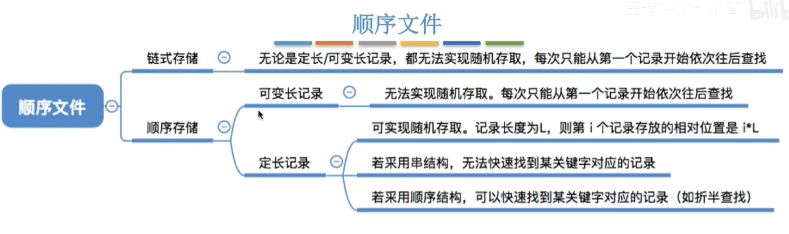

- 索引文件

  - 每个文件一张索引表加快文件检索速度
    - 索引表：定长记录顺序文件，可以快速找到第i个记录对应索引表项
    - 增加删除记录，需要相应操作索引表
  - 每条记录一个索引项，文件中的记录物理上可以离散存放
  - 可以用不同数据项建立多个索引表
    - 例如用学号建立，用姓名建立

- 索引顺序文件

  - 索引表很大？小文件的索引表都比文件内容大
  - 记录分组，一组记录对应索引表项
  - 索引顺序文件不需要按关键字顺序排列，可极大方便新表项插入
  - 10000个项->100组（平均查50次）->组内100项(平均查50次)

  

  - 多级索引顺序文件，10^6分为100 * 100 * 100

  

### 考

默认顺序文件的记录在物理顺序存储

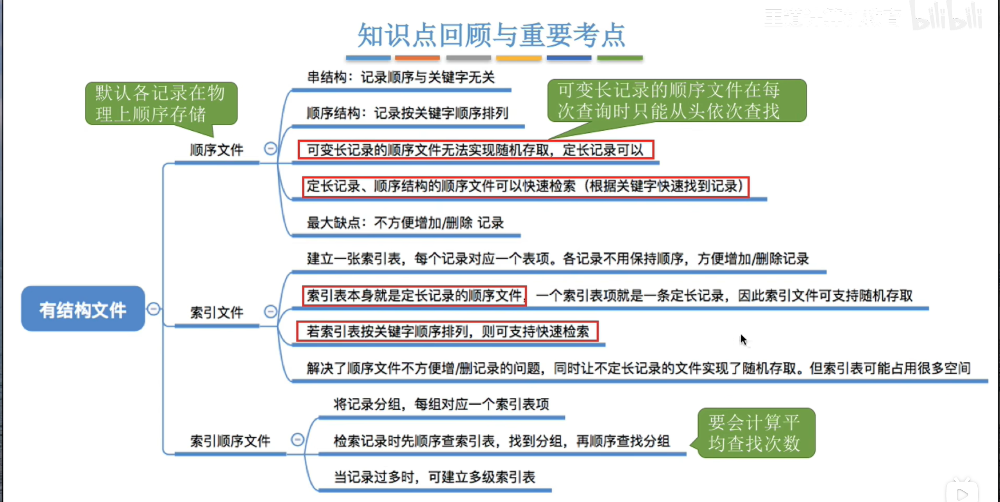

## 4.1.2 文件控制块 4.2.1/3 文件目录

目录结构

- 易于查找
- 按名存取

### 文件控制块

目录文件（目录表）

- 目录文件的每条记录对应该目录下一个文件

  - **文件名**、类型、存取权限、**物理地址**
  - FCB包含文件基本信息
  - FCB有序集合称为**文件目录**，一个FCB就是一个**文件目录项**

  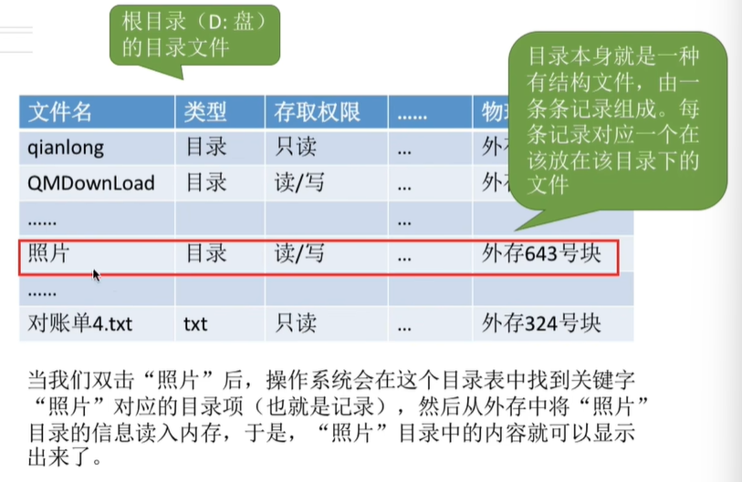

- 目录的操作
  - 搜索：根据文件名找到对应目录项
  - 创建文件：需要在目录增加目录项
  - 删除文件
  - 显示目录
  - 修改目录：文件属性变化时需要修改

### 目录结构——单级目录结构

整个系统一张目录表，每个文件一个目录项

- 不允许文件重名
- 不适于多用户

### 两级目录结构

主文件目录：记录用户名、用户文件目标存放位置

用户文件目录

- 允许不同用户文件重名
- 但是用户不可以对自己文件分类

### 树型目录结构

不同目录下文件可以重名

文件路径名：字符串

- 各级目录之间用/隔开

- 从**根目录**出发的路径称为**绝对路径**

  

- 设置一个当前目录（利用局部性）
- 从当前目录出发的**相对路径**
  - 只需要查询当前目录的目录表，只需要一次外存I/O

特点

- 不便于实现文件共享

### 无环图目录结构

有向无环图

- 不同文件名指向同一个文件，甚至指向同一个目录（共享同一目录下所有内容）
- 删除文件时
  - 共享文件设置共享计数器，归0时再删除文件结点
- 共享文件：一个用户修改文件，所有用户都可以看到

### 索引结点

FCB的改进：用户查找时，只需要用文件名匹配即可，目录表瘦身，其他信息放到索引结点

- 磁盘索引结点
- 内存索引结点
  - 内存索引结点需要增加一些信息：文件是否被修改，几个进程正访问该文件等

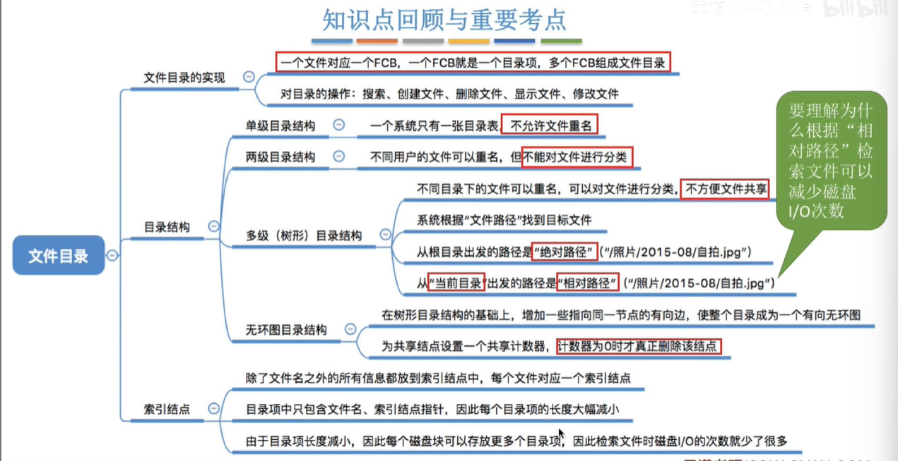

## 4.1.5 文件物理结构

OS需要管理磁盘

- 非空闲磁盘块 —— 文件物理结构/文件分配方式
- 空闲磁盘块 —— 文件存储空间管理

文件物理结构

- 连续分配
- 链接分配
  - 隐式链接
  - 显式链接
- 索引分配

### 文件块磁盘块

- 磁盘块应与内存块大小相等
- 文件逻辑地址结构也被划分为一个个文件的“块”
  - （逻辑块号，块内地址）
  - 用户使用逻辑块号
  - OS从逻辑到物理地址

### 文件分配方式——连续分配

每个文件在**磁盘占有一组连续**的块

文件目录中记录存放*起始块号*和*长度*

- OS根据逻辑块号找到FCB

- 物理块号 = 起始块号 + 逻辑块号

优点

- 支持顺序访问，随机访问（直接访问）
- 此时磁头移动距离、时间最短 —— 顺序读/写最快

缺点

- 文件拓展不方便，可能需要数据迁移etc.
- 磁盘碎片，存储利用率低
  - 紧凑，但是需要耗费很大时间代价

### 链接分配

离散分配

#### 隐式链接

起始块号、结束块号，磁盘块保存指向下一个盘块的指针，指针对用户透明

- i号块，需要i+1次I/O

- 只支持顺序访问，不支持随机访问，耗费存储空间

优点：

- 方便拓展
- 利用率高

缺点：

- 不支持随机访问

#### 显示链接

用于链接文件各物理块的指针显示放在一张表中，文件分配表FAT

FCB只要记录起始块号即可

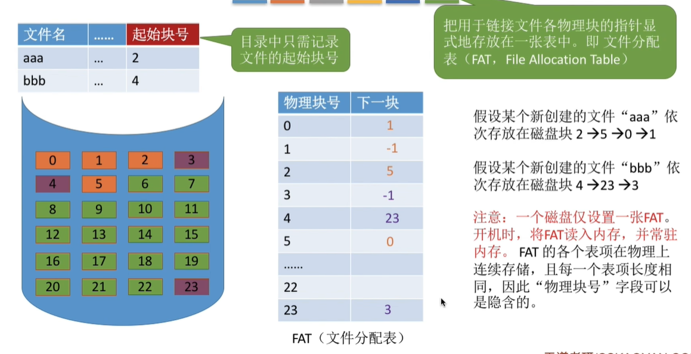

访问逻辑块号i：

1. 先查FCB
2. 找到起始块号，i>0则查FAT
3. i号往后找到物理块号（这里不需要进行读磁盘）

结论

- 支持顺序访问，随机访问；速度比隐式链接快很多

- FAT需要占用一定存储空间

考：链接分配默认隐式链接

### 索引分配

每个文件一张索引表，记录文件各逻辑块对应物理块

索引表存放的磁盘块称索引块，文件数据存放的磁盘块称数据块

目录项记录索引块

- 隐含：只要知道索引表起始位置（即索引块），就可直接根据逻辑块号，直接计算出表项位置

逻辑块号到物理块号转换：

- 给出访问逻辑块号i，系统找到文件对应的FCB
- FCB知道索引表存放位置，索引表从外存读入内存，
- 查找索引表，知道i号逻辑块在外存中存放位置

特点

- 支持随机访问，文件扩展容易实现
- 索引表需要占用一定存储空间

**一个磁盘块装不下整个文件索引表**

1. 链接方案，多个索引块链接存放，索引块存储指向下一个索引块的指针

   - 地址转换可能需要两百多次读磁盘那

2. 多层索引

   - FCB记录顶级索引块 —— 各级索引表大小不能超过一个磁盘块
   - 两层索引：文件最大长度256 * 256 * 1KB = 64MB
   - 逻辑块->物理
     - 1026号逻辑块，1026/256=4，1026%256=2
     - 查4号表项，找到对应的二级索引表，再查询二级索引表的2号表项，即可知道1026号逻辑块存放的磁盘块号
     - 3次I/O
   - 3层索引，4次I/O，256 * 256 * 256 *1KB
   - K层索引，顶级索引表未调入内存时，K+1次读磁盘操作

3. 混合索引

   - 顶级索引表中，包含一些直接索引、一级间接索引、二级间接索引
   - 直接地址：指向数据块
   - 一级间接索引：指向单层索引表
   - 二级间接索引：指向两层索引表

   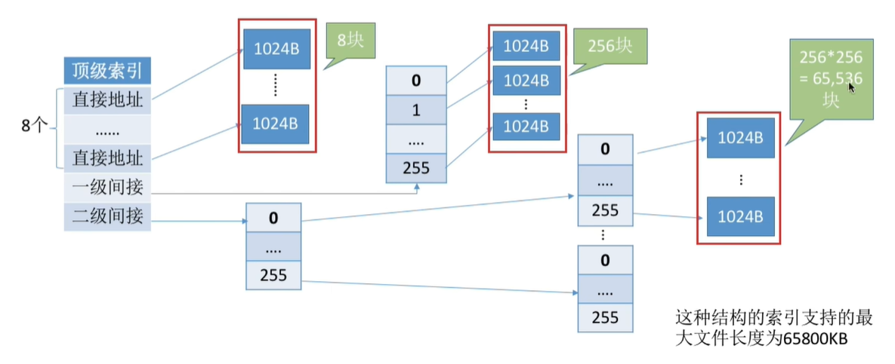

   - 读磁盘操作
     - 0~7：两次读磁盘
     - 8~263：三次读磁盘
     - 264~65799：四次读磁盘

#### 考

- 计算文件最大长度 —— 各级索引表最大不能超过一个块
- 分析读磁盘次数，每次读入下一级索引块都需要读磁盘，注意题目条件 —— 顶级索引块是否已调入内存

## 4.3.3 文件存储空间管理

空闲磁盘块管理

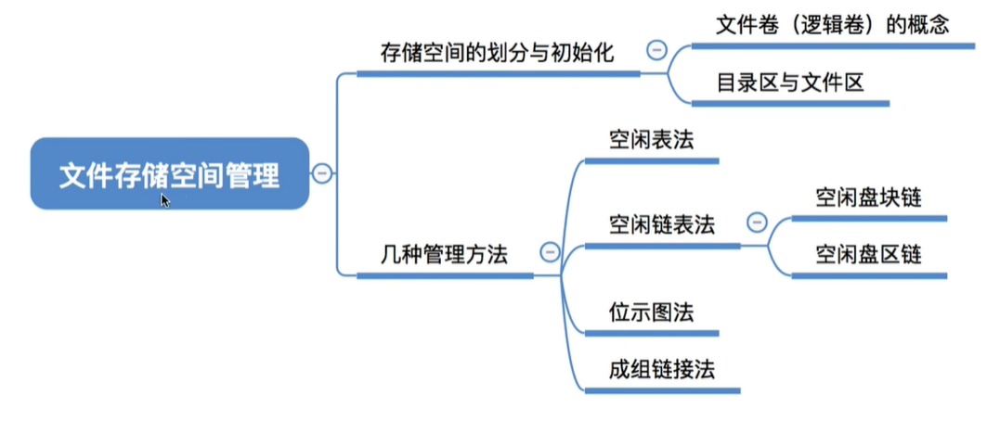

- 什么方式记录、组织
- 如何分配、回收

### 存储空间的划分与初始化

存储空间划分：物理磁盘划分为文件卷（逻辑卷、逻辑盘）

- 目录区：存目录信息（FCB）、用于磁盘存储空间管理的信息
- 文件区：用于存放文件数据
- 有的也有多个物理磁盘组成一个文件卷

### 存储空间管理——空闲表法

适用连续分配

表项：第一个空闲盘块号，空闲盘块数

如何分配磁盘块：为文件分配连续存储空间

- 首次适应、最佳适应、最坏适应等

回收：注意表项合并，表项数量的变化

### 空闲链表法

空闲盘块链vs空闲盘区链

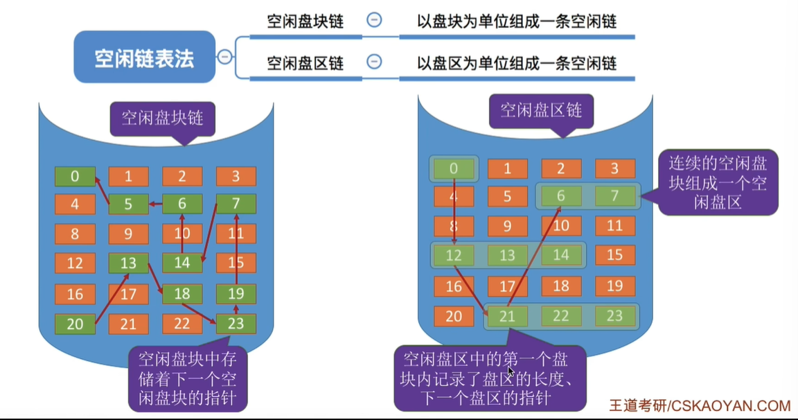

盘块：

- OS保存链头链尾指针（指向空闲块的）
- 分配：文件申请K个盘块，从链头摘下K个盘块分配，并修改空闲链头指针
- 回收：回收盘块依次挂到链尾，并修改链尾指针

盘区：

- OS保存头尾
- 申请K，采用首次适应、最佳适应，从链头检索，找到一个大小合适的空闲盘区，分配给文件，若没有合适的连续空闲块，可以分配不同盘区的盘块，注意需要修改链指针、盘区大小等数据
- 回收：合并&盘区挂到链尾
- 适用离散、连续分配，分配多个磁盘块效率更高

### 位示图法

每个二进制位对应一个盘块，0代表空闲，1代表分配

需要自己推盘块号与（字号，位号）相互转换公式

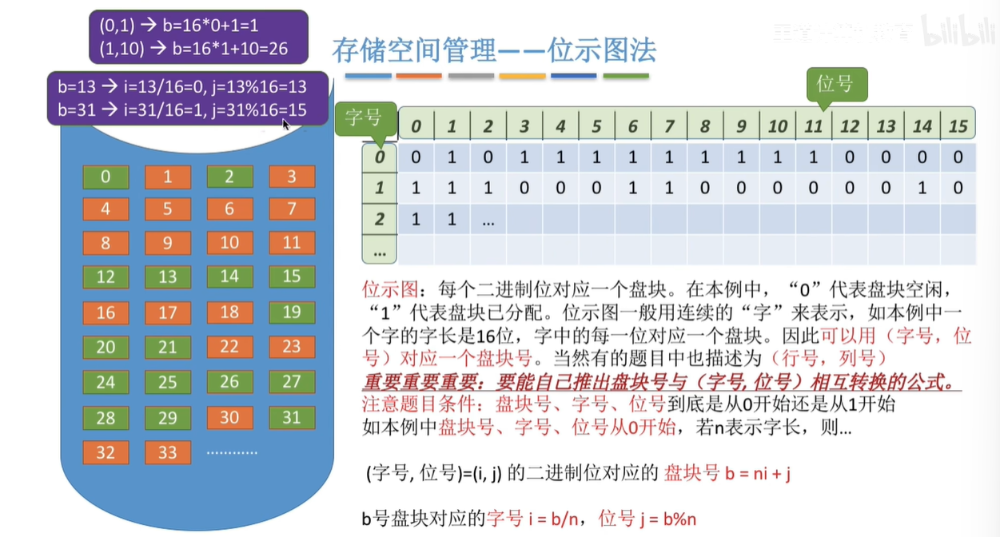

分配：顺序扫描位示图，找到K个相邻或不相邻的0；根据字号位号算出盘块号，相应盘块分配给文件；相应位设置成1

回收：根据盘块号计算字号位号，相应二进制位设0

### 成组链接法

文件卷**目录区**中，专门用一个磁盘块作为超级块，系统启动时超级块读入内存，保证内存与外存中超级块数据一致

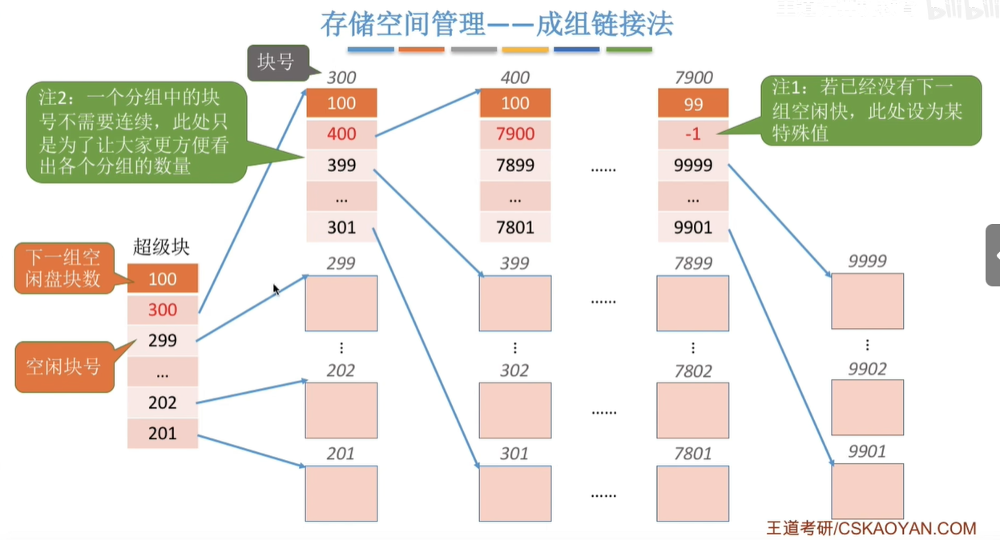

分配：检查第一个分组块数是否足够；分配第一个分组中的空闲块，并修改相应数据

- 1<100; 100->99
- 100=100; 300号磁盘块中都需要分配掉，但是300号存了下一组的信息，所以300号块的数据需要复制到超级块中（超级块300->400）
- 超级块充当链头作用

回收：分组没满，插入分组；分组已满，新的块作为新分组

- 理解一下得了难得考

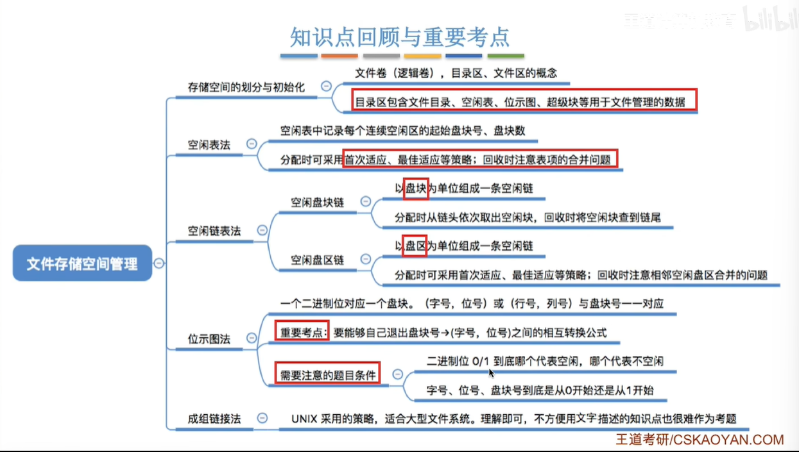

## 4.1.7 文件基本操作

### 创建文件

- 提供外存空间大小
- 路径
- 文件名

### 删除文件

- 路径
- 文件名

操作

- 找到目录项，回收磁盘块，删除目录项

### 打开文件

- 路径
- 文件名
- 操作类型（r、rw）

操作

- 找到目录项
- 复制到打开文件表中
  - 系统打开文件表（整个系统一张）
    - 打开计数器
  - 进程打开文件表
    - 有指向系统表索引号
    - 读写指针
    - 访问权限

**文件描述符**：索引号

## 4.1.8 文件共享

### 基于索引结点的共享（硬链接）

索引结点，链接计数变量count，用于表示链接到本索引结点上的用户目录项数

count=2则有两个用户链接

注意删除的细节，删目录项，count=0再删除文件

### 基于符号链的共享（软链接）

link型文件：记录文件存放路径（有点像快捷方式）

- 判断Link型文件
- 根据记录查找目录，找到文件的索引结点
- 如果找文件被干掉了，那么软链接失效

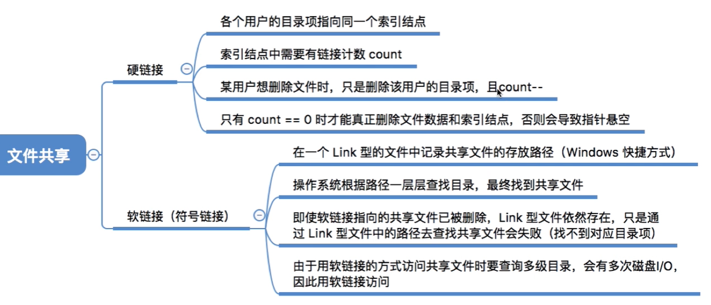

## 4.1.9 文件保护

### 口令保护

- 访问文件时提供口令，OS比对
- 开销小，验证开销小
- 不够安全，口令就存在系统内部

### 加密保护

- 加密算法对文件加密，访问文件需用正确密码解密
- 异或加密
- 保密性强，不需要系统存储
- 加密解密需要花费一定时间

### 访问控制

FCB中访问控制表，记录用户可对文件执行的操作

访问类型：读、写、执行、添加、删除、列表清单（列出文件名和文件属性）

精简的访问列表：组，标记各组用户可以对文件执行哪些操作；系统需要管理分组的信息

- 若想让某个用户能读，则加入相应用户组即可

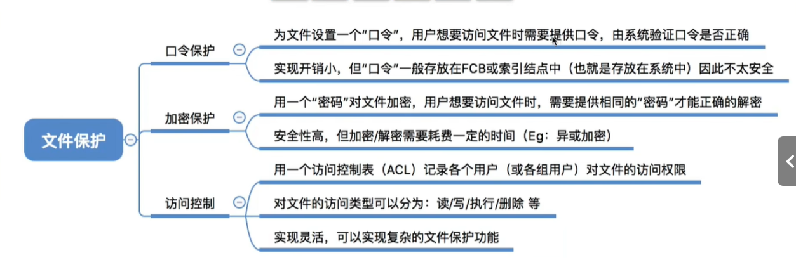

## 4.3.1 文件系统层次结构

## 4.3.2 文件系统布局

### 文件系统在磁盘结构

物理格式化：划分扇区，检测坏扇区，备用扇区替换坏扇区（对OS透明）

逻辑格式化（高级格式化）：磁盘分区，完成各分区的文件系统初始化

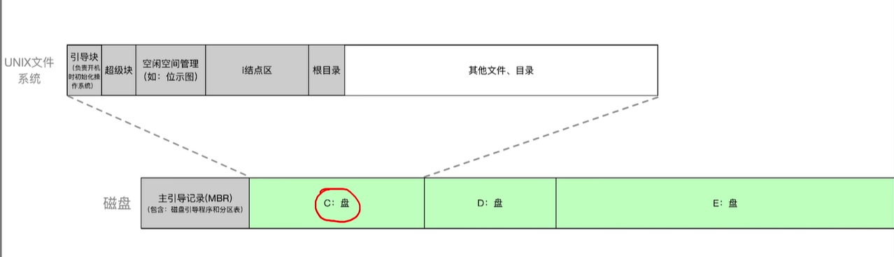

### 文件系统在内存结构

用户区内核区

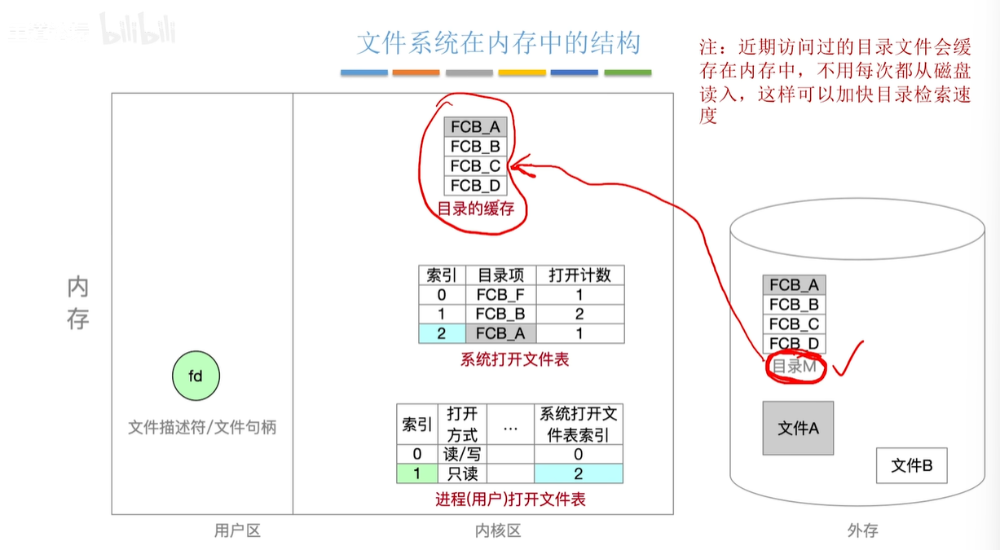

- 目录缓存
- 系统打开文件表
- 进程（用户）打开文件表

## 4.3.4 虚拟文件系统

不同硬件文件系统格式可能不同，函数接口也不相同；不同文件系统，文件数据结构各不相同，读入文件信息各不相同

虚拟文件系统VFS特点：

1. 向上层用户进程提供统一标准的系统调用接口，屏蔽底层具体文件系统的实现差异
2. 要求下层文件系统必须实现某些规定函数功能，满足OS的VFS的要求
3. 打开文件，就在主存新建一个vnode，用统一数据结构表示文件（无论文件存储在哪个文件系统）
   - 注意vnode只存在于主存，而文件系统inode会被调入主存，也会在外存中存储

### 文件系统挂载

1. VFS中注册新的挂载表，包含每个文件系统相关信息，包含文件系统类型、容量大小
2. 新挂载的文件系统，想VFS提供函数地址列表
3. 新文件系统加入到挂载点中，挂在某个父目录之下

# 4.x 整理

## 4.1 文件系统基础

### 打开文件操作

将文件FCB存入内存中的活跃文件目录表 —— 如果需要会返回一个文件描述符

找到指定文件目录项：是打开文件之前的操作

### 关闭文件操作

将文件当前控制信息从内存写回磁盘 —— 并不意味着文件数据写回磁盘

- 仅写文件会写回磁盘
- 暂不考虑延迟写

### 文件目录项

文件目录项就叫FCB，它包含文件物理位置，不会包含自己的物理位置

### 逻辑文件

逻辑文件包含两种：

- 无结构文件（流式文件）
- 有结构文件

物理结构包含：

- 连续文件
  - 连续存储的随机访问是**最优的**
  - 别忘了这个我草
- 链接文件

按用途分类文件：

- 系统文件
- 链接文件

### 文件系统

系统角度：

- 对文件的存储空间进行组织、分配
- 负责文件的存储，对文件进行保护、检索

用户角度：

- 根据格式将文件存储到适当地方
- 用户需要适用文件时，系统根据用户所给文件名从存储器中找到相应文件

### UNIX文件系统相关

超级块

- 超级块用来描述文件系统

索引结点

- 存放文件信息
- 采用树形目录结构

### 可用于管理空闲磁盘块的数据结构

1. 位图
2. 空闲磁盘块链
3. 文件分配表（FAT）
   - 因为FAT记录了文件中各个块的先后链接关系，还标记了空闲的磁盘块

### 对文件访问的限制

由**用户访问权限**和**文件属性**共同限制

### 存取控制矩阵

是用户组、权限的那个**表格**，用于多用户之间的存取权限保护

防止文件受损：采用备份的办法
