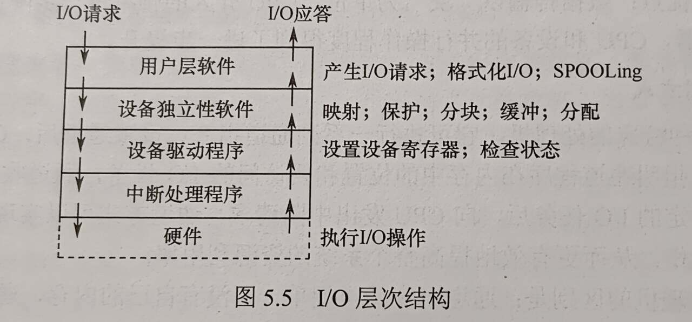

# 第五章 输入/输出管理

## 目录
- [第五章 输入/输出管理](#第五章-输入输出管理)
  - [目录](#目录)
  - [5.1 I/O管理概述](#51-io管理概述)
    - [5.1.1 I/O设备](#511-io设备)
      - [设备的分类](#设备的分类)
      - [I/O接口（设备控制器）](#io接口设备控制器)
      - [I/O接口的类型](#io接口的类型)
      - [I/O端口](#io端口)
    - [5.1.2 I/O控制方式](#512-io控制方式)
      - [程序直接控制](#程序直接控制)
      - [中断驱动方式](#中断驱动方式)
      - [DMA方式](#dma方式)
      - [通道控制方式（不在考纲）](#通道控制方式不在考纲)
    - [5.1.3 I/O软件层次结构](#513-io软件层次结构)
      - [用户层软件](#用户层软件)
      - [设备独立性软件](#设备独立性软件)
      - [设备驱动程序](#设备驱动程序)
      - [中断处理程序](#中断处理程序)
      - [总结过程](#总结过程)
    - [5.1.4 应用程序I/O接口](#514-应用程序io接口)
      - [I/O接口的分类](#io接口的分类)
      - [阻塞I/O和非阻塞I/O](#阻塞io和非阻塞io)
    - [考点\&易错点整理](#考点易错点整理)

## 5.1 I/O管理概述

### 5.1.1 I/O设备
I/O设备包含很多领域的不同设备及设备相关的应用程序，很难有通用且一致的设计方案

#### 设备的分类
I/O设备指可以将数据输入计算机的外部设备，或者可以接收计算机输出数据的外部设备

按信息交换的单位分类
- 块设备
  - 以数据块为单位信息交换，如磁盘、磁带等
  - 磁盘设备，传输速率较高、可寻址（即可随机读/写任意一块）
- 字符设备
  - 以字符为单位，交互式终端机（Terminal）、打印机等
  - 传输速率低，不可寻址，通常采用中断I/O方式
- 低速设备  
  - 每秒几字节~数百字节，如键鼠等
- 中速设备
  - 每秒数千~数万字节，如激光打印机等
- 高速设备
  - 每秒数百KB~千MB，如磁盘、光盘等

按设备的使用特性分类
- 人机交互设备
  - 用户与计算机之间交互信息的设备，如键盘、显示器、打印机等
- 存储设备
  - 用于存储数据的设备，如磁盘、磁带、光盘等
- 网络通信设备
  - 计算机和计算机之间的通信设备，如网卡、调制解调器等

按设备的共享属性分类
- 独占设备
  - 一次只能被一个进程使用的设备。
  - 低速设备一般是独占设备，如键盘、鼠标、打印机等
- 共享设备
  - 同一时间段多个进程同时访问的设备
  - 通过分时的方式分配给多个进程使用
- 虚拟设备
  - 通过SPOOLing技术将独占设备改造成共享设备，一个物理设备变成多个逻辑设备，从而可将设备同时分配给多个进程

#### I/O接口（设备控制器）
- I/O接口（也称设备控制器）是CPU与设备之间的“桥梁”，实现设备和计算机之间的数据交换
- 接收发自CPU的命令，控制设备工作，使CPU能从繁杂的设备控制事务中解脱出来
- 设备控制器由3部分组成
  - 设备控制器与CPU的接口
    - 实现CPU与设备控制器之间的通信
    - 该接口有三类信号线
      - 数据线
      - 地址线
      - 控制线
  - 设备控制器与设备的接口
    - 一个设备控制器可以连接一个或多个设备  
    - 控制器有**一个或多个设备接口**，每个接口都可传输 数据、控制和状态三种类型的信号
  - I/O逻辑
    - 实现对设备的控制
    - 一组控制线与CPU交互，对从CPU收到的I/O命令进行译码
    - CPU启动设备时，将启动命令发送给控制器，同时通过地址线将地址发送给控制器
    - 由控制器的I/O逻辑对地址进行译码，并对所选设备进行控制
- 设备控制器的主要功能有
  - 接收和识别命令：磁盘控制器能接收CPU发来的读、写、查找等命令
  - 数据交换：CPU和控制器间数据传输，控制器和设备之间的数据传输
  - 标识和报告设备的状态：供CPU处理
  - 地址识别
  - 数据缓冲
  - 差错控制

#### I/O接口的类型
I/O接口可分为不同的类型：
- 按数据传送方式（外设和接口一侧）
  - 并行接口（一个字节或一个字的所有位同时传送）
  - 串行接口（一位一位地有序传送）
  - **接口需要完成数据格式的转换**
- 按主机访问I/O设备的控制方式
  - 程序查询接口
  - 中断接口
  - DMA接口
  - etc.
- 按功能选择的灵活性
  - 可编程接口（通过编程改变接口功能）
  - 不可编程接口

#### I/O端口
- I/O端口是设备控制器中可被CPU直接访问的寄存器，主要有以下三类
  - 数据寄存器：缓存从设备送来的输入数据或从CPU来的输出数据
  - 状态寄存器：保存设备的执行结果或状态信息，供CPU读取
  - 控制寄存器：由CPU写入，以便启动命令或更改设备模式
- I/O端口想要被CPU访问，必须对各个端口编址，每个端口对应一个**端口地址**，有两种编址方式
  - 独立编址  
    - 每个端口分配一个I/O端口号
    - I/O端口的地址空间和主存地址空间是两个独立的地址空间，范围可以重叠
    - 普通用户无法访问端口，仅OS使用特殊的I/O指令才能访问端口
    - 优点
      - I/O端口数比主存单元少得多，只需要少量地址线
      - I/O端口译码简单寻址快
      - 使用专用I/O指令，程序更清晰，便于理解检查
    - 缺点
      - I/O指令少，只提供简单传输操作，程序设计灵活性差
      - CPU需提供两组独立存储器和设备的读/写控制信号，增加控制复杂性
  - 统一编址
    - 也称内存映射I/O，主存地址空间分配一部分给I/O端口进行编址，I/O端口和主存单元在同一地址的不同分段
    - 根据地址范围即可判断访问的是I/O端口还是主存单元
    - 优点
      - 无需专门的I/O指令，CPU访问I/O操作更加灵活方便
      - 端口有较大的编制空间
      - 保护机制可由虚拟存储管理系统实现，无需专门实现
    - 缺点
      - 使主存可用容量变小
      - 识别I/O时全部地址线参与译码，译码电路更加复杂，降低寻址速度

### 5.1.2 I/O控制方式
- **I/O控制**是指控制设备和主机之间的数据传送
- 宗旨：减少CPU对I/O控制的干预，将CPU从繁杂的I/O控制事务中解脱出来
- I/O控制方式有四种

#### 程序直接控制
- 也称**程序轮询**方式
- 一个字的I/O操作：
  - CPU向设备控制器发送I/O指令，启动轮询
    - 从I/O设备读取一个字
    - 不断循环测试设备状态（轮询）
    - 确定该字已到设备控制器数据寄存器中
  - CPU取出数据寄存器中的数据，送入内存指定单元
- 优点
  - 简单、易于实现
- 缺点
  - CPU绝大部分都处于循环测试中 -> 因为CPU未采用中断机制，I/O设备无法报告它完成，只能通过轮询来检查
  - CPU和I/O设备也只能串行
  - 由于CPU和I/O设备速度差异非常大，CPU利用率相当低

#### 中断驱动方式
- 思想：允许I/O设备主动打断CPU运行并请求服务，使得CPU发出一条I/O指令后可做其他有用的工作
- 设备控制器角度看工作过程
  - 设备控制器从CPU接收一个读命令，从设备读数据
  - 一旦数据读入设备控制器的数据寄存器，通过控制线给CPU发送中断信号
  - 等待CPU请求该数据
  - 设备控制器收到CPU发出的取数据请求后，将数据放到数据总线上，传至CPU寄存器中
- CPU角度看工作过程
  - 当前运行进程发出读命令，进程被阻塞，保存进程上下文，转去执行其他程序
  - 每个指令周期的末尾，CPU检查中断信号
  - 有来自设备控制器的中断时，CPU上下文切换至中断处理程序
  - CPU读数据存入主存
  - 处理完中断后解除进程的阻塞状态，恢复其（或其他进程）上下文继续运行
- 优点
  - CPU和设备并行工作，效率明显提升
- 缺点
  - 设备、内存之间数据交换都得经过CPU寄存器
  - CPU是以字为单位干预的，速度及其受限

#### DMA方式
- **DMA**（直接存储器读取）
- 思想：I/O设备和内存之间开辟直接的数据交换通路，彻底“解放”CPU
- 特点
  - 基本传送单位是数据块，不再是字
  - 数据从设备直接送入内存
  - 仅传送一个/多个数据块的开始和结束时，才需要CPU干预
- 为实现主机和控制器之间直接交换成块数据，DMA控制器需设置4类寄存器
  - 命令/状态寄存器（CR）：暂存从CPU发来的I/O指令，或设备的状态信息
  - 内存地址寄存器（MAR）：输入时，存放将数据从设备传送到内存的 **起始目标地址**；输出时，存放内存到设备的 **内存源地址**
  - 数据寄存器（DR）：暂存从设备到内存或从内存到设备的数据
  - 数据计数器（DC）：本次要传送的字节数
- 工作流程
  - CPU接收到设备的DMA请求时
  - CPU向DMA控制器发出一条命令，同时设置MAR和DC初值，启动DMA控制器，然后继续其他工作
  - 之后CPU将I/O控制权交给DMA控制器，由**DMA控制器负责数据传送**
  - 数据传送结束后，DMA向CPU发送一个中断信号
- 优点
  - 以块为单位，CPU介入频率进一步降低
  - 数据传送不再经过CPU的寄存器，CPU和设备的并行度得到进一步提升

#### 通道控制方式（不在考纲）
I/O通道是一种特殊的处理机，可执行一系列通道指令

### 5.1.3 I/O软件层次结构
- I/O软件涉及的面很宽，往下与硬件有密切联系，往上与虚拟存储器系统、文件系统和用户直接交互，都需要I/O软件完成I/O操作
- 采用层次结构的I/O软件，每层都利用其下层提供的服务，完成子功能并向高层提供服务
- 各层次及功能如下（自顶向下）
  

#### 用户层软件
- 实现与用户交互的接口
- 用户层I/O软件必须通过一组系统调用来获取操作系统服务

#### 设备独立性软件
- 实现用户程序与设备驱动器的统一接口、设备命名、设备保护，以及设备的分配与释放等
- 同时为设备管理和数据传送提供必要的存储空间
- **设备独立性**
  - 又称设备无关性
  - 含义：应用程序所用的设备不局限于某个具体的物理设备
  - 为实现设备独立性引入逻辑设备和物理设备两个概念
    - 应用程序中，使用逻辑设备名来请求某类设备
    - 系统实际执行时，逻辑设备映射成物理设备名
  - 逻辑设备名好处
    - 增加设备分配灵活性
    - 易于I/O重定向，而不必改变应用程序
- 为实现设备独立性，需要在驱动程序上设置一层**设备独立性软件**
- 功能
  - 执行设备的公有操作
    - 分配回收
    - 逻辑设备名 -> 物理设备名
    - 对设备进行保护，禁止用户直接访问设备
    - 缓冲管理
    - 差错控制
    - 提供独立于设备大小统一的逻辑块
    - 屏蔽设备之间信息交换单位大小和传输速率的差异
  - 向用户层（或文件层）提供统一接口
    - 无论何种设备，它们向用户提供的接口应该是相同的
    - 例如：对各种设备读写，程序中都是read/write

#### 设备驱动程序
- 负责具体实现系统对设备发出的操作指令
- 驱动I/O设备工作的驱动程序，是I/O进程与设备控制器之间的通信程序，常以进程形式存在
- 接收上层抽象I/O请求，read和write
- 转换为具体要求，发送给设备控制器，控制I/O设备工作
- 将由设备控制器发送的信号传送给上层软件，为I/O内核子系统隐藏设备控制器之间的差异

#### 中断处理程序
- I/O完成时，设备控制器发送中断信号，CPU响应中断后，根据中断类型号找到相应中断处理程序处理，处理完后返回到被中断的进程
- 中断处理层任务有：
  - 进程上下文切换
  - 对处理中断信号源测试
  - 读取设备状态，修改进程状态

#### 总结过程
1. 用户要读取某设备的内容时，通过read命令接口——经过**用户层**
2. 操作系统提供给用户的接口是统一通用接口，每个设备都可以响应的统一命令，如read
3. 用户发送的read命令，经过**设备独立层**解析，交往下层
4. 不同的设备对read命令行为不同，针对不同设备，需要将read命令解析成不同的指令——经过**设备驱动层**
5. 命令解析完毕后，需要中断正在运行的进程，转而执行read命令——**需要中断处理程序**
6. 命令抵达硬件设备，硬件设备控制器按照上层命令操控硬件设备，完成相应功能

### 5.1.4 应用程序I/O接口

#### I/O接口的分类
1. 字符设备接口
   - 字符设备
     - 传输速率较低
     - 不可寻址
     - I/O时通常采用中断驱动方式
   - get和put操作
     - 字符设备不可寻址 -> 顺序存取，为字符设备建立字符缓冲区
     - get从缓冲区获取字符
     - put将字符输出至缓冲区
   - in-control指令
     - 通用的in-control指令，包含许多参数，每个参数代表一个与具体设备相关的特定功能
2. 块设备接口
   - 块设备
     - 传输速率较高
     - 可寻址
     - I/O时通常采用DMA方式
   - 支持上层发来的打开、读、写和关闭等抽象命令，映射较低层的具体操作
   - 隐藏磁盘二维结构
     - 二维结构：磁盘每个扇区地址需要磁道号+扇区号标识
     - 而接口将所有扇区从0~n-1依次编号
     - 二维结构 -> 线性序列
3. 网络设备接口
   - 提供相应网络软件和网络通信接口，使计算机能够通过网络与网络上其他计算机通信或上网浏览
   - 许多OS提供的为 网络套接字接口

#### 阻塞I/O和非阻塞I/O
- 阻塞I/O：
  - 当前用户进程调用I/O时，进程就被阻塞，并移到阻塞队列
  - I/O操作完成后，进程才被唤醒，移到就绪队列
  - 进程恢复执行时，收到系统调用返回值，继续处理数据
  - 大多数OS提供的I/O接口都是采用阻塞I/O的
  - 优点
    - 操作简单，实现难度低
    - 适合并发量小的应用开发
  - 缺点
    - I/O执行阶段，进程会一直阻塞下去
- 非阻塞I/O：
  - 用户进程调用I/O时，不阻塞该进程，但进程需不断询问I/O是否完成
  - I/O执行阶段，进程可以做其他事情
  - 问到I/O完成后，系统将数据从内核复制到用户空间
  - 进程继续处理数据
  - 优点
    - 进程等待期间不会阻塞，可以做别的，适合并发量大的应用开发
  - 缺点
    - 轮询询问I/O结果，会占用CPU时间

### 考点&易错点整理
- I/O逻辑 也叫 设备控制器

- 设备控制器为了便于上层的编制，需要提供
  - 控制寄存器、状态寄存器和控制命令
  - **控制命令是设备控制器提供的**
  - 不存在I/O地址寄存器的概念

- 接口仅用来传输数据，而实现设备控制功能的是I/O逻辑

- DMA传输的过程
  - DMA向CPU发送I/O请求（这里已经通过系统调用进入**内核态**，**预处理和后处理程序都运行在内核态**）
  - 预处理（请求I/O的进程负责）：
    - CPU向DMA控制器发出命令，设置MAR和DC初值
    - **需要CPU的参与**
  - 数据传输：
    - DMA控制器直接从设备读取数据，并将其写入内存
  - 后处理（**中断处理程序负责**）：
    - 数据传输完成后，DMA控制器向CPU发送中断信号

- 通道控制设备控制器、设备控制器控制设备工作

- 问使用I/O设备时，首先获得设备发送的信息的程序是什么
  1. 考虑I/O设备使用什么I/O控制方式。例如键盘使用中断驱动方式，磁盘使用DMA
  2. 再回忆I/O控制流程。键盘：中断处理程序获得信息；磁盘：DMA控制器获得信息