# 第五章 输入/输出管理

## 目录

- [第五章 输入/输出管理](#第五章-输入输出管理)
  - [目录](#目录)
- [5.0 错题速览](#50-错题速览)
- [5.1 I/O管理概述](#51-io管理概述)
  - [5.1.1 I/O设备](#511-io设备)
    - [按使用特性分类](#按使用特性分类)
    - [传输速率分类](#传输速率分类)
    - [交换单位分类](#交换单位分类)
    - [IO控制器](#io控制器)
  - [5.1.2 I/O控制方式](#512-io控制方式)
    - [程序直接控制方式](#程序直接控制方式)
    - [中断驱动方式](#中断驱动方式)
    - [DMA方式](#dma方式)
    - [通道控制方式](#通道控制方式)
    - [总结](#总结)
  - [5.1.3 I/O软件层次结构](#513-io软件层次结构)
    - [用户层软件](#用户层软件)
    - [设备独立性软件](#设备独立性软件)
    - [设备驱动程序](#设备驱动程序)
    - [中断处理程序](#中断处理程序)
    - [总结](#总结-1)
  - [5.1.4 应用程序I/O接口](#514-应用程序io接口)
    - [输入输出应用程序接口](#输入输出应用程序接口)
    - [阻塞/非阻塞IO](#阻塞非阻塞io)
    - [设备驱动程序接口](#设备驱动程序接口)
  - [整理](#整理)
    - [虚拟设备](#虚拟设备)
    - [I/O逻辑](#io逻辑)
    - [DMA过程](#dma过程)
    - [设备分配](#设备分配)
    - [驱动程序](#驱动程序)
    - [中断处理程序](#中断处理程序-1)
- [5.2 设备独立性软件](#52-设备独立性软件)
  - [5.2.1 I/O核心子系统](#521-io核心子系统)
  - [假脱机技术SPOOLing](#假脱机技术spooling)
    - [SPOOLing系统](#spooling系统)
    - [共享打印机原理分析](#共享打印机原理分析)
  - [设备分配回收](#设备分配回收)
    - [考虑因素](#考虑因素)
    - [静态、动态分配](#静态动态分配)
    - [数据结构](#数据结构)
    - [设备分配步骤](#设备分配步骤)
  - [缓冲区管理](#缓冲区管理)
    - [什么是](#什么是)
    - [单缓冲](#单缓冲)
    - [双缓冲](#双缓冲)
    - [循环缓冲](#循环缓冲)
    - [缓冲池](#缓冲池)
  - [整理](#整理-1)
    - [静态动态设备分配](#静态动态设备分配)
    - [SPOOLing](#spooling)
    - [设备独立性层功能](#设备独立性层功能)
    - [I/O控制方式](#io控制方式)
- [5.3 磁盘](#53-磁盘)
  - [5.3.1 磁盘的结构](#531-磁盘的结构)
    - [概念](#概念)
    - [如何读写数据](#如何读写数据)
    - [盘面柱面](#盘面柱面)
    - [磁盘物理地址](#磁盘物理地址)
    - [磁盘分类](#磁盘分类)
  - [5.3.2 磁盘调度算法](#532-磁盘调度算法)
    - [一次磁盘读写需要时间](#一次磁盘读写需要时间)
    - [磁盘调度算法](#磁盘调度算法)
      - [先来先服务FCFS](#先来先服务fcfs)
      - [最短寻找时间SSTF](#最短寻找时间sstf)
      - [扫描算法SCAN](#扫描算法scan)
      - [循环扫描算法C-SCAN](#循环扫描算法c-scan)
  - [5.3.3 减少延迟时间的方法](#533-减少延迟时间的方法)
    - [交替编号](#交替编号)
    - [磁盘地址结构设计](#磁盘地址结构设计)
    - [错位命名](#错位命名)
  - [5.3.4 磁盘管理](#534-磁盘管理)
    - [磁盘初始化](#磁盘初始化)
    - [引导块](#引导块)
    - [坏块](#坏块)
  - [5.3.5 固态硬盘SSD](#535-固态硬盘ssd)

# 5.0 错题速览

# 5.1 I/O管理概述

## 5.1.1 I/O设备

可以将数据输入到计算机，或可以接收计算机输出数据的外部设备

- UNIX将外部设备抽象成特殊文件，用户可以用与文件操作相同的方式对外部设备进行操作（/dev/null）

### 按使用特性分类

人机交互类 —— 数据传输慢

存储设备 —— 快

网络通信 —— 中

### 传输速率分类

低速设备

中速设备

高速设备

### 交换单位分类

块设备：速率高，可寻址，随机读写

字符设备：速率慢，不可寻址，常用中断驱动

### IO控制器

I/O设备由机械部件和电子部件组成

- 机械部件执行具体I/O操作
- 电子部件——I/O控制器
  - 中介作用
    - 接受和识别CPU发出的命令
      - I/O控制器中有相应控制寄存器，存放命令和参数
    - 向CPU报告设备的状态
      - I/O控制器中也有相应的状态寄存器，记录I/O设备的当前状态，1表示空闲，0表示忙碌etc.
    - 数据交换
      - 数据寄存器，暂存CPU发来的数据/暂存设备发来的数据
    - 地址识别
      - 区分控制器中各个寄存器，需要给各个寄存器设置一个特定的“地址”，I/O控制器识别地址并寻到对应寄存器
  - 设备控制器

I/O控制器的组成

- CPU与控制器接口
- I/O逻辑：接受识别各种CPU命令（地址译码），负责对设备发出命令
- 控制器与设备接口

控制过程

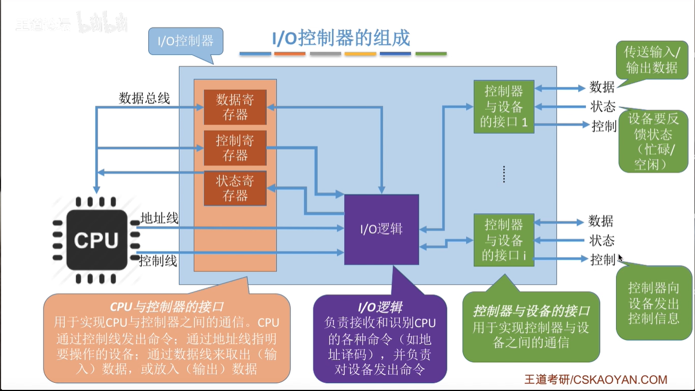

- 一个I/O控制器可能对应多个设备
- 数据、控制器、状态寄存器可能有多个，且这些寄存器都要有相应地址，才能方便CPU操作
  - 内存映射I/O
  - 寄存器独立编址

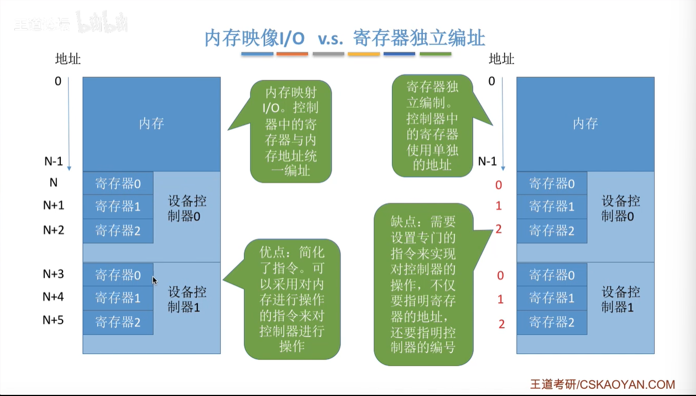

## 5.1.2 I/O控制方式

读写流程

CPU干预频率

数据传送单位

数据流向

主要缺点主要优点

### 程序直接控制方式

轮询

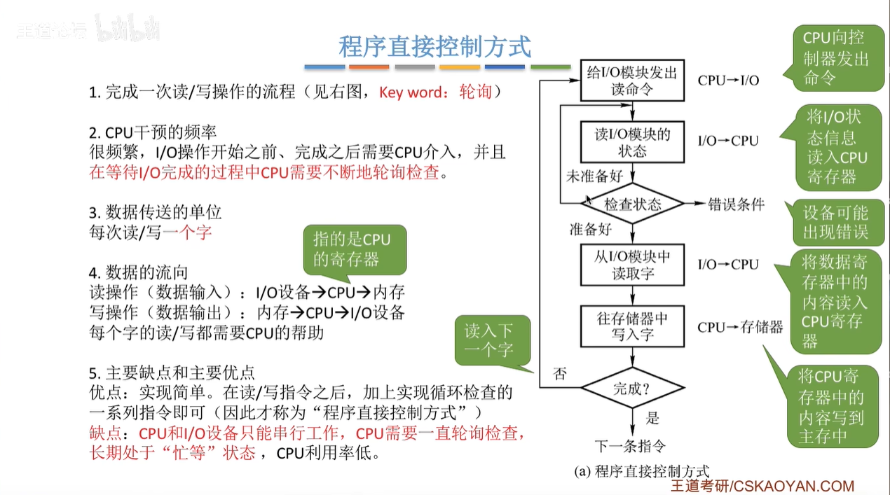

### 中断驱动方式

中断机制，阻塞等待I/O的进程，CPU检测中断信号，执行中断处理程序恢复I/O进程（或其他）并继续执行

1. CPU每个指令周期末尾检查中断
2. 中断频率太高，会降低性能
3. 并行

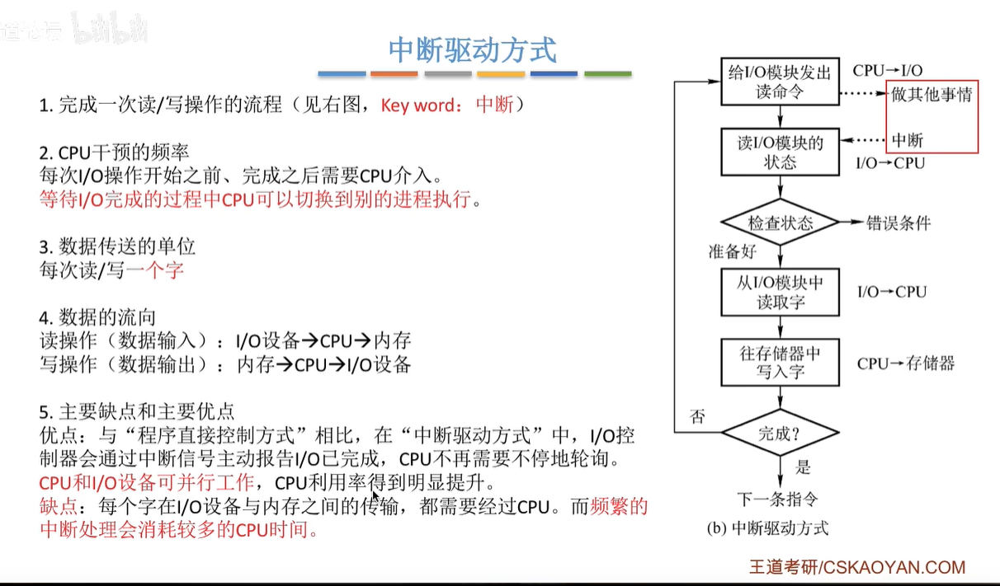

### DMA方式

直接存储器存取，块设备I/O控制

1. 单位是块
2. 流向是设备直接到内存，或内存直接到设备
3. 仅一个/多个数据块开始和结束时才需要CPU干预
   - 整块数据传输完成时发出中断信号

DMA控制器

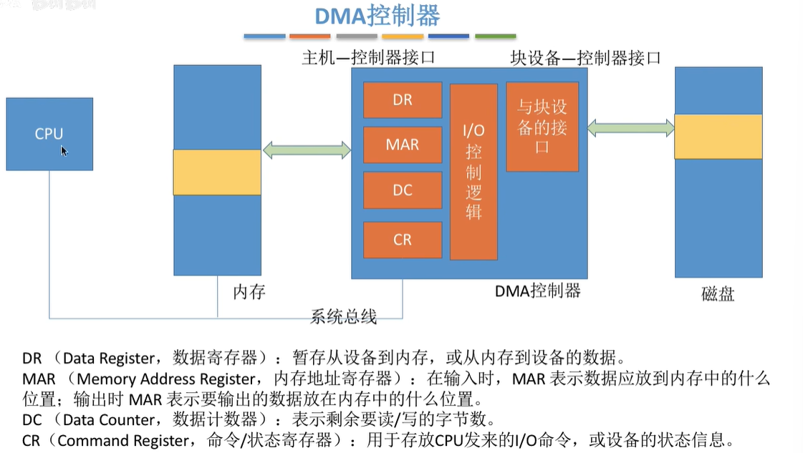

总结

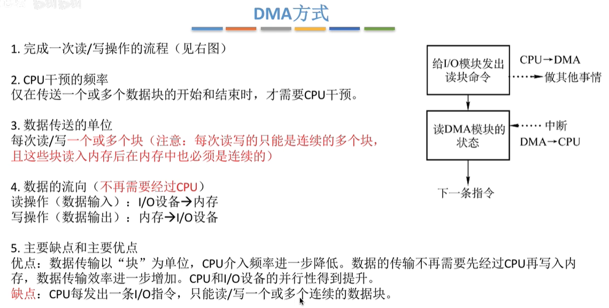

### 通道控制方式

通道：一种硬件，弱鸡CPU，识别并执行一系列通道指令，需和CPU共享主机内存

1. CPU指明通道程序在内存中位置，指明操作的I/O设备，CPU就切换到其他进程执行
2. 通道执行内存中通道程序（任务清单），指明数据多少，数据存放位置等信息
3. 通道完成任务后，向CPU发出中断信号

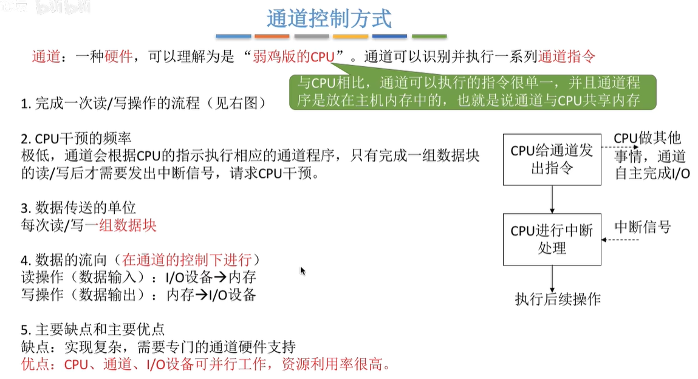

### 总结

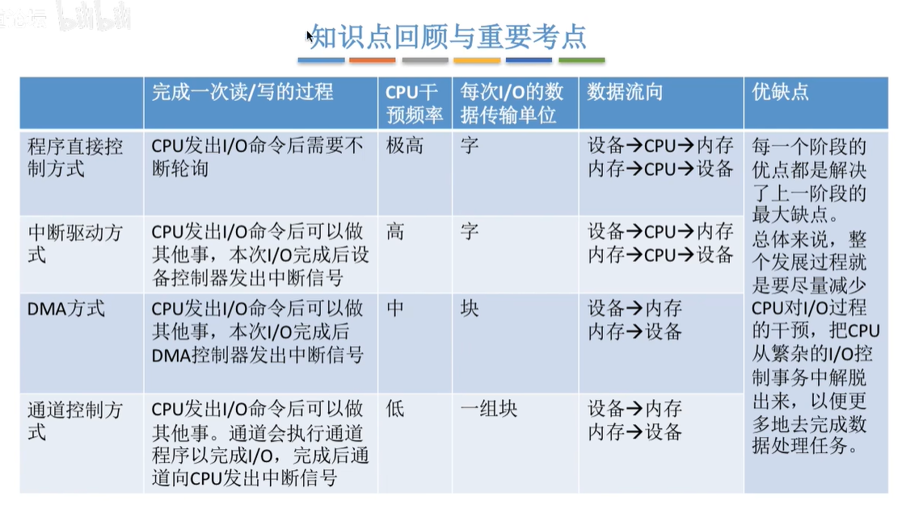

## 5.1.3 I/O软件层次结构

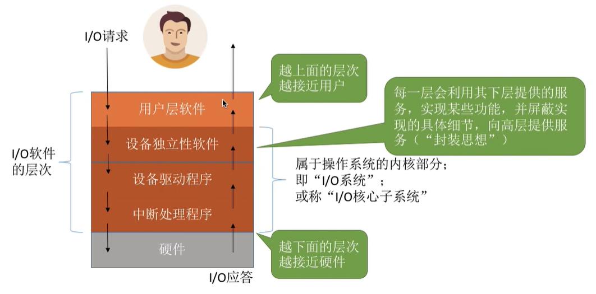

### 用户层软件

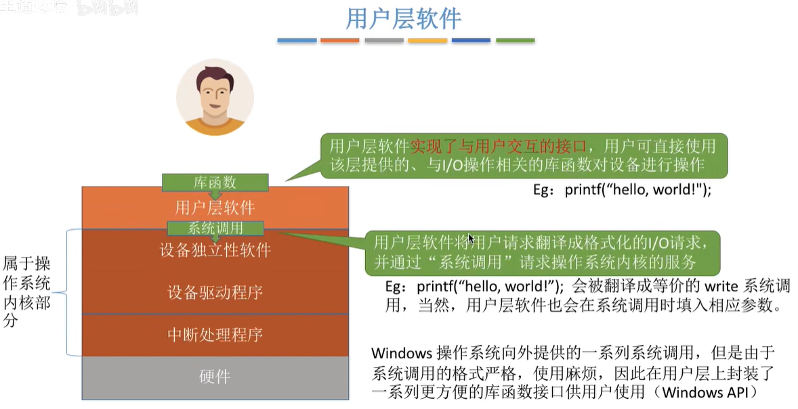

### 设备独立性软件

设备无关性

1. 向上提供
2. 设备保护
3. 差错处理：对设备错误进行处理
4. 设备分配回收
5. 数据缓冲区管理
6. 逻辑设备名 -> 物理设备名；并根据设备类型调用相应驱动程序

逻辑设备表LUT（有点像单级、两级目录）

- 表项：（逻辑设备名，物理设备名，驱动程序入口地址）

- 法一：整个用户一张LUT
- 法二：每个用户一张LUT

### 设备驱动程序

完成对设备具体控制

以独立进程方式存在

### 中断处理程序

根据中断信号类型找到中断处理程序并执行

### 总结

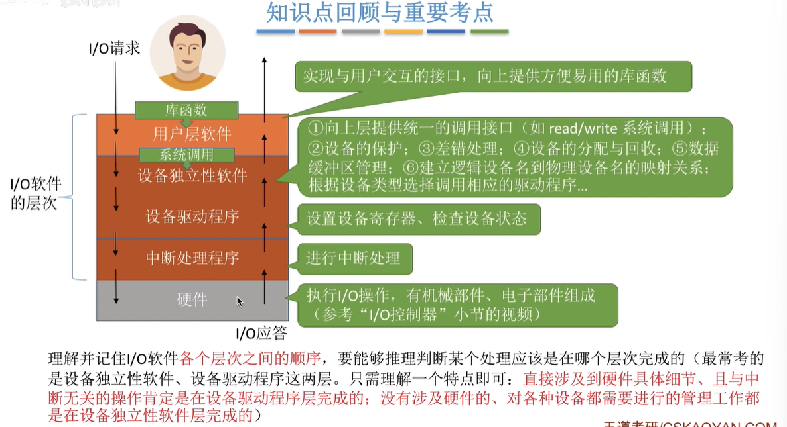

## 5.1.4 应用程序I/O接口

- 输入输出应用程序接口
  - 字符设备接口
  - 块设备接口
  - 网络设备接口
  - 什么是阻塞/非阻塞IO
- 设备驱动程序接口

### 输入输出应用程序接口

无法通过一个统一系统调用接口完成所有类型设备的I/O

- 有的可寻址有的不可以
- 所以会分三类

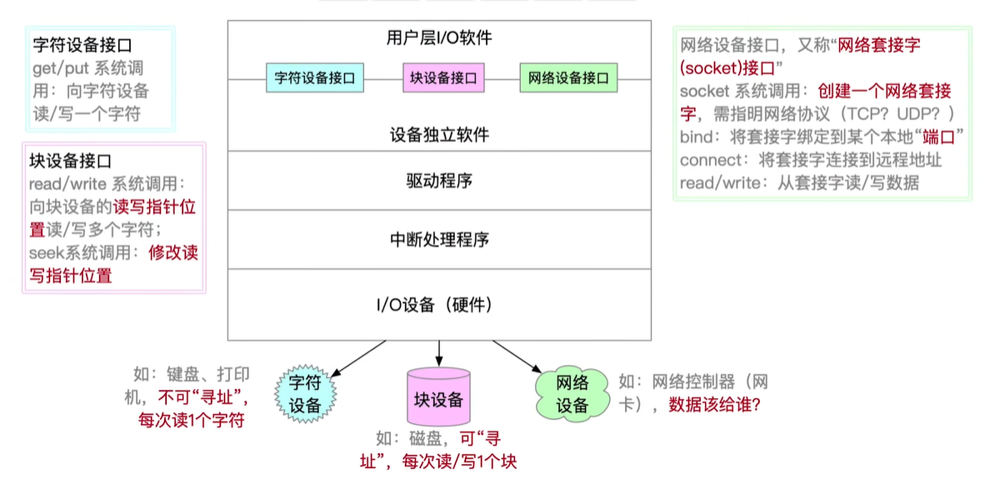

### 阻塞/非阻塞IO

阻塞：发出IO系统调用，进程需阻塞态等待

- 字符设备接口——如从键盘读一个字符get

非阻塞：发出IO系统调用，系统调用可迅速返回，进程无需阻塞等待

- 块设备接口——往磁盘写数据write
- 交给内核完成即可

### 设备驱动程序接口

OS规定设备驱动程序接口标准，各厂商需按要求开发设备驱动程序

## 整理

### 虚拟设备

克服独占设备速度慢、利用率低的特点

一台物理 -> 若干逻辑

### I/O逻辑

I/O逻辑即设备控制器，实现对设备控制

另外两端都是接口

### DMA过程

- 预处理前，请求I/O的进程通过系统调用进入内核态，引起预处理前后都在内核态
- 负责预处理的进程时请求I/O的进程；后处理的是中断服务例程
  - 预处理时请求I/O的进程处于运行态；后处理处于阻塞态
- 开始与结束都需要CPU的参与

### 设备分配

考虑：

- 设备固有属性
- 设备安全性
- 设备独立性

及时性是OS与用户程序需要考虑的

### 驱动程序

一种多个设备只需要一个驱动程序

### 中断处理程序

不同的设备，有不同的中断处理程序

# 5.2 设备独立性软件

## 5.2.1 I/O核心子系统

I/O核心子系统：

- 属于OS内核部分
- 即I/O系统，或称I/O核心子系统

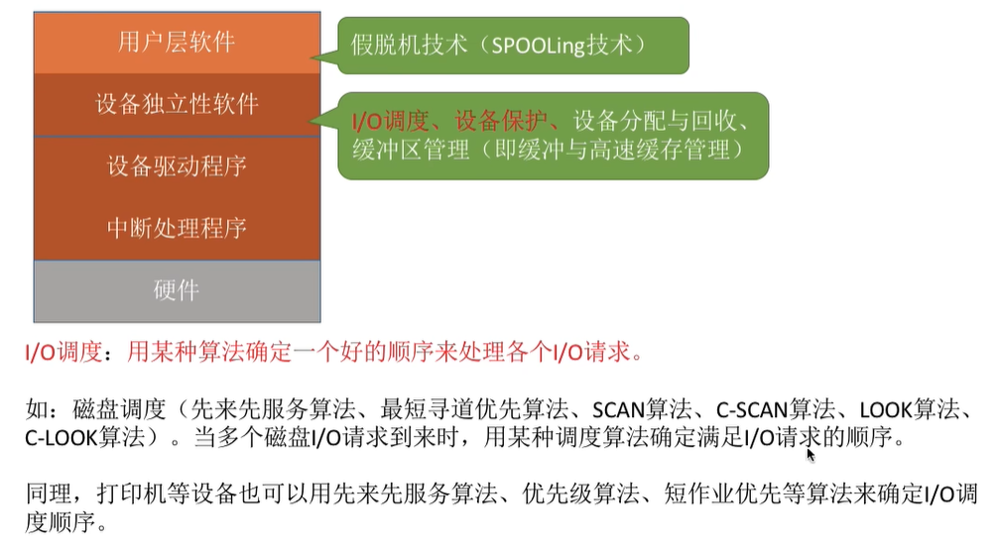

IO调度，设备保护的实现

## 假脱机技术SPOOLing

脱机技术：脱离主机控制进行输入输出（如使用外围控制机）

- 缓解了CPU与慢速I/O设备的速度矛盾
- 即使CPU忙碌，也可以提前将数据输入到磁带

假脱机技术，软件模拟脱机技术

### SPOOLing系统

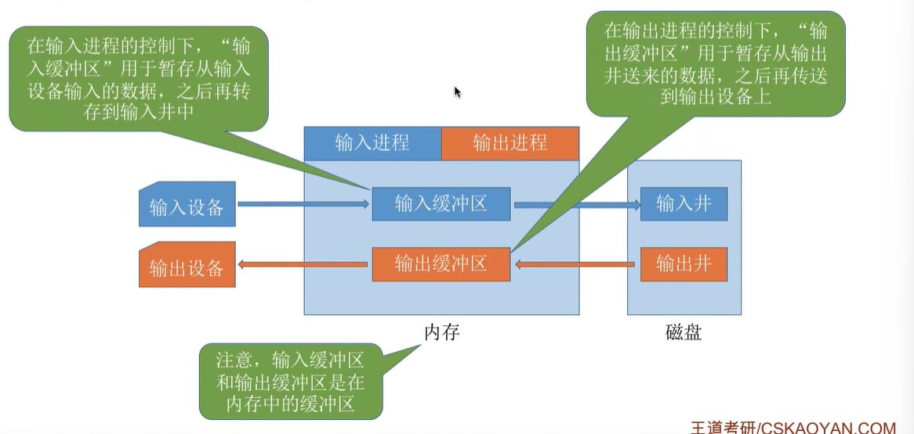

输入井：模拟脱机输入的磁带

输出井：收容进程输出的内容

输入进程：模拟脱机输入时的外围控制机

输出进程：模拟脱机输出时的外围控制机

输入缓冲区

输出缓冲区

多进程 -> 必须要多道程序控制系统的支持

### 共享打印机原理分析

SPOOLing，将独占式设备改造成共享式设备的技术

- 多个用户进程提出输出打印的请求时，系统会答应请求，但并不真正分配，而是假脱机管理进程为每个进程做两件事：
  - **磁盘**的输出井中，为用户申请空闲缓冲区（磁盘上的），并将要打印的数据送入其中 —— 分配了逻辑设备
  - 为用户进程申请空白打印请求表，说明用户打印数据存放位置等信息，将表挂到假脱机文件队列上

## 设备分配回收

### 考虑因素

设备固有属性：独占、共享、虚拟

分配算法：先来先服务、优先级、短任务优先

设备分配中安全性：

- 进程分配设备后就将其阻塞，完成I/O才将其唤醒 —— 破坏请求保持，但一个进程CPU和I/O设备只能串行工作
- 不安全分配：进程请求I/O则分配设备，进程可继续执行，直到I/O请求不满足时才将进程阻塞 —— 计算和I/O任务可并行处理，使进程迅速推进；但可能发生死锁（使用三种策略）

### 静态、动态分配

静态：进程运行前，分配全部资源，运行结束后归还 —— 破坏请求保持

动态：运行过程中得到资源

### 数据结构

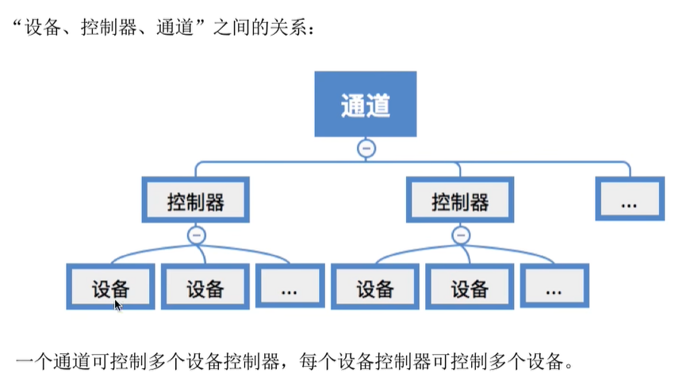

**设备控制表DCT（每个设备一个）**

表项：

- 设备类型
- 设备标识符：物理设备名，唯一
- 设备状态：忙碌空闲故障
- 指向控制器表的指针：每个设备由控制器控制，指针可找到相应控制器信息
- 重复执行次数/时间
- 设备队列队首指针：等待设备的进程队列（由进程PCB组成队列）

**控制器控制表COCT（每个设备控制器一个）**

表项：

- 控制器标识符 —— 控制器唯一ID
- 控制器状态
- 指向通道表的指针
- 控制器队列的队首指针 —— 等待控制器的进程队列
- 控制器队列队尾指针

**通道控制表CHCT**

- 通道标识符
- 通道状态
- 与通道连接的控制器表首指针
- 通道队列的队首队尾指针

**系统设备表SDT**

记录全部设备情况，每个设备一个表目

表目i：

- 设备类型
- 设备标识符
- DCT（设备控制表）
- 驱动程序入口

### 设备分配步骤

1. 根据进程请求的物理设备名查找SDT
2. 根据SDT找到DCT，设备忙则PCB挂到设备等待队列，不忙则设备分配给进程
3. DCT找到COCT，忙则PCB挂到控制器等待队列，不忙则控制器分配给进程
4. COCT找到CHCT —— 只有设备、控制器、通道三次都分配成功时，才分配成功，开始I/O

缺点：

- 编程必须使用物理设备名
- 换了物理设备则程序无法运行
- 若进程请求的物理设备正忙碌，即使系统还有同类型设备，进程必须等待

改进

1. 根据逻辑设备名（设备类型）查找SDT
2. 查找SDT，找到指定类型、空闲的设备，分配给进程，OS在逻辑设备表（LUT）中新增一个表项（代表逻辑设备）
3. DCT找COCT
4. COCT找CHCT

**逻辑设备表LUT**：建立逻辑设备名和物理设备名的映射关系

- 整个系统一张LUT：各用户用的逻辑设备名不允许重复，单用户操作系统
- 每个用户一张LUT：不同用户逻辑设备名可重复，多用户操作系统

## 缓冲区管理

### 什么是

硬件作为缓冲区：联想寄存器，快表

更多是用内存作为缓冲区

作用：

- 缓和CPU和I/O设备速度不匹配的矛盾
- 减少对CPU中断频率，放宽对CPU中断响应时间的限制（可以不用那么急着响应中断，因为响应一次管一年
- 解决数据粒度不匹配的问题
- 提高CPU与I/O设备之间并行性

### 单缓冲

OS在主存中为进程分配一个缓冲区（一个进程一个，大小一般是一个块，默认用户进程工作区大小也相同）

- 非空只能传出数据
- 为空才可冲入数据，充满后才能开始传出

考：每处理一块数据平均需要多久

- 假定一个初始状态，分析下次到达相同状态需要多少时间，则为处理一块数据平均所需时间

- 如假设工作区满，缓冲区空

  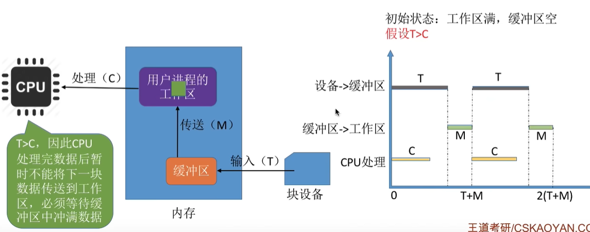

  可以背一下公式

### 双缓冲

两个缓冲区

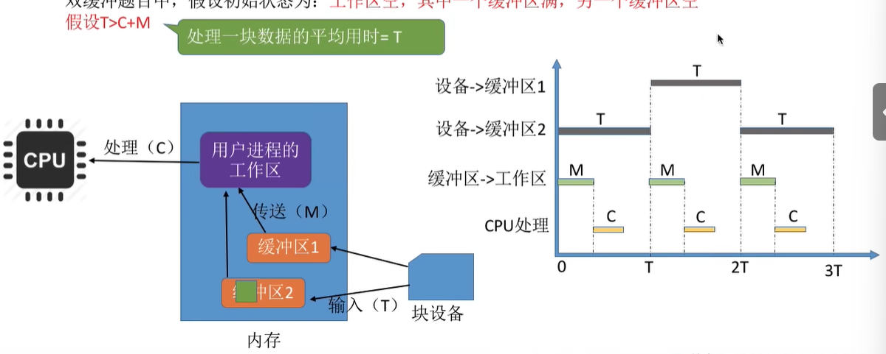

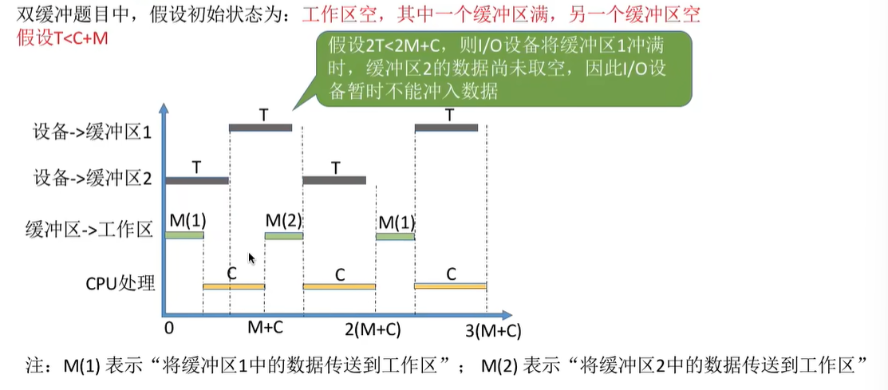

通信配置双缓冲区，分别作为发送接收

### 循环缓冲

in指针

out指针

### 缓冲池

按使用状况分为：

- 空缓冲队列
- 装满输入数据的缓冲队列（输入队列）
- 装满输出数据的缓冲队列（输出队列）

按功能分为四种工作缓冲区：

- 收容输入数据的工作缓冲区hin —— 输入进程请求输入
- sin —— 计算进程取得一块输入数据
- sout —— 输出进程请求其输出数据 
- hout —— 计算进程将准备好的数据冲入缓冲区

## 整理

### 静态动态设备分配

独占设备：静态分配

共享设备：动态分配

为了保证系统运行的安全性

### SPOOLing

用户要求使用打印机打印文件时：

- 使用磁盘作为虚拟设备 —— 需访问文件系统
- 处理新分配的虚拟设备 —— 运行设备管理程序

### 设备独立性层功能

- 设备管理
- 缓冲管理

如果说驱动程序对I/O设备传回的数据进行分析和**缓冲**，则是:x:

### I/O控制方式

- 中断控制
- DMA控制
- 通道
- etc.

# 5.3 磁盘

## 5.3.1 磁盘的结构

### 概念

磁盘：表面磁性物质，记录二进制数据

- 磁头臂带动磁头，在磁头表面读取存储的信息

磁道

扇区 —— 磁盘块

- 每个扇区存放数据量相同
- 最内的扇区数据密度最大

### 如何读写数据

移到磁道，目标扇区从磁头下划过，读取数据

### 盘面柱面

所有磁头连在统一的磁臂，共进退

相对位置相同的磁道组成柱面

### 磁盘物理地址

块号 ->（柱面号，盘面号，扇区号）

根据地址读块：

1. 根据柱面号移动磁臂，磁头指向指定柱面
2. 激活指定盘面对应的磁头
3. 磁盘旋转，指定扇区会从下面划过，完成对指定扇区的读写

### 磁盘分类

活动头磁盘（每个盘面一个）；固定头磁盘（每个磁道一个）

可换盘磁盘；固定盘磁盘

## 5.3.2 磁盘调度算法

### 一次磁盘读写需要时间

寻找时间（寻道时间）：读写前移动磁头到指定磁道

1. 启动磁头臂（s）
2. 移动磁头（跨越n条磁道，每条耗m）
3. T_S = s + m*n

延迟时间（以下这俩要会推）

1. 平均所需延迟时间 T_R =  1/2r（转半圈找到）

传输时间

1. 磁盘转速r，读取字节b，每个磁道字节N
2. T_t = b/(rN)

总时间 = T_S + 1/2r + b/(rN)

### 磁盘调度算法

#### 先来先服务FCFS

磁头先后顺序进行调度

100->55 = 45（直接减就行了）

多进程竞争激烈时，性能极低

#### 最短寻找时间SSTF

保证每次寻道最短，但总体未必最优

饥饿现象

#### 扫描算法SCAN

电梯算法，磁头移到最外侧磁道才能往内移动，最内后才能往外

初始：磁头往磁道号增大/减小的方向移动

（需要移动到上限，即使上限那里不需要访问）

优点：性能较好，不会饥饿

缺点：只有到达最边上才能改变方向，浪费时间（使用LOOK算法）；访问频率不均匀

#### 循环扫描算法C-SCAN

返回时直接快速移动起始段，不处理任何请求

优点：比SCAN响应频率平均

缺点：只有到达最边上才能改变方向；返回时也会返回更多了

C-LOOK（两边都不到底即可）

## 5.3.3 减少延迟时间的方法

逻辑上相邻扇区物理上也相邻，则读完这群可能要旋转好几圈

### 交替编号

磁盘顺时针八个区：<u>0</u>4<u>1</u>5<u>2</u>6<u>3</u>7

采用交替编号后，盘面旋转**2周**才可读完整个盘面的扇区

### 磁盘地址结构设计

物理地址是（柱面号，盘面号，扇区号）而不是（盘面号，柱面号，扇区号）

8个柱面/磁道，4个盘面，8个扇区（3bit、2bit、3bit）

- 假设物理地址是（盘面号，柱面号，扇区号）
  - (00,000,000) ~ (00,001,111)两圈
  - (00,001,000) ~ (00,001,111)需启动磁头臂，将磁头移到下一磁道
- （柱面号，盘面号，扇区号）
  - (000,00,000) ~ (000,01,111)
  - 读取连续磁盘块时，采用这种地址结构可以减少磁头移动消耗的时间

### 错位命名

原方案：1号盘面的0扇区就在0号盘面0扇区正下方

- 读(000,00,111)再读(000,01,000)
- 读完前面这个后，需要短暂的时间处理，但盘面又在不停转动，当(000,01,000)第一次划过1号盘面的磁头下方时，并不能读取数据，只能再转一圈

采用错位命名，可以减少延迟时间

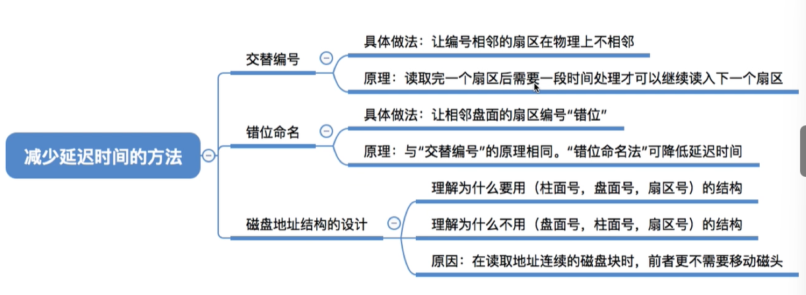

## 5.3.4 磁盘管理

### 磁盘初始化

1. 低级格式化：各个磁道划分为扇区，扇区分为头、数据区域、尾
   - 管理扇区的数据结构放在头、尾两部分，包括扇区校验码（奇偶、CRC）
2. 磁盘分区，每个分区若干柱面组成
3. 逻辑格式化，创建文件系统
   - 文件系统根目录
   - 初始化存储空间管理所用数据结构（位示图、空闲分区表等）

### 引导块

计算机开机执行初始化程序（自举程序），存储在ROM上

- 更新很不方便
- 现代OS只在ROM存放很小的自举装入程序，完整自举程序放在磁盘启动块（即引导块/启动分区）上，位于磁盘固定位置
- 现代开机：计算机执行小自举装入程序，执行该程序找到引导块，将完整自举程序读入内存，完成初始化

### 坏块

是硬件故障，坏块对OS透明

在FAT表上标明

坏块链表，扇区备用

## 5.3.5 固态硬盘SSD

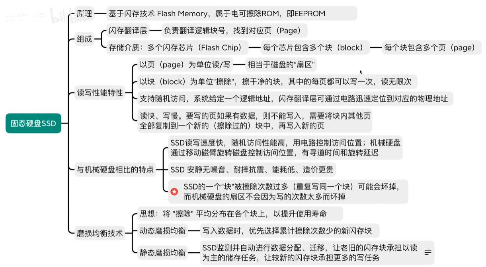
