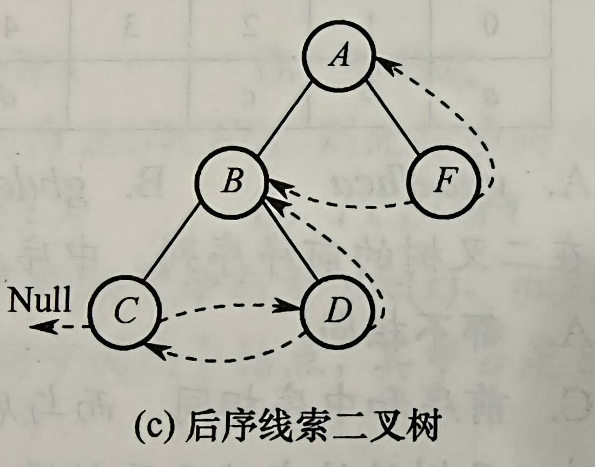

# 5.3 树的遍历与线索化

### 后序线索二叉树中线索的指向

后序线索二叉树中找结点的后继，分为三种情况：

1. 若结点x是二叉树的根，则后继为空
2. 若结点x是右孩子/x是左孩子且其父结点无右子树 -> 后继为父结点
3. x是左孩子，父结点有右子树，则其后继为双亲右子树后续遍历列出的第一个结点



- 如图中B，B的后继无法通过链域找到，B的后继是F
- **后序线索树的遍历需要栈的支持**

### 一些关于NLR、LNR、LRN性质的分析

- 先序序列与中序序列完全相同：NLR=LNR -> L为空，每个结点都只有右子树或没有
- 后序序列与中序序列完全相同：LNR=LRN -> R为空
- 前序与后序序列中若出现
  - 前序...p...q...；后序...q...p...   
  - 由<u>N</u> <u>LR</u>和<u>LR</u> <u>N</u>可知p必定是q的祖先，因为只有为祖先后代关系，二者顺序才会倒过来

### 先序序列为abcd的不同二叉树个数为

- 首先了解前序遍历和中序遍历的过程：前序遍历相当于入栈次序、中序遍历相当于出栈次序
- 所以给定入栈次序的长度，出栈次序的个数也确定了
- 出栈次序=中序次序 + 入栈次序 = 唯一确定二叉树
- **出栈次序数量 = 二叉树个数**
- 入栈长n，二叉树个数$\frac{1}{n+1}C_{2n}^{n}$，卡特兰树

### 算法整理

- 中序遍历为递增序列的二叉树T，若想构造一个中序遍历为递减序列的二叉树T'
  - 只需要交换所有结点的左右子树
  - 那么我们实现这种算法：采用后序遍历，先处理完所有左右子树，然后再处理这个根，递归往上走

- 求WPL：树上所有叶结点的带权路径之和
  - 中间结点不用管
  - 只要管叶结点即可

- 判断一个顺序存储的二叉树是否是搜索二叉树

  ```c
  // val记录中序遍历中已遍历结点的最大值，初值为一个负整数。若当前遍历的结点值小于等于val，则返回false，否则更新val值
  bool judge(SqBiTree bt, int k, int *val) { 
      // 初始调用k为0，从根出发
      if (k < bt.ElemNum && bt.SqBiTNode[k] != -1) {
          if(!judge(bt, 2*k+1, val)) return false;
          if(bt.SqBiTNode[k]<=*val) return false;
          *val = bt.SqBiTNode[k];
          if(!judge(bt, 2*k+2, val)) return false;
      }
      return false;
  }
  ```

  