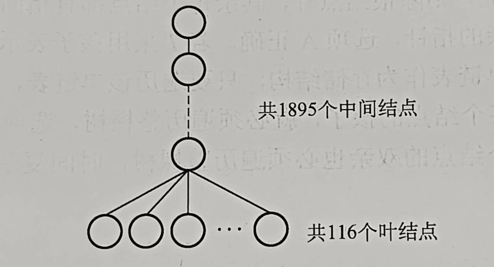

# 第五章 树与二叉树

## 目录
- [第五章 树与二叉树](#第五章-树与二叉树)
  - [目录](#目录)
- [5.1 树的基本概念](#51-树的基本概念)
- [5.2 二叉树的基本概念](#52-二叉树的基本概念)
  - [特殊二叉树](#特殊二叉树)
  - [二叉树存储结构](#二叉树存储结构)
    - [顺序存储](#顺序存储)
  - [一些易错点](#一些易错点)
- [5.3 树的遍历与线索化](#53-树的遍历与线索化)
    - [后序线索二叉树中线索的指向](#后序线索二叉树中线索的指向)
    - [一些关于NLR、LNR、LRN性质的分析](#一些关于nlrlnrlrn性质的分析)
    - [先序序列为abcd的不同二叉树个数为](#先序序列为abcd的不同二叉树个数为)
    - [算法整理](#算法整理)
- [5.4 树、森林](#54-树森林)
  - [5.4.2 树、森林与二叉树的转换](#542-树森林与二叉树的转换)
    - [孩子兄弟表示法](#孩子兄弟表示法)
  - [5.4.3 树和森林的遍历](#543-树和森林的遍历)
    - [树的遍历](#树的遍历)
    - [森林的遍历](#森林的遍历)
    - [一些名词补充\&可能方向](#一些名词补充可能方向)
- [5.5 树与二叉树应用](#55-树与二叉树应用)
  - [5.5.1 哈夫曼树和哈夫曼编码](#551-哈夫曼树和哈夫曼编码)
    - [带权路径长度](#带权路径长度)
    - [哈夫曼树](#哈夫曼树)
    - [构造](#构造)
    - [哈夫曼编码](#哈夫曼编码)
    - [5.5.2 并查集及应用](#552-并查集及应用)
    - [存储结构](#存储结构)
    - [基本实现](#基本实现)
  - [出题法](#出题法)

# 5.1 树的基本概念

- 树的度：树中结点的最大度数
- 树的路径长度：从根节点到所有叶结点的路径长度之和 —— 注意区别霍夫曼树
- n个结点的树，度为n-1
- 关于n个结点、度为m、分析树的高度h最小最大
  - 或度为m，高为h，分析结点n的最大最小
- 一点小技巧
  - 森林中每颗树让 n-m 增大1，例如25个结点、15条边的森林中有 25 - 15 = 10棵树
  - 分析树上叶结点的个数
    - 每个度为m的结点让叶结点增多m-1；基础叶节点个数为1
    - 于是m叉树中，N1个度数为1的结点、N2个度2、...、Nm个度m，叶结点个数为$\Sigma^m_{i=2}(i-1)Ni+1$

# 5.2 二叉树的基本概念

## 特殊二叉树

- 满二叉树
- 完全二叉树
- 二叉排序树
- 平衡二叉树
- 正则二叉树：结点的子结点树为0或2

## 二叉树存储结构

### 顺序存储

- 完全二叉树
- 一般二叉树
  - **如果必定会占到h层，为了保证它的任意性，它所需的空间和h层完全二叉树相同**
  - 例如5层有10个结点的二叉树：我们不能限定它的形状，所以它在5层的结点分布是任意的；需要和5层完全二叉树相同的空间

## 一些易错点

- 124个叶节点的完全二叉树最多多少个结点？
  - 小心一个叶结点若改为有一个子结点，**则总叶结点个数并不改变**，所以算最多结点时需要注意是否能加这一个子节点

- 遇到问树的性质的，多考虑一下根结点

# 5.3 树的遍历与线索化

### 后序线索二叉树中线索的指向

后序线索二叉树中找结点的后继，分为三种情况：

1. 若结点x是二叉树的根，则后继为空
2. 若结点x是右孩子/x是左孩子且其父结点无右子树 -> 后继为父结点
3. x是左孩子，父结点有右子树，则其后继为双亲右子树后续遍历列出的第一个结点


- 如图中B，B的后继无法通过链域找到，B的后继是F
- **后序线索树的遍历需要栈的支持**

### 一些关于NLR、LNR、LRN性质的分析

- 先序序列与中序序列完全相同：NLR=LNR -> L为空，每个结点都只有右子树或没有
- 后序序列与中序序列完全相同：LNR=LRN -> R为空
- 前序与后序序列中若出现
  - 前序...p...q...；后序...q...p...   
  - 由<u>N</u> <u>LR</u>和<u>LR</u> <u>N</u>可知p必定是q的祖先，因为只有为祖先后代关系，二者顺序才会倒过来

### 先序序列为abcd的不同二叉树个数为

- 首先了解前序遍历和中序遍历的过程：前序遍历相当于入栈次序、中序遍历相当于出栈次序
- 所以给定入栈次序的长度，出栈次序的个数也确定了
- 出栈次序=中序次序 + 入栈次序 = 唯一确定二叉树
- **出栈次序数量 = 二叉树个数**
- 入栈长n，二叉树个数$\frac{1}{n+1}C_{2n}^{n}$，卡特兰树

### 算法整理

- 中序遍历为递增序列的二叉树T，若想构造一个中序遍历为递减序列的二叉树T'
  - 只需要交换所有结点的左右子树
  - 那么我们实现这种算法：采用后序遍历，先处理完所有左右子树，然后再处理这个根，递归往上走

- 求WPL：树上所有叶结点的带权路径之和
  - 中间结点不用管
  - 只要管叶结点即可

- 判断一个顺序存储的二叉树是否是搜索二叉树

  ```c
  // val记录中序遍历中已遍历结点的最大值，初值为一个负整数。若当前遍历的结点值小于等于val，则返回false，否则更新val值
  bool judge(SqBiTree bt, int k, int *val) { 
      // 初始调用k为0，从根出发
      if (k < bt.ElemNum && bt.SqBiTNode[k] != -1) {
          if(!judge(bt, 2*k+1, val)) return false;
          if(bt.SqBiTNode[k]<=*val) return false;
          *val = bt.SqBiTNode[k];
          if(!judge(bt, 2*k+2, val)) return false;
      }
      return false;
  }
  ```

# 5.4 树、森林

## 5.4.2 树、森林与二叉树的转换

### 孩子兄弟表示法

一个结点中两个指针域保存第一个孩子和右兄弟的指针

## 5.4.3 树和森林的遍历

### 树的遍历

先根遍历

- 访问根结点
- 再依次遍历根结点的每颗子树（遍历子树也采用先根后子树）
- 遍历序列 = 相应二叉树的先序序列

后根遍历

- 依次遍历根结点每颗子树，遍历子树遵循先子树后根
- 访问根结点
- 遍历序列 = 相应二叉树中序序列

### 森林的遍历

先序遍历森林

中序遍历森林（有时候也叫森林的后序遍历，因为根确实是最后才访问）

### 一些名词补充&可能方向

**非终端结点、分支结点：非叶结点**

- 每个非终端结点都有子结点

- 在转换到二叉树之后，子结点里最后一个兄弟的右指针域必定为空

- 一棵树中n个非终端结点 -> 转换成二叉树后有n+1个结点无右孩子

  - n个非终端->n组孩子，每组1个无右指针  n
  - 根结点转换后也无右指针                           +1
  - 得到 n+1

- 例：王道数据结构`P176 T16`，树有2011个结点、叶结点有116个，树对应二叉树中无右孩子结点个数为<u>2011-116+1=1896</u>

  - 法1即上述分析

  - 法2使用特殊情况

    

**树的孩子兄弟表示法中一些说法的等价转换：**

- *结点左指针域为空 = 结点没有孩子 = 结点为叶节点*（**这个好像很重要**）
- 结点右指针域为空 = 结点为最后一个兄弟
- 例题：某树孩子兄弟链表示中，有6个空左指针、7个空右指针，并且5个结点左、右指针域都为空。分析树中叶结点个数
  - 6空左指针 -> 6个叶结点

# 5.5 树与二叉树应用

## 5.5.1 哈夫曼树和哈夫曼编码

### 带权路径长度

带权路径长度：树的根到一个结点的路径长度*该结点权值，称为该结点

树的带权路径长度：所有叶结点带权路径长度之和，记为$WPL = \Sigma^n_{i=1}w_il_i$

### 哈夫曼树

哈夫曼树（最优二叉树）：n个带权叶结点中WPL最小的二叉树

### 构造

n 个权值为 $w_i$ 的结点通过优先队列构造

**得到一些性质**：

- 新建了n-1个双分支结点，总结点数2n-1
- **不存在度为1的结点**
- 权值越小的结点到根结点的路径长度越大

### 哈夫曼编码

- 哈夫曼编码、前缀编码 —— 总长度最短的二进制前缀编码

- 编码画出来的树不会要求树满，只要不是前缀即可

### 5.5.2 并查集及应用

同一集合组织成一棵树

### 存储结构

使用树的双亲结构作为并查集存储结构

### 基本实现

实现如下

```c
#define SIZE 13
int UFSets[SIZE];

// 初始化
void Initial(int S[]) {
    for (int i = 0; i< SIZE; i++) {
        S[i] = -1;
    }
}
// Find，返回所属集合，最坏复杂度O(n)
int Find(int S[], int x) {
    while (S[x]>=0) {
        x = S[x];
    }
    return x;
}
// 并，两集合合并为一个集合
// 注意传进去的参数得是Find找来的根
// 保证树高不超过log_2(n)+1
void Union(int S[], int r1, int r2) {
    if(r1==r2) return;
    // 负数的绝对值表示树上的结点数
    if(s[r2]>s[r1]) { // r2结点数更少，-2 > -4
        s[r1] += s[r2];
        s[r2] = r1; // 小树合并到大树
    } else {
        s[r2] += s[r1];
        s[r1] = r2;
    }
}

// 进一步优化，Find使用路径压缩
int Find(int S[], int x) {
    int root = x;
    while(s[root] >= 0) {
        root = s[root];
    }
    while (x != root) { // 压缩路径
        int t = S[x];
        S[x] = root;  // x直接挂到根结点下面
        x = t;
    }
    return root;
}
```

## 出题法

- 哈夫曼带权路径长度两种计算方法
  - 叶结点的带权路径长度和
  - or所有分支结点权值和（叶结点有多深，路上分支结点就给叶算了多少次）
- m度哈夫曼树
  - 只有度0和度m的结点，设度m的结点有$n_m$，度0的结点有$n_0$个，总结点数$N=n_0+n_m$
  - N个结点哈夫曼树有N-1条边
  - $m*n_m=N-1=n_m+n_0-1$
  - 得到$n_m=(n_0-1)/(m-1)$

- 加权平均长度 = WPL，并不是什么路径长度的概念，还是得算结点的权进去
- 二叉树保存字符集编码&检测编码前缀特性
  - 保存方式：
    - 每个编码对应于从根开始到某叶结点的一条路径，路径长度等于编码位数， 路径到达的叶结点中保存该编码对应的字符
  - 检查编码是否具有前缀特性（任一编码不是另一编码的前缀）
    - 初始时，二叉树中仅含根结点，左右指针均为空
    - 依次读入每个编码C，建立/寻找从根开始对应于该编码的一条路径，过程如下
    - 每个编码，从左至右扫描C各位，0向左指针移动，1向右指针移动。遇到空指针创建新节点，空指针指向该新节点并继续移动。移动过程中遇到三种情况
      1. 遇到叶结点，表明不具有前缀特性，返回
      2. 处理C所有位，均没创建新结点，不具有，返回
      3. 处理C最后一个编码位时创建新结点，则继续验证
    - 若所有编码均通过验证，则编码具有前缀特性
