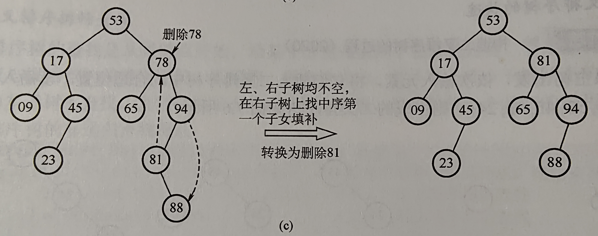

# 7.3 树型查找

## 7.3.1 二叉排序树

### 二叉排序树的插入

### 二叉排序树的删除

按3种情况处理（删除节点z）

- z是叶节点，直接删除

- z只有一颗子树，子树根节点替代z，删除z

- z有左右两颗子树，z的直接后继（前驱）替代，然后从BST中直接删去这个直接后继（前驱）；并转换为删除这个后继（前驱节点）递归调用删除

  

## 7.3.2 平衡二叉树

### 平衡二叉树的定义

插入和删除结点时保证任意结点的左右子树高度差的绝对值不超过1，这样的二叉树称为平衡二叉树，AVL树

- 平衡因子：结点左子树高度 - 右子树高度；AVL树的**结点的**平衡因子只可能是-1，0，1

### 平衡二叉树的插入

- 保持平衡的基本思想：
  - 每当二叉排序树中插入（或删除）一个结点时，首先检查插入路径上的结点是否因为此操作导致不平衡。
  - 若不平衡，找到插入路径上，离插入结点最近的 平衡因子绝对值大于1的 结点A；
  - 再对以A为根的子树，保持二叉排序树的前提下，调整各结点位置关系
- 插入后调整操作
  - LL平衡旋转（右单旋转）：结点A的左孩子(L)的左子树(L)上插入新结点；A的平衡因子由1增至2
    - 以A为根的子树失去平衡，需要一次向右的旋转操作。
    - A为根 -> 左子结点为根
  - RR平衡旋转（左单旋转）：结点A的右孩子(R)的右子树(R)插入新结点；A的平衡因子-1至-2
    - 向左旋转
    - A为根 -> 右子结点为根
  - LR平衡旋转（先左后右双旋转）：A的左孩子L的右子树R插入新结点；1 -> 2
    - 先左旋后右旋
  - RL平衡旋转（先右后左双旋转）：A的右孩子R的左子树L上插入新结点；-1 -> -2
    - 先右旋后左旋
- 构造平衡二叉树的过程
  - 举个例子

### 平衡二叉树的删除

删除步骤：

- 用二叉排序树的方法对结点w执行删除
- 若不平衡，则从w向上回溯，找到第一个不平衡的结点z（最小不平衡子树）
  - y为结点z的高度最高的孩子；x是结点y的高度最高的孩子
- 对z为根的子树进行平衡调整
  - y是z左孩子，x是y左孩子；LL
  - y是z左孩子，x是y右孩子；LR
  - y是z右孩子，x是y右孩子；RR
  - y是z右孩子，x是y左孩子；RL
- 插入只需要对z为根的子树进行平衡调整；
- 删除的第一步同二叉排序树；而删除要先对z为根的子树进行调整，若调整后子树高度-1，则可能需要对z的祖先结点进行平衡调整，甚至回溯到根结点（导致树高-1）
  - 二叉排序树的删除，删除z：
    - 若被删除的结点是叶子结点，则直接删除
    - 若z只有一颗子树（左、右都可以），则让z的子树成为z父节点的子树，替代z
    - 若z右两颗子树，z的直接后继/直接前驱和替代z（即排好序z的后一位/前一位），然后从二叉树中删除这个直接后继/直接前驱，这样就变成了第1、2种情况

### 平衡二叉树的查找

同二叉排序树

## 7.3.3 红黑树

### 红黑树的定义

AVL树需要非常频繁地调整全树拓扑结构，代价较大 —— 进一步放宽条件引入**红黑树**的结构

- 红黑树是如下红黑性质的二叉树：

  - 每个结点是红色或是黑色的

  - 根结点是黑色的

  - 叶结点（虚构的外部结点、NULL结点）都是黑色的

  - 不存在两个相邻的红结点（红结点的父节点和孩子结点均为黑色）

  - 每个结点，从该结点到任意一个叶结点的简单路径上，所含黑结点的数量相同

- 引入外部叶结点，使得所有内部结点左右孩子均非空

- 黑高（bh）

- **结论1**：从根到叶结点的最长路径不大于最短路径的两倍
  - 即最长的路径`黑-红-黑-红-...-红-黑`
  - 最短的路径：全黑
- **结论2**：有n个内部结点的红黑树高度 $h <= 2log_2(n+1)$ —— 红黑树中全为黑的情况取等
  - 根的黑高至少为 h/2
  - 于是有$n >= 2^{k/2}-1$

### 红黑树的插入

和二叉查找树的插入类似，但红黑树中插入新结点后需要调整（重新着色/旋转操作）

- **结论3**：新插入红黑树中结点初始着为红色