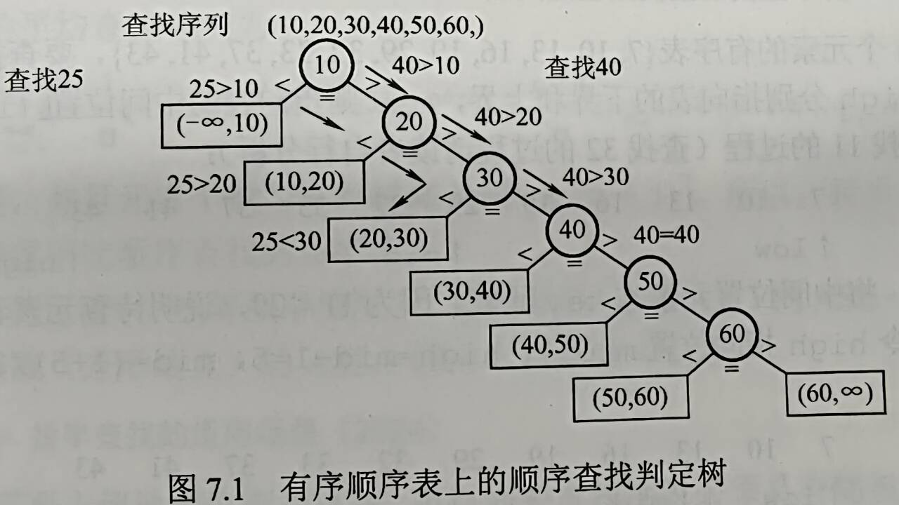
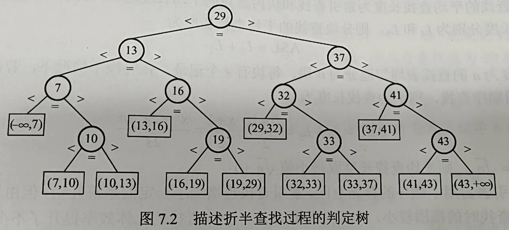
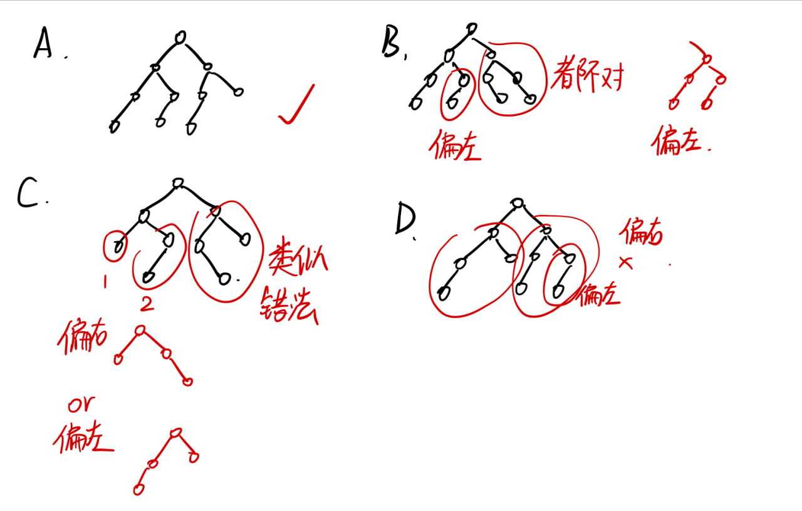
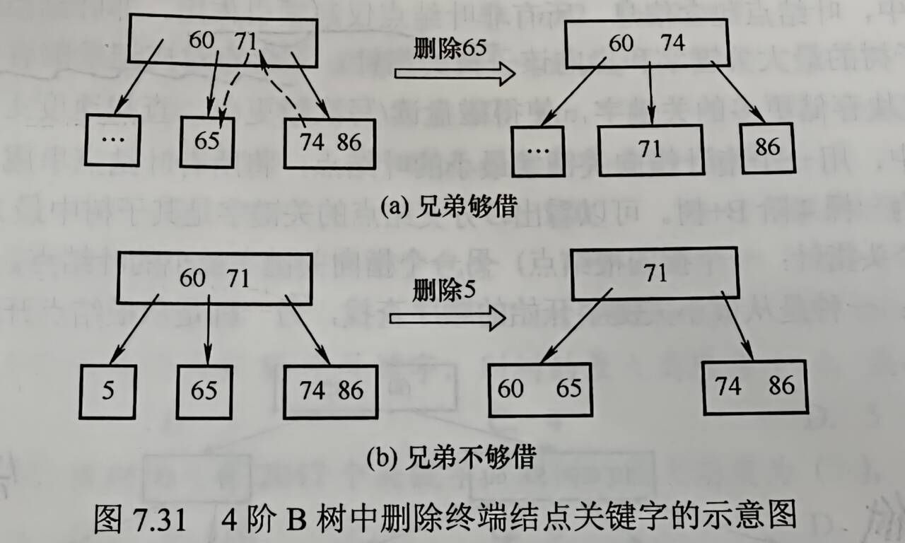

# 第七章 查找

## 目录
- [第七章 查找](#第七章-查找)
  - [目录](#目录)
- [7.1 查找的基本概念](#71-查找的基本概念)
- [7.2 顺序查找和折半查找](#72-顺序查找和折半查找)
  - [7.2.1 顺序查找](#721-顺序查找)
    - [一般线性表顺序查找](#一般线性表顺序查找)
    - [有序线性表的顺序查找](#有序线性表的顺序查找)
  - [7.2.2 折半查找](#722-折半查找)
  - [7.2.3 分块查找](#723-分块查找)
  - [易错点分析](#易错点分析)
- [7.3 树型查找](#73-树型查找)
  - [7.3.1 二叉排序树](#731-二叉排序树)
    - [二叉排序树的插入](#二叉排序树的插入)
    - [二叉排序树的删除](#二叉排序树的删除)
  - [7.3.2 平衡二叉树](#732-平衡二叉树)
    - [平衡二叉树的定义](#平衡二叉树的定义)
    - [平衡二叉树的插入](#平衡二叉树的插入)
    - [平衡二叉树的删除](#平衡二叉树的删除)
    - [平衡二叉树的查找](#平衡二叉树的查找)
  - [7.3.3 红黑树](#733-红黑树)
    - [红黑树的定义](#红黑树的定义)
    - [红黑树的插入](#红黑树的插入)
- [7.4 B树和B+树](#74-b树和b树)
  - [7.4.1 B树及其基本操作](#741-b树及其基本操作)
    - [定义和基本特点](#定义和基本特点)
    - [B树查找](#b树查找)
    - [B树插入](#b树插入)
    - [B树删除](#b树删除)
  - [考点\&易错点整理](#考点易错点整理)
- [7.5 散列表Hash](#75-散列表hash)
  - [7.5.1 基本概念](#751-基本概念)
  - [7.5.2 构造方法](#752-构造方法)
    - [直接定址法](#直接定址法)
    - [除留余数法](#除留余数法)
    - [数字分析法](#数字分析法)
    - [平方取中法](#平方取中法)
  - [7.5.3 处理冲突的方法](#753-处理冲突的方法)
    - [开放定址法](#开放定址法)
    - [拉链法](#拉链法)
  - [7.5.4 散列查找\&性能分析](#754-散列查找性能分析)
    - [性能分析](#性能分析)
  - [常考概念](#常考概念)

# 7.1 查找的基本概念

- 查找：寻找满足某种条件的数据元素
  - 查找成功
  - 查找失败
- 查找表
  - 包含插入、删除
- 静态查找表vs动态查找表
  - 静态：顺序查找、折半查找、散列查找等
  - 动态：二叉排序树查找、散列查找
- 平均查找长度：
  - 一次查找的长度：指需要比较的关键字次数
  - 平均查找长度：所有查找过程中进行关键字比较的次数的平均值
    - $\text{ASL} = \Sigma^{n}_{i=1}P_iC_i$
    - 通常认为每个数据元素查找概率相等，Pi = 1/n
    - Ci为找到i个数据元素进行的比较次数

# 7.2 顺序查找和折半查找

## 7.2.1 顺序查找

### 一般线性表顺序查找

- 引入`哨兵` ，elem[0] = key；查找顺序**从后往前**

```c
int Search_Seq(SSTable ST, ElemType key) {
    ST.elem[0] = key;  // 哨兵 —— 节省大量if语句
    for (int i = ST.length; ST.elem[i] != key; --i); // 从后往前查找
    return i; // 查找成功，返回下标；失败则停在哨兵，返回0，表示失败
}
```


- n个元素，给定key与第i个元素相等 —— 定位第i个元素需要 n-i+1 次关键字比较
  - 比如查第n个，比了1次，`n-n+1=1`
  - $\text{ASL}_{成功} = \Sigma^{n}_{i=1}\frac{1}{n}(n-i+1) = \frac{n+1}{2}$
- 而不成功时，比较了n+1次
  - $\text{ASL}_{不成功} = n+1$

### 有序线性表的顺序查找

- 查找顺序**从前往后**

- 判定树

  - **失败结点**，矩形结点，n个元素则有n+1个查找失败结点

  

- 成功时与一般线性表相同，失败时

  - $\text{ASL}_{不成功} = \Sigma_{j=1}^{n}q_j(l_j-1) = \frac{1+2+...+n+n}{n+1} = \frac{n}2+\frac{n}{n+1}$
  - qj为到达第j个失败结点的概率，1/(n+1)
  - lj为j个失败结点所在层数
    - 例如上图查5，第一次比较失败，到达(-\inf, 10)，2层，比较了1次

## 7.2.2 折半查找

- 效率分析

- 查找路径判断

  ```c
  int Binary_Search(SSTable L, ElemType key) {
      int low = 0, high = len-1, mid;
      while(low <= high) {
          mid = (low + high) / 2;
          if (elem[mid] == key)
              return mid;
          else if(elem[mid] > key)
              high = mid - 1;
          else
              low = mid + 1;
      }
      return -1;
  }
  ```

- 二叉树树型能否构成折半查找判定树

  

  - 是平衡二叉树
  - 圆形结点个数 = 表中元素个数
  - 方形叶结点：失败结点，不算树高；例如这里11个圆形结点，log2(n+1) 向上取整 = 4，树高4 

- 成功平均查找长度

  - `（圆形结点高度*概率）求和`

- 失败平均查找长度

  - `（(方形结点高度-1)*概率）求和`

- 随机存取，关键字有序排列

## 7.2.3 分块查找

索引顺序查找

- 表项：各块最大关键字，各块中第一个元素的地址
  - 而块中元素不要求有序
- 表项按关键字有序排列
- 平均查找长度（包括成功和失败）
  - ASL = L_I + L_S
- 长度为n的查找表分为b块，每块有s个记录；块内&索引表均顺序查找
  - $\text{ASL} = L_I + L_S = \frac{b+1}2+\frac{s+1}{2} = \frac{s^2+2s+n}{2s}$
  - $s = \sqrt{n}$时最小值$\sqrt{n}+1$

## 易错点分析

- 若数据元素保持有序，则查找就可以折半查找

  - 错的！链式结构就不可以

- 折半查找法查找一个元素大约需要O(logn)次关键字比较

  - 说大约，是对的

- **有序查找表的判定树分析 **—— 如果是存在数组中得这样分析

  - 不止是平衡二叉树

  - h高，那么h-1必是满er'cha'shu

  - 若2n+1个元素，左右子树各n个元素

  - 若2n个元素，左子树n-1个元素，右子树n个元素 —— mid = (low + high)/2 **向下取整时**

  - 所以树的判定树会**偏向一边**

    

- 数据结构P277T7
  - 意思是顺序查找可以任意排序
  - 而折半查找要求使用字典序
    - 好像使用二叉链表也是可以的，就不一定要按照左右偏？

# 7.3 树型查找

## 7.3.1 二叉排序树

### 二叉排序树的插入

### 二叉排序树的删除

按3种情况处理（删除节点z）

- z是叶节点，直接删除

- z只有一颗子树，子树根节点替代z，删除z

- z有左右两颗子树，z的直接后继（前驱）替代，然后从BST中直接删去这个直接后继（前驱）；并转换为删除这个后继（前驱节点）递归调用删除

  

## 7.3.2 平衡二叉树

### 平衡二叉树的定义

插入和删除结点时保证任意结点的左右子树高度差的绝对值不超过1，这样的二叉树称为平衡二叉树，AVL树

- 平衡因子：结点左子树高度 - 右子树高度；AVL树的**结点的**平衡因子只可能是-1，0，1

### 平衡二叉树的插入

- 保持平衡的基本思想：
  - 每当二叉排序树中插入（或删除）一个结点时，首先检查插入路径上的结点是否因为此操作导致不平衡。
  - 若不平衡，找到插入路径上，离插入结点最近的 平衡因子绝对值大于1的 结点A；
  - 再对以A为根的子树，保持二叉排序树的前提下，调整各结点位置关系
- 插入后调整操作
  - LL平衡旋转（右单旋转）：结点A的左孩子(L)的左子树(L)上插入新结点；A的平衡因子由1增至2
    - 以A为根的子树失去平衡，需要一次向右的旋转操作。
    - A为根 -> 左子结点为根
  - RR平衡旋转（左单旋转）：结点A的右孩子(R)的右子树(R)插入新结点；A的平衡因子-1至-2
    - 向左旋转
    - A为根 -> 右子结点为根
  - LR平衡旋转（先左后右双旋转）：A的左孩子L的右子树R插入新结点；1 -> 2
    - 先左旋后右旋
  - RL平衡旋转（先右后左双旋转）：A的右孩子R的左子树L上插入新结点；-1 -> -2
    - 先右旋后左旋
- 构造平衡二叉树的过程
  - 举个例子

### 平衡二叉树的删除

删除步骤：

- 用二叉排序树的方法对结点w执行删除
- 若不平衡，则从w向上回溯，找到第一个不平衡的结点z（最小不平衡子树）
  - y为结点z的高度最高的孩子；x是结点y的高度最高的孩子
- 对z为根的子树进行平衡调整
  - y是z左孩子，x是y左孩子；LL
  - y是z左孩子，x是y右孩子；LR
  - y是z右孩子，x是y右孩子；RR
  - y是z右孩子，x是y左孩子；RL
- 插入只需要对z为根的子树进行平衡调整；
- 删除的第一步同二叉排序树；而删除要先对z为根的子树进行调整，若调整后子树高度-1，则可能需要对z的祖先结点进行平衡调整，甚至回溯到根结点（导致树高-1）
  - 二叉排序树的删除，删除z：
    - 若被删除的结点是叶子结点，则直接删除
    - 若z只有一颗子树（左、右都可以），则让z的子树成为z父节点的子树，替代z
    - 若z右两颗子树，z的直接后继/直接前驱和替代z（即排好序z的后一位/前一位），然后从二叉树中删除这个直接后继/直接前驱，这样就变成了第1、2种情况

### 平衡二叉树的查找

同二叉排序树

## 7.3.3 红黑树

### 红黑树的定义

AVL树需要非常频繁地调整全树拓扑结构，代价较大 —— 进一步放宽条件引入**红黑树**的结构

- 红黑树是如下红黑性质的二叉树：

  - 每个结点是红色或是黑色的

  - 根结点是黑色的

  - 叶结点（虚构的外部结点、NULL结点）都是黑色的

  - 不存在两个相邻的红结点（红结点的父节点和孩子结点均为黑色）

  - 每个结点，从该结点到任意一个叶结点的简单路径上，所含黑结点的数量相同

- 引入外部叶结点，使得所有内部结点左右孩子均非空

- 黑高（bh）

- **结论1**：从根到叶结点的最长路径不大于最短路径的两倍
  - 即最长的路径`黑-红-黑-红-...-红-黑`
  - 最短的路径：全黑
- **结论2**：有n个内部结点的红黑树高度 $h <= 2log_2(n+1)$ —— 红黑树中全为黑的情况取等
  - 根的黑高至少为 h/2
  - 于是有$n >= 2^{k/2}-1$

### 红黑树的插入

和二叉查找树的插入类似，但红黑树中插入新结点后需要调整（重新着色/旋转操作）

- **结论3**：新插入红黑树中结点初始着为红色

# 7.4 B树和B+树

## 7.4.1 B树及其基本操作

### 定义和基本特点

- 树中每个结点至多m棵子树，至多m-1个关键字
- 根节点不是叶结点，则至少2颗子树，至少有一个关键字
- **除根** **非叶**结点，至少$\lceil m/2 \rceil$颗子树，至少$\lceil m/2 \rceil-1$个关键字
- 所有叶结点都在同一层次，并不带信息
  - 小心叶结点定义为失败结点
  - or 叶结点定义为终端结点

### B树查找

两个基本操作：B树中找节点（在磁盘上进行）；在结点内找关键字（内存中）

### B树插入

插入过程：定位、插入、分裂

- 分裂：$\lceil m/2 \rceil$将关键字分为两部分，中间这个飞升到父结点，如果父结点也超过上限，那么递归直到传到根节点，根结点也超过那么B树高度+1

### B树删除

删除后考虑合并

- 删除：

  - 删前 $>= \lceil m/2\rceil$，直接删
  - 兄弟够借 —— 左右兄弟都可以
  - 兄弟不够借
  - 若双亲结点借走之后变到$\lceil m/2 \rceil - 2$

  

## 考点&易错点整理

- n个关键字的m阶B树，应有 <u>n+1</u> 个叶结点（最终查找失败的结点）
  - 理解1：每个key多一个分支，从根开始算1个叶结点，多了n个，共n+1
  - 理解2：n个key，n个查找成功，并且将查找失败分为n+1个区间，对应n+1个叶结点
- B+更适于读取频繁的场景
  - 相对B树一个磁盘块存储更多的关键字，能减少磁盘读/写次数

- 关键字在B树第k层，则需要启动k-1次I/O操作，最后一次在内存中查找不需要读取磁盘

# 7.5 散列表Hash

## 7.5.1 基本概念

- 散列函数：Hash(key) = Addr
  - Addr是数组下标、索引或内存地址
- 冲突
- 散列表：根据关键字直接进行访问的数据结构

## 7.5.2 构造方法

根据数据选择

### 直接定址法

### 除留余数法

### 数字分析法

### 平方取中法

## 7.5.3 处理冲突的方法

### 开放定址法

$H_i = (H(key) + d_i) \% m$

- m散列表长
- di增量序列

增量序列取法

- 线性探测法
  - 冲突时，查看表中下一个单元；知道找到or查遍全表
- 平方探测法——二次探测法
  - m必须是质数（素数）
  - m可以表示为4k+3
  - $d_i = 1^2, -1^2, 2^2, -2^2, ... , k^2, -k^2$
  - k <= m/2
- 双散列法——两个散列函数
  - 冲突则用第二个Hash函数
  - $H_i = (H(key) + i \times Hash_2(key)) \% m$
- 伪随机序列法

### 拉链法

## 7.5.4 散列查找&性能分析

### 性能分析

散列查找效率取决于三个因素：散列函数、处理冲突的方法和装填因子

- 装填因子 $\alpha = \frac{记录数n}{表长m}$

- α越大，装填越满，冲突概率越大

## 常考概念

- 堆积：同义词冲突的探查序列和非同义词之间不同的探查序列交织再一起，导致关键字查询需要经过较长探测距离，降低散列效率
  - 同义词：hash算出来是一样的
  - 线性探测法：易产生
  - 平方探测法：不易产生，跳过一些已被占用的单元，而不是顺序探测
  - 链地址法：根本不会堆积，只是同义词放同一个链表即可

- 查找失败平均查找长度：长11的空HT，H(key) = key%7,  线性探查，插入87,40,30,6,11,22,98,20，求查找失败平均查找长度

  | 散列地址 | 0    | 1    | 2    | 3    | 4    | 5    | 6    | 7    | 8    | 9    | 10   |
  | -------- | ---- | ---- | ---- | ---- | ---- | ---- | ---- | ---- | ---- | ---- | ---- |
  | key      | 98   | 22   | 30   | 87   | 11   | 40   | 6    | 20   |      |      |      |

  - H(key) = 0~6 -> 查找失败时可能地址有**7**个 —— **不是表长**
  - 计算出0的key0，需比较0~8号地址才可以确定该关键字不在，比较了9次（**最后一次空地址也要算比较一次**）
  - 0~6的查找次数9~3，算出来 ASL_失败=6

- 存在删除情况的平均查找长度：长度5初始空HT，H(k) = (k+4)%5，线性探查再散列，插入2022，12，25，删除25，则HT中查找失败平均查找长度为？

  | 地址     | 0    | 1    | 2    | 3    | 4        |
  | -------- | ---- | ---- | ---- | ---- | -------- |
  | key      |      | 2022 | 12   |      | 25（del) |
  | 失败次数 | 1    | 3    | 2    | 1    | 2        |

  - 失败0~4，key0~5失败次数标记如上表
  - 其中key4：比较发现关键字为删除，则继续向后查找，直到为空
  - 平均查找长度1.8

- 散列查找中需要关键字比较，要确定查找是否成功

- 散列表平均查找长度与
  - 装填因子α直接相关
  - 不直接依赖于n、m
  - 不能保证平均查找长度O(1)
- 下一个空位的要求是
  - 大于or小于 但是 不等于
  - yin'wei