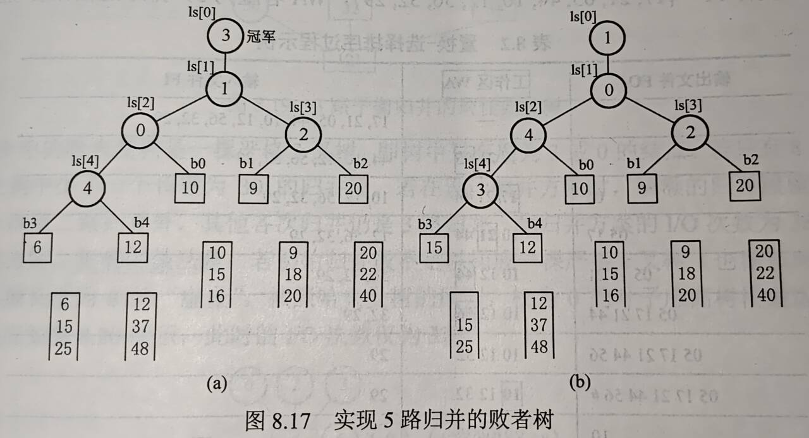

# 第八章 排序

## 目录
- [第八章 排序](#第八章-排序)
  - [目录](#目录)
- [8.1 排序基本概念](#81-排序基本概念)
- [8.2 插入排序](#82-插入排序)
  - [8.2.1 直接插入排序](#821-直接插入排序)
  - [8.2.2 折半插入排序](#822-折半插入排序)
  - [8.2.3 希尔排序](#823-希尔排序)
  - [小技巧](#小技巧)
- [8.3 交换排序](#83-交换排序)
  - [8.3.1 冒泡排序](#831-冒泡排序)
  - [8.3.2 快速排序](#832-快速排序)
  - [常见考点及做法](#常见考点及做法)
  - [算法分析](#算法分析)
- [8.4 选择排序](#84-选择排序)
  - [8.4.1 简单选择排序](#841-简单选择排序)
  - [8.4.2 堆排序](#842-堆排序)
    - [基本概念](#基本概念)
    - [建堆](#建堆)
    - [基于大根堆排序](#基于大根堆排序)
    - [效率分析](#效率分析)
    - [堆插入删除](#堆插入删除)
  - [考点易错点](#考点易错点)
- [8.5 归并排序、基数排序和计数排序](#85-归并排序基数排序和计数排序)
  - [8.5.1 归并排序](#851-归并排序)
  - [8.5.2 基数排序](#852-基数排序)
    - [实现过程：分配收集](#实现过程分配收集)
    - [性能分析](#性能分析)
  - [8.5.3 计数排序](#853-计数排序)
  - [考点易错点整理](#考点易错点整理)
- [8.6 各排序算法比较](#86-各排序算法比较)
- [8.7 外部排序](#87-外部排序)
  - [8.7.1 基本概念](#871-基本概念)
  - [8.7.2 外部排序的方法](#872-外部排序的方法)
  - [8.7.3 优化](#873-优化)
    - [败者树](#败者树)
    - [置换选择排序](#置换选择排序)
  - [8.7.5 最佳归并树](#875-最佳归并树)

# 8.1 排序基本概念

- 排序：按关键字有序
- 算法的稳定性
- 分类
  - 内部排序
  - 外部排序 —— 涉及到外存
- 易错：**拓扑排序不是这里的排序算法**

# 8.2 插入排序

基本思想：待排序的记录按关键字大小插入到前面已排好序的子序列中，直到全部记录插入完成

## 8.2.1 直接插入排序

- 哨兵

  ```c
  void InsertSort (ElemType A[], int n) {
      int i, j;
      for (i=2; i<=n; i++) {
          if (A[i] < A[i-1]) {
              A[0] = A[i]; // A[0]不存放元素
              for (j=i-1; A[0]<A[j]; --j) {
                  A[j+1]=A[j]; //向后挪位置，直到找到要插入/哨兵
              }
              A[j+1] = A[0];
          }
      }
  }
  ```

- 稳定的算法
- 适用于顺序存储/链式存储的线性表，无须移动元素
- n个元素最坏比较次数：$\frac{n(n-1)}{2}$
  - 不要考虑哨兵的比较 —— 哨兵是实现方法加的，这个只是问逻辑上的比较次数

## 8.2.2 折半插入排序

将查找过程换为折半查找

```c
void InsertSort (ElemType A[], int n) {
    int i, j, low, high, mid;
    for (i=2; i<=n; i++) { // 处理A[2]~A[n]
        A[0]=A[i];  // 暂存，因为最后平移需要从A[i]开始
        low = 1; high = i-1; // 在处理好的序列中可以进行折半查找
        while(low <= high) {
            mid = (low + high) / 2;
            if (A[mid] > A[0]) high = mid - 1;
            // 保证了定位到一组相同数中最右边的位置 -> 保证了稳定性
            else low = mid + 1; // <= 
        }
        // 目标位置为high
        for (j = i-1; j >= high+1; --j) {
            A[j+1] = A[j];
        }
        A[high+1] = A[0];
    }
}
```

-  稳定
- 仅顺序存储

## 8.2.3 希尔排序

缩小**增量**排序

- 目前没有特别好的增量序列
- 取小于n的增量d1，表中记录分为d1组，各组内直接插排
  - d2 < d1，重复
  - 直到dt = 1

效率分析

- 空间复杂度$O(1)$
- 在特定范围内，时间复杂度约为$O(n^{1.3})$
- 最坏，$O(n^2)$

不稳定

仅适用于顺序存储

## 小技巧

- 判断直接插排比较次数：考虑逆序数，逆序数越小，则直接插排比较次数越小

# 8.3 交换排序

交换：根据序列中两个元素关键字的比较结果来对换这个两个记录在序列中的位置

- 比一下交换一次（有序就不交换）

## 8.3.1 冒泡排序

基本思想：

- 从后往前（or从前往后）两两比较相邻元素位置（即5和4；4和3；3和2；2和1）
- 若逆序，则交换它们，直到序列比较完。称它为第一趟冒泡
- 从后往前->最小的元素漂浮至第一位；从前往后->最大的元素到达最后一个位置
- n-1趟冒泡将所有元素排好序

```c
void BubbleSort(ElemType A[], int n) {
    for (int i = 0; i<n-1; i++) {
        bool flag = false;
        for (int j = n-1; j > i; j--) {
            if (A[j-1] > A[j]) {
                swap (A[j-1], A[j]); // 封装的swap函数
                flag = true;
            }
        }
        if (flag == false) { // 如果没发生交换，则表已经有序
            return;
        }
    }
}
```

性能分析：

- 空间效率：O(1)
- 时间效率
  - 最好情况，扫一趟有序，比较n-1次，移动0次，O(n)
  - 最坏情况，n-1趟排序，i趟进行n-i次关键字比较，每次比较后都移动元素3次以交换位置
    - 比较次数n(n-1)/2; 移动次数3n(n-1)/2
    - 时间复杂度O(n2), 平均时间复杂度O(n^2)


## 8.3.2 快速排序

基本思想：

- pivot -> L[k] （L[1...n]）
  - 同时`L[1...k-1] < pivot`; `L[k+1...n] > pivot`
  - 称作一次划分 —— 算法题
- 对左右两个子表递归重复上述过程
- 一趟快排：是交替搜索和交换的过程

```c
void QuickSort(ElemType A[], int low, int high) {
    if (low < high) {
        int pivot_index = Partition(A, low, high);  // 进行划分，这里默认使用首元素作为pivot
        QuickSort(A, low, pivot_index-1);
        QuickSOrt(A, pivot_index-1, high);
    }
}

int Partition(ElemType A[], int low, int high) {
    ElemType pivot = A[low];
    while(low < high) {
    	while (low < high && A[high] >= pivot) --high; // 高的跳过
        A[low] = A[high]; // 比pivot小的移到左端
        while (low < high && A[low] <= pivot) ++low; // 注意这里是<=，为了减少交换次数
        A[high] = A[low];
    }
    A[low] = pivot;
    return low;
}
```

性能分析：

- 容量与递归调用的最大层数一致
  - 最好$O(\log_2n)$
  - 最坏n-1次递归，O(n)
  - 平均情况下栈深度$O(\log_2n)$
- 时间效率
  - 最坏O(n2)
  - 最好$O(n\log_2n)$
- 稳定性：不稳定 —— 怎么调都不稳定

## 常见考点及做法

- 冒泡排序 —— 问趟数
  - 首先看题目说趟数包不包含无交换的最后一趟
  - 然后老实手排
- 问一个序列可不可能是n趟快排后的序列
  - n趟 -> 找n个pivot
  - pivot只要满足左边都比pivot 小（大）且右边的都比pivot 大（小）即可
  - 小技巧：先看最左边是不是最小和最右边是不是最大，是就可以算一个pivot
- 问快排中移动记录次数最多 —— 老实算别偷懒
- 问快排最好情况比较次数，例如长度8的最好情况
  - 第一次分为3、4，比较7次（分出来的所有都需要与pivot进行一次比较才能确定）
  - 3分为1和1，不用再分，比2次
  - 4分为1和2，比3次
  - 2分为1，比1次
  - 共7+2+3+1=13次

## 算法分析

- Select算法（结合Partition算法使用）王道P352T4

```c
// 分区函数：以pivot为基准，返回pivot最终的位置
int Partition(ElemType A[], int low, int high) {
    ElemType pivot = A[low];
    while(low < high) {
    	while (low < high && A[high] >= pivot) --high; // 高的跳过
        A[low] = A[high]; // 比pivot小的移到左端
        while (low < high && A[low] <= pivot) ++low;
        A[high] = A[low];
    }
    A[low] = pivot;
    return low;
}

// 快速选择函数：寻找第k大元素
// 然后我们只需要寻找 \lfloor n/2 \rfloor
int quickSelect(int arr[], int left, int right, int k) {
    if (left <= right) {
        int pivotIndex = Partition(arr, left, right);
        int count = right - pivotIndex + 1; // pivot是第count大

        if (count == k)
            return arr[pivotIndex];
        else if (count > k)
            return quickSelect(arr, pivotIndex + 1, right, k);
        else
            return quickSelect(arr, left, pivotIndex - 1, k - count);
    }
    return -1; // 理论上不会执行到这里
}
```

- 同上，使用非递归做法

```c
int SetPartition(int a[], int n) {
    int p_key, low=0, low0=0, high=n-1, high0=n-1, flag=1, k=n/2, i;
    int s1 = 0, s2 = 0;
    while(flag) {
        p_key = a[low]; // 选择pivot
        while(low < high) { // 基于pivot对数据进行划分
            while(low<high && a[high]>=p_key) --high;
            if(low != high) a[low] = a[high];
            while(low<high && a[low]<=p_key) ++low;
            if(low != high) a[high] = a[low];
        }
        a[low] = p_key;
        if (low == k-1) { // pivot是第n/2小的元素，则划分成功
            flag = 0;
        } else { // 若不在这一部分，则在更大的一边选取pivot进行划分，直到为k-1
            if (low < k-1) {
                low0 = ++low;
                high = high0;
            } else {
                high0 = --high;
                low = low0;
            }
        }
    }
    for (i=0; i<k; i++) s1+=a[i];
    for (i=k; i<n; i++) s2+=a[i];
    return s2-s1;
}
```

# 8.4 选择排序

基本思想：i趟在后n-i+1个待排序元素选择关键字最小的元素，作为有序子序列的第i个元素，直到n-1趟做完，待排序元素只剩下一个

## 8.4.1 简单选择排序

```c
void SelectSort(ElemType A[], int n) {
    for (int i = 0; i < n-1; i++) {
        int min  = i;
        for (int j = i+1; j < n;j++) {
            if (A[j] < A[min]) min = j;
        }
        if (min != i) swap(A[i], A[min]); // 移动元素3次
    }
}
```

性能分析：

- 空间效率：O(1)
- 时间效率：
  - 元素移动次数很少，不超过3(n-1)
  - 元素间比较次数与序列初始状态无关，始终是n(n-1)/2次
- 稳定性：不稳定
  - 第i趟找到最小元素和第i个元素交换，可能会导致第i个元素与含有相同关键字的元素相对位置改变
- 适合顺序存储、链式存储 && 关键字较少

## 8.4.2 堆排序

### 基本概念

- 大(小)根堆：根>=(<=)左右子结点

- 顺序存储完全二叉树
- 堆排序：无序序列构造初始堆；输出堆顶元素后，如何调整剩余元素

### 建堆

- 检查所有**非终端结点**，是否满足最大根堆要求，不满足则进行调整
  - 非终端结点编号$i \leq \lfloor n/2 \rfloor$
- 调整：
  - 不满足，则将当前结点与更大的孩子交换
  - $i$ 的左孩子：$2i$
  - $i$ 的右孩子：$2i+1$
  - $i$ 的父结点：$\lfloor i/2\rfloor$

- 但是元素下坠：有时候会破坏偏叶结点的堆
  - 下坠的元素采用相同的方法继续向下调整 —— 小元素不断下坠

```c
// 元素从a[1]存起，a[0]留空
void BuildMaxHeap(int a[], int len) {
    for (int i=len/2; i>0; i--) { // 从后往前调整所有非终端结点
        HeadAdjust(a, i, len);
    }
}
// 以k为根的子树调整为最大根堆
void HeadAdjust(int a[], int k, int len) {
    a[0] = a[k]; // 暂存
    // 初始i取k的左孩子
    // i*=2表示沿选好的子节点向下继续筛选
    for (int i=2*k; i<=len; i*=2) {
        if (i<len&&a[i]<a[i+1]) // i<len才有右兄弟
            i++;           // 取key较大的子节点的下表
        if (a[0]>=a[i]) break; // 如果比两个都大，那么筛选结束
        else {
            a[k] = a[i]; // a[i]调整至双亲结点
            k = i; // 修改k，判断a[0]是否要插入这个位置
            // k=i，那么i*=2相当于继续对k的子结点进行判断
        }
    }
    a[k] = a[0];
}
```

### 基于大根堆排序

- 堆顶是最大元素，选它放到有序子序列中（即与待排序序列中最后一个元素进行交换）
- 将待排序元素序列再次调整为大根堆，小元素不断下坠
- 最终得到递增序列（小根堆得到递减序列）

```c
void BuildMaxHeap(int a, int len);
void HeadAdjust(int a[], int k, int len);
void HeapSort(int a[], int len) {
    BuildMaxHeap(a, len); // 初始建堆
    for (int i = len; i>1; i--) {
        swap(a[i], a[1]);
        HeadAdjust(a, 1, i-1);
    }
}
```

### 效率分析

- 建堆O(n)
- 堆排序O(nlogn)
  - n-1趟logn
- 空间效率O(1)
- 稳定性：不稳定

### 堆插入删除

- 小根堆插入：新元素放入表尾，与父结点对比，新元素比父结点更小则二者互换；一路上升直到无法上升

- 删除元素：堆底放入被删除的元素位置；同时让该元素不断下坠，直到无法下坠

- 考：对比关键字的次数

## 考点易错点

- 看清问的是交换次数还是比较次数
- 最大堆中：
  - 最大值必定在根，次大值必定在第二层
  - 最小值必定在叶结点，范围为$\lfloor n/2\rfloor +1 \text{ to } n$

# 8.5 归并排序、基数排序和计数排序

## 8.5.1 归并排序

- 二路归并排序

```c
// 辅助数组
int *b = (int *)malloc((n+1)*sizeof(int));
// a[low...mid], a[mid+1...high]各自有序，合并成一个有序表
void Merge(int a[], int low, int mid, int high) {
    int i, j, k;
    // a中元素备份至b
    for (k=low; k<=high; k++) b[k]=a[k];
    for (i=low, j=mid+1, k=i; i<=mid&&j<=high; k++) {
        if(b[i]<=b[j]) {
            a[k] = b[i];
            i++;
        } else {
            a[k] = b[j];
            j++;
        }
    }
    while (i<=mid) {
        a[k] = b[i];
        k++;
        i++;
    }
    while (j<=high) {
        a[k] = b[j];
        k++;
        j++;
    }
}

void MergeSort(int a[], int low, int high) {
    if (low<high) {
        int mid = (low+high)/2;
        MergeSort(a, low, mid);
        MergeSort(a, mid+1, high);
        Merge(a, low, mid, high);
    }
}
```

性能分析

- 空间O(n)
- 时间O(nlogn)
- 稳定
- 顺序存储、链式存储均可

## 8.5.2 基数排序

基本思想：

- 不基于比较和移动排序，而基于关键字各位的大小排序
- 借多关键字排序的思想对单逻辑关键字排序的方法

- 实现多关键字排序通常有两种方法：
  - 最高位优先（MSD）法：按关键字位权重递减依次逐层划分成若干更小的子序列，最后所有子序列依次连接成一个有序序列
  - 最低位优先（LSD）法：关键字为权重递增
  - 例如个位、十位、百位

### 实现过程：分配收集

- 第一趟，按个位分配，然后收集，得到一个按个位递减排序的序列
- 第二趟，按十位分配收集；得到按十位递减的序列，十位相同中则按个位递减
- 第三趟，按百位分配收集；

递增序列：

- 按关键字为权重递增次序分配收集（个、十、百）

### 性能分析

r为基数（例如个位、十位etc.都有0~9十种取值，故r=10为基数），使用10个队列，例如数字=$1.x \times 10^d$，则有d组关键字

- 空间效率：r个队列，O(r)
- 时间效率：d趟分配收集，分配n个，合并r个队列，O(d(n+r))
- 稳定性：稳定
- 适用：顺序存储、链式存储

## 8.5.3 计数排序

基本思想：对每个待排序x，统计小于x的元素个数，利用信息可确定x的最终位置，有几个元素相同时，还需优化

```c
// 输入a[n]
// 需要b[n]存放输出的排序序列，c[k]存储计数值
// a[]中的元素作为c的下标，其出现次数存储在该元素作为下标的数组c中
void CountSort(int a[], int b[], int n, int k) {
    int i, c[k];
    for (i=0; i<k; i++) c[i] = 0;
    for (i=0; i<n; i++) c[a[i]]++;
    for (i=1; i<k; i++) c[i]=c[i]+c[i-1]; // c[x]保存的是<=x的元素个数
    for(i=n-1; i>=0; i--) {
        b[ c[a[i]]-1 ] = a[i]; // a[i]放在b[]的正确位置上
        c[a[i]] = c[a[i]]-1;
    }
}
```

性能分析

- 空间效率O(n+k) / O(k)
- O(k)+O(n)
- 稳定性：从后往前遍历输入数组，则相同元素在输出数组中相对位置不会发生改变
- 适用于顺序存储；且数据范围不能太大

## 考点易错点整理

- 基数排序的思想/多关键字排序的思想
  - 例如：要求按k1排好序，k1相同的内部再按k2排序
  - 那么：先按k2排序；再以稳定排序手段按k1排序

- 只有基数排序的元素移动次数与关键字初始状态无关

# 8.6 各排序算法比较

- 判断一个序列是什么排序的中间过程
  1. 冒泡、选择、快速排序每趟必有一个元素放在最终位置上
     - 如果问一个序列是不是快排的第几趟，那就找可能成为pivot的个数，>=趟数n即可
  2. 二路归并：局部有序
     - 第一趟：每两个局部有序；第二趟：每4个局部有序；……
  3. 允许所有有元素不在最终位置上：插入、shell、merge
  4. todo

# 8.7 外部排序

## 8.7.1 基本概念

- 文件中记录很多，无法全部调入内存中进行排序，需要将待排序的记录储存在外存上；排序过程中需要经过多次内存和外存之间的交换
- 以块为单位进行交换

## 8.7.2 外部排序的方法

归并排序，**内存中**最少分配3块大小缓冲区即可对任意一个大文件进行排序

- 输入缓冲区1/2
- 输出缓冲区

排序原理：

1. 构造初始归并段：两个输入缓冲区中**一起**进行内部排序；然后缓冲区1写回、2写回，这两个磁盘块记录变成递增有序的
   - 16个块，16次读+16次写
2. 第一趟归并：
   - 两个初始归并段（大小共4块）小部分进入输入缓冲区；输出缓冲区满时，外存**新选取**4块，输出缓冲区写入第一块
   - 若中途遇到缓冲区1/2空，则需要**立马**用归并段1/2下一块补上，保证包含归并段1/2中未归并的最小数据在输入缓冲区中
   - 两两归并直到处理完
3. 第二趟归并：
   - 类似处理，新选取**8块**
4. 归并直到整个文件得到有序文件

## 8.7.3 优化

多路归并 —— 减少I/O次数

- r个初始归并段，k路归并，k叉树，计算得到 趟数=h-1=log_k(r)

思路

- 增加k：但是会增加一些关键字对比次数 —— 败者树
- 减小r：生成初始归并段的内存工作区越大，初始归并段越长 —— 置换选择排序

区分**4路归并**和**4路平衡归并**

### 败者树

完全二叉树，叶子记录参赛者及比较情况

- k路中，初始情况，k个归并段进行败者树构造
  - 其中分支结点记录——败者来自哪个归并段（可以根据序号O(1)读，不用担心）
- 有了败者树后，选出最小元素只需要$\lceil\log_2k\rceil$次对比，对比的同时更新败者树数据结构 



- 败者树记录败者（这里选最小，那么更大的是败者），而胜者继续向上比较

### 置换选择排序

- 处理当前归并段：使用miniMax记录归并段中最大值
- 内存工作区WA：若WA中关键字比miniMax都更小，则该归并段在此截止
- 换到新的归并段：miniMax置0，WA中边更新miniMax并输出到归并段
- 同时存在一个输出缓冲区，记录多个归并段，输出缓冲区满再一次写入磁盘

## 8.7.5 最佳归并树

置换选择排序后，得到长度不等的初始归并段，讨论如何组织归并顺序以得到最小I/O次数

- 例如9个初始归并段，长度9、30、12、18、3、17、2、6、24
  - 9、30、12进行三路平衡归并 —— 读51次、写51个次
- 总I/O次数 = 2*WPL —— 哈夫曼

构成**严格k叉归并树**

- 例如3叉、8个结点，补充0结点到9个结点

补充几个0结点？

- 分析严格k叉树， $n=n_0+n_k$;$ kn_k=n-1$
- $n_k=\frac{n_0-1}{k-1}$
- 初始归并段数量 = 补充前的n0（都在叶子）
- 8路归并，19个
  - 19%7=4，补充7-4=3个0结点
