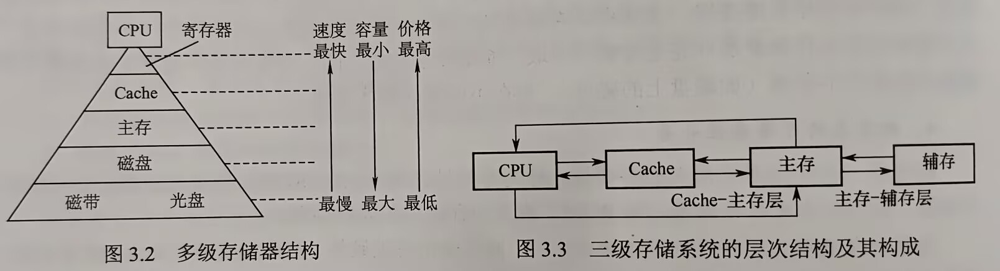
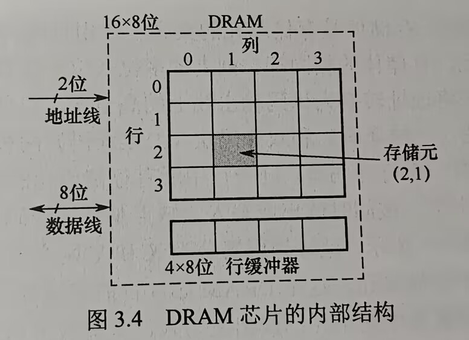
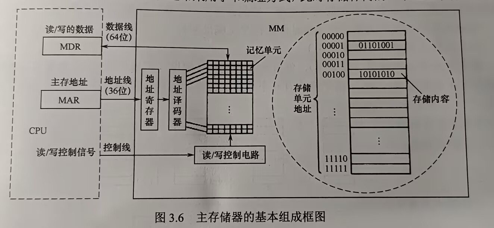

# 第三章 存储系统

## 目录
- [第三章 存储系统](#第三章-存储系统)
  - [目录](#目录)
- [3.1 存储器概述](#31-存储器概述)
  - [3.1.1 存储器的分类](#311-存储器的分类)
    - [按在计算机作用分类](#按在计算机作用分类)
    - [按存储介质分类](#按存储介质分类)
    - [按存取方式分类](#按存取方式分类)
    - [按信息的可保存性分类](#按信息的可保存性分类)
    - [3.1.2 存储器的性能指标](#312-存储器的性能指标)
  - [3.1.3 多级层次的存储系统](#313-多级层次的存储系统)
  - [考点易错点](#考点易错点)
- [3.2 主存储器](#32-主存储器)
  - [3.2.1 SRAM和DRAM芯片](#321-sram和dram芯片)
    - [SRAM工作原理](#sram工作原理)
    - [DRAM工作原理](#dram工作原理)
    - [SRAM和DRAM比较](#sram和dram比较)
    - [存储器芯片内部结构](#存储器芯片内部结构)
  - [3.2.2 ROM](#322-rom)
    - [特点](#特点)
    - [类型](#类型)
  - [3.2.3 主存储器的基本组成](#323-主存储器的基本组成)
  - [3.2.4 多模块存储器](#324-多模块存储器)
    - [单体多字存储器](#单体多字存储器)
    - [多体并行存储器](#多体并行存储器)

# 3.1 存储器概述

## 3.1.1 存储器的分类

### 按在计算机作用分类

### 按存储介质分类

### 按存取方式分类

- 随机存储器（RAM）
  - 存储器任何一个存储单元都可以随机存取，存取时间与存储单元物理位置无关
  - 读/写方便，使用灵活，主要用作主存或高速缓冲存储器
  - 分为静态RAM，动态RAM
- 只读存储器（ROM）
  - 断电保留
  - 随机读取
  - 写入需通过电擦除，速度比读取慢得多
- 串行访问存储器
  - 需按物理位置先后顺序寻址
  - 包括顺序存取存储器（磁带）
  - 直接存取存储器（磁带、光盘）
- 直接存储器（DAM）
  - 速度介于随机存储器和顺序存取存储器之间

### 按信息的可保存性分类

- **易失性存储器**：断电存储信息即消失，RAM
- **非易失性存储器**：断电后信息仍然保持，如ROM、磁表面存储器和光存储器

### 3.1.2 存储器的性能指标

- 三个性能指标
  - 存储容量
  - 单位成本
  - 存储速度
- 相关概念
  - 存储容量 = 存储字数 x 字长
  - 单位成本：位价 = 总成本 / 总容量
  - 存储速度：数据传输速率（每秒传送信息的位数）= 数据的宽度 / 存取周期
    - 存取时间（$T_a$）：从启动一次存储器到完成该操作经历的时间，读出时间、写入时间
    - 存取周期（$T_m$）：指存储器进行一次完整读/写操作所需的全部时间，即连续两次独立访存操作之间所需最短时间间隔
    - 主存带宽（$B_m$）：也称*数据传输速率*，每秒从主存进出信息的最大数量，单位为字/秒或位/秒
  - 存取时间不等于存取周期，通常存取周期大于存取时间。
    - 因为任何一种存储器，读/写操作后，总需要一段时间恢复内部状态。
    - 对于破坏性读出的存储器，存取周期往往比存取时间大得多，因为信息读出后需要马上再生
    - 存取周期 = 存取时间 + 复原时间

## 3.1.3 多级层次的存储系统

- 
  - 辅存（硬盘）只能直接和主存（内存）交流信息
  - CPU、Cache、主存相互之间都可以直接交流信息

- 主要思想：上一层存储器作为低一层存储器的高速缓存

- 主存和Cache之间的数据调动是由硬件自动完成的，**对所有程序员均是透明的**
- 主存和辅存之间的数据调动是由硬件和OS共同完成的，**对应用程序员是透明的**
- 虚拟存储系统

## 考点易错点

- 可寻址单元数 = 存储器容量 / CPU寻址单元大小
  - 这里CPU寻址单元大小需要考虑**机器字长**，例如32位机器字长，CPU按半字寻址，那么寻址单元大小为16位
- 相联存储器按**内容**指定方式和**地址**指定方式相结合来寻址
  - 工作原理：存储单元所存内容的某一部分作为检索项（关键字项）去检索该存储器，并将存储器中与该检索项符合的存储单元内容进行写入/读出
  - 一般用于制作TLB、相联Cache
- CPU不能直接访问Cache
- 计算Cache命中率：不能四舍五入，必须命中率往上走
- 几种存储器的名称
  - EPROM
    - 可擦除可编程只读存储器
    - 非易失
    - 像可重复使用的石板，擦除需要特殊的紫外线
  - CD-ROM
    - **只读**光盘
    - 光学存储介质
  - DRAM
    - 动态随机存取存储器
    - 易失性
    - 计算机内存，DDR4、DDR5 —— 高速重复读写
  - SRAM
    - 静态随机存取存储器
    - 易失性
    - 不需要刷新，速度极快，结构复杂成本高功耗大（锁存器电路）

# 3.2 主存储器

## 3.2.1 SRAM和DRAM芯片

主存储器主要由DRAM实现，靠近处理器那一层（Cache）由SRAM实现

### SRAM工作原理

- 概念介绍
  - 存储**一个**二进制位的物理器件称为**存储元**，是存储器最基本的构建
  - 地址码相同的多个**存储元**构成一个**存储单元**，若干存储单元的集合构成**存储体**
- 工作原理
  - 双稳态触发器（六晶体管MOS）来记忆信息
  - **静态**：非破坏性读出
  - SRAM存取速度快，集成度低，功耗较大，价格昂贵，一般用于高速缓冲存储器

### DRAM工作原理

- 基本存储元只使用一个晶体管，集成度高、价位低、功耗小

- DRAM存取速度比SRAM慢，定时刷新+读后再生，必须大容量的主存系统
  - 动态：读操作会使状态发生改变，需要根据读出内容对相应单元进行重写，**读后再生**

- 同一行相邻两次刷新的时间间隔称为**刷新周期**，通常2ms

- 常用刷新方式3种
  - 集中刷新：死时间、死区
  - 分散刷新：工作周期分为两部分，前半用于读/写，后半用于刷新
  - 异步刷新：每个刷新周期内每行仅刷新一次，相邻两行之间刷新时间间隔t，每隔t刷新一次

- DRAM的刷新需要注意
  - 刷新对CPU透明，刷新并不依赖于外部的访问
  - DRAM刷新单位是行，芯片内部自行生成地址
  - 刷新操作类似于读操作，但又有所不同

- DRAM芯片的**地址引脚复用技术**
  - 行地址和列地址通过相同引脚先后分两次输入，地址引脚数可减少一半

- DRAM芯片行、列数的**优化原则**

  - $2^n \times b$位DRAM芯片的存储阵列，行数为r，列数为c，则$2^n = r\times c$
  - 引脚复用技术，应尽量使行、列数相同，满足**$|r-c|$最小**
  - DRAM按行刷新，行数应比列数少，$r\leq c$

- DRAM芯片行缓冲器容量的计算

  

  - 芯片容量16x8位，存储阵列4行x4列
  - 地址引脚采用复用技术，故仅需$log_24=2$根地址线，分时传送
  - 每个存储元8位，8根数据线
  - 芯片内部有个行缓冲器，缓存指定行中每列数据
    - 大小 = 列数 x 存储元位数
    - SRAM实现
    - 选中某行，该行所有数据送到行缓冲器，以后每个时钟都可以连续地从DRAM中输出一个数据，因此可支持**突发传输**
    - 突发传输方式：在寻址阶段给出数据首地址，传输阶段可传送多个连续存储单元的数据

- 目前更常用SDRAM（同步DRAM）芯片
  - SDRAM与CPU的数据交换同步于系统的时钟信号，并以CPU-主存总线最高速度运行，而不需要插入等待状态
  - SDRAM在系统时钟控制下进行数据读出和写入，将CPU发出的**地址和控制信号**锁存起来，经过指定的时钟周期数后再响应，此时CPU可执行其他操作
  - 而普通DRAM需要CPU不断采样其完成信号

### SRAM和DRAM比较

| 特点       | SRAM     | DRAM     |
| ---------- | -------- | -------- |
| 存储信息   | 触发器   | 电容     |
| 破坏性读出 | no       | yes      |
| 需要刷新   | no       | yes      |
| 送行列地址 | 同时送   | 引脚复用 |
| 运行速度   | 快       | 慢       |
| 集成度     | 低       | 高       |
| 存储成本   | 高       | 低       |
| 主要用途   | 高速缓存 | 主存     |

### 存储器芯片内部结构

- 存储器芯片
  - 存储体（存储矩阵）
    - 存储单元的集合
    - 行选择线X，列选择线Y
  - I/O电路
    - 控制被选中单元的读出/写入，放大信号的作用
  - 地址译码器
    - 单译码法：只有一个行译码器，同行所有存储单元的字线连在一起，同一行中**各单元构成一个**字，被同时读出、写入；缺点：地址译码器输出线数过多
    - 双译码法：X、Y两个译码器，选中的行、列交叉电能确定一个存储单元
  - 控制电路
    - 片选控制线
      - 单个芯片容量太小，需用一定数量的芯片进行存储器的扩展，访问某个字必须选中芯片，而其他芯片不被选中
    - 读写控制线
      - 根据CPU给出的读/写命令，经读/写控制线控制被选中单元进行读/写

## 3.2.2 ROM

### 特点

- 结构简单，**位密度**比可读/写存储器**高**
- 非易失性，可靠性高

### 类型

- MROM，掩模式只读存储器
  - 生产过程直接写入，任何人无法更改
  - 可靠性高、集成度高、价格便宜
  - 灵活度差
- PROM，以此可编程只读存储器
  - 用户用专门设备写入自己的程序，写入后无法更改
- EPROM，可擦除可编程只读存储器
  - 编程次数有限、写入时间过长
- Flash存储器
  - 可不加电情况长期保存信息
  - 又能在线快速擦除重写，且速度快
  - 价格便宜、集成度高；且可擦除重写、速度快
- 固态硬盘（Solid State Drive，SSD）
  - 基于闪存，用固态电子存储芯片阵列制成
  - 控制单元+存储单元（Flash芯片）
  - 保留Flash存储器长期保存信息、快速擦除与重写的特性
  - 对比传统硬盘具有低功耗、读写速度快的特性
  - 但价格较高

## 3.2.3 主存储器的基本组成

- 存储元件、存储单元 -> 存储矩阵
- 编址，可以按字编址、也可以按字节编址
  - 被访问单元地址--->MAR--*地址线*->主存中地址寄存器（地址译码器译码）->选中相应单元由CPU将读/写控制信号送至主存的读/写控制电路
    - 写：CPU同时将信息送到MDR，在读/写控制电路控制下，经数据线写入选中单元
    - 读：主存选中相应单元送至数据线，送到MDR中
  - MDR位数与数据线相同，64位数据线，字节编址，最多可存取8个单元的内容
  - MAR位数与地址线相同，决定主存地址空间最大可寻址范围

## 3.2.4 多模块存储器

- 是一种**空间并行技术**，多个结构完全相同的存储模块的并行工作来提高存储器的吞吐率
  - 常用的有单体多字存储器和多体低位交叉存储器
  - 多体：CPU速度比存储器快得多，若同时从存储器中取出n条指令，则可以充分利用CPU资源

### 单体多字存储器

- 一个存取周期，从同一地址取出m条指令，将指令逐条送至CPU执行，每隔1/m存取周期，CPU向主存取一条指令
- 缺点：指令&数据在主存中连续存放时才能有效提升存储速度；转移指令/操作数不能连续存放，则提升不明显

### 多体并行存储器

