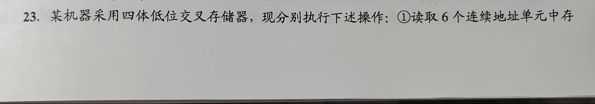
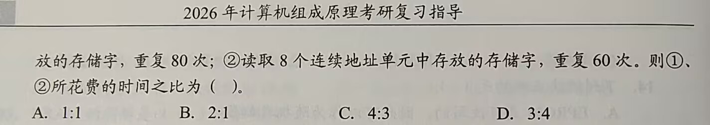
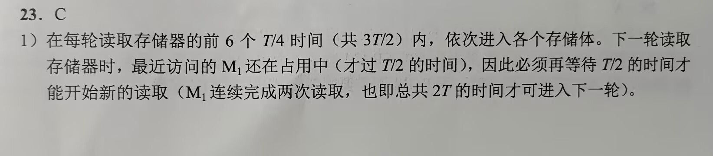
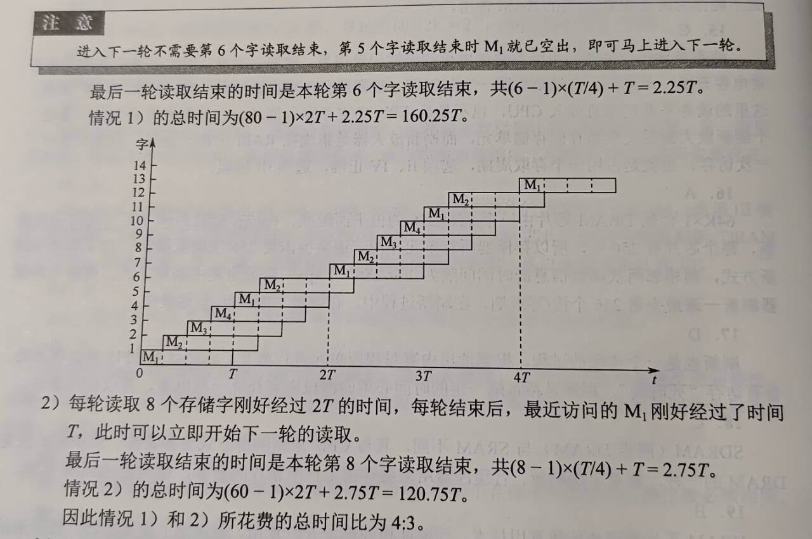

# 第三章 存储系统

## 目录
- [第三章 存储系统](#第三章-存储系统)
  - [目录](#目录)
- [3.1 存储器概述](#31-存储器概述)
  - [3.1.1 存储器的分类](#311-存储器的分类)
    - [按在计算机作用分类](#按在计算机作用分类)
    - [按存储介质分类](#按存储介质分类)
    - [按存取方式分类](#按存取方式分类)
    - [按信息的可保存性分类](#按信息的可保存性分类)
    - [3.1.2 存储器的性能指标](#312-存储器的性能指标)
  - [3.1.3 多级层次的存储系统](#313-多级层次的存储系统)
  - [考点易错点](#考点易错点)
- [3.2 主存储器](#32-主存储器)
  - [3.2.1 SRAM和DRAM芯片](#321-sram和dram芯片)
    - [SRAM工作原理](#sram工作原理)
    - [DRAM工作原理](#dram工作原理)
    - [SRAM和DRAM比较](#sram和dram比较)
    - [存储器芯片内部结构](#存储器芯片内部结构)
  - [3.2.2 ROM](#322-rom)
    - [特点](#特点)
    - [类型](#类型)
  - [3.2.3 主存储器的基本组成](#323-主存储器的基本组成)
  - [3.2.4 多模块存储器](#324-多模块存储器)
    - [单体多字存储器](#单体多字存储器)
    - [多体并行存储器](#多体并行存储器)
  - [考点\&易错点](#考点易错点-1)
- [3.3 主存储器与CPU的连接](#33-主存储器与cpu的连接)
  - [3.3.1 连接原理](#331-连接原理)
  - [3.3.2 主存容量的扩展](#332-主存容量的扩展)
    - [位扩展法](#位扩展法)
    - [字扩展法](#字扩展法)
    - [字位同时扩展法](#字位同时扩展法)
  - [3.3.3 存储芯片的地址分配和片选](#333-存储芯片的地址分配和片选)
    - [线选法](#线选法)
    - [译码片选法](#译码片选法)
  - [3.3.4 存储器与CPU的连接](#334-存储器与cpu的连接)
    - [合理选择存储芯片](#合理选择存储芯片)
    - [地址线的连接](#地址线的连接)
    - [数据线的连接](#数据线的连接)
    - [读/写控制线的连接](#读写控制线的连接)
    - [片选控制线的连接](#片选控制线的连接)
  - [考点\&易错点](#考点易错点-2)
- [3.4 外部存储器](#34-外部存储器)
  - [3.4.1 磁盘存储器](#341-磁盘存储器)
    - [磁盘存储器](#磁盘存储器)
    - [磁盘阵列](#磁盘阵列)
  - [固态硬盘](#固态硬盘)
    - [固态硬盘的特性](#固态硬盘的特性)
    - [磨损均衡](#磨损均衡)
  - [考点\&易错点](#考点易错点-3)
- [3.5 高速缓冲存储器](#35-高速缓冲存储器)
  - [3.5.1 程序访问的局部性原理](#351-程序访问的局部性原理)
  - [3.5.2 Cache的基本工作原理](#352-cache的基本工作原理)
  - [3.5.3 Cache和主存的映射方式](#353-cache和主存的映射方式)
    - [直接映射](#直接映射)
    - [全相联映射](#全相联映射)
    - [组相联映射](#组相联映射)
    - [总结](#总结)
  - [3.5.4 Cache中主存块的替换算法](#354-cache中主存块的替换算法)
    - [常见替换算法](#常见替换算法)
    - [LRU算法](#lru算法)
  - [3.5.5 Cache的一致性问题](#355-cache的一致性问题)
    - [写操作命中](#写操作命中)
    - [写操作不命中](#写操作不命中)
    - [配合](#配合)
    - [分离的指令Cache和数据Cache](#分离的指令cache和数据cache)
    - [多级Cache](#多级cache)
  - [考点\&易错点](#考点易错点-4)
- [3.6 虚拟存储器](#36-虚拟存储器)
  - [3.6.1 虚拟存储器的基本概念](#361-虚拟存储器的基本概念)
  - [3.6.2 页式虚拟存储器](#362-页式虚拟存储器)
    - [页表](#页表)
    - [地址转换](#地址转换)
    - [快表TLB](#快表tlb)
    - [有TLB和Cache的多级存储系统](#有tlb和cache的多级存储系统)
  - [3.6.3 段式虚拟存储器](#363-段式虚拟存储器)
  - [3.6.4 段页式虚拟存储器](#364-段页式虚拟存储器)
  - [3.6.5 虚拟存储器与Cache的比较](#365-虚拟存储器与cache的比较)
  - [考点\&易错点](#考点易错点-5)

# 3.1 存储器概述

## 3.1.1 存储器的分类

### 按在计算机作用分类

### 按存储介质分类

### 按存取方式分类

- 随机存储器（RAM）
  - 存储器任何一个存储单元都可以随机存取，存取时间与存储单元物理位置无关
  - 读/写方便，使用灵活，主要用作主存或高速缓冲存储器
  - 分为静态RAM，动态RAM
- 只读存储器（ROM）
  - 断电保留
  - 随机读取
  - 写入需通过电擦除，速度比读取慢得多
- 串行访问存储器
  - 需按物理位置先后顺序寻址
  - 包括顺序存取存储器（磁带）
  - 直接存取存储器（磁带、光盘）
- 直接存储器（DAM）
  - 速度介于随机存储器和顺序存取存储器之间

### 按信息的可保存性分类

- **易失性存储器**：断电存储信息即消失，RAM
- **非易失性存储器**：断电后信息仍然保持，如ROM、磁表面存储器和光存储器

### 3.1.2 存储器的性能指标

- 三个性能指标
  - 存储容量
  - 单位成本
  - 存储速度
- 相关概念
  - 存储容量 = 存储字数 x 字长
  - 单位成本：位价 = 总成本 / 总容量
  - 存储速度：数据传输速率（每秒传送信息的位数）= 数据的宽度 / 存取周期
    - 存取时间（$T_a$）：从启动一次存储器到完成该操作经历的时间，读出时间、写入时间
    - 存取周期（$T_m$）：指存储器进行一次完整读/写操作所需的全部时间，即连续两次独立访存操作之间所需最短时间间隔
    - 主存带宽（$B_m$）：也称*数据传输速率*，每秒从主存进出信息的最大数量，单位为字/秒或位/秒
  - 存取时间不等于存取周期，通常存取周期大于存取时间。
    - 因为任何一种存储器，读/写操作后，总需要一段时间恢复内部状态。
    - 对于破坏性读出的存储器，存取周期往往比存取时间大得多，因为信息读出后需要马上再生
    - 存取周期 = 存取时间 + 复原时间

## 3.1.3 多级层次的存储系统

- 
  - 辅存（硬盘）只能直接和主存（内存）交流信息
  - CPU、Cache、主存相互之间都可以直接交流信息

- 主要思想：上一层存储器作为低一层存储器的高速缓存

- 主存和Cache之间的数据调动是由硬件自动完成的，**对所有程序员均是透明的**
- 主存和辅存之间的数据调动是由硬件和OS共同完成的，**对应用程序员是透明的**
- 虚拟存储系统

## 考点易错点

- 可寻址单元数 = 存储器容量 / CPU寻址单元大小
  - 这里CPU寻址单元大小需要考虑**机器字长**，例如32位机器字长，CPU按半字寻址，那么寻址单元大小为16位
- 相联存储器按**内容**指定方式和**地址**指定方式相结合来寻址
  - 工作原理：存储单元所存内容的某一部分作为检索项（关键字项）去检索该存储器，并将存储器中与该检索项符合的存储单元内容进行写入/读出
  - 一般用于制作TLB、相联Cache
- CPU不能直接访问Cache
- 计算Cache命中率：不能四舍五入，必须命中率往上走
- 几种存储器的名称
  - EPROM
    - 可擦除可编程只读存储器
    - 非易失
    - 像可重复使用的石板，擦除需要特殊的紫外线
  - CD-ROM
    - **只读**光盘
    - 光学存储介质
  - DRAM
    - 动态随机存取存储器
    - 易失性
    - 计算机内存，DDR4、DDR5 —— 高速重复读写
  - SRAM
    - 静态随机存取存储器
    - 易失性
    - 不需要刷新，速度极快，结构复杂成本高功耗大（锁存器电路）

# 3.2 主存储器

## 3.2.1 SRAM和DRAM芯片

主存储器主要由DRAM实现，靠近处理器那一层（Cache）由SRAM实现

### SRAM工作原理

- 概念介绍
  - 存储**一个**二进制位的物理器件称为**存储元**，是存储器最基本的构建
  - 地址码相同的多个**存储元**构成一个**存储单元**，若干存储单元的集合构成**存储体**
- 工作原理
  - 双稳态触发器（六晶体管MOS）来记忆信息
  - **静态**：非破坏性读出
  - SRAM存取速度快，集成度低，功耗较大，价格昂贵，一般用于高速缓冲存储器

### DRAM工作原理

- 基本存储元只使用一个晶体管，集成度高、价位低、功耗小

- DRAM存取速度比SRAM慢，定时刷新+读后再生，必须大容量的主存系统
  - 动态：读操作会使状态发生改变，需要根据读出内容对相应单元进行重写，**读后再生**

- 同一行相邻两次刷新的时间间隔称为**刷新周期**，通常2ms

- 常用刷新方式3种
  - 集中刷新：死时间、死区
  - 分散刷新：工作周期分为两部分，前半用于读/写，后半用于刷新
  - 异步刷新：每个刷新周期内每行仅刷新一次，相邻两行之间刷新时间间隔t，每隔t刷新一次

- DRAM的刷新需要注意
  - 刷新对CPU透明，刷新并不依赖于外部的访问
  - DRAM刷新单位是行，芯片内部自行生成地址
  - 刷新操作类似于读操作，但又有所不同

- DRAM芯片的**地址引脚复用技术**
  - 行地址和列地址通过相同引脚先后分两次输入，地址引脚数可减少一半

- DRAM芯片行、列数的**优化原则**

  - $2^n \times b$位DRAM芯片的存储阵列，行数为r，列数为c，则$2^n = r\times c$
  - 引脚复用技术，应尽量使行、列数相同，满足**$|r-c|$最小**
  - DRAM按行刷新，行数应比列数少，$r\leq c$

- DRAM芯片行缓冲器容量的计算

  

  - 芯片容量16x8位，存储阵列4行x4列
  - 地址引脚采用复用技术，故仅需$log_24=2$根地址线，分时传送
  - 每个存储元8位，8根数据线
  - 芯片内部有个行缓冲器，缓存指定行中每列数据
    - 大小 = 列数 x 存储元位数
    - SRAM实现
    - 选中某行，该行所有数据送到行缓冲器，以后每个时钟都可以连续地从DRAM中输出一个数据，因此可支持**突发传输**
    - 突发传输方式：在寻址阶段给出数据首地址，传输阶段可传送多个连续存储单元的数据

- 目前更常用SDRAM（同步DRAM）芯片
  - SDRAM与CPU的数据交换同步于系统的时钟信号，并以CPU-主存总线最高速度运行，而不需要插入等待状态
  - SDRAM在系统时钟控制下进行数据读出和写入，将CPU发出的**地址和控制信号**锁存起来，经过指定的时钟周期数后再响应，此时CPU可执行其他操作
  - 而普通DRAM需要CPU不断采样其完成信号

### SRAM和DRAM比较

| 特点       | SRAM     | DRAM     |
| ---------- | -------- | -------- |
| 存储信息   | 触发器   | 电容     |
| 破坏性读出 | no       | yes      |
| 需要刷新   | no       | yes      |
| 送行列地址 | 同时送   | 引脚复用 |
| 运行速度   | 快       | 慢       |
| 集成度     | 低       | 高       |
| 存储成本   | 高       | 低       |
| 主要用途   | 高速缓存 | 主存     |

### 存储器芯片内部结构

- 存储器芯片
  - 存储体（存储矩阵）
    - 存储单元的集合
    - 行选择线X，列选择线Y
  - I/O电路
    - 控制被选中单元的读出/写入，放大信号的作用
  - 地址译码器
    - 单译码法：只有一个行译码器，同行所有存储单元的字线连在一起，同一行中**各单元构成一个**字，被同时读出、写入；缺点：地址译码器输出线数过多
    - 双译码法：X、Y两个译码器，选中的行、列交叉电能确定一个存储单元
  - 控制电路
    - 片选控制线
      - 单个芯片容量太小，需用一定数量的芯片进行存储器的扩展，访问某个字必须选中芯片，而其他芯片不被选中
    - 读写控制线
      - 根据CPU给出的读/写命令，经读/写控制线控制被选中单元进行读/写

## 3.2.2 ROM

### 特点

- 结构简单，**位密度**比可读/写存储器**高**
- 非易失性，可靠性高

### 类型

- MROM，掩模式只读存储器
  - 生产过程直接写入，任何人无法更改
  - 可靠性高、集成度高、价格便宜
  - 灵活度差
- PROM，以此可编程只读存储器
  - 用户用专门设备写入自己的程序，写入后无法更改
- EPROM，可擦除可编程只读存储器
  - 编程次数有限、写入时间过长
- Flash存储器
  - 可不加电情况长期保存信息
  - 又能在线快速擦除重写，且速度快
  - 价格便宜、集成度高；且可擦除重写、速度快
- 固态硬盘（Solid State Drive，SSD）
  - 基于闪存，用固态电子存储芯片阵列制成
  - 控制单元+存储单元（Flash芯片）
  - 保留Flash存储器长期保存信息、快速擦除与重写的特性
  - 对比传统硬盘具有低功耗、读写速度快的特性
  - 但价格较高

## 3.2.3 主存储器的基本组成

- 存储元件、存储单元 -> 存储矩阵
- 编址，可以按字编址、也可以按字节编址
  - 被访问单元地址--->MAR--*地址线*->主存中地址寄存器（地址译码器译码）->选中相应单元由CPU将读/写控制信号送至主存的读/写控制电路
    - 写：CPU同时将信息送到MDR，在读/写控制电路控制下，经数据线写入选中单元
    - 读：主存选中相应单元送至数据线，送到MDR中
  - MDR位数与数据线相同，64位数据线，字节编址，最多可存取8个单元的内容
  - MAR位数与地址线相同，决定主存地址空间最大可寻址范围

## 3.2.4 多模块存储器

- 是一种**空间并行技术**，多个结构完全相同的存储模块的并行工作来提高存储器的吞吐率
  - 常用的有单体多字存储器和多体低位交叉存储器
  - 多体：CPU速度比存储器快得多，若同时从存储器中取出n条指令，则可以充分利用CPU资源

### 单体多字存储器

- 一个存取周期，从同一地址取出m条指令，将指令逐条送至CPU执行，每隔1/m存取周期，CPU向主存取一条指令
- 缺点：指令&数据在主存中连续存放时才能有效提升存储速度；转移指令/操作数不能连续存放，则提升不明显

### 多体并行存储器

## 考点&易错点

- 考：芯片引脚数的计算

  - 引脚长在芯片上，如果是内存条则还需要添加地址译码器
  - **地址引脚**部分：容量 -> 行r，列c
    - 观察是SRAM，则无复用
    - 是DRAM，观察需不需要地址引脚复用
  - **数据线**部分：1024 x 8bit，那么数据线8根

- DRAM的刷新

  - 只有分散刷新的方式不存在死时间，**死时间会影响CPU正常访存**
  - 刷新不依赖于CPU访问
  - 刷新可以称作“假读”，读取存储单元中信息并给它重新充电
  - 芯片刷新时间的计算：
    - 假设给64K x 1bit的DRAM芯片构成128K x 8bit的存储器，给出每单元刷新间隔，计算**异步刷新**生成刷新信号的间隔时间，计算**集中刷新**使用时间周期（每行一个时间周期）
    - 芯片自己有自己的控制电路，那么我们**只需要考虑芯片本身**
    - 64K -> 256 x 256的位平面，有256行
    - 2ms/256 = 7.8us
    - 256个时间周期

- RAM和ROM都是**半导体存储器**

  - RAM
    - SRAM
    - DRAM
      - 扩展出SDRAM
  - ROM
    - MROM
    - PROM
    - EPROM
    - Flash存储器
      - 需要擦除再写，所以读和写的周期并不相同
    - 固态硬盘SSD
      - 同Flash

- 考虑多体并行存储器

  - 若从开始考虑，那么就是T+(n-1)r
  - 如果是工作情况（整体工作性能），那么就是nr（流水线运行起来的情况）

- 多体并行存储器的时间计算（流水线套流水线）

  

  

  

  

- 交叉编址的理解
  - 得芯片数，比如为4，那么**片选信号**由最低两位构成，其他高位为**片内地址**
  - e.g. BFFFH为 10111111111111<u>11</u>，所以所在芯片片选信号11，那么芯片中最小地址应为0003H

# 3.3 主存储器与CPU的连接

## 3.3.1 连接原理

- 数据总线、地址总线、控制总线
- 数据总线位数x工作频率 正比于 数据传输速率
- 地址总线位数决定可寻址的最大内存空间
- 控制总线（读/写）指出总线周期的类型和本次输入/输出操作完成的时刻

## 3.3.2 主存容量的扩展

单个芯片 -> 多个芯片集成于内存条 -> 多个内存条及主板上的ROM芯片组成计算机主存空间 -> 总线与CPU相连

### 位扩展法

- 增加**存储字长**
- **连接方式**：各芯片地址线、片选控制线和读/写控制线与系统总线相应**并联**；各芯片数据线单独引出，分别连接系统数据线

### 字扩展法

- 扩展存储字的**数量**
- **连接方式**：系统地址线高位 -> 各芯片片选信号；低位 -> 各芯片地址线；芯片的数据线和读/写控制线与系统总线相应并联；各芯片分时工作

### 字位同时扩展法

- 增加存储字的数量，又增加存储字长
- 连接方式：位扩展的芯片一组，各组连接方式与位扩展相同；由系统地址线高位译码产生若干片选信号，分别接到各组芯片的片选控制线

## 3.3.3 存储芯片的地址分配和片选

片选：选择存储芯片；字选：选定的芯片中选择具体的存储单元

### 线选法

### 译码片选法

## 3.3.4 存储器与CPU的连接

### 合理选择存储芯片

### 地址线的连接

- CPU地址线低位连接芯片地址线
- 高位扩充时使用

### 数据线的连接

### 读/写控制线的连接

- 不分开时：高电平读、低电平写
- 分开时（读RD，写WE，均位低电平有效）

### 片选控制线的连接

## 考点&易错点

- 要会读电路
- 并联扩展位的几个芯片看作一个就可以了

- MAR决定主存地址空间（即使主存储器没有那么大）

# 3.4 外部存储器

## 3.4.1 磁盘存储器

- 优点
  - 容量大价位低
  - 记录介质可重复使用
  - 信息可长期保存不丢失，甚至可以脱机存档
  - 非破坏性读出，不需再生
- 缺点
  - 存取速度慢
  - 机械结构复杂，对工作环境要求高

### 磁盘存储器

1. 磁盘设备的组成

   1. 磁盘的组成
      - 磁盘驱动器、磁盘控制器和盘片组成
      - 磁盘驱动器
        - 驱动磁盘转动并在盘面上通过磁头进行读/写操作
      - 磁盘控制器
        - 磁盘驱动器与主机的接口，接收并解释CPU发来的命令，向磁盘驱动器发出各种控制信号，负责检测驱动器状态

   2. 存储区域

      - 记录面、磁道、扇区（块）

      - 磁头数

      - 柱面数

      - 扇区数

   3. 磁盘高速缓存

2. 磁记录原理

   - 原理：磁头 & 磁性记录介质相对运动，通过电磁转换完成读写操作
   - 编码方法：磁化翻转序列
   - 磁记录方式：FM和MFM

3. 磁盘性能指标

   - 记录密度
     - 道密度、位密度、面密度
   - 磁盘容量
     - 非格式化容量
     - 格式化容量（小一些）
   - 存取时间
     - 寻道时间（取平均值：最外道到最内道的时间的一半）
     - 旋转延迟时间（取平均值：旋转半周的时间）
     - 传输时间
   - 数据传输速率
     - r转每秒，每条磁道容量N字节
     - $D_r = r N$

4. 磁盘地址

   `|柱面（磁道）号|盘面（磁头）号|扇区号|`

   若有16个盘面、每个盘面256个磁道、每个磁道16个扇区，则每个扇区的地址为16位二进制代码

   `|柱面（磁道）号（8位）|盘面（磁头）号（4位）|扇区号（4位）|`

5. 磁盘工作过程
   - 主要操作：寻址、读盘、写盘
   - 工作：第一步取控制字，第二步执行控制字

### 磁盘阵列

- RAID，1~5何时有磁盘损坏，都可以随时拔出受损磁盘再插入好的磁盘，数据不会损坏
  - RAID0：无冗余无校验
  - RAID1：镜像
  - RAID2：纠错的海明码
  - RAID3：位交叉奇偶校验
  - RAID4：块交叉奇偶校验
  - RAID5：无独立校验的奇偶校验
- 优点：传输速率、并行提高数据吞吐量（例如条带化）、镜像提高安全可靠、数据校验提供容错

## 固态硬盘

### 固态硬盘的特性

- 闪存芯片 -> 机械驱动器
- 闪存翻译层 -> 磁盘控制器
- 以页为单位读写，以块为单位擦除，每块由32~128页组成
- 优点
  - 无移动部件，随机访问时间比机械磁盘快很多
  - 无机械噪声、振动
  - 能耗低、抗震好，安全性高

### 磨损均衡

- 动态磨损均衡
- 静态磨损均衡

## 考点&易错点

- 计算磁盘接口**所需**最大传输速率
  - 每个扇区的容量/每个扇区用时（这个是纯粹的数据传输）
- 所以磁盘考虑扇区间隙的话，它传输数据是离散的，一会传一会不传
- 扇区平均存取时间
  - 寻道时间+旋转半周+数据传输时间

# 3.5 高速缓冲存储器

Cache由SRAM组成，通常集成在CPU中

## 3.5.1 程序访问的局部性原理

- 时间局部性
- 空间局部性
- 时间&空间局部性的分析
  - 如数组的访问
  - 如for循环体的局部性

## 3.5.2 Cache的基本工作原理

- **Cache块**也称Cache**行**，每块由若干字节组成，块的长度为**块长**（也称行长）
- CPU和Cache之间数据交换以**字**为单位，Cache和主存之间数据交换以**Cache块**为单位
- CPU读请求
  - Cache命中
  - Cache不命中
    - 从主存调入Cache
    - 替换算法
- CPU写请求
  - Cache与主存内容不一致
    - 全写法
    - 回写法
- Cache命中率的计算
- Cache缺失率对主存带宽的影响
- 根据Cache读写流程，可知实现Cache需要解决以下关键问题
  - 数据查找
  - 地址映射
  - 替换策略
  - 写入策略

## 3.5.3 Cache和主存的映射方式

- 标记位、有效位

### 直接映射

`Cache行号 = 主存块号 mod Cache总行数`

`|标记（t位）|Cache行号（c位）|块内地址（b位）|`

- CPU访存

- 块冲突概率最高、空间利用率最低

### 全相联映射

`|标记|块内地址|`

- CPU访存
- 每个Cache行设置一个比较器，位数等于标记字段的位数
- 按**内容访问**的存取方式

- 优点

  - 冲突概率低

  - 空间利用率高

  - 命中率高

- 缺点

  - 标记的速度较慢
  - 实现成本较高，按内容寻址的相联存储器

### 组相联映射

`|标记|组号|块内地址|`

`Cache组号 = 主存块号 mod Cache组数（Q）`

- Cache分为Q个大小相等的组，每个主存块装入固定组中的任意一行，组间采用直接映射、组内采用全相联映射
- 是对直接映射和全相联映射的一种折中，Q=1则全相联映射、Q=Cache行数则直接映射
- CPU访存
  - 直接映射方式找组，组中每行比较，判断是否命中
  - 不命中则读出信息送入组中，并设置标记

### 总结

- 直接映射命中率最低，全相联映射命中率最高
- 直接映射判断开销最小、所需时间最短，全相联映射判断开销最大、所需时间最长
- 直接映射标记所占额外空间开销最小，全相联映射标记所占额外空间开销最大

## 3.5.4 Cache中主存块的替换算法

### 常见替换算法

- RAND
- FIFO
- LRU（近期最少使用）
- LFU（最不经常使用）

### LRU算法

- 每个Cache行设计一个计数器（LRU替换位）
- LRU替换位及其位数的计算
- 抖动：当集中访问的存储区超过Cache组的大小时，命中率可能变得很低。如4路组相联，访问序列1、2、3、4、5、1、2、3、4、5，命中率为0

## 3.5.5 Cache的一致性问题

对Cache中内容更新时，需选用写操作序列使Cache内容和主存内容保持一致

### 写操作命中

- 全写法（直写法，Write Through）
  - 数据同时写入Cache和主存
  - 优点：实现简单，随时保证主存数据正确性
  - 缺点：增加了访存次数，降低了Cache的效率
  - **写缓冲**：CPU同时写数据到Cache和写缓冲中，写缓冲再将其写入主存，写缓冲是一个FIFO队列，可以解决速度不匹配的问题，但是频繁写会导致写缓冲饱和溢出
- 回写法
  - Cache被换出时才写回主存
  - 减少访存次数，但存在数据不一致的隐患
  - 给每个Cache行设置一个**修改位**（**脏位**）

### 写操作不命中

- 写分配法
  - 更新主存单元，并将其调入Cache
  - 缺点：每次写不命中都要从主存读一个块到Cache
- 非写分配法
  - 只更新主存单元但不调入Cache

### 配合

- 非写分配法&全写法
- 写分配法&回写法

### 分离的指令Cache和数据Cache

- 统一Cache：设计和实现相对简单；但执行部件存取数据时，指令预取部件要从同一Cache读指令，会引发冲突
- 采用分离的Cache结构可以解决这个问题
  - 同时，分离的Cache还可以充分利用指令和数据的不同局部性来优化性能

### 多级Cache

- 指令Cache与数据Cache分离一般在L1，通常为写分配法和回写法合用
- 两级Cache系统中
  - L1Cache对L2Cache使用全写法，L2Cache对主存使用回写法
  - L2访问速度大于主存，避免了频繁写造成的写缓冲饱和溢出

## 考点&易错点

- CPU与Cache交换的单位是**字**，Cache与主存交换的单位是**块**
  - CPU只与Cache直接交互，如果发生缺失也是先写入Cache然后再读Cache
- 局部性
  - 时间局部性：自己在短时间内被多次访问
  - 空间局部性：数组邻居在短时间内被多次访问
- Cache的功能完全由硬件实现
  - 就连那几个替换算法也是硬件里面的，需要根据替换算法做出相应的硬件
- Cache地址空间与主存地址空间独立
  - 是通过地址映射才将主存地址空间映射到空间中
- 指令Cache通常比数据Cache有更好的空间局部性
  - 因为指令**顺序执行**
- Tag的计算
  - 直接映射：
    - `|标记（t位）|Cache行号（c位）|块内地址（b位）|`
    - t = 主存地址位数 - cache行号 - 块内地址
    - 然后取高位读出即可
  - 全相联映射：
    - `|标记|块内地址|`
    - t = 主存地址位数 - 块内地址
  - 组相联映射
    - `|标记|组号|块内地址|`
    - t = 主存地址位数 - cache组号 - 块内地址
    - **考**：cache总容量不变下，cache块大小增加一倍，则t如何变化
- cache块(组)号的计算
  - `（存储单元号 / cache块大小）% 块(组)数`
- cache总容量的计算
  - 主存块大小，例如这里32bit
  - 有效位1bit
  - 回写标志1bit
  - 标志位t：按照上面的*按tag计算*
  - 最后一个cache行的大小为 `主存块大小+1bit+1bit(如果回写法)+t`
  - 再按比例计算cache的总容量

- 计算数组的访问次数：小心读出写回，这样一条指令中有两次访问数组元素
- cache是 n 路组相联就 n 个比较器

# 3.6 虚拟存储器

- 主存和辅存共同构成了虚拟存储器，二者在硬件和系统软件的共同管理下作用。

- 对应用程序员而言，虚拟存储器是透明的
- 虚拟存储器具有主存的速度和辅存的容量

## 3.6.1 虚拟存储器的基本概念

- 虚地址、逻辑地址 -> 虚拟空间、程序空间
- 始地址、物理地址 -> 主存地址空间、实地址空间
- 访问辅存代价很大，所以要提高命中率&减少访问辅存次数
  - **全相联映射**
  - **回写法**

## 3.6.2 页式虚拟存储器

主存空间中的页为**物理页**、实页、页框

虚拟地址空间的页为**虚拟页**、虚页

页表记录程序的虚页调入主存时安排在主存中的位置，页表长久地保存在内存中

### 页表

- 页表示例
  - 有效位：表示对应页面是否在主存
    - 1则在，存放该页的物理页号
    - 0则不在，存放该页的磁盘地址
  - 引用位：也称使用位，配合替换算法
- 页式虚拟存储器优点：
  - 页面长度固定，页表简单，调入方便
- 缺点：
  - 最后一页的零头将无法利用而造成浪费
  - 页不是逻辑上独立的实体，处理、保护、共享都不及段式虚拟存储器方便

### 地址转换

- 基本概念

  - 虚拟地址：高位**虚页号**，低位**页内偏移地址**
  - 物理地址：高位**物理页号**，低位**页内偏移地址**

  - 页表：存放在主存中的虚页号->实页号对照表

- 虚拟地址->物理地址的转换

  - 每个进程有一个**页表基址寄存器**，存放该进程的**页表首地址**
  - 根据虚拟地址高位虚拟页号找到页表项
    - 装入位为1，取出物理页号，和低位页内偏移地址拼接形成实际物理地址
    - 装入位为0，缺页，需要OS进行缺页处理

### 快表TLB

- 概念

  - 高速缓冲器中的页表

  - 慢表（Page）

- 实现

  - **SRAM**，全相联/组相联，工作原理类似Cache
  - TLB表项由页表项内容和TLB标记组成
    - 全相联：TLB标记即对应页表项的虚拟页号
    - 组相联：TLB标记是对应虚拟页号的高位部分，低位部分作为TLB组的组号

### 有TLB和Cache的多级存储系统

- 地址变换过程

## 3.6.3 段式虚拟存储器

## 3.6.4 段页式虚拟存储器

## 3.6.5 虚拟存储器与Cache的比较

## 考点&易错点

- 虚拟存储器的实际容量不可以大于主存和辅存容量之和
  - 再大没意义了
- TLB搜索速度快来源于**硬件**，而非什么搜索算法
  - 即来源于相联存储器
- 读页表的时候小心：十六进制/十进制
  - 可能虚页号在地址中给的是十六进制，而页表中是十进制
- TLB标记字段类似于Cache标记字段，计算比较类似
- MMU地址转换中能检测
  - 访问越权（能看到是否访问到不该访问的虚拟地址）
  - 缺页
  - TLB缺失
- MMU地址转换不能检测：Cache缺失，Cache缺失则是访问物理内存时才知道的
