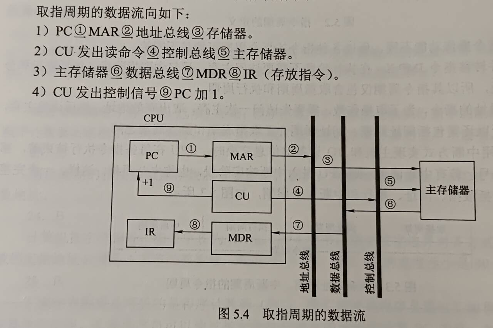
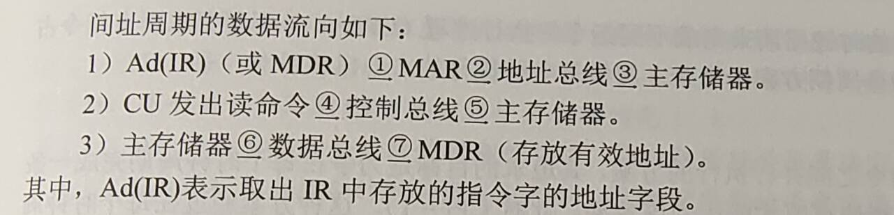
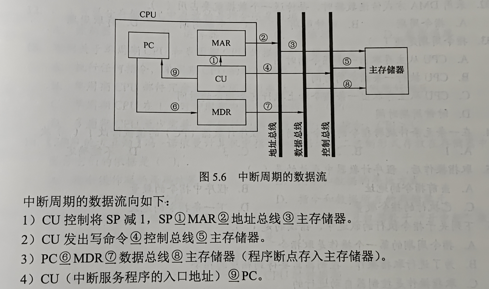

# 第五章 中央处理器

## 目录
- [第五章 中央处理器](#第五章-中央处理器)
  - [目录](#目录)
- [5.1 CPU的功能和基本结构](#51-cpu的功能和基本结构)
  - [5.1.1 CPU的功能](#511-cpu的功能)
  - [5.1.2 CPU的基本结构](#512-cpu的基本结构)
    - [运算器](#运算器)
    - [控制器](#控制器)
  - [5.1.3 CPU的寄存器](#513-cpu的寄存器)
    - [CPU中各种寄存器的作用](#cpu中各种寄存器的作用)
  - [考点\&易错点](#考点易错点)

# 5.1 CPU的功能和基本结构

## 5.1.1 CPU的功能

- CPU的具体功能包括
  - 指令控制：取指令、分析指令、执行指令（程序的顺序控制）
  - 操作控制：产生操作信号，并将各种操作信号送到相应的部件，从而控制部件正确执行
  - 时间控制：严格控制各种操作信号的出现时间、持续时间及顺序
  - 数据加工：对数据算术、逻辑运算
  - 中断处理：异常情况&中断请求

## 5.1.2 CPU的基本结构

### 运算器

- 算数逻辑单元ALU
- 暂存器
- 累加寄存器ACC
- 通用寄存器组GPRs
- 程序状态字PSW寄存器
- 移位寄存器
- 计数器

### 控制器

- 程序计数器
- 指令寄存器
- 指令译码器
- 时序电路
- 微操作信号发生器

## 5.1.3 CPU的寄存器

- 用户可见寄存器
- 用户不可见寄存器：控制部件使用，控制CPU的操作
  - 如存储器地址寄存器、存储器数据寄存器etc.

### CPU中各种寄存器的作用

- 运算器中的寄存器
  - 通用寄存器组GPRs。用于存放操作数（源、目的操作数，中间结果）和各种地址信息如AX、BX、CX、DX、SP等等
    - 指令需指明寄存器编号才能对它进行访问
    - SP是堆栈指针，指示栈顶的地址
  - 累加寄存器ACC
  - 移位寄存器SR
  - 暂存寄存器。**对应用程序员来说是透明的**
  - 程序状态字PSW寄存器
    - 保留算术/逻辑运算指令或测试指令的运行结果
    - OF、SF、ZF、CF等等
    - 每个标志位通常由一位触发器保存
    - 组合在一起称程序状态字
- 控制器中的寄存器
  - PC
  - 指令寄存器IR，保存当前正在执行的指令，位数等于指令字长

## 考点&易错点

- 对用户透明：不需要用户进行任何的干预，用户既不用读也不用写
  - 比如指令寄存器IR
- CPU位数：CPU一次能处理的数据的位数
  - 数据总线应与处理器位数相同
- PC的位数取决于
  - 存储器的容量
  - 指令字长
  - `存储器容量/指令字长`得到最多多少条指令，然后计算PC的位数
- 通用寄存器的位数取决于机器字长，便于操作控制
- 控制器的全部功能
  - 从主存储器中取出指令，分析并产生相应的控制信号
- 指令译码：对指令的操作码字段进行译码
- **间址周期**：取操作数的有效地址

# 5.2 指令执行过程

## 5.2.1 指令周期

- **指令周期**：CPU每取出并执行一条指令所需的全部时间
  - 取指周期：完成取指令和分析指令的操作
  - 间址周期：访问主存获取操作数有效地址（间址：表示指令是间接寻址）
  - 执行周期：完成执行指令的操作
  - 中断周期：若有中断请求，则CPU进入中断响应阶段，也称中断周期
- 指令执行过程
  - 取指周期：从PC指出的主存单元取指，送至IR，PC+“1”作为下一条地址
    - 遇到转移指令等改变执行顺序的指令，PC+“1”后会重新计算
  - 判断是否有间接寻址，有则进入间址周期，获得操作数有效地址
  - 执行周期：完成取操作数、执行操作数、存操作数
  - 若CPU检测到中断请求，则进入中断周期
    - 关中断、保存断点，并转向中断服务程序
    - 进栈是SP减“1”，因为计算机中堆栈都是向低地址方向增长

## 5.2.2 指令周期的数据流

### 取指周期

- 主存储器取指令代码并放在IR中

  

### 间址周期

- 取操作数**有效地址**，指令中地址码送到MAR并送至地址总线，CU向主存发出读命令，获取有效地址存至MDR

  

  

### 执行周期

无统一数据流向

### 中断周期

- 处理中断请求。假设：程序断点存入堆栈，并用SP指示栈顶地址，进栈操作是先修改栈顶指针，后存入数据

  

## 5.2.3 指令执行方案

### 单周期处理器

- 每条指令都在一个时钟周期内完成（CPI=1），指令串行执行
- 指令周期取决于执行时间最长的指令的执行时间

### 多周期处理器

- 不同类型执行选取不同执行步骤
- 指令需要几个周期就为它分配几个周期
- 仍是串行执行

### 流水线处理器

- 尽量多条指令同时运行，但各自处在不同的执行步骤中