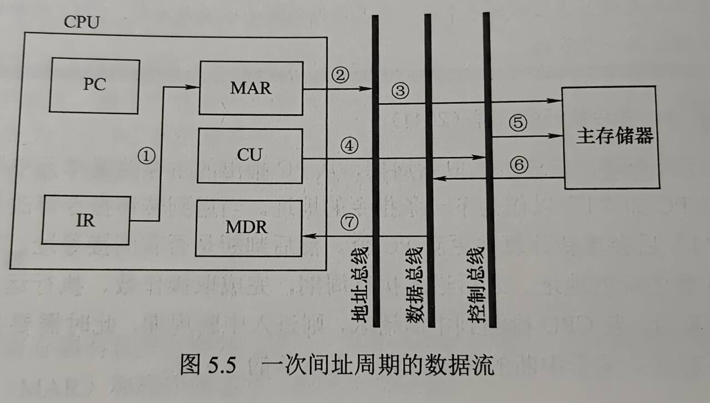

# 第五章 中央处理器

## 目录
- [第五章 中央处理器](#第五章-中央处理器)
  - [目录](#目录)
- [5.1 CPU的功能和基本结构](#51-cpu的功能和基本结构)
  - [5.1.1 CPU的功能](#511-cpu的功能)
  - [5.1.2 CPU的基本结构](#512-cpu的基本结构)
    - [运算器](#运算器)
    - [控制器](#控制器)
  - [5.1.3 CPU的寄存器](#513-cpu的寄存器)
    - [CPU中各种寄存器的作用](#cpu中各种寄存器的作用)
  - [考点\&易错点](#考点易错点)
- [5.2 指令执行过程](#52-指令执行过程)
  - [5.2.1 指令周期](#521-指令周期)
  - [5.2.2 指令周期的数据流](#522-指令周期的数据流)
    - [取指周期](#取指周期)
    - [间址周期](#间址周期)
    - [执行周期](#执行周期)
    - [中断周期](#中断周期)
  - [5.2.3 指令执行方案](#523-指令执行方案)
    - [单周期处理器](#单周期处理器)
    - [多周期处理器](#多周期处理器)
    - [流水线处理器](#流水线处理器)
  - [考点\&易错点](#考点易错点-1)
- [5.3 数据通路的功能和基本结构](#53-数据通路的功能和基本结构)
  - [5.3.1 数据通路的功能](#531-数据通路的功能)
  - [5.3.2 数据通路的组成](#532-数据通路的组成)
    - [组合逻辑元件（操作元件）](#组合逻辑元件操作元件)
    - [时序逻辑元件](#时序逻辑元件)
  - [5.3.3 数据通路的基本结构](#533-数据通路的基本结构)
    - [总线结构](#总线结构)
      - [CPU内部单总线方式](#cpu内部单总线方式)
      - [CPU内部多总线方式](#cpu内部多总线方式)
    - [专用数据通路方式](#专用数据通路方式)
  - [5.3.4 数据通路的操作举例](#534-数据通路的操作举例)
    - [通用寄存器之间](#通用寄存器之间)
    - [主存读取数据](#主存读取数据)
    - [数据写入主存](#数据写入主存)
    - [算术/逻辑运算](#算术逻辑运算)
    - [修改程序计数器的值](#修改程序计数器的值)
  - [考点\&易错点](#考点易错点-2)
- [5.4 控制器的功能和工作原理](#54-控制器的功能和工作原理)
  - [5.4.1 控制器的结构和功能](#541-控制器的结构和功能)
  - [5.4.2 硬布线控制器](#542-硬布线控制器)
  - [5.4.3 微程序控制器](#543-微程序控制器)
    - [基本概念](#基本概念)
    - [组成和工作原理](#组成和工作原理)
    - [编码方式](#编码方式)
    - [地址形成方式](#地址形成方式)
    - [微指令的格式](#微指令的格式)
    - [硬布线和微程序控制器的特点](#硬布线和微程序控制器的特点)
  - [考点\&易错点](#考点易错点-3)
- [5.5 异常和中断机制](#55-异常和中断机制)
  - [5.5.1 异常和中断的基本概念](#551-异常和中断的基本概念)
  - [5.5.2 异常和中断的分类](#552-异常和中断的分类)
    - [异常的分类](#异常的分类)
    - [中断的分类](#中断的分类)
  - [5.5.3 异常和中断响应过程](#553-异常和中断响应过程)

# 5.1 CPU的功能和基本结构

## 5.1.1 CPU的功能

- CPU的具体功能包括
  - 指令控制：取指令、分析指令、执行指令（程序的顺序控制）
  - 操作控制：产生操作信号，并将各种操作信号送到相应的部件，从而控制部件正确执行
  - 时间控制：严格控制各种操作信号的出现时间、持续时间及顺序
  - 数据加工：对数据算术、逻辑运算
  - 中断处理：异常情况&中断请求

## 5.1.2 CPU的基本结构

### 运算器

- 算数逻辑单元ALU
- 暂存器
- 累加寄存器ACC
- 通用寄存器组GPRs
- 程序状态字PSW寄存器
- 移位寄存器
- 计数器

### 控制器

- 程序计数器
- 指令寄存器
- 指令译码器
- 时序电路
- 微操作信号发生器

## 5.1.3 CPU的寄存器

- 用户可见寄存器
- 用户不可见寄存器：控制部件使用，控制CPU的操作
  - 如存储器地址寄存器、存储器数据寄存器etc.

### CPU中各种寄存器的作用

- 运算器中的寄存器
  - 通用寄存器组GPRs。用于存放操作数（源、目的操作数，中间结果）和各种地址信息如AX、BX、CX、DX、SP等等
    - 指令需指明寄存器编号才能对它进行访问
    - SP是堆栈指针，指示栈顶的地址
  - 累加寄存器ACC
  - 移位寄存器SR
  - 暂存寄存器。**对应用程序员来说是透明的**
  - 程序状态字PSW寄存器
    - 保留算术/逻辑运算指令或测试指令的运行结果
    - OF、SF、ZF、CF等等
    - 每个标志位通常由一位触发器保存
    - 组合在一起称程序状态字
- 控制器中的寄存器
  - PC
  - 指令寄存器IR，保存当前正在执行的指令，位数等于指令字长

## 考点&易错点

- 对用户透明：不需要用户进行任何的干预，用户既不用读也不用写
  - 比如指令寄存器IR
- CPU位数：CPU一次能处理的数据的位数
  - 数据总线应与处理器位数相同
- PC的位数取决于
  - 存储器的容量
  - 指令字长
  - `存储器容量/指令字长`得到最多多少条指令，然后计算PC的位数
- 通用寄存器的位数取决于机器字长，便于操作控制
- 控制器的全部功能
  - 从主存储器中取出指令，分析并产生相应的控制信号
- 指令译码：对指令的操作码字段进行译码
- **间址周期**：取操作数的有效地址

# 5.2 指令执行过程

## 5.2.1 指令周期

- **指令周期**：CPU每取出并执行一条指令所需的全部时间
  - 取指周期：完成取指令和分析指令的操作
  - 间址周期：访问主存获取操作数有效地址（间址：表示指令是间接寻址）
  - 执行周期：完成执行指令的操作
  - 中断周期：若有中断请求，则CPU进入中断响应阶段，也称中断周期
- 指令执行过程
  - 取指周期：从PC指出的主存单元取指，送至IR，PC+“1”作为下一条地址
    - 遇到转移指令等改变执行顺序的指令，PC+“1”后会重新计算
  - 判断是否有间接寻址，有则进入间址周期，获得操作数有效地址
  - 执行周期：完成取操作数、执行操作数、存操作数
  - 若CPU检测到中断请求，则进入中断周期
    - 关中断、保存断点，并转向中断服务程序
    - 进栈是SP减“1”，因为计算机中堆栈都是向低地址方向增长

## 5.2.2 指令周期的数据流

### 取指周期

- 主存储器取指令代码并放在IR中

  

### 间址周期

- 取操作数**有效地址**，指令中地址码送到MAR并送至地址总线，CU向主存发出读命令，获取有效地址存至MDR

  

  

### 执行周期

无统一数据流向

### 中断周期

- 处理中断请求。假设：程序断点存入堆栈，并用SP指示栈顶地址，进栈操作是先修改栈顶指针，后存入数据

  

## 5.2.3 指令执行方案

### 单周期处理器

- 每条指令都在一个时钟周期内完成（CPI=1），指令串行执行
- 指令周期取决于执行时间最长的指令的执行时间

### 多周期处理器

- 不同类型执行选取不同执行步骤
- 指令需要几个周期就为它分配几个周期
- 仍是串行执行

### 流水线处理器

- 尽量多条指令同时运行，但各自处在不同的执行步骤中

## 考点&易错点

- DMA传输过程中，数据是直接在外设和内存之间传送的，每次DMA传输占用一个存取周期
- 取指操作由**控制器自动进行**，不需要得到相应指令

- CPU根据**指令周期不同阶段**来区分是指令还是数据
  - 取指阶段取出的是指令
    - 只有区分出是指令时才可能送去译码，因此不可能根据译码结果区分指令/数据
  - 执行阶段取出的是数据
  - 区分的方式好像就这种

# 5.3 数据通路的功能和基本结构

## 5.3.1 数据通路的功能

- CPU可视为**数据通路**和**控制部件**两大部分组成
  - 数据通路：数据在指令执行过程所经过的路径、包括路径上的部件
    - ALU、通用寄存器、状态寄存器、异常和中断处理逻辑等都是
  - 数据通路由**控制部件**控制

## 5.3.2 数据通路的组成

主要有组合逻辑元件和时序逻辑元件

### 组合逻辑元件（操作元件）

- 不含存储信号的记忆单元
- 输入输出之间无反馈通路，信号是单向传输
  - 加法器
  - ALU
  - 译码器
  - 多路选择器
  - 三态门
- 多路选择器
  - 控制信号Select来确定选择哪个输入被输出
- 三态门
  - 控制开关，控制信号EN决定信号线的通断

### 时序逻辑元件

- **包含存储信号的记忆单元**
- 必须在时钟节拍下工作
- 各类寄存器和存储器
  - 通用寄存器组
  - 程序计数器
  - 状态/移位/暂存/锁存寄存器等

## 5.3.3 数据通路的基本结构

### 总线结构

#### CPU内部单总线方式

- ALU及所有寄存器都连接到一条内部总线上，称为单总线结构的**数据通路**

  - 结构简单但存在较多冲突现象，性能较低

- 在CPU**内部**

  - 注意**区分**连接CPU、存储器和外设的系统总线

  

  - 能输出到总线的部件均通过一个**三态门**与内部总线相连，用于控制该部件与内部总线之间数据通路的连接与断开 —— 三态门的作用

- 单周期处理器（CPI=1）不能采用单总线方式，一个时钟内仅允许一次操作，无法完成一条指令的所有操作

#### CPU内部多总线方式

同时在多个总线上传送不同的数据，提高效率

### 专用数据通路方式

根据指令执行过程中的数据和地址流动方向安排连接电路，避免使用共享总线，性能较高但硬件量大

## 5.3.4 数据通路的操作举例

### 通用寄存器之间

- 寄存器和总线之间有两个控制信号，Rin和Rout

### 主存读取数据

- 主存中读的可能是数据或指令，现以取指令为例
  - (PC)->MAR 一个时钟周期
  - MEM(MAR)->MDR (PC)+1->PC 一个主存周期
  - (MDR)->IR 一个时钟周期

### 数据写入主存

### 算术/逻辑运算

- ALU没有存储功能，执行运算时必须两个输入端同时有效，所以先将一个操作数经内部总线送入暂存器Y保存

- Y的内容在ALU左输入端始终有效，另一个操作数经内部总线直接送到ALU右输入端

- ALU输出端也不能直接与总线相连，否则输出会通过总线反馈到输入端，因此结果暂存至暂存器Z

- 加法 `ADD ACC, R1`

  ```
  (R1) -> Y            R1out和Yin有效，操作数->Y
  (ACC) + (Y) -> Z     ACCout和ALUin有效，CU向ALU发出加命令，结果->Z
  (Z) -> ACC           Zout和ACCin有效，结果->ACC
  ```

  - 以上三步不能同时执行，否则会引起总线冲突，3个时钟周期

### 修改程序计数器的值

## 考点&易错点

- 对CPU而言，数据通路的基本结构分为总线结构和专用数据通路结构
  - 总线结构分为：单总线结构、双总线结构、多总线结构
  - 专用数据通路
- **操作元件** = 组合逻辑元件
- 采用CPU内部总线 v.s. 不采用CPU内部总线方式 的数据通路
  - 采用：结构简单，实现容易，性能较低，存在较多冲突
  - 不采用：结构复杂，硬件量大，不易实现，性能高，基本不冲突
- 在一条指令执行过程中，
  - 单周期CPU每个控制信号保持不变，每个部件只能使用一次
  - 多周期CPU控制信号可能发生改变，同一部件可使用多次
    - 即一条指令执行过程可能经过多个时钟周期，控制信号可能发生改变

# 5.4 控制器的功能和工作原理

## 5.4.1 控制器的结构和功能


主要连接关系：

- 运算器部件通过**数据总线**，与内存储器、I/O设备传送数据
- 输入设备和输出设备通过**接口电路**与总线相连
- 内存、I/O从**地址总线**接收地址信息，从**控制总线**得到控制信号，通过**数据总线**与其他部件传送数据
- 控制器部件从**数据总线**接收指令信息，从**运算器部件**接收指令转移地址，送出指令地址**到地址总线**，还向系统中部件提供部件提供它们运行需要的控制信号

控制器主要功能

- 从主存取出一条指令，并指出**下一条指令**在主存中位置
- 对指令译码或测试，产生相应的**操作控制信号**，以便启动规定的动作
- 指挥并控制CPU、主存、I/O之间的**数据流动方向**

## 5.4.2 硬布线控制器

- 复杂的组合逻辑门电路和触发器构成，也称**组合逻辑控制器**
- $n$位操作码 经译码电路 产生$2^n$个输出，每种操作码对应一个输出送至CU
- CU信号来源
  - 指令译码器译码产生的指令信息
  - 时钟脉冲，按时钟先后发出
  - 执行单元的反馈信息即标志
- 修改/增加指令就需要重新设计电路，非常麻烦，而且微操作命令越多，电路就越庞杂，调试越困难

## 5.4.3 微程序控制器

存储逻辑实现，即微操作信号代码化，每条机器指令转化成一段微程序并存入一个专门的存储器

### 基本概念

- 微命令与微操作
  - 微命令：控制部件向执行部件啊发出的各种控制命令，时构成控制序列的最小单位
  - 微操作：执行部件收到微命令后进行的操作
  - 微命令有**相容性**和**互斥性**
    - 相容：可以同时出现、共同完整某些微操作
- 微指令与微周期
  - 微指令是**若干微命令**的集合
  - 一条**微指令**至少包含两大部分信息
    - 操作控制字段，*微操作码字段*，用于产生某一步操作所需的各种操作控制信号
    - 顺序控制字段，*微地址码字段*，用于控制产生下一条要执行的微指令地址
  - 微周期：从控制存储器中取出并执行一条微指令所需的全部时间，通常为一个时钟周期
- 主存储器与控制存储器
  - 主存：存放程序和数据，CPU外部，RAM
  - 控制存储器（CM），存放微程序，CPU内部，ROM实现
  - 存放微指令的CM的单元地址称为**微地址**
- 程序与微程序
  - 程序：指令的有序结合
  - 微程序：微指令的有序集合，机器指令的实时解释器

- 区分以下寄存器
  - 地址寄存器MAR
  - 微指令地址寄存器CMAR、uPC
  - 指令寄存器IR
  - 微指令寄存器uIR、CMDR

### 组成和工作原理

### 编码方式

直接编码方式

字段直接编码方式

字段间接编码方式

### 地址形成方式

### 微指令的格式

### 硬布线和微程序控制器的特点

| 对比项   | 微程序控制器                                               | 硬布线控制器 |
| -------- | ---------------------------------------------------------- | ------------ |
| 工作原理 | 微操作控制信号以微程序的形式存放在控制存储器中，执行时读出 | 组合逻辑电路 |
| 执行速度 | 慢                                                         | 快           |
| 规整性   | 较规整                                                     | 繁琐不规整   |
| 应用场合 | CISC CPU                                                   | RISC CPU     |
| 易扩充性 | 易扩充修改                                                 | 扩充修改难   |

## 考点&易错点

- CU的输入信号来源
  - 指令译码器译码产生的信息
  - 时序系统产生的节拍信息
  - --------以上为主要因素
  - 执行单元反馈信息
- 机器指令操作码指出微程序入口地址（初始微地址）
  - 剩下的由地址形成方式给出
- 看清微指令和指令
- 一条机器指令对应一个微程序
  - 一个微程序由几条微指令构成
  - 一条微指令由几个微命令构成
- 垂直型操作指令最主要特征：
  - 采用微操作码（即类似指令操作码这种）
- 状态条件寄存器PSW属于运算器的部件
  - 记录运算的结果和状态
- $\mu PC$位数决定微指令条数
  - 8位 -> 256条微指令
  - $\mu IR$位数表示微指令位数，32位得出 `控制存储器容量 = 256x32bit = 1KB`
- 计算微指令后继地址位数
  - 即计算微指令有多少条
  - 取log_2取上界
- 主存储器MM可以使用ROM实现，但主要是RAM
  - CS（Control Storage）采用地址访问

# 5.5 异常和中断机制

CPU的数据通路中有相应的异常检测和响应逻辑

## 5.5.1 异常和中断的基本概念

- 异常（内中断）：CPU**内部**产生的意外事件
  - 与当前执行的指令**相关**的**同步**事件
- 中断（外中断）：CPU外部的设备向CPU发出的中断请求
  - 与当前执行的指令**无关**的**异步**事件
- 异常和中断处理过程：
  1. CPU执行用户程序的第i条指令时，检测到异常事件；或执行第i条指令发现一个中断请求
  2. 则CPU打断当前程序，转去执行相应异常或中断处理程序
     1. 若异常/中断处理程序能解决相应问题，则程序最后，CPU通过执行异常/中断返回指令，回到被打断的i条 或 i+1条指令继续执行
     2. 若发现是不可恢复的致命错误，则终止用户程序

## 5.5.2 异常和中断的分类

### 异常的分类

- 故障（Fault）—— 软件中断
  - 指令译码时非法操作码
  - 取数据时缺段/缺页
  - ————**断点**：当前发生故障的指令，执行完处理程序后回到断点执行
  - 整数除法指令时，除数为0
  - ————无法通过异常处理程序恢复故障，不能回到原断点执行
- 自陷（Trap）—— 软件中断
  - 陷阱/陷入，特殊方式人为设定
- 终止（Abort）—— 硬件中断
  - 硬件故障：控制器出错、存储器校验错、总线错误等等，程序无法继续执行只能终止。
  - 随机发生
  - 调用异常服务程序重启系统

### 中断的分类

- 与CPU执行指令无关的事件引起的中断
  - I/O设备发出的I/O中断：键盘输入、打印机缺纸
  - 特殊事件：Esc键、定时器计数时间到
  - 特定中断请求信号线，**CPU每执行完一条指令就检查中断请求信号线**，若检测到中断请求，则进入中断响应周期
- 可屏蔽中断
  - 通过可屏蔽中断请求线INTR向CPU发出
  - CPU中设置相应屏蔽字来屏蔽/不屏蔽
- 不可屏蔽中断
  - NMI线，非常紧急的硬件故障，如电源掉电，让CPU快速处理这类紧急事件
- 根据识别中断服务程序地址的方式
  - 向量中断和非向量中断
- 根据中断处理过程是否允许被打断
  - 单重中断
  - 多重中断

## 5.5.3 异常和中断响应过程

- **异常和中断响应**：CPU检测到异常或中断事件，到调出相应的处理程序的过程

1. 关中断
2. 保存断点和程序状态
3. 识别异常和中断并转到相应处理程序
   - 软件识别和硬件识别
     - 异常大多软件识别
     - 中断可软件可硬件
   - 软件识别方式：CPU设置一个异常状态寄存器，记录异常原因，OS用一个同一的异常/中断查询程序，按优先级顺序查询异常状态寄存器，以检测异常/中断类型。先查询到的先被处理，然后转到内核中相应处理程序
   - 硬件识别方式：向量中断，异常/中断处理程序的首地址称为**中断向量**，所有中断向量都存放在中断向量表中，每个异常/中断都指定**中断类型号**
     - 类型号和中断向量一一对应

- 中断响应过程不可被打断，响应过程**结束后**，CPU从PC中取出对应中断服务程序的第一条指令开始执行，直至中断返回
  - 这部分任务由CPU执行中断服务程序完成的，整个中断处理过程由软/硬件协同实现
