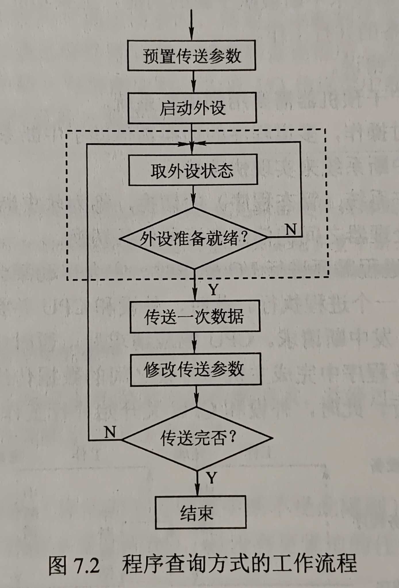
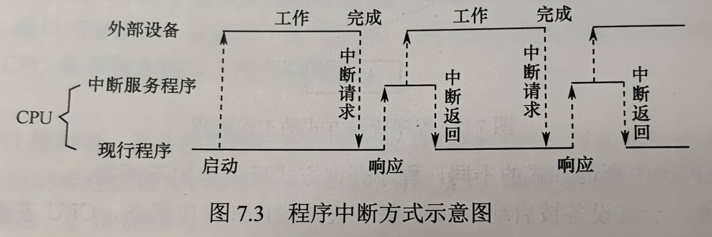
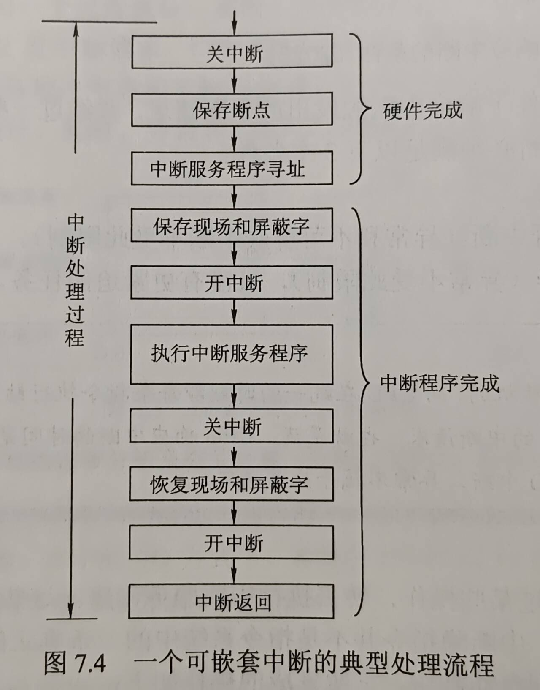
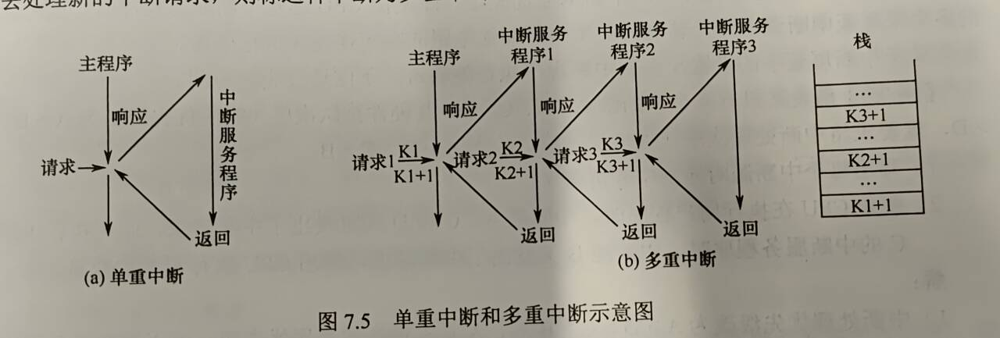
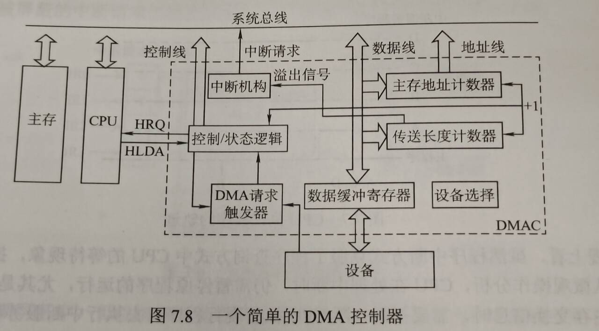

# 第七章 输入输出系统

## 目录
- [第七章 输入输出系统](#第七章-输入输出系统)
  - [目录](#目录)
- [7.1 I/O系统基本概念](#71-io系统基本概念)
  - [7.1.1 输入输出系统](#711-输入输出系统)
  - [7.1.2 外部设备](#712-外部设备)
    - [输入设备](#输入设备)
    - [输出设备](#输出设备)
    - [外部存储器（辅存）](#外部存储器辅存)
  - [7.1.3 I/O控制方式](#713-io控制方式)
- [7.2 I/O接口](#72-io接口)
  - [7.2.1 I/O接口的功能](#721-io接口的功能)
  - [7.2.2 I/O接口的基本结构](#722-io接口的基本结构)
  - [7.2.3 I/O接口的类型](#723-io接口的类型)
  - [7.2.4 I/O端口及其编址](#724-io端口及其编址)
  - [考点\&易错点](#考点易错点)

# 7.1 I/O系统基本概念

## 7.1.1 输入输出系统

- 外部设备
- 接口
- 输入设备
- 输出设备
- 外存设备
- I/O软件
- I/O硬件

## 7.1.2 外部设备

### 输入设备

- 键盘
- 鼠标

### 输出设备

- 显示器
  - 屏幕大小
  - 分辨率
  - 灰度级
  - 刷新
  - 刷新频率
  - 显示存储器
- 打印机
  - 针式打印机
  - 喷墨式打印机
  - 激光打印机

### 外部存储器（辅存）

- 磁表面存储器
- 固态硬盘（SSD）
- 光盘存储器

## 7.1.3 I/O控制方式

- 基本控制方式
  - 程序查询方式
  - 程序中断方式
  - DMA方式
  - 通道方式

# 7.2 I/O接口

- I/O接口（I/O控制器）是主机和外设之间的交接界面，通过接口可以实现主机和外设之间的信息交换
- 为了解决各种外设工作特性的差异而设置

## 7.2.1 I/O接口的功能

- I/O接口主要功能如下
  - 进行地址译码和设备选择
    - 外设的地址码
    - 设备选择信息
  - 实现主机和外设的通信联络控制
    - 时序配合，协调不同工作速度
  - 实现数据缓冲
    - 缓冲寄存器
  - 信号格式的转换
    - 电平转换
    - 并/串或串/并转换
    - 模数或数模转换
  - 传送控制命令和状态信息
    - CPU->外设：启动命令 & 反馈信息
    - 外设->CPU：中断请求 & 相应信号

## 7.2.2 I/O接口的基本结构

- I/O接口
  - 主机侧 通过I/O总线 与内存、CPU相连
- 数据缓冲寄存器
- 状态寄存器
- 控制寄存器
- 线上传输的内容
  - 数据线：读/写数据、状态信息、控制信息、中断类型号
  - 地址线：访问I/O接口中的寄存器的地址
  - 控制线：读/写控制信号；中断请求、响应信号、仲裁信号、握手信号
- I/O指令是一种特权指令

## 7.2.3 I/O接口的类型

- 数据传送方式
  - 并行接口
  - 串行接口
- 访问I/O设备的控制方式
  - 程序查询接口
  - 中断接口
  - DMA接口等
- 功能选择的灵活性
  - 可编程接口
  - 不可编程接口

## 7.2.4 I/O端口及其编址

- I/O端口：I/O接口电路中可被CPU直接访问的寄存器
  - 数据端口
    - CPU能对数据端口中数据读/写操作
  - 状态端口
    - CPU对端口中的外设状态只能读操作
  - 控制端口
    - 控制命令只能进行写操作
- I/O端口的编址方式有与存储器**独立编址**和**统一编址**两种
- 独立编址
  - I/O端口数比主存单元数少得多，只需少量地址线，I/O端口译码简单，寻址速度更快。使用专用I/O指令，程序更清晰
  - I/O指令少，只提供简单的传输操作，设计灵活性差；CPU还需提供存储器读/写、I/O设备读/写两组控制信号，增大了控制复杂性
- 统一编址
  - 不需要专门I/O指令，CPU访问I/O操作更灵活方便，端口有较大编址空间。访问保护机制可由虚拟存储管理系统实现
  - 占据部分主存地址空间，主存可用容量变小。识别I/O端口时，全部地址线都需要译码，译码电路更复杂

## 考点&易错点

- CPU和主存 —— 系统总线 —— I/O接口 —（设备侧、接口电缆）—> 通信总线（电缆）—— 外设
- I/O接口含有 控制寄存器、状态寄存器、数据缓冲寄存器
- 搞清中断请求是设备（或I/O接口）发送给CPU的，并不在设备与I/O接口中发送
- I/O总线的数据线上传输的信息包括
  - I/O接口中的命令字
  - I/O接口中的状态字
  - 中断类型号

# 7.3 I/O方式

即不同的控制方式：程序查询、程序中断和DMA等

## 7.3.1 程序查询方式

- CPU执行程序实现

- 接口中设置一个数据缓冲寄存器（数据端口）和一个设备状态寄存器（状态端口），主机I/O时读取状态并根据状态决定下一步操作

  

- 分类
  - 独占查询：CPU 100%，CPU和外设串行工作
  - 定时查询：周期性查询，条件满足才进行数据传送
    - 计算题：
      - 外设准备数据时间：数据缓冲寄存器容量/外设数据率 = 32bit / 2MB/s = 2us
      - 所以最多2us就得查询一次
        - 得出每秒查询次数
      - 然后计算外设I/O占用CPU总时间百分比
        - 每秒所需要的I/O时间 = 每次I/O执行指令条数xCPIx查询次数 （时钟周期）
        - 百分比 = I/O时间 / CPU主频
- 优点：设计简单，硬件量少
- 缺点：花费很多时间查询等待，一段时间只能和一台外设交换信息，串行工作效率低

## 7.3.2 程序中断方式

### 基本概念

- 软中断：应用程序和操作系统的切换

- 思想：当前进程需要I/O操作时，启动某台外设，并阻塞当前进程，然后CPU从就绪队列选另一个进程执行。此时外设和CPU并行工作，外设完成数据传送的准备工作后，主动向CPU发中断请求，CPU响应请求后，转去执行中断服务程序，在中断服务程序中完成主机与外设的数据传送。完成后转回最开始被中止的进程的断点处继续执行

​	

- 计算题：判断能否采用中断I/O方式？
  - 计算中断响应和中断处理时间：可能给出所用时间周期数，然后计算时间
  - **比较**：准备数据时间 和 中断响应与中断处理时间
    - 若准备数据时间小，则数据被刷新，造成丢失
    - 大则可采用中断I/O方式

### 工作流程

- 中断请求

  - 中断源，一台计算机允许多个中断源
  - 每个中断源设置 **中断请求标记触发器**，为1时表示有请求
  - 可屏蔽中断、不可屏蔽中断

- 中断响应判优

  - 中断响应优先级 —— 硬件排队实现
  - 不可屏蔽中断 > 可屏蔽中断
  - 高速设备 > 低速；输入 > 输出；实时 > 普通

- CPU响应中断条件（所以说一般中断并不是强行打断，而是CPU空闲了可以转来做这个）

  - 中断源有中断请求
  - CPU允许中断及开中断（异常和不可屏蔽中断不受此限制）
  - 一条指令执行完毕（异常不受此），且无更紧迫任务

- 中断响应过程

  - CPU响应中断后，经过某些**操作**转去执行中断服务程序，这些操作由硬件直接实现，称为**中断隐指令**，并不是OS真是指令，而是硬件的一系列操作，如下
    1. 关中断。保护程序断点和现场信息
    2. 保存断点。保存在栈或者特定寄存器中（PC和PSW）
       - 中断的断点是下一条
       - 异常的断点是本条（因为没执行成功需要重新执行）
    3. 引出中断服务程序。识别中断源，对于服务程序的入口地址送入PC。识别中断源两种方法
       - 硬件向量法（本节主要讨论，最常用）
       - 软件查询法

- 中断向量

  - 中断向量：每个中断服务程序入口地址
  - 中断向量表：存放中断向量的存储区
  - 中断类型号计算中断向量的地址，根据地址从中断向量表取出入口地址送入PC
  - 中断请求和响应信号在I/O总线的**控制线**上传输；CPU响应中断后，从**数据线**上获取中断源的中断类型号

- 中断处理过程

  

  - 单级中断则去掉中间的一组开中断和关中断，不需要实现中断嵌套

### 多重中断和中断屏蔽技术

- 中断处理优先级
- 中断屏蔽技术动态调整中断服务程序的优先级，设置**中断屏蔽字寄存器**来实现，每个中断源对于中断字寄存器中一位
- 中断屏蔽字：中断屏蔽字寄存器的内容
- 中断屏蔽字寄存器内容只有执行中断服务程序时才会更新，中断屏蔽只在CPU运行中断服务程序时才有用，并不能改变CPU运行主程序时的中断响应优先级
- 中断屏蔽字：每个中断源在中断时都可以设置它自己的中断屏蔽字，比它**处理优先级**高的设0，自己或是优先级低的设1
- 区分**响应优先级**和**处理优先级**

## 7.3.3 DMA方式

- 完全由硬件成组信息传送的控制方式，具有程序中断方式的优点：数据准备阶段CPU与外设并行工作
- DMA在外设与内存间开辟一条**直接数据通路**；**直接存储器存取方式**
- 适合磁盘、显卡、声卡、网卡等高速设备的大批量数据传送，硬件开销较大
- DMA中，中断作用仅限于故障和正常传送结束时的处理

### 特点

1. 主存与CPU的固定联系脱钩，现在主存也可以被外设访问了
2. 数据块传送时，主存地址的确定、传送数据的计数都由硬件电路直接实现
3. 主存开辟专用缓冲区，即使提供和接收外设的数据
4. DMA传送速度快，CPU和外设并行工作
5. 传送开始前需要程序预处理、接收后通过中断方式后处理

### DMA控制器的组成

- DMA控制器即DMA接口

  

- 主要功能

- 主要结构
  - 主存地址计数器：存放要交换数据的主存地址；++直至完毕
  - 传送长度计数器：记录传送数据的总长度；--直至0
  - 数据缓冲寄存器：DMA接口与主存间单位为字；DMA与设备之间传送单位为字节或位
  - “控制/状态”逻辑：指定传送方向，修改传送参数，并对DMA请求信号、CPU响应信号进行协调同步
  - 中断机构：数据传送完成后触发，向CPU提出中断请求
- DMA必须具有控制系统总线的能力

### DMA传送方式

1. 停止CPU访存
2. 周期挪用
   - I/O访存优先级高于CPU访存（I/O不立即访存就可能丢失数据），因此I/O设备挪用一个存取周期，传送完一个数据字后立即释放总线，单字传送方式
3. DMA与CPU交替访存
   - CPU工作周期分为两个时间片
     - 适用于CPU工作周期比主存存取周期长
     - 例如CPU工作周期1.2us，主存<0.6us，那么分为两个周期C1、C2
     - 总线使用权通过C1、C2分时使用
4. DMA效率分析、计算
   - 计算外设每秒DMA次数
   - 只有预处理后处理需要占用CPU时间
   - 然后算出占用时间，进而得出占用CPU总时间百分比

### DMA传送过程

- 预处理
- 数据传送
- 后处理

### DMA方式和中断的区别

- 中断方式是程序的切换，需要保护和恢复现场；而DMA方式不中断现行程序，无需保护限长
- 对中断请求的响应只能发生在**每条指令**执行结束后；DMA请求响应可以发生在任一**机器周期**结束（取值、间址、执行周期后均可）
- 中断传送过程需要CPU干预；DMA传送不需要

- DMA请求优先级高于中断优先级
- 中断具有处理异常事件能力；DMA方式仅限于大批数据传送
- 数据传送方式：中断靠程序；DMA靠ying'jian
