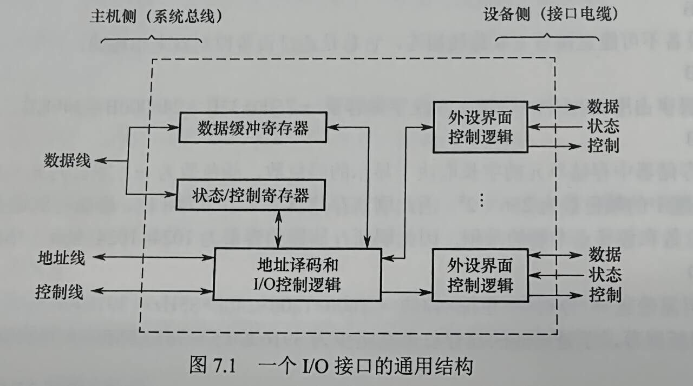

# 第七章 输入输出系统

## 目录
- [第七章 输入输出系统](#第七章-输入输出系统)
  - [目录](#目录)
- [7.1 I/O系统基本概念](#71-io系统基本概念)
  - [7.1.1 输入输出系统](#711-输入输出系统)
  - [7.1.2 外部设备](#712-外部设备)
    - [输入设备](#输入设备)
    - [输出设备](#输出设备)
    - [外部存储器（辅存）](#外部存储器辅存)
  - [7.1.3 I/O控制方式](#713-io控制方式)
- [7.2 I/O接口](#72-io接口)
  - [7.2.1 I/O接口的功能](#721-io接口的功能)
  - [7.2.2 I/O接口的基本结构](#722-io接口的基本结构)
  - [7.2.3 I/O接口的类型](#723-io接口的类型)
  - [7.2.4 I/O端口及其编址](#724-io端口及其编址)
  - [考点\&易错点](#考点易错点)

# 7.1 I/O系统基本概念

## 7.1.1 输入输出系统

- 外部设备
- 接口
- 输入设备
- 输出设备
- 外存设备
- I/O软件
- I/O硬件

## 7.1.2 外部设备

### 输入设备

- 键盘
- 鼠标

### 输出设备

- 显示器
  - 屏幕大小
  - 分辨率
  - 灰度级
  - 刷新
  - 刷新频率
  - 显示存储器
- 打印机
  - 针式打印机
  - 喷墨式打印机
  - 激光打印机

### 外部存储器（辅存）

- 磁表面存储器
- 固态硬盘（SSD）
- 光盘存储器

## 7.1.3 I/O控制方式

- 基本控制方式
  - 程序查询方式
  - 程序中断方式
  - DMA方式
  - 通道方式

# 7.2 I/O接口

- I/O接口（I/O控制器）是主机和外设之间的交接界面，通过接口可以实现主机和外设之间的信息交换
- 为了解决各种外设工作特性的差异而设置

## 7.2.1 I/O接口的功能

- I/O接口主要功能如下
  - 进行地址译码和设备选择
    - 外设的地址码
    - 设备选择信息
  - 实现主机和外设的通信联络控制
    - 时序配合，协调不同工作速度
  - 实现数据缓冲
    - 缓冲寄存器
  - 信号格式的转换
    - 电平转换
    - 并/串或串/并转换
    - 模数或数模转换
  - 传送控制命令和状态信息
    - CPU->外设：启动命令 & 反馈信息
    - 外设->CPU：中断请求 & 相应信号

## 7.2.2 I/O接口的基本结构

- I/O接口
  - 主机侧 通过I/O总线 与内存、CPU相连
- 数据缓冲寄存器
- 状态寄存器
- 控制寄存器
- 线上传输的内容
  - 数据线：读/写数据、状态信息、控制信息、中断类型号
  - 地址线：访问I/O接口中的寄存器的地址
  - 控制线：读/写控制信号；中断请求、响应信号、仲裁信号、握手信号
- I/O指令是一种特权指令

## 7.2.3 I/O接口的类型

- 数据传送方式
  - 并行接口
  - 串行接口
- 访问I/O设备的控制方式
  - 程序查询接口
  - 中断接口
  - DMA接口等
- 功能选择的灵活性
  - 可编程接口
  - 不可编程接口

## 7.2.4 I/O端口及其编址

- I/O端口：I/O接口电路中可被CPU直接访问的寄存器
  - 数据端口
    - CPU能对数据端口中数据读/写操作
  - 状态端口
    - CPU对端口中的外设状态只能读操作
  - 控制端口
    - 控制命令只能进行写操作
- I/O端口的编址方式有与存储器**独立编址**和**统一编址**两种
- 独立编址
  - I/O端口数比主存单元数少得多，只需少量地址线，I/O端口译码简单，寻址速度更快。使用专用I/O指令，程序更清晰
  - I/O指令少，只提供简单的传输操作，设计灵活性差；CPU还需提供存储器读/写、I/O设备读/写两组控制信号，增大了控制复杂性
- 统一编址
  - 不需要专门I/O指令，CPU访问I/O操作更灵活方便，端口有较大编址空间。访问保护机制可由虚拟存储管理系统实现
  - 占据部分主存地址空间，主存可用容量变小。识别I/O端口时，全部地址线都需要译码，译码电路更复杂

## 考点&易错点

- CPU和主存 —— 系统总线 —— I/O接口 —（设备侧、接口电缆）—> 通信总线（电缆）—— 外设
- I/O接口含有 控制寄存器、状态寄存器、数据缓冲寄存器
- 搞清中断请求是设备（或I/O接口）发送给CPU的，并不在设备与I/O接口中发送
- I/O总线的数据线上传输的信息包括
  - I/O接口中的命令字
  - I/O接口中的状态字
  - 中断类型号
