# 第一章 计算机网络体系结构

## 目录

- [第一章 计算机网络体系结构](#第一章-计算机网络体系结构)
  - [目录](#目录)
- [1.1 计网概述](#11-计网概述)
  - [1.1.1 计网概念](#111-计网概念)
    - [计网组成功能](#计网组成功能)
      - [组成](#组成)
      - [功能](#功能)
    - [1.1.3 三种数据交换](#113-三种数据交换)
      - [报文交换](#报文交换)
      - [电路交换](#电路交换)
      - [分组交换](#分组交换)
    - [三种交换方式性能对比](#三种交换方式性能对比)
      - [电路交换性能分析](#电路交换性能分析)
      - [报文交换性能分析](#报文交换性能分析)
      - [分组交换性能分析](#分组交换性能分析)
      - [交换方式总结对比](#交换方式总结对比)
    - [计算机网络的分类](#计算机网络的分类)
      - [分布范围](#分布范围)
      - [传输技术](#传输技术)
    - [拓扑结构](#拓扑结构)
    - [计网性能指标](#计网性能指标)
      - [速率](#速率)
      - [带宽](#带宽)
      - [吞吐量](#吞吐量)
      - [时延](#时延)
      - [时延带宽积](#时延带宽积)
      - [RTT](#rtt)
      - [信道利用率](#信道利用率)
- [1.2 计网体系结构](#12-计网体系结构)

# 1.1 计网概述

## 1.1.1 计网概念

**计算机网络 vs internet（互连网） vs Internet（互联网）**

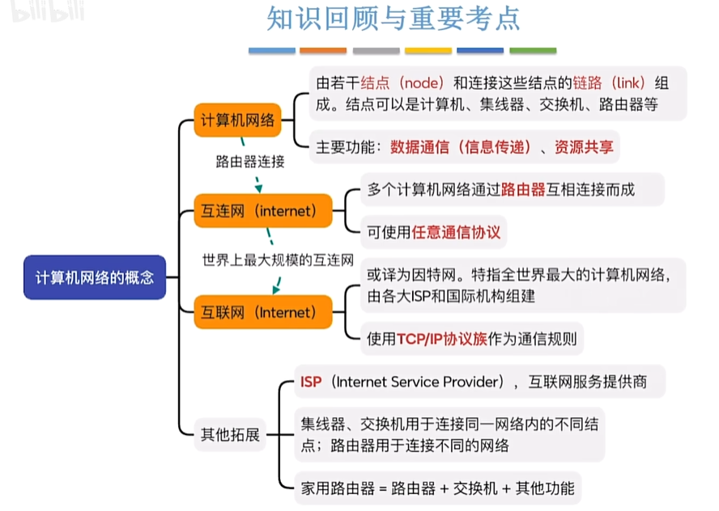

集线器：多个结点连接起来组成一个计算机网络（现在使用的是交换机，多个结点连接起来）

交换机：多结点连接，组成一个计算机网络

路由器：连接多个计算机网络 —— 互**连**网

- 家用路由器：路由器（连接外部网络） + 交换机（有线&无线链路）

ISP（Internet Service Provider）：互联网服务提供商

- 互连网可以任意协议通信，互联网必须使用TCP/IP协议通信

光猫：调制解调器

### 计网组成功能

#### 组成

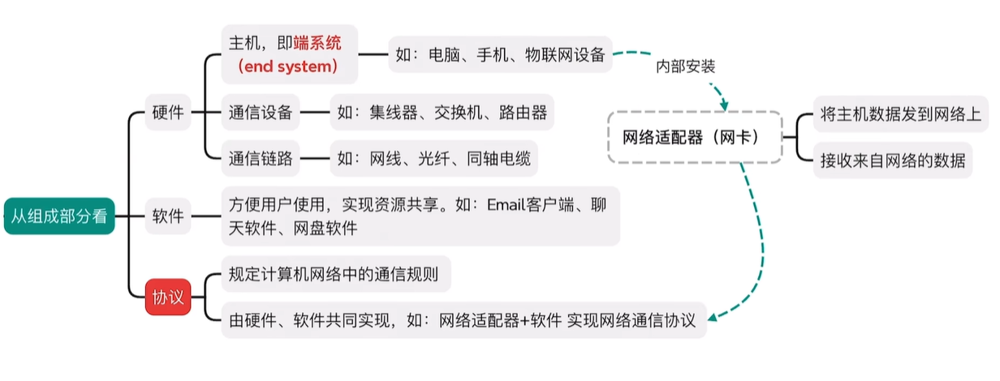

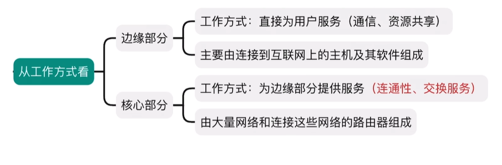

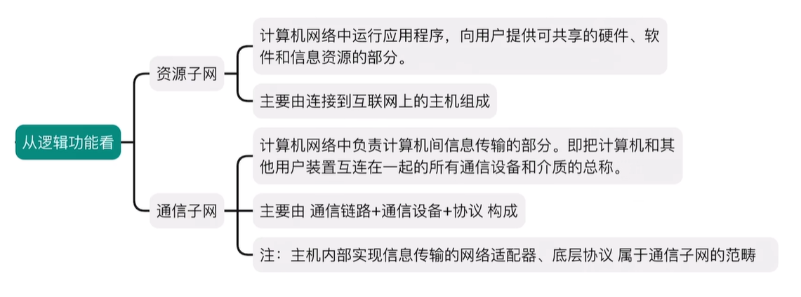

#### 功能

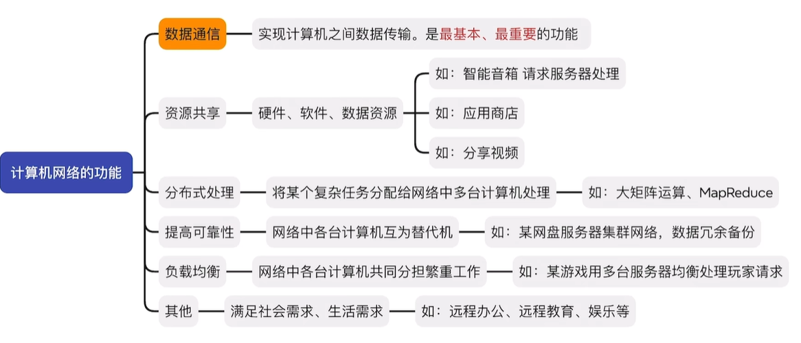

### 1.1.3 三种数据交换

#### 报文交换

电报网络：控制信息+用户数据 = 报文（message）

分析控制信息，通过报文交换机传递，存储转发

优点：

- 通信前无需建立连接
- 报文为单位存储转发，灵活分配
- 无需独占，线路利用率高
- 支持差错控制

缺点：

- 报文不定长，不方便存储转发管理
- 长报文存储转发时间开销大、缓存开销大
- 长报文容易出错，重传代价高

#### 电路交换

1. 建立连接（尝试占用通信资源）
2. 通信（一直占用通信资源） —— 以前打长途电话更贵一些
3. 释放连接（归还通信资源）

优点：

- 双方独占线路资源，传输速率高
- 适用于低频次，大量传输数据

缺点：

- 建立/释放连接，需要额外时间开销
- 双方独占，利用率低
- 线路分配灵活性差（出故障难解决）
- 中间交换节点，不支持差错控制
- 计算机之间的传输往往是突发式传输，高频次、少量传输数据

#### 分组交换

长报文 -> 定长分组，解决了报文交换的问题

分组控制信息

- 源地址
- 目的地址
- 分组号 —— 保证数据顺序

优点：

- 继承报文交换优点
- 分组定长，方便存储转发管理
- 分组存储转发时间开销小、缓存开销小
- 不易出错，重传代价低

缺点：

- 控制信息占比增加（增加不会特别多）
- 存在存储转发时延
- 报文拆分多分组，可能出现分组失序、丢失等问题，增加处理的复杂度（这个交给终端来解决，因为有强大的算力，可以降低网络核心的时延）

**补充虚电路交换**

1. 建立连接（虚拟电路）
2. 通信（按既定路线发送，但不独占线路）
3. 释放连接

### 三种交换方式性能对比

连接建立、数据传送、连接释放

#### 电路交换性能分析

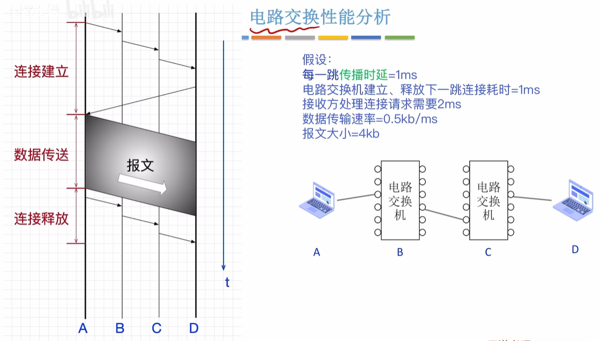

图中每小格 1ms

#### 报文交换性能分析

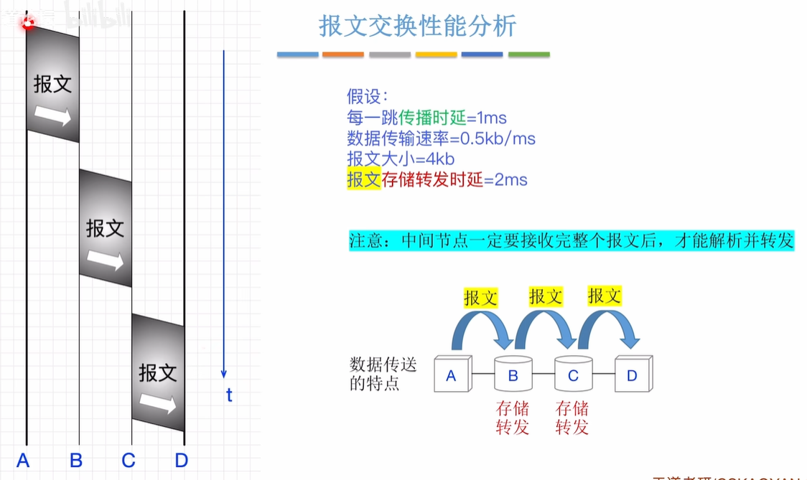

完整接收后才能解析转发 —— 需要校验/其他检查

#### 分组交换性能分析

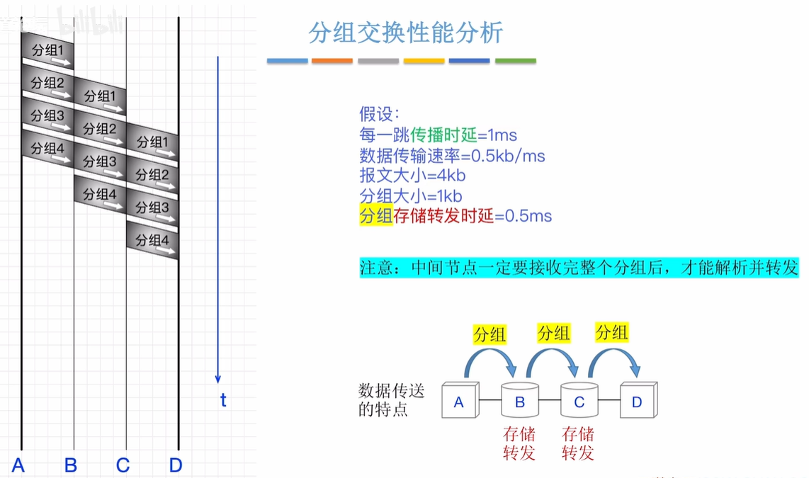

小心这里时间的计算，自己要会画这个流水线图

#### 交换方式总结对比

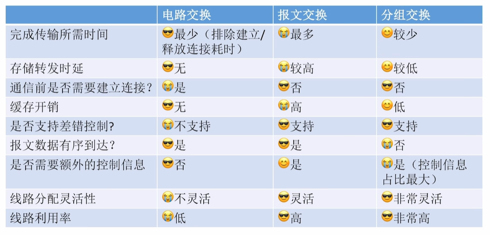

考试要会画这个图

### 计算机网络的分类

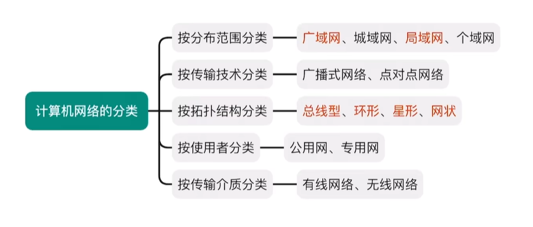

#### 分布范围

如今局域网几乎都是以太网技术实现，以太网几乎成局域网代名词

**WAN**，**LAN**，PAN（无线技术，蓝牙etc.）

局域网通过路由器接入广域网

#### 传输技术

广播：检查分组地址决定是否接收

点对点：精准送达 —— 路由器间

### 拓扑结构

总线形：广播式传播，总线争用

- 集线器连接的设备，物理上星形，逻辑上总线型

环形：广播式，令牌解决总线争用，顺环形依次传递，拿到令牌者可使用总线

- 令牌环网

星型：中央设备点对点传输，不存在总线争用

- 以太网**交换机**，物理逻辑上都是星型

---

网状：点到点

- 分组交换，广域网

### 计网性能指标

信道Channel：表示向某一方向传送信息的通道（信道 != 通信线路）

- 一条通信线路逻辑上对应一条发送信道 + 一条接收信道

#### 速率

连接到网络上的节点在信道上传输数据的速率，数据率/比特率/**数据传输速率**

单位：bps=b/s=b/s，1B=8b，k=10^3 M=10^6 G=10^9 T=10^12

- 小心区别计组，OS，它们是2^10, 20, 30, 40

#### 带宽

某信道所能传送最高数据率，下行信道、上行信道

- 节点间通信实际能达到的最高速率，由带宽、节点性能共同限制

- 单位：bps

通信原理中：带宽——允许通过的信号频带范围，单位Hz

带宽都表示信道传输数据能力，越大越强

#### 吞吐量

单位时间通过某个网络（或信道/接口）的实际数据量

很少考

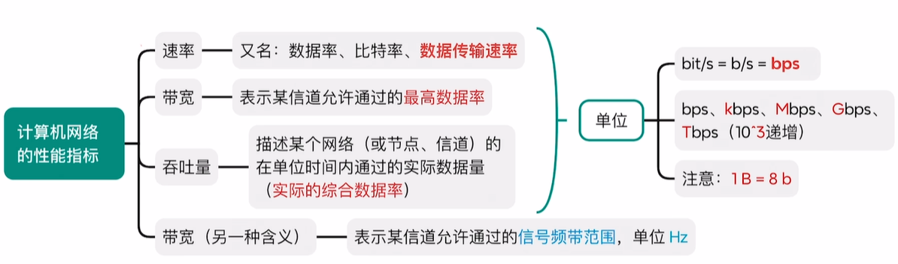

#### 时延

一段到另一端所需时间

总时延 = 传输时延/发送时延 + 传播时延 + （处理时延+排队时延 *考试一般不考*）

- 传输时延：数据传输用时
- 传播时延：电磁波传播用时
- 输入队列、输出队列（作为缓冲区）

#### 时延带宽积

**传播时延** x 带宽：与信道长度、电磁波传播速度有关

- 已发出但尚未到达的的最大比特数
- 用于设计最短帧长

#### RTT

往返时延：发送发**发送完** 到 发送方接收到接收方的确认总时间

RTT = 发送传播时延 + 处理时延 + 确认发送/传输时延 + 确认传播时延

- **发送方的传输时延**不应计入

#### 信道利用率

某个信道有百分之多少时间有数据通过

信道利用率 = 有 /（有+无）

- 不能太低，浪费资源
- 不能太高，易造成拥塞

# 1.2 计网体系结构