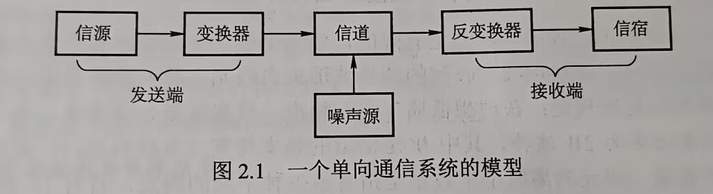

# 第二章 物理层

## 目录

- [第二章 物理层](#第二章-物理层)
  - [目录](#目录)
- [2.1 通信基础](#21-通信基础)
  - [2.1.1 基本概念](#211-基本概念)
    - [数据、信号和码元](#数据信号和码元)
    - [信源、信道与信宿](#信源信道与信宿)
    - [速率、波特与带宽](#速率波特与带宽)
  - [2.1.2 信道的极限容量](#212-信道的极限容量)
    - [奈奎斯特定理（奈氏准则）](#奈奎斯特定理奈氏准则)
    - [香农定理](#香农定理)
  - [2.1.3 编码与调制](#213-编码与调制)
    - [数字数据-\>数字信号](#数字数据-数字信号)
    - [模拟数据-\>数字信号](#模拟数据-数字信号)
    - [数字数据-\>模拟信号](#数字数据-模拟信号)
    - [模拟数据-\>模拟信号](#模拟数据-模拟信号)
  - [考点\&易错点](#考点易错点)
- [2.2 传输介质](#22-传输介质)
  - [2.2.1 双绞线、同轴电缆、光纤与无线传输介质](#221-双绞线同轴电缆光纤与无线传输介质)
    - [双绞线](#双绞线)
    - [同轴电缆](#同轴电缆)
    - [光纤](#光纤)
    - [无线传输介质](#无线传输介质)
  - [2.2.2 物理接口的特性](#222-物理接口的特性)
  - [考点\&易错点](#考点易错点-1)
- [2.3 物理层设备](#23-物理层设备)
  - [2.3.1 中继器](#231-中继器)
  - [2.3.2 集线器](#232-集线器)
- [2.4 本章小结及疑难点](#24-本章小结及疑难点)

# 2.1 通信基础

## 2.1.1 基本概念

### 数据、信号和码元

- **数据**：传送信息的实体
- **信号**：数据在传输过程中存在的形式（如数据的电气、电磁表现）
  - 数据和信号都有*模拟*和*数字*两种形式
    - 模拟数据/模拟信号：取值是连续的
    - 数字数据/数字信号：取值是离散的
- 固定时长的信号波形表示k进制数，时长内的信号称为**码元**（可称为k进制码元）
  - 该时长称为 码元宽度（信号周期）
  - 1码元可携带若干比特信息量

### 信源、信道与信宿
数据通信系统划分为三个部分：
- **信源**：产生和发送数据的源头
- **信宿**：接收数据的终点——通常是计算机或其他数字终端装置
- **信道**：信号传输的介质，双向通信的线路包含一条发送信道和一个接收信道
- 单向通信系统模型：  
    
  - 噪声源：信道上噪声及系统其他各处噪声的集中表示
- 信道分类
  - 传输信号形式：模拟信道、数字信道
  - 传输介质：有线信道、无线信道
- 信号分类
  - 基带信号：信源发出的未经调制的原始电信号 —— 信道中之间传送基带信号时，称为*基带传输*
  - 宽带信号：经过调制形成的*频分复用模拟信号* —— *宽带传输*
- 数据传输方式
  - **串行传输**：数据逐比特按顺序依次传送
    - 适用于长距离通信，如计算机网络
  - **并行传输**：若干比特 多个信道 同时传输
    - 短距离，计算机内部，CPU和主存
- 按双方信息交互方式
  - 单向通信：一个方向通信，如电视广播、无线电广播 —— 一个信道
  - 半双工通信：双方发送接收，不可同时 —— 两个信道
  - 全双工通信：双方可同时发送接收 —— 两个信道

### 速率、波特与带宽
- **速率**：单位时间内传输的数据量
  - 码元传输速率（波特率、调制速率）：每秒传输的码元数
    - 单位：波特（Baud）
    - 可多进制也可以二进制，码元速率与进制无关
  - 信息传输速率（比特率）：每秒传输的比特数
    - 单位：比特每秒（b/s）
  - 二者关系：码元携带n比特信息量
    - M Baud = M × n b/s
- 带宽：
  - 在模拟信号系统中
    - 某个信道能够传输的频率范围，最高最低频率之差
    - 单位：赫兹（Hz）
  - **在计算机网络中**
    - 为网络的通信线路所能传输数据的能力（最高数据率）
    - b/s

## 2.1.2 信道的极限容量

### 奈奎斯特定理（奈氏准则）
- 信号中许多高频分量不能通过信道，否则传输中就会衰减，导致接收端收到的信号失去码元之间的清晰界限——**码间串扰**
- 奈奎斯特定理：理想低通（没有噪声，带宽有限）信道中，极限码元传输速率为*2W波特*，
  - W为信道带宽（Hz）
  - 若用V表示每个码元离散电平数量——V种不同的码元
  - 极限数据传输速率为 `2W log_2 V b/s`
  - 有如下结论
    - 任何信道中，码元传输速率有上限
    - 信道带宽越大，传输码元能力越强
    - 给出码元传输速率限制，但并未给出信息传输速率限制
  - 得出：要提高数据传输速率，就要设法使**每个码元携带更多比特**的信息量，采用**多元制**的调制方法

### 香农定理
- 香农定理给出**带宽受限且有高斯噪声干扰的信道**极限数据传输速率，使用该速率传输数据时，不会产生误差
  - 信道极限传输速率 = Wlog_2(1 + S/N) b/s
  - W为信道带宽（Hz）
  - S为信号平均功率
  - N为信道内高斯噪声功率
  - S/N为信噪比
- 信噪比两种记法
  - 无单位记法：S/N —— 使用香农定理计算信道极限传输速率时，应采用无单位记法
  - 分贝记法：10log_10(S/N) dB
- 香农定理结论
  - 信噪比越大，极限传输速率越高
  - 一定传输带宽和一定信噪比，信息传输速率上限是确定的
  - 信息传输速率低于信道极限传输速率，就能找到方法实现 **无差错传输**
  - 实际信道能达到传输速率 比 极限信息传输速率 低不少

- 奈氏准则和香农定理的对比分析
  - 奈氏只考虑了**带宽** -> 极限码元传输速率
  - 香农定理考虑**带宽**、**信噪比** -> 极限信息传输速率
  - 从另一个侧面表明，码元可以携带的比特数是有限的

## 2.1.3 编码与调制
- **编码**：数据转换成数字信号的过程
- **调制**：数据转换成模拟信号的过程  
  |转换工具|数字数据|模拟数据|
  |--|--|--|
  |数字信号|数字发送器|PCM编码器|
  |模拟信号|调制器|放大器调制器|

形成如下4种编码与调制方式
### 数字数据->数字信号
- 用于基带传输中，基本不改变数字数据信号频率下直接传输
- 具体用什么数字信号表示0/1就是**编码**（只要能有效区分0/1即可）
  - 归零（RZ）编码：每个码元中间均跳到0电平
    - 接收方根据跳变（正/负->0）调整本方时钟基准，**提供同步机制**
    - 归零占用一定带宽，传输效率受影响
  - 非归零（NRZ）编码：一个时钟全部用来传输数据
    - 编码效率最高
    - 但双方存在 **同步问题**，双方需带有时钟线
  - 反向非归零（NRZI）编码：电平跳变表示0，不变表示1
    - 通知机制
    - 能传输时钟信号，又尽量不损失系统带宽（？保持不变的时候如何确定1序列长度呢）
    - USB2.0采用NRZI编码
  - 曼彻斯特编码：每个码元中间都发生电平跳变（电平跳变传输时钟&数据信号）
    - 既作为时钟信号（用于同步）
    - 又作为数据信号，向下跳变表示1，向上跳变表示0（or相反）
    - 理解：每个码元中根据1、0有自己的形状，同时码元边界只要给它们连起来就行
  - 差分曼彻斯特编码：每个码元中间都发生电平跳变（电平跳变仅传输时钟信号）
    - 电平跳变仅表示时钟信号——**抗干扰能力强**
    - 数据表示：每个码元开始处有无电平跳变，无跳变1，跳变0
- 标准以太网使用曼彻斯特编码；差分曼彻斯特编码广泛用于宽带高速网中

### 模拟数据->数字信号
三个步骤，采样、量化、编码（常用于音频信号编码的PCM编码）：
- 采样：对模拟信号周期性扫描，时间上连续信号->时间上离散信号
  - 采样频率 >= 模拟信号最大频率两倍（奈氏准则）
- 量化：电平幅值按一定分级标度转换为对应数值并取整
- 编码：量化得到离散整数 -> 对应二进制编码

### 数字数据->模拟信号
- 数字数据调制技术
  - 发送端：数字信号 -> 模拟信号 —— 调制
  - 接收端：模拟信号 -> 数字信号 —— 解调
- 各种数字调制方法
  - 调幅（AM）或**幅**移键控（ASK）
    - 有载波1，无载波0
    - 容易实现；抗干扰差
  - 调频（FM）或**频**移键控（FSK）
    - 频率f1表示1，f2表示0
    - 容易实现；抗干扰能力强
  - 调相（PM）或**相**移键控（PSK）
    - 相位0表示1，相位pi表示0
    - 绝对调相方式
  - 正交幅度调制（QAM）
    - 频率相同前提，结合AM和PM，形成叠加信号
    - 波特率B，采用m个相位，每个相位n种振幅
    - 则QAM传输速率 R=Blog2(mn) b/s

### 模拟数据->模拟信号
- 为实现传输有效性，可能需要较高频率
- 频分复用技术
- 电话局&本地交换机使用

## 考点&易错点
- 一条可通信电路可能有有俩信道：一个发送信道和一个接收信道

- 曼彻斯特编码主要原因：实现对收发双方的同步控制

- 计算机网络中 kb/s = 1000 b/s

- 通信速率的计算
  - 牢记：三条计算公式
    - 奈氏公式 2Wlog_2 V （无噪声）
    - 香农公式 Wlog_2(1 + S/N) （有噪声）
    - QAM公式 R=Blog_2(mn) （调制）
  - 观察题目：
    - 是否有噪声？（x2 或者 log_2(1 + S/N)）
    - 是否是QAM调制？（Blog_2(mn)，无噪声时B=2W）
      - QAM-64表示mn=64
    - 或者考虑最大传输速率（奈和香中选小的那个）
    - 得到带宽W（或是采样率或是码元速率或是波特率）
      - 小心它给范围，范围就是**带宽=最大频率-最小频率**，而不是最大频率

- 通信编码方式及对应波形

# 2.2 传输介质

## 2.2.1 双绞线、同轴电缆、光纤与无线传输介质
- **传输介质**也称**传输媒体**，是数据传输系统中发送器和接收器之间的物理通路
- 传输介质分类
  - 导向传输介质，电磁波被导向为沿固体介质传播
    - 铜线、光纤
  - 非导向传输介质，电磁波在空间中传播 —— 电磁波在其中的传输称为无线传输

### 双绞线
- STP、UTP

### 同轴电缆

### 光纤
- 10^8MHz，带宽极大  
- 多模光纤、单模光纤
- 特点
  - 通信容量巨大
  - 传输损耗小，中继距离长，远距离传输特别经济
  - 抗雷电、电磁干扰好
  - 无串音干扰，保密性好，不易被窃听或截取数据
  - 体积小重量轻

### 无线传输介质
- 无线电波
- 微波、红外线、激光

## 2.2.2 物理接口的特性
- 物理层考虑如何在传输介质上传输比特流，物理层应尽可能屏蔽传输介质的差异

- 物理层主要任务：确定与传输介质的接口有关的一些特性
  - 机械特性：接口使用接线器的形状尺寸、引脚数量和排列、固定和锁定装置
  - 电气特性：电压范围、传输速率和距离限制
  - 功能特性：某条线上某一电平的电压的意义，及每条线的功能

## 考点&易错点
- 传统以太网使用广播的方式发送信息，因此主机间通信方式是半双工通信

- 同轴电缆具有更高屏蔽性、抗噪声性

# 2.3 物理层设备

## 2.3.1 中继器
- 中继器主要功能
  - 放大、整形并转发信号
  - 消除信号经过一长段电缆后产生的失真和衰减，使信号的波形和强度达到所需要求
  - 从而扩大网络传输的距离
- 原理：信号再生（而非简单地放大/衰减）
- 有两个端口，一个输入一个发出，端口仅作用于信号的电气部分，对内容不做任何处理
- 使用中继器连接的几个网段仍是一个局域网 —— 中继器两端网络部分是网段而不是子网
  - 所以中继器出故障，相邻两网段都受影响
- **若某网络设备无存储转发功能，那么认为它不能连接两个不同的协议**
  - 中继器无存储转发功能，它连接差速的网段，会使两个网段都只能工作在低速率上
- 5-4-3规则
  - 互相串联的中继器数量不能超过4个
  - 互相串联的网段数量不能超过5个
  - 5段通信介质中，只有3段可以挂接计算机（其余只能作扩展通信范围的链路段）

## 2.3.2 集线器
- 集线器（Hub）是一个多端口中继器
  - 一个端口接收数据，将数据整形放大后，转发到其他所有处于工作状态的端口
  - 同样只起信号放大和转发作用
  - 目的是扩大网络传输范围，不具备信号定向传送能力，信息传输方向是固定的 —— 共享式设备
- Hub组网灵活，是共享式网络，但**逻辑上仍是总线网**
  - Hub只能在半双工状态下工作
  - Hub每个端口连接的是统一网络的不同网段
- 集线器不能分割冲突域，所有端口属于同一个冲突域

# 2.4 本章小结及疑难点
1. 传输介质时物理层吗？传输介质和物理层主要区别？
   - 传输介质不是物理层，在物理层下面，有时称它第0层
   - 比特流在物理层传播，信号在传输介质上传播，信号是比特流的载体
2. 什么是基带传输、频带传输和宽带传输？三者区别？
   - 基带传输：不经调制就直接传输
   - 频带传输：用数字信号对特定频率的载波进行调制（数字调制），变成适合传送的信号再传输
     - 数字信号远距离传输必须采用频带传输技术传输
     - 解决了电话系统传输数字信号的问题，还实现了多路复用
   - 宽带传输：借助频带传输，将链路分解成两个或多个信道，每个信道携带不同信号
     - 如对信道频分复用，划分为两个互不相关子信道
3. 奈氏准则和香农定理主要区别？这俩对数据通信的意义是什么？
   - 注意其中带宽单位都是Hz
4. 信噪比S/N，为什么还要取对数10log_10(S/N) dB？
   - 分贝对于表示特别大或特别小的数值方便很多，在通信领域用得很广