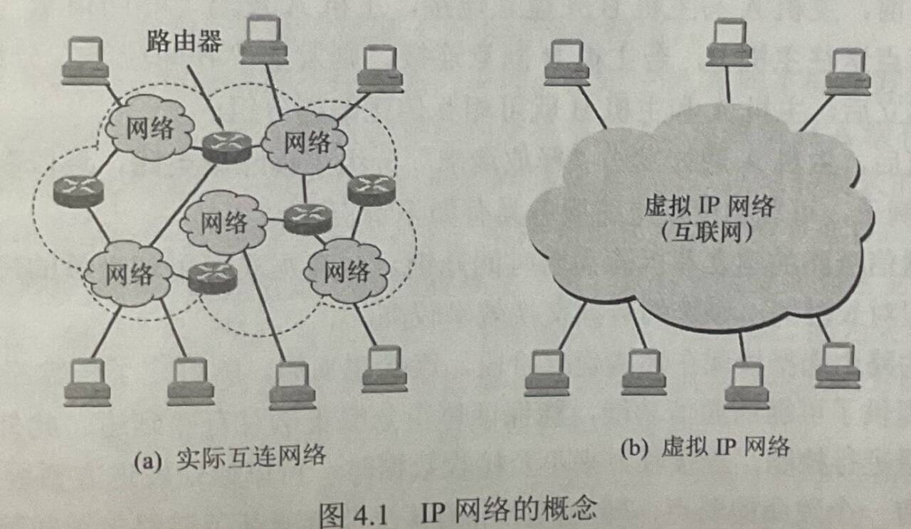
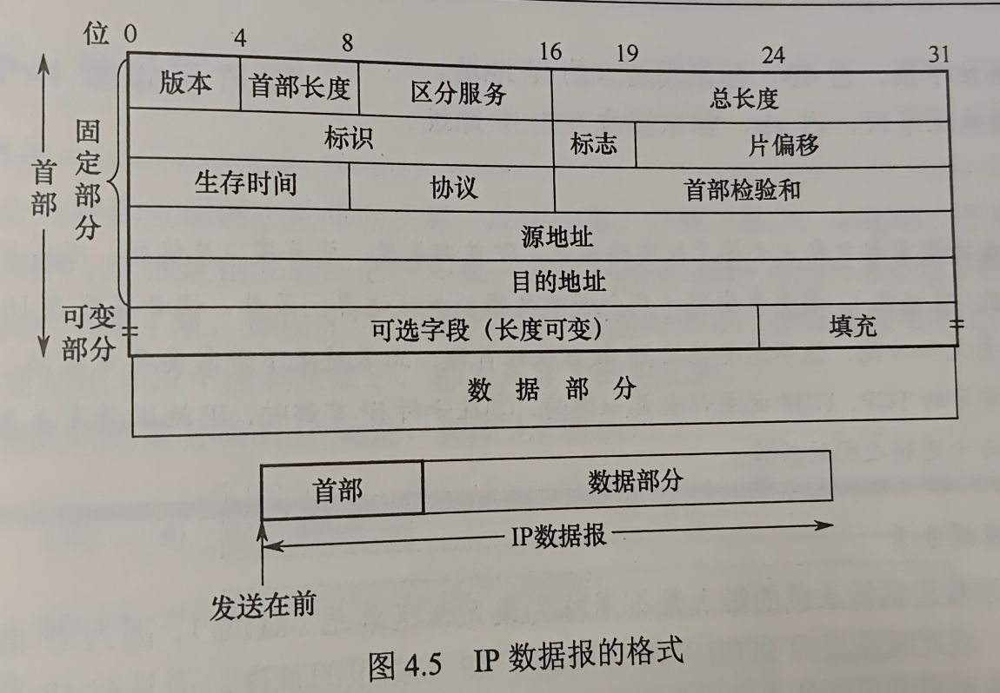
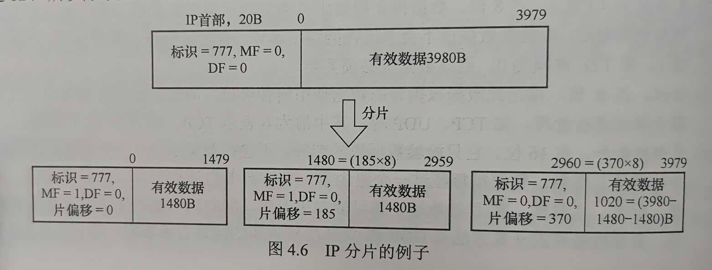
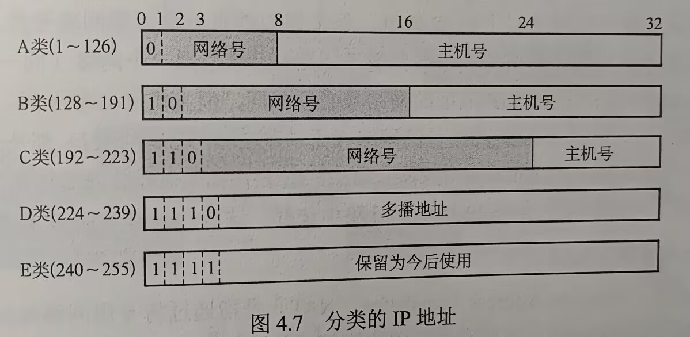
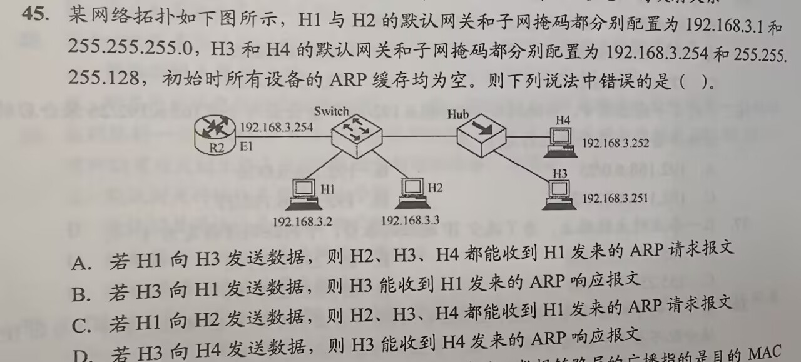
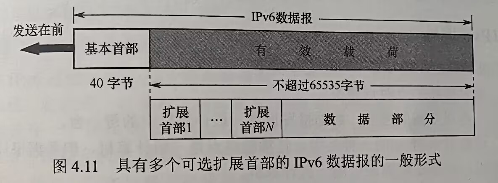
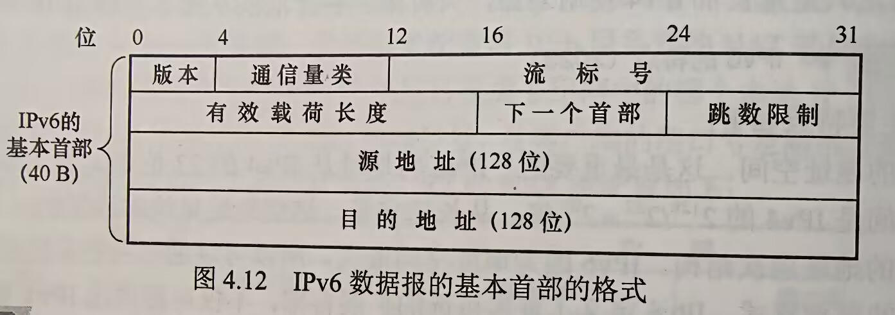
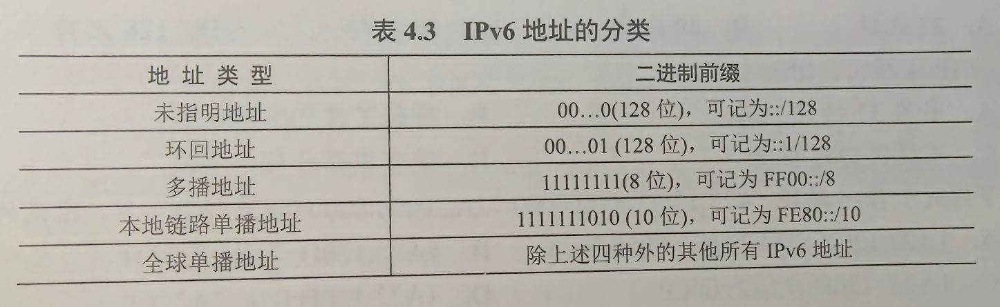
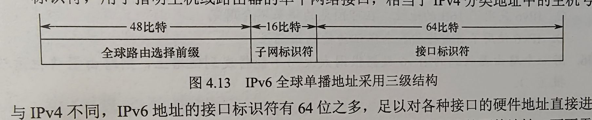
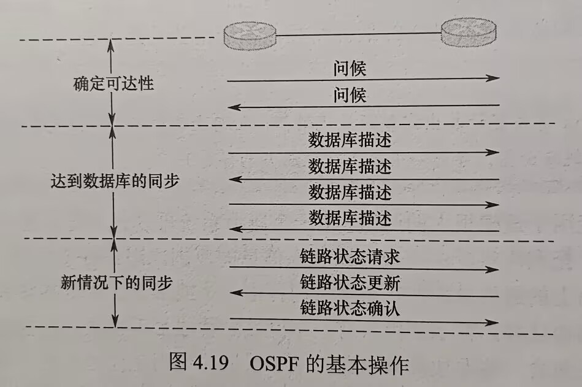

# 第四章 网络层

## 目录
- [第四章 网络层](#第四章-网络层)
  - [目录](#目录)
- [4.1 网络层的功能](#41-网络层的功能)
  - [4.1.1 异构网络互连](#411-异构网络互连)
  - [4.1.2 路由与转发](#412-路由与转发)
  - [4.1.3 网络层提供两种服务](#413-网络层提供两种服务)
    - [虚电路](#虚电路)
    - [数据报](#数据报)
    - [二者比较](#二者比较)
  - [4.1.4 SDN基本概念](#414-sdn基本概念)
    - [基本概念](#基本概念)
    - [SDN接口](#sdn接口)
    - [优点和问题](#优点和问题)
  - [4.1.5 拥塞控制](#415-拥塞控制)
  - [考点\&易错点整理](#考点易错点整理)
- [4.2 IPv4](#42-ipv4)
  - [4.2.1 IPv4分组](#421-ipv4分组)
    - [IPv4分组的格式](#ipv4分组的格式)
    - [IP数据报分片](#ip数据报分片)
  - [4.2.2 IPv4地址与NAT](#422-ipv4地址与nat)
    - [IPv4地址](#ipv4地址)
    - [网络地址转换（NAT）](#网络地址转换nat)
  - [4.2.3 划分子网与路由聚合](#423-划分子网与路由聚合)
    - [划分子网](#划分子网)
    - [子网掩码](#子网掩码)
    - [无分类编制CIDR](#无分类编制cidr)
    - [路由聚合](#路由聚合)
    - [子网划分举例](#子网划分举例)
  - [4.2.4 网络层转发分组的过程](#424-网络层转发分组的过程)
  - [4.2.5 地址解析协议](#425-地址解析协议)
    - [IP地址与硬件地址](#ip地址与硬件地址)
    - [地址解析协议](#地址解析协议)
  - [4.2.6 动态主机配置协议DHCP](#426-动态主机配置协议dhcp)
    - [含义](#含义)
    - [DHCP原理及交换过程](#dhcp原理及交换过程)
    - [重要概念](#重要概念)
  - [4.2.7 网际控制报文协议ICMP](#427-网际控制报文协议icmp)
  - [考点\&易错点](#考点易错点)
- [4.3 IPv6](#43-ipv6)
  - [4.3.1 IPv6的特点](#431-ipv6的特点)
  - [4.3.2 IPv6数据报基本首部](#432-ipv6数据报基本首部)
  - [4.3.3 IPv6地址](#433-ipv6地址)
  - [4.3.4 IPv4向IPv6过渡](#434-ipv4向ipv6过渡)
  - [考点\&易错点](#考点易错点-1)
- [4.4 路由算法与路由协议](#44-路由算法与路由协议)
  - [4.4.1 路由算法](#441-路由算法)
    - [静态路由与动态路由](#静态路由与动态路由)
    - [距离-向量路由算法](#距离-向量路由算法)
    - [链路状态路由算法](#链路状态路由算法)
  - [4.4.2 分层次的路由选择协议](#442-分层次的路由选择协议)
    - [内部网关协议](#内部网关协议)
    - [外部网关协议](#外部网关协议)
  - [4.4.3 路由信息协议RIP](#443-路由信息协议rip)
    - [RIP的规定](#rip的规定)
    - [RIP的特点](#rip的特点)
    - [RIP距离向量算法](#rip距离向量算法)
    - [RIP优缺点](#rip优缺点)
  - [4.4.4 开放最短路径优先协议OSPF](#444-开放最短路径优先协议ospf)
    - [基本特点](#基本特点)
    - [基本工作原理](#基本工作原理)
    - [OSPF的分组类型](#ospf的分组类型)
  - [4.4.5 边界网关协议](#445-边界网关协议)
    - [BGP的基本特点](#bgp的基本特点)
    - [BGP路由](#bgp路由)
    - [BGP路由选择](#bgp路由选择)
    - [BGP的四种报文](#bgp的四种报文)
  - [考点\&易错点](#考点易错点-2)
- [4.5 IP多播](#45-ip多播)
  - [4.5.1 多播的概念](#451-多播的概念)
  - [4.5.2 IP多播地址](#452-ip多播地址)
  - [4.5.3 局域网进行硬件多播](#453-局域网进行硬件多播)
  - [4.5.4 IGMP与多播路由协议](#454-igmp与多播路由协议)
  - [考点\&易错点](#考点易错点-3)
- [4.6 移动IP](#46-移动ip)
  - [4.6.1 移动IP的概念](#461-移动ip的概念)
  - [4.6.2 移动IP通信过程](#462-移动ip通信过程)
  - [考点\&易错点](#考点易错点-4)
- [4.7 网络层设备](#47-网络层设备)
  - [4.7.1 冲突域和广播域](#471-冲突域和广播域)
  - [4.7.2 路由器的组成和功能](#472-路由器的组成和功能)
  - [4.7.3 路由表与转发分组](#473-路由表与转发分组)
  - [考点\&易错点](#考点易错点-5)


# 4.1 网络层的功能

- 网络层提供主机到主机的通信服务，主要任务：将分组从源主机经过多个网络、多段链路传输到目的主机
  - 分组转发
  - 路由选择
- TCP/IP体系结构中，网络层只提供简单灵活的、无连接的、尽最大努力交付的**数据报服务**
  - 传送的分组可能出错、丢失、重复、失序、超时 —— 路由器可以做得很简单，价格低廉
  - 通信可靠性由更高层传输层负责
  - 优点：网络造价大幅降低，运行方式灵活，能适应多种应用

## 4.1.1 异构网络互连

- **互联网**是全球范围内数以百万计的**异构网络**互连起来的 ——由网络层实现这种互联

  - 异构：网络的拓扑结构、寻址方案、差错处理方法、路由选择机制都不尽相同

- **网络互联**：两个以上的计算机网络，通过一定方法，用一些**中继系统**相互连接起来，构成更大网络系统

  - 根据所在层次，中继系统分为4种
    1. 物理层中继系统：转发器、集线器
    2. 数据链路层中继系统：网桥/交换机
    3. 网络层中继系统：路由器
    4. 网络层以上中继系统：网关
  - 网络互联通常指使用**路由器**进行**网络连接和路由选择**
    - 因为使用物理层、数据链路层中继系统连接，只是把网络扩大了，它们在网络层观点仍是同一网络

- TCP/IP在网络互连方面在网络层采用标准化协议，相互连接的网络可以是异构的

  

  - 参与互连的计算机使用**相同的IP**，通过IP可以使性能各异的网络在网络层上看起来像一个**统一**的网络
  - 可以把互联后的网络视为一个 *虚拟互联网络*，简称IP网络

- 使用IP网：IP网上的主机进行通信时，就好像在单个网络上通信一样，看不见互连的各个网络的具体异构细节（如具体编址方案、路由选择协议等）

## 4.1.2 路由与转发

- **路由选择**：根据路由协议构造**路由表**，同时经常或定期地与相邻路由器交换信息，获取网络最新拓扑，*动态更新维护路由表*，以决定分组到达目的地节点最优路径
- **分组转发**：路由器根据**转发表**将分组从合适的端口转发出去
  - 转发表查询、转发及相关的队列管理任务调度
- 路由表vs转发表
  - 路由表，根据路由算法得出；转发表，从路由表得出
  - 路由表最优化网络拓扑变化的计算；转发表结构应使查找过程最优化
  - 讨论**路由选择原理**时，通常不区分转发表、路由表，统一使用路由表


## 4.1.3 网络层提供两种服务

- **分组交换**网根据通信子网向端点系统提供的服务可分为两种（这两种服务由网络层提供）
  - 面向连接的虚电路服务
  - 无连接的数据报服务
- 补充：对分组交换网的理解
  - 采用分组交换的网络整体 —— 将数据切成分组，通过存储-转发方式在网络中传递
  - **涉及多层**，包括物理层、数据链路层、网络层etc.

### 虚电路

- 虚电路方式中，两台计算机进行通信，应先建立网络层的连接，即建立一条逻辑上的虚电路；连接建立即**固定**虚电路对应的**物理路径**
- 通信过程分为三个阶段
  - 虚电路建立
    - 每次建立时，将一个未用过的**虚电路号**（VCID）分配给该虚电路
  - 数据传输
    - 双方沿已建立的虚电路传送分组
    - 分组首部**仅在建立连接时**使用完整的目的地址，之后每个分组首部只需携带这个虚电路编号即可
  - 虚电路释放
- 虚电路网络中，每个节点维持一张虚电路表，表中每项记录一个打开的虚电路信息
  - 包括虚电路号、前一节点和下一节点的标识
- 特点
  - 通信链路的建立和拆除需要时间开销，对交互式应用和少量段分组情况效率低，但是长时间、频繁数据交换效率高
  - 路由选择 体现在连接建立阶段
  - 提供可靠通信功能，保证每个分组正确有序到达
  - 可对两个端点流量控制
  - 致命弱点：当网络中某节点/链路出现故障彻底失效时，所有经过该节点/链路的虚电路将被破坏
  - 分组首部仅包含虚电路号，相对数据报开销小
  - **虚**：电路并非专用，一个节点可能同时有若干虚电路通过

### 数据报

- 网络发送分组前不需先建立连接。源主机高层协议将报文拆成若干较小数据段，并加上地址等控制信息构成分组
- 中间节点**存储**分组很短一段时间，找到最佳路由后尽快**转发**每个分组
- 举例说明发送过程，主机A向B发送
  - 主机A将分组逐个发往与它直接相连的交换节点A，交换节点缓存收到的分组
  - 交换节点查找自己转发表，不同时刻网络状态不同，转发表内容可能不完全相同，**分组交付的节点可能不同**
  - 其他节点收到分组后，类似地转发分组，直到分组到达主机B
- 数据报服务特点
  - 发送分组前无需建立连接，发送方可随时发送分组，网络中节点可随时接收分组
  - 尽最大努力交付，不保证可靠性（分组出错、丢失）；网络为每个分组独立选择路由，转发路径可能不同，不一定按序到达目的节点
  - 发送分组要包括发送方、接收方完整地址
  - 分组在交换节点存储转发，有时需要排队等候处理，排队时延；会在拥塞时大大增加，交换节点可丢弃部分分组
  - 网络具有冗余路径，故障适应能力较强
  - 收发双方不独占链路，资源利用率较高

### 二者比较

|                    | 数据报服务                                             | 虚电路服务                             |
| ------------------ | ------------------------------------------------------ | -------------------------------------- |
| 连接建立           | 不需                                                   | 需要                                   |
| 目的地址           | 每个分组都有完整目的地址                               | 仅建立连接阶段使用，后续使用VCID       |
| 路由选择           | 每个分组独立路由转发                                   | 同一虚电路的分组按同一路由转发         |
| 分组顺序           | 不保证有序                                             | 有序                                   |
| 可靠性             | 不保证可靠通信，可靠得由用户主机保证                   | 可靠                                   |
| 对网络故障适应     | 出故障节点丢失分组，其他分组路径发生变化时可以正常传输 | 所有经过故障节点的虚电路均不能正常工作 |
| 差错处理、流量控制 | 用户主机流量控制，不保证数据报可靠性                   | 由分组交换网负责，也可由用户主机负责   |


## 4.1.4 SDN基本概念

### 基本概念

- 网络层可抽象地划分为
  - 数据平面（也称转发层面） —— 转发
  - 控制平面 —— 路由选择
- 软件定义网络（Software Defined Network，SDN）是近年流行的一种创新网络架构，采用**集中式的控制平面**和**分布式的数据平面**，两个平面互相分离
  - 控制平面利用*控制-数据接口*对数据平面上路由器进行集中式控制
- SDN结构中，路由器不需要路由选择软件了，路由器也不再相互交换路由信息
  - 控制平面有一个*逻辑上*的**远程控制器**（可由多个服务器组成）
    - 远程控制器：掌握各主机和整个网络状态，为每个分组计算最佳路由；通过Openflow协议（或其他途径）将转发表（SDN中称**流表**）下发给路由器
  - 路由器工作
    - 收到分组
    - 查找转发表
    - 转发分组
  - 这样网络又变成集中控制的，而互联网本来是分布式的
  - 大型数据中心之间的广域网，使用SDN模式建造可以使网络运行效率更高

### SDN接口

- SDN的可编程性，为开发者提供了强大的编程接口
  - 北向接口：SDN提供的编程结构，开发者可以设计自己的应用
  - 南向接口：SDN控制器和转发设备建立双向会话的接口
    - 通过不同的南向接口协议（如Openflow），SDN控制器可以兼容不同的硬件设备，并能在设备中实现上层应用的逻辑
  - 东西向接口：SDN控制器集群内部控制器**之间**的通信接口
    - 用于增强整个控制平面的可靠性可拓展性

### 优点和问题

- 优点
  - 全局集中式控制和分布式高速转发，既利于控制平面的全局优化，又利于高性能的网络转发
  - 灵活可编程与性能的平衡，控制和转发功能分离后，网络可以由专有的自动化工具以编程方式配置
  - 降低成本，实现网络设备制造与功能软件的开发香相分离
- 问题
  - 易受攻击，崩溃则整个网络都会收到影响
  - 瓶颈问题，控制器可能称为网络性能的瓶颈

## 4.1.5 拥塞控制

- 拥塞：因过量的分组而引起网络性能的下降
- 判断方法：观察网络吞吐量与网络负载关系
  - 若随负载增加，网络吞吐量明显小于正常吞吐量，则网络可能已进入轻度拥塞状态
  - 若吞吐量随网络负载增大而减少，则网络可能已进入拥塞状态
- **拥塞控制**：主要解决如何获取网络中发生拥塞的信息，从而利用这些信息控制网络，以避免因拥塞造成的分组丢失
  - 作用：确保网络能承载所达到的流量，是*全局性*的过程
- 拥塞控制vs流量控制
  - 流量控制往往指发送方、接收方间点对点通信量的控制，它要做的是抑制发送方发送速率
- 拥塞控制两种方法
  - **开环控制**，设计网络是，事先考虑有关发生拥塞的因素。**静态的预防方法**，启动后不需再修改
  - 闭环控制，事先不考虑拥塞的因素，采用监测网络监视，及时检测哪里发生拥塞，将拥塞信息传到合适地方调整网络系统的运行，**动态的方法**

## 考点&易错点整理

- 路由器互连的多个局域网结构中，要求每个局域网 物理层、数据链路层、**网络层**协议可以不同，而以上高层协议必须相同
  - 路由器是网络层设备，向传输层及以上隐藏下层的具体实现，物、链、网实现都被隐藏，所以可以不同
  - **网络层**不同举例：使用特定路由器连接IPv4和IPv6
- 存储转发机制：先**接收整个**分组，对分组进行错误检查，正确则转发，错误即丢弃
- 虚电路建立连接时建立的是逻辑连接（并非物理连接）
  - 注意虚电路连接需要主动断开，而不是会话结束就释放连接


# 4.2 IPv4

## 4.2.1 IPv4分组

- IPv4（版本4）：现在普遍使用的**网际协议**（Internet Protocal，IP）
  - 定义数据传送的基本单元 —— IP分组及其确切数据格式
  - 包括一套规则，指明分组如何处理、错误怎样控制

### IPv4分组的格式



- 由首部和数据部分组成，首部分两部分，前一部分长度固定，共20B（所有IP分组必须具有的）；后面是一些可选字段，长度可变，提供错误检测和安全等机制

- 首部重要字段含义

  1. 版本，4bit。
     - 指IP版本，IPv4中值为4

  2. 首部长度，4bit。

     - 以4B为单位，例如不使用任何可选字段的首部长度20B，该值为5

     - 最大首部长度是60B，达到最大值15（1111B)

  3. 总长度，16bit。

     - 1B为单位，数据报最大长度为$2^{16}-1=65535B$

     - 而以太网帧最大传送单元（MTU）为1500B

     - IP数据报封装成帧时，总长度一定不能超过下面数据链路层的MTU

  4. **标识**，16bit

     - 计数器，每产生一个数据报就+1，并赋值给标识字段
     - **原始数据报的标识号唯一**，所以组装时能分辨出来
     - 分片时，每个数据报片都复制一次**标识号**，以便能正确重装

  5. 标志（Flag），3bit。

     - 最低位MF，MF = 1表示后面还有分片，MF = 0表示最后一个分片

     - 标志字段中间位位DF，只有DF = 0才允许分片

  6. 片偏移，13bit。

     - 较长数据报在分片后，该片在原数据报中相对位置

     - 8B位单位 -> 除最后一个分片外，每个分片长度**必定**是8B的整数倍

  7. 生存时间（TTL），8bit

     - 可通过路由器数最大值（也即最多几跳），标识数据报在网络中寿命（确保不会永远在网络中循环）

     - 路由器转发前，TTL减一。若减到0了就不转发丢弃了

  8. 协议，8bit

     - 数据部分上交给哪个协议进行处理

     - 值6 TCP；17 UDP

  9. 首部检验和（checksum），16bit

     - 源地址字段，4B
     - **仅检测首部**
     - 计算方法为首部每**16bit**按**反码相加再取反码**

  10. 发送方**IP地址**
  
  11. 目的地址字段，4B

### IP数据报分片

- 链路层数据帧能承载最大数据量为 **最大传送单元**（MTU）
  - 以太网MTU = 1500B；许多广域网MTU <= 576B
- MTU严格限制IP数据报的长度 -> 较长IP数据报分装成较小IP数据报，称为**片**
  - 片在目的地网络层会重新组装
  - 目的主机使用IP首部中：标识、标志和片偏移字段完成对片的重组

- 分片&重组中字段分析

  - 分片时，形成的每个数据报（片）都具有原始数据的标识号
  - 目的主机收到来自同一发送主机一批数据报时
    - 可以通过**检查数据报标识号**来确定数据片属于哪些原始数据报
    - 重组时，使用片偏移字段来确定片应放原始IP数据报的哪个位置
  - 标志位只有后两位有意义
    - DF（Don't Fragment）
    - MF（More Fragment）

- 分片计算示例

  

## 4.2.2 IPv4地址与NAT

### IPv4地址

- IP地址：是给连接到互联网上每台主机（或路由器）的每个接口，全球范围内**唯一**的32bit标识符
  - 由 ICANN（互联网名字和数字分配机构）进行分配
  - 32位IP地址分为4段，每段8位，用等效十进制标识，每段中加一个小数点 —— **点分十进制记法**

- `IP地址 ::= {<网络号>，<主机号>}`

  - **网络号**标志主机（或路由器）所连接到的**网络**，网络号在整个互联网范围内必须是唯一的
  - **主机号**标志该**主机**（或路由器），主机号在网络号指明的**网络范围内唯一**
  - 由此，一个IP地址在整个互联网范围内都是唯一的
  - 

- IP地址中部分有特殊用途，不作主机的IP地址：

  - 主机号全为0，表示网络本身，202.98.174.0
  - 主机号全为1，广播地址（也称直接广播地址），202.98.174.255
  - 127.x.x.x，保留作为**本地**软件**环回测试**（Loopback Test）本主机进程之间通信用，目的地址为环回地址的IP数据报不会被主机发送到任何网络
  - 32位全0，0.0.0.0，本网络上本主机
  - 32位全1，255.255.255.255，**受限广播地址**，仅在本网络上进行广播

- 常用三类IP地址使用范围  

  | 网络类别 | 最大可用网络数 | 第一个可用网络号 | 最后一个可用网络号 | 每个网络中最大主机数 |
  | :------: | -------------- | ---------------- | ------------------ | -------------------- |
  |    A     | $2^7 - 2$      | 1                | 126                | $2^{24}-2$           |
  |    B     | $2^{14}$       | 128.0            | 191.255            | $2^{16}-2$           |
  |    C     | $2^{21}$       | 192.0.0          | 223.255.255        | $2^8-2$              |

  - A类地址可用网路数$2^7-2$，-2原因为
    - **网络号字段全0的IP地址是保留地址**，本网络
    - 网络号127的IP地址是环回自检地址
  - 每个网络中最大主机数-2原因：全0和全1的主机号不指派
    - 分别用作网络本身和广播地址

- IP地址重要特点

  - IP地址由网络号和主机号两部分组成，IP地址是分等级的地址结构，好处如下
    - IP地址管理机构分配IP地址时只分配网络号，主机由得到网络的单位自行分配，方便IP地址管理
    - 路由器仅需根据目的主机所连接的网络号转发分组，减小了路由表存储空间
    - 转发器、桥接器（网桥等）连接的若干LAN仍然是同一个网络（同一个广播域），因此该LAN中所有主机IP地址的 网络号必须相同，主机号必须不相同
    - IP地址中，所有分配到网络号的网络（无论是LAN还是WAN），都是平等的
    - **同一个局域网**上的主机或路由器接口的IP地址中**网络号必须相同**

### 网络地址转换（NAT）

- 网络地址转换（Network Address Translation，NAT）：专用网络地址（如Intranet） -> 公用地址（如Internet），从而对外隐藏内部管理的IP地址
  - 整个专用网只需一个全球IP地址就可与互联网连通，大大节省IP地址的消耗
  - 隐藏内部网络结构，从而降低内部网络受攻击的风险

- 为了网络安全，划出三个**私有**IP地址块，只用于LAN，而不用于WAN（因此**私有IP地址不能直接用于互联网**，需通过NAT转换成合法全球IP地址才能出现于互联网上）
  - **10**.0.0.0/8（即**10**.0.0.0 ~ **10**.255.255.255），相当于一个A类网络
  - **172.16.**0.0/12（即**172.16**.0.0 ~ **172.31**.255.255），相当于16个连续的B类网络
  - **192.168.0**.0/16（即**192.168.0**.0 ~ **192.168.255**.255），相当于256个连续的C类网络
- 采用私有IP地址的互联网络称为**专用互联网**或**本地互联网**
  - 私有IP地址也称为**可重用地址**
- 使用NAT，需要在专用网连接到互联网的路由器上安装NAT软件
  - NAT路由器至少有一个有效的外部全球IP地址
  - 使用NAT转换表进行本地IP地址 -> 全球IP地址的转换
    - 表项：{本地IP地址：端口} -> {全球IP地址：端口}的映射
  - 可以多个私有IP地址映射到一个全球IP地址
- NAT原理和应用
  - 某家庭办理一个宽带获得全球IP地址136.76.29.7，家庭网络内3台主机使用私有地址（10.0.0.0网段），家庭网关路由器应开启NAT功能
  - 工作原理
    - 用户主机10.0.0.1（随机端口3345）向web服务器128.119.40.186（端口80）发送请求
    - NAT路由器收到IP分区，为该IP生成一个新端口号5001，IP分组源地址改为136.76.29.7，源端口号改为5001
    - NAT路由器在NAT转换表中增加一个表项
    - Web响应的IP地址为改装后端IP地址，向其发送响应
    - 响应分组到达NAT路由器后，通过NAT转换表将IP分组目的IP地址改为10.0.0.1，目的端口号改为3345
- 普通路由器 v.s. NAT路由器
  - 普通路由器仅工作在网络层
  - NAT路由器转发数据报时需要查看和转换**传输层的端口号**
- 内网映射到公网（如私网中部署的Web服务器、FTP服务器等）
  - 可在NAT表中配置“公网IP地址+端口号” -> "私网IP地址 + 端口号"的映射关系

## 4.2.3 划分子网与路由聚合

### 划分子网

- 两级IP地址缺点：
  - IP地址空间利用率有时很低
  - 每个物理网络分配一个网络号会使路由表变得太大，进而网络性能变坏
  - 两级IP地址不够灵活
- IP地址中增加 “子网号字段”，变为三级IP地址，这种做法称为**划分子网**（已称为标准协议

- 划分子网基本思路
  - 仅是单位内部的事。单位对外表现为未划分子网的一个网络
  - 划分子网方法：从主机号借用若干位为子网号，主机号也相应减少相同位数
  - 三级IP地址结构 `IP地址 ::= {<网络号>，<子网号>，<主机号>}`
  - 路由器转发分组根据仍是IP数据报目的网络号，本单位路由器收到IP数据报后，按目的网络号和子网号找到目的子网，最后将IP数据报交付给目的主机
- 举例：C类网络208.115.21.0划分4个子网，则子网号需要占用2bit，因此主机号只有6位
  - 子网网络地址分别为208.115.21.0, 208.115.21.64, 208.115.21.128, 208.115.21.196
  - 每个子网可分配IP数为$2^6-2=62$
- 注意
  - 划分子网并不会改变IP地址原有网络号
  - **子网的主机号**（指划分后剩下的主机号）不能被指派，全0用作子网网络地址，全1用作广播地址
  - 划分子网增加灵活性，但减少可用IP地址

### 子网掩码

- **子网掩码**：与IP地址相对应的、长32位的二进制串，由一串1和跟随的一串0组成
  - 1对应IP地址中网络号、子网号；0对应主机号
  - `子网网络地址 = IP地址 ^ 子网掩码`
- **默认网关**：子网与外部网络连接的设备，即连接本机或子网的 **路由器接口的IP地址**
- 现代互联网标准规定：所有网络都必须使用子网掩码。若一个网络未划分子网，那么它使用**默认子网掩码**
  - A类默认子网掩码255.0.0.0
  - B类255.255.0.0
  - C类255.255.255.0
- 路由器相互之间交换路由信息时，必须将自己所在网络的子网掩码告诉对方
  - 分组转发时，路由器将分组目标地址和某网络的（*测测它是不是要发的*）子网掩码按位相与，若结果与该网络地址一致，则路由匹配成功，路由器将分组转发至该网络
- 使用子网掩码
  - 一台主机在设置IP地址信息同时，必须设置子网掩码
  - 同属于**一个子网**所有主机及路由器的相应端口，必须设置**相同的子网掩码**
  - 路由器路由表中包含的信息主要内容由
    - 目的地址、子网掩码、下一跳地址

### 无分类编制CIDR

- 无分类域间路由选择（Classless Inter-Domain Routing, CIDR）是在变长子网掩码的基础上，提出的一种消除传统ABC类地址及划分子网的概念

- CIDR使用**网络前缀**的概念代替网络的概念，与传统分类IP地址最大的区别就是，网络前缀的位数**不是固定的**

- 记法`IP地址 ::= {<网络前缀>, <主机号>}`

- CIDR还使用斜线记法（CIDR记法），记为`IP地址/网络前缀所占的位数`

  - 采用CIDR后，斜线及后面的数字一定不能省略
  - 例如128.14.32.5/20这个，它的掩码是20个连续的1和12个连续的0

  - 逐位”与“
    - IP     =   <u>10000000.00001110.0010</u>0000.00000101
    - 掩码 =   <u>11111111.11111111.1111</u>0000.00000000
  - 网络前缀 =   <u>10000000.00001110.0010</u>0000.00000000（128.14.32.0）

- CIDR将**网络前缀都相同**的连续IP地址组成**CIDR地址块**，只需知道CIDR地址块中的任何一个地址，就能知道这个地址块的最大地址、最小地址及地址块中地址数

  - 128.14.32.5/20
    - 最小地址: <u>10000000.00001110.0010</u>0000.00000000（128.14.32.0）
    - 最大地址: <u>10000000.00001110.0010</u>1111.11111111（128.14.47.255）
  - 这俩地址通常不使用，通常只使用在这两个特殊地址之间的地址

- CIDR虽然不使用子网，但仍使用”掩码“一词

  - 不使用子网：指CIDR并没有指明若干位作为子网字段
  - 但分配到一个CIDR地址**块**的单位，仍可在本单位根据需要划分出一些子网
  - 某单位分配到地址块/20，就**可**继续划分8个子网，向主机号借用3位划分子网（也可划分更多/更少子网），这时每个子网的网络前缀就变成了23位

- CIDR地址块中地址数一定是**2的整数次幂**

  - 实际可指派的地址数通常为$2^{N}-2$
    - N表示主机号的位数；主机号全0代表网络号，主机号全1为广播地址
  - 网络前缀越短，地址块包含的地址数越多
  - 在三级结构的IP地址中，划分子网使网络前缀变长

### 路由聚合

- **路由聚合**：路由表中就可利用较大的一个CIDR地址代替许多较小的地址块
  - 路由表中的一个项目可以表示原来传统分类地址的多条路由项目
  - 压缩路由表所占的空间，从而提高了网络性能
- 考虑网络1：206.1.0.0/17；网络2：206.1.128.0/17都在路由器R2下，下一跳发给R2
  - 前16位都是相同，第17位分别是0和1
  - 且两个网络下一条皆为R2
  - 若使用**路由聚合**，网络1和网络2可以构成一个更大的地址块206.1.0.0/16，二者可以聚合成一条到206.1.0.0/16的路由
- **最长前缀匹配**（最佳匹配）：
  - CIDR时，路由表中表项由 （网络前缀，下一跳）
  - 应当从匹配结果中**选择具有最长网络前缀的路由**
    - 因为网络前缀越长，其地址块越小，路由越具体
- CIDR查找路由表的方法：
  - 通常将无分类编址的路由表存放在一种层次式数据结构（通常**二叉线索**）
  - 然后自上而下按层次进行查找
- 优点
  - 在于网络前缀长度灵活性
    - 上层网络的前缀长度较短，所以相应的路由表的项目较少
    - 内部又可采用演唱网络前缀方法灵活划分子网

### 子网划分举例

- 两类划分子网方法：定长的子网掩码，变长的子网掩码
- 假设CIDR地址块为208.115.21.0/24，划分给3个部门，各部门主机台数50，20，5
- **定长**子网掩码划分子网的应用
  - 3个部门，需要2bit作为子网号
  - 子网可分配IP地址数位$2^{8-2}-2=62$，能够满足各部门的需求
    - 208.115.21.0/26，分给部门1
    - 208.115.21.64/26，分给部门2
    - 208.115.21.128/26，分给部门3
    - 208.115.21.192/26，留作以后用
- 变长子网掩码划分子网
  - 计算需要主机号位数注意 n 位子网提供$2^n-2$个可分配地址
  - 部门1需要6位主机号，余26位作为网络前缀
    - 如果部门1有63台主机，那么它可能会要7位主机号
  - 部门2主机号5位，余27位网络前缀
  - 部门3主机号3位，余29位网络前缀
  - **每个子网最小地址只能选择主机号全0的地址**
- 子网主机号全0或全1的地址通常不分配，对于一段连接**两个路由器**的链路，可以分配**/30**的地址块，这样可分配地址为2个，恰好可分配给链路两端路由器接口
  - **最新标准**：直线连线的两个路由器接口可不分配IP地址；若分配IP地址，则这一段连接就构成一种只包含一段点对点的特殊”网络“（网络只有两个地址，分给两端点对点），这种网络仅需两个IP地址，主机号可以是0或1，可以使用**/31**地址块

## 4.2.4 网络层转发分组的过程

- 转发表中，每条路由必须有 （目的网络地址，下一跳地址）
  - 分组到达路由器后，路由器根据目的IP地址的网络前缀查找转发表，确定下一跳到哪个路由器
  - 可能多次间接交付
  - 直接交付 —— 到达最后一个路由器时，向目的主机直接交付
- 采用CIDR编址时，使用最长前缀匹配
  - 为了更快查找转发表，转发表按前缀长度降序排列
- 两种特殊路由
  - **特定主机路由**：对特定目的主机的IP地址专门指明一个路由，方便网络管理员控制、测试网络
    - e.g. 特定主机IP为a.b.c.d，转发表中对应项的目的网络a.b.c.d/32，/32表示子网掩码无意义，但是它**可以用在转发表中**
  - **默认路由**：特殊前缀0.0.0.0/0表示默认路由，任何目的地址都可以匹配上
    - **通常用于路由器到互联网的路由**，只要目的地是其他网络，一律选择默认路由
- 路由器执行**分组转发**算法如下：
  1. 收到IP分组提取目的主机IP地址 **D**（目的地址）
  2. 先查*特定主机路由*，查到则按这条路由下一跳转发分组；否则进入步骤3开始最长前缀匹配
  3. 这一行子网掩码于目的地址D逐位与操作，若结果与本行前缀匹配，则查找结束，按下一跳指出的进行处理；否则 若转发表还有下一行，则对下一行检查，重新执行步骤3，若无则步骤4
  4. 若转发表**有**默认路由，则传送给默认路由；若无则报告转发分组出错
- 得到下一跳路由器IP地址后，不是直接将该地址填入待发送数据报，而是**将IP地址通过ARP转换为MAC地址**，将此MAC地址填入MAC帧首部，根据这个MAC地址找到下一跳路由器

## 4.2.5 地址解析协议

### IP地址与硬件地址

- 基本概念

  - IP地址：网络层、网络层之上使用的地址，分层式 —— 分出网络号、子网号、主机号

  - 硬件地址（MAC地址）是数据链路层使用的地址，平面式 —— 6B的MAC地址

  - IP地址放在IP数据报首部，MAC地址放在MAC帧的首部；IP数据报封装为MAC帧后，数据链路层看不到IP数据报中的IP地址

- IP数据报经过多次路由转发（这里以IP地址寻址）到目标网络后，改为在目标局域网中通过数据链路层的MAC地址以广播方式寻址

- 计算机网络的精髓

  - **IP层抽象**的互联网上只能看到IP数据报 —— 底下的都是透明的
  - 虽然IP数据报中有源地址，但是路由器**仅根据目的IP地址进行转发**
  - 局域网的链路层只能看见MAC帧。IP数据报封装在MAC帧中，通过路由器转发时，IP数据报在每个网络中都被路由器解封装、重新封装，其**MAC帧首部中源地址和目的地址会不断改变** -> 无法使用MAC地址跨网络通信
  - IP层抽象的互联网屏蔽了下层复杂的网络细节，只要在网络层之上讨论问题，就能使用统一的、抽象的IP地址研究主机或路由器之间的通信

- 路由器互连多个网络，它不仅有多个IP地址、还有多个硬件地址

### 地址解析协议

- **地址解析协议**（ARP）
  - 每台主机设有一个**ARP高速缓存**，存放本局域网上各主机和路由器的 **IP地址到MAC地址** 的映射表，称为ARP表
    - 每个表项都设置生存实际，超时删除
- ARP工作原理：
  - **仅在子网范围工作**
  - 主机A欲向本局域网上某台主机B发送IP数据报时，先在A上ARP高速缓存查找
  - 若有，则查出硬件地址，将此硬件地址写入MAC帧，通过局域网发送给此硬件地址
  - 若没有，使用目的MAC地址为FF-FF-FF-FF-FF-FF的帧**广播**ARP请求分组
  - 局域网中每个主机都会收到帧，若帧包含的目的IP地址与本机相同（此处为主机B），则向源主机（主机A）发送**响应分组**（**单播**发送），响应分组包含B的IP与它MAC地址映射关系
  - 主机A收到响应分组，将此映射写入ARP缓存，并按查询到的硬件地址发送MAC帧
  
- 使用ARP的四种典型情况
  - 发送方是主机H1，IP发送到本网络另一台主机H1。H1在本网络用ARP找到H2硬件地址
  - 发送方是主机H1，需要发送到其他网络另一台主机H4。H1用ARP找到与网1相连的路由器R1的硬件地址（其他网络使用**默认网关**），剩下工作交给R1完成
  - 发送方是路由器R1，需要发送到R1相连的网络2的另一台主机H3。R1在网络中用ARP找到H3硬件地址
  - 发送方是路由器R1，需要发送到其他网络3另一台主机H4。R1在网络2用ARP找到与网2相连的路由器R2的硬件地址，剩下工作交给R2完成

## 4.2.6 动态主机配置协议DHCP

### 含义

- **动态主机配置协议**（Dynamic Host Configuration Protocol，DHCP）常用于给主机动态分配IP地址，提供即插即用的联网机制，允许计算机加入新的网络**自动获取IP地址**而不用手工参与
- **DHCP是应用层协议**，基于UDP
- DHCP使用客户/服务器模型
- 连接到互联网的计算机需要配置如下
  - IP地址
  - 子网掩码
  - 默认路由器的IP地址（默认网关）
  - 域名服务器的IP地址

### DHCP原理及交换过程

- 原理

  - 需要IP地址的主机在启动时向DHCP服务器**广播**发送**发现报文**，此时主机称为**DHCP客户**

  - 本地网络上所有主机都能收到，但只有**DHCP服务器**才能回答
    - DHCP先在其数据库中查找该计算机配置信息
      - 若找到，返回配置信息
      - 找不到，在服务器的IP地址池取一个地址分配给该主机

  - DHCP服务器提供的回答报文称为**提供报文**，包含IP地址等配置信息

- 实际过程

  - DHCP客户广播”DHCP发现“消息，意图从DHCP服务器获取IP地址。源地址0.0.0.0，目的地址255.255.255.255
  - DHCP服务器收到消息，**广播**”DHCP提供”消息。源地址DHCP服务器地址，目的地址255.255.255.255
  - DHCP客户收到消息
    - 若接收该IP地址，则广播”DHCP请求“消息，请求DHCP服务器提供IP地址。源地址0.0.0.0，目的地址255.255.255.255
  - DHCP服务器广播“DHCP确认”消息，分配IP地址给DHCP客户。源地址DHCP服务器地址，目的地址255.255.255.255

### 重要概念

- 租用期
- 采用广播方式交互，并采用UDP的原因 —— 二者不知道对方IP地址

## 4.2.7 网际控制报文协议ICMP

- 网际控制报文协议（Internet Control Message Protocol，ICMP），让主机或罗尤其报告差错和异常情况。
  - ICMP报文封装在IP数据报发送
  - 但ICMP是**网络层**协议
- ICMP报文有两种：
  - **ICMP差错报告报文**，用于目标主机或到目标主机路径上路由器，向源主机报告差错和异常情况，有如下5种常用类型
    - 终点不可达 —— 路由器或主机不能交付数据报
    - 源点抑制（现已不使用） —— 因拥塞而丢弃数据报，需要抑制源点发送
    - 时间超过 —— TTL为0；或终点在规定时间内不能收到数据报全部报片
    - 参数问题 —— 路由器/目的主机收到的数据报的首部中有字段不正确时
    - 改变路由（重定向） —— 路由器发送报文，通知主机应将数据报发送给别的路由器
  - **ICMP询问报文**
    - 回答请求和回答报文 —— 测试目的主机是否可达，并了解有关状态
    - 时间戳请求和回答报文 —— 计算当前RTT
- 不应发送ICMP差错报告报文情况
  - 对ICMP差错报告报文，不再发送
  - 对第一个分片的数据片的后续所有数据片，都不发送
  - 对多播地址的数据报，不发送
  - 具有特殊地址（如127.0.0.0，0.0.0.0）的数据报，不发送
- 常见应用
  - **PING**，使用ICMP回送请求和回答报文 —— PING工作在应用层
  - **Traceroute**，使用ICMP时间超过报文

## 考点&易错点

- IP首部检验和字段
  - 检验的范围：**仅IP首部**
  - 检验和计算方法：每16bit按反码加法求和再取反码
    - 反码加法：16bit累计到32bit中，溢出部分回滚（高16bit + 低16bit）得到结果，再每位取反
- IP数据报分片相关
  - IP数据报最后在**目的端主机**才能进行分组重组
    - 注意连数据片都可能走的是不同的路由，怎么可能在中间重组
  - IP分片时，原IP数据报的源IP地址和目的IP地址将**复制到每个分片首部**，传输过程中，IP数据报的首部的源IP地址和目的IP地址都**不会变化**
  - 分片长度的计算
    - 需要用MTU=800B的链路转发1580B的IP数据报（首部为20B）
    - 分片中，数据部分需要是8B的整数倍，设长nB，nB + 20B <= 800B，得到n=776
    - 所以第二个分片总长度字段应为776B+20B = 796B，且它后面还有小分片，应有MF=1
- 计算最长匹配
  - 首先对路由表表项进行排序，前缀越长的表项放越前面
  - 一个一个看匹不匹配
  - 找出第一个匹配上的项
- 对IP地址的分析
  - 举例172.31.128.255/18
    - 首先它**不是地址块**
    - 然后前缀18位的话，它后14位不全1，所以不是广播地址
    - 是分配给一个主机的地址，为**单播地址**
  - 举例127.x.x.x 用于软件的环回测试，既可作为源IP地址，又可作为目的IP地址
  - 255.255.255.255不会被路由器转发，它只在本网络广播
  - 方法
    - 先看地址属于哪一类（A、B、C、多播、留用）
    - 按照CIDR，分出网络号、子网号、主机号
    - 观察主机号，普通/全0/全1

- IP网络划分为子网的作用

  - 减小广播域
  - 可以**增加子网数量**（而不是增加网络的数量）

- CIDR技术主要作用

  - 有效分配IP地址空间，并减小路由表的数量
    - 缓解IP地址消耗的速度，无法彻底解决IP地址耗尽的问题
  - CIDR通过路由聚合，可减少路由表数量，从而减少路由器之间的信息交换，提升网络性能
  - **结果是**把大的网络划分为子网，**不是作用**

- 互联网的路由器对目的地址是**私有地址的IP数据报一律不进行转发**（为了网络安全），有3个私有地址段

  - **10**.0.0.0/8，即10.0.0.0 ~ 10.255.255.255，相当于1个A类网络
  - 172.16.0.0/12，即172.16.0.0 ~ 172.31.255.255，相当于16个连续的B类网络
  - **192.168.0**.0/16，即192.168.0.0 ~ 192.168.128.0，相当于256个连续的C类网络

- **转发**：一个路由器到另一个路由器（**小心挖坑**，比如255.255.255.255，绝不通过任何接口转发该分组）

- 解决IP地址耗尽的问题，**治本**的**IPv6**

- 某主机因IP地址分配不当而存在通信故障，有如下情况

  - 地址分配成了广播地址
  - 与其他网络**在不同子网** —— 出题，给定子网掩码，出4个IP地址，判断谁不是同一子网内的

- 判断**划分子网**问题：使用哈夫曼满二叉树表示整个IP地址空间

  - 例：将一个IP网络**划分**为4个子网，若其中一个子网为192.168.1.130/26，则下列网络不可能是另外3个子网之一的是
    - 192.168.1.9/25
    - 192.168.1.64/27
    - 192.168.1.96/27 -> CIDR地址块为192.168.1.<u>011</u>00000/27
    - 192.168.1.224/27
  - **划分**的理解：
    - n个子网互不重叠，这里4个选项都不重叠
    - **n个子网分完所有地址空间**，这里第3个子网若需要聚合成更大网络，需要5个，所以4个子网是分不完这个地址空间的

- **ARP广播仅在子网内进行**，相互通信的主机若不在同一子网内，则它们不能直接通过ARP广播得到目的站的硬件地址

- 路由器转发IP数据报时，需重新封装源/目的**硬件地址**

  - 而IP数据报的源IP和目标IP是不变的

- 网络拓扑分析举例1

  

  - H3向H1发送数据
    1. H3用目的IP地址、（本）子网掩码逐位与，192.168.3.2&255.255.255.128 = 192.168.3.0，发现与H3自身网络前缀不同，所以判定H3与H1不属于同一个网络，所以**目的MAC地址是默认网关E1**
    2. H3用ARP获得默认网关192.168.3.254的MAC地址（即E1），并将发往H1的IP数据报封装成MAC帧，帧经过集线器、交换机转发，被默认网关E1接收
    3. 路由器不再向入口E1转发IP数据报 —— H3收不到H1 发来的响应报文，H1也收不到请求报文
  - 分析发送数据
    - 先判断目的主机与本主机是否属于同一网络 —— 使用目的IP地址&本子网掩码，与自身网络前缀相比较
    - 相同则ARP获取其MAC地址并直接发送，不相同则ARP获取**网关地址**
    - 分析发往网关（路由器）的路线，同时注意网关不会向入口转发数据
    - 网关再在其他网络中使用目的IP地址，最长前缀匹配决定下一跳，下一跳再重复这个步骤

- ARP相关报文的IP地址、MAC地址分析；DHCP相关报文的IP地址、MAC地址分析

  - ARP**请求**报文的目的IP地址是**目的**主机的IP地址，目的MAC地址是**广播**MAC地址
  - ARP响应报文的目的IP地址是请求的主机的IP地址，目的MAC地址是**请求的**主机的MAC地址
  - DHCP发现报文，目的IP地址是广播IP地址，目的MAC地址是广播MAC地址
    - DHCP请求报文类似
  - DHCP提供报文，目的IP地址是广播IP地址，目的MAC地址是客户端主机MAC地址
    - DHCP确认报文类似

- TCP/IP体系结构中，直接为ICMP提供服务的协议是 IP

  - ICMP使用IP发送ICMP相关报文
  - ICMP仍是**网络层**协议

- **网关**的含义

  - 网关就是路由器
  - 默认网关一般设置为离主机最近路由器的端口地址，该主机子网掩码应与路网关子网相同


# 4.3 IPv6

## 4.3.1 IPv6的特点

- 为解决IPv4地址耗尽
  - 采用无类别编址CIDR，IP分配更加合理
  - NAT节省全球IP地址
  - 采用更大地址空间的IPv6 —— 从根本上解决IP地址耗尽问题
- IPv6特点
  - 更大地址空间，128bit
  - 扩展的地址层次结构，可以划分更多的层次
  - 灵活的首部格式，IPv6定义了许多可选的扩展首部，提供更多功能，还可提升路由器处理效率
  - 改进的选项
  - 允许协议继续扩充，IPv6允许扩充功能，IPv4功能固定不变
  - 支持自动配置，无需DHCP
  - 支持资源预分配，支持音视频等对带宽、时延有要求的应用
  - IPv6只有源主机才能分片，是端到端的，不允许IPv4在中间路由器分片
  - 首部长度固定40B
  - 增大安全性，身份鉴别和保密功能是IPv6扩展首部

## 4.3.2 IPv6数据报基本首部

- IPv6数据报

  

  - 基本首部
  - 有效载荷（净负荷）
    - 零个或多个扩展首部 —— 放在净负荷中
    - 数据部分

- IPv6基本首部及各字段

  

  - 版本。4bit，值为6
  - 通信量类。8bit，区分不同IPv6数据报的类别或优先级
  - 流标号。20bit
    - IPv6提出流的抽象概念。
    - **流**：从互联网上特定源点到特定终点（单播/多播）的一系列数据报（如实时音/视频传输），在这个“流”经过路径的路由器都保证指明的服务质量，所有属于同一个流的数据报都具有相同的流标号
  - 有效载荷长度。16bit
    - 单位为字节
    - 除基本首部以外的字节数
  - 下一个首部。8bit
    - 当IPv6无扩展首部，它指明IPv6数据报运载何种协议的数据单元；
    - 当IPv6有扩展首部，它标识后面第一个扩展首部的类型
  - 跳数限制。8bit
    - 类似于TTL字段，路由器每次转发时，将其值减1，为0时将其丢弃
  - 源地址和目的地址。128bit
    - 发送端/接收端的IP地址

## 4.3.3 IPv6地址

- 目的地址有三种基本类型

  - 单播
  - 多播
  - **任播**：终点是一组计算机，但数据报只交付其中的一台计算机，通常是距离最近的一台

- 使用**冒号十六进制记法**，即地址中每4位用一个十六进制表示，使用冒号分隔每16位

  - 4BF5:0000:0000:0000:BA5F:039A:000A:2170
  - 4BF5:0:0:0:BA5F:39A:BE9A:2170
  - 4BF5::BA5F:39A:A:2170

- 分类

  

  - 未指明地址：不能用作目的地址，只能用于还未配置IPv6的主机作为**源地址**

  - 环回地址：含义同IPv4，但环回地址仅此一个

  - 多播地址：同IPv4，占IPv6地址空间的1/256

  - 本地链路单播地址：类似IPv4私有IP地址

  - 全球单播地址：用的最多的地址，采用三级结构

    

    - 全球路由选择前缀，48bit，用于路由选择
    - 子网标识符，16bit，各机构建自己的子网
    - 接口标识符，64bit，指明主机/路由器单个网络接口，相当于主机号
      - 足以对各种接口的硬件地址直接进行编码

## 4.3.4 IPv4向IPv6过渡

- 策略
  - 双协议栈。一台设备准备两个协议栈
    - 主机使用应用层的DNS获知目的主机采用的是哪种地址
    - 返回的是IPv4则知道源主机使用IPv4，IPv6则知道
  - 隧道技术
    - IPv6数据进入IPv4网络，整个IPv6数据报封装成IPv4数据报的数据部分
    - 使原来IPv6数据报好像在IPv4网络的隧道中传输

## 考点&易错点

- QoS —— 有限带宽资源下，为业务提供端到端的服务质量保证，以满足实时、多媒体通信的需要
- 目前网络传输介质可靠性较高，出现比特错误可能性很低 —— **IPv6没有检验和字段**
- IPv6不允许在中间路由器进行分片，若路由器发现到来的数据报太大而不能转发到链路上，则**丢弃**该数据报，向发送方发送一个**指示分组太大**的ICMP报文


# 4.4 路由算法与路由协议

## 4.4.1 路由算法

- 路由算法：给定一组路由器及连接路由器的链路，路由算法要找到一条从源路由器到目的路由器的“最佳”路径（通常是最低费用）

### 静态路由与动态路由

- 从能否跟随网络通信量/拓扑而**自适应**地进行调整变化来划分
  - 静态路由算法：网络管理员手工配置每一条路由
    - 优点：简单、开销较小
    - 缺点：不能及时适应网络状态变化
  - 动态路由算法：根据网络流量负载和拓扑结构变化动态调整
    - 能较好适应网络状态变化
    - 实现复杂开销大
    - 能分成两类：距离-向量路由算法、链路状态路由算法

### 距离-向量路由算法

- Bellman-Ford算法，计算单源最短路径
- 设$d_x(y)$表示从节点x到节点y的带权最短路径的费用
  - $d_x(y) = min\{c(x, v)+d_v(x)\}$， v是x的所有邻居
- **每个节点**x维护下列路由信息
  - 从x到每个直接邻居v距离$c(x, v)$
  - 节点x的距离向量（都是维护自己的向量），从x到网络中其他节点的费用
- 思路
  - **每个节点**定期向邻居发送它距离向量副本
  - 每当**节点**从**邻居v**接收到新距离向量时，先保存v的距离向量，再使用公式更新自己的距离向量
  - 若**节点**距离向量因这个更新步骤而改变，则节点接下来继续向它每个邻居发送其更新后的距离向量
- 具体实现
  - n个节点维护1个$n\times n$矩阵，初始时填好初始化距离向量
  - 向各个邻居发送距离向量

- 更新报文大小与网络中节点数量成正比，大型网络将导致巨大的更新报文（超大矩阵）
- 最常见的是**RIP算法**，采用**跳数**作为距离的度量

### 链路状态路由算法

- **链路状态**：本路由器和哪些路由器都相邻，以及相应链路的代价
- 要求每个节点**都具有全网拓扑结构图**，每个节点都执行两项任务
  - 主动测试所有相邻节点的状态
  - 定期将链路状态传播给所有其他节点
  - 每个节点都可使用**Dijkstra最短路径算法**计算到达其他节点的最短路径
- 主要优点
  - 每个链路都使用同样的链路状态独立计算路径，而不依赖于中间节点的计算
  - 链路状态报文不加改变地传播，采用该算法易于查找故障
  - 链路状态报文仅运载单个节点关于直接链路的信息，**大小与网络中节点数无关**
- 典型链路状态路由算法，OSPF算法

## 4.4.2 分层次的路由选择协议

- 许多联网单位不愿让外界了解自己单位网络布局斜街，所以互联网采用**分层次的路由选择协议**
- 整个互联网划分为许多较小的**自治系统**（Autonomous System，AS）
  - 是在单一技术管理下的**一组路由器**
  - 这些路由器使用AS内部的路由选择协议和共同的度量
  - 一个AS对其他AS表现的是一个单一和一致的路由选择策略

### 内部网关协议

- Interior Gateway Protocol，IGP
- 内部网关协议：在AS内部使用的路由选择协议，与互联网中其他AS选什么路由选择协议无关
  - 目前这类路由选择协议使用得最多，如RIP和OSPF

### 外部网关协议

- 源主机和目的主机处于不同的AS中，数据报传送到一个AS的边界时，需要用**外部网关协议**将路由选择信息传到另一个AS，目前使用最多的是BGP-4
- 自治系统间的路由选择也称**域间路由选择**，内部的称**域内路由选择**
- 每个AS都有一个或多个路由器
  - 除运行本系统内部网关协议外，还要运行外部网关协议

## 4.4.3 路由信息协议RIP

- 路由信息协议（Routing Information Protocol，RIP），是内部网关协议IGP中最先得到广泛应用的协议，是**分布式的基于距离向量的路由选择协议**

### RIP的规定

1. 网络中每个路由器都要维护距离向量
2. **跳数**（Hop Count）衡量到达目的网络的距离
3. 认为好路由即它通过的路由器数量少
4. RIP允许一条路径最多包含15个路由器，**距离等于16表示网络不可达**
5. 每个路由表项包含3个关键字段：`<目的网络N，距离d，下一跳路由器地址X>`

### RIP的特点

1. 仅和直接相邻的路由器交换信息 —— 和谁
2. 交换自己的路由表 —— 交换什么
3. 固定时间间隔交换路由信息（通常30s），有变化也及时告知 —— 合适交换

- 路由器刚开始工作时，只知道自己直接相连的网络距离为1
- 经过若干次交换和更新后，所有路由器都会知道最终到达本AS内任何网络的最短距离和下一跳地址 —— 称为**收敛**
- **应用层协议**，使用UDP传送数据（端口520）

### RIP距离向量算法

- 每个相邻路由器发来的RIP报文，执行如下步骤：

  1. 对地址X的相邻路由器发来的RIP报文，先修改**该报文**中所有项目：把“下一跳”字段中的地址都改为X，并把所有距离字段都加1

  2. 对修改后的RIP报文中每个项目执行

     ```
     IF 原来路由表中无目的网络N
     	把该项目添加到路由表中（这是新的目的网络）
     ELSE IF 原来路由表中有目的网络N，且下一跳地址为X
     	收到的项目替换原路由表的项目（以最新的消息为准）
     ELSE IF 原来路由表中有目的网络N，且下一跳地址不是X
     	若收到的项目中的距离d小于路由表中距离，则进行更新
     ELSE 
     	什么都不做
     ```

  3. 若180s（RIP默认超时时间）还没有收到相邻路由器的更新路由表，则标记此相邻路由器不可达，并且**距离设置为16**（即RIP中的不可达）

  4. 结束算法

- RIP路由条目更新、收敛过程

### RIP优缺点

优点：

- 实现简单、开销小、收敛过程较快
- 若一个路由器发现了更短的路由，则这种更新信息就传播得很快，较短时间内可传至所有路由器，“好消息传播得快”

缺点：

- RIP限制了网络的规模，能用的最大距离为15
- 交换的信息是完整路由表，网络规模越大，开销越大
- 网络出现故障，路由器之间需反复交换信息才能完成收敛；并且要经过较长时间才能将故障消息传到所有路由器（慢收敛现象），“坏消息传得慢”

关于好消息传得快、坏消息传得慢的分析

## 4.4.4 开放最短路径优先协议OSPF

### 基本特点

- OSPF是使用分布式链路状态路由算法的典型代表，IGP一种，**与RIP相比**有如下4个特点
  - **洪泛法**向**AS内所有路由器**发送信息：路由器向所有相邻路由器发送信息，每个相邻路由器又将此信息发往所有相邻路由器
  - 发送的信息是**本路由器相邻的所有**路由器的链路状态 —— 发送的信息只是本路由器知道的一部分
  - 只有链路状态发生变化采用洪泛法发送此信息，并且更新过程收敛得很快
  - OSPF是网络层协议，信息直接使用IP数据报传送，IP数据报首部协议字段为89
    - 区别RIP，它在应用层，使用传输层UDP，将RIP报文作为UDP数据报的数据部分

- 自己还有以下特点
  - 每条路由设置不同代价，不同类型业务可以计算出不同的路由
  - 若到同一个目的地有多条相同代价的路径，可将通信量分配给它们
  - OSPF分组具有**鉴别功能**，仅在可信赖的路由器之间交换链路信息
  - OSFP支持可变长度的子网划分和无分类编址CIDR
  - 每个链路状态带上32位序号，序号越大，状态就越新

### 基本工作原理

- 所有路由器根据频繁交换的链路信息
  - 最终都能建立一个**链路状态数据库**（即全网的拓扑结构图）
  - 每个路由器根据链路状态数据库，使用Dijkstra算法计算自己到达各目的网络的最优路径，构造自己的路由表
    - **路由表并不存放完整路径**，只存储下一跳，只有到达下一跳路由器才知道下下跳怎么走
  - 链路状态变化则重新计算到达各目的网络的最优路径，构造出最新的路由表
- AS划分为若干更小的范围 —— **区域**
  - 洪泛法交换链路状态信息的范围限制在各区域，减少了整个网络上的通信量
  - 一个区域内，由一个/多个**边界路由器**负责为流向该区域以外的分组提供路由选择
  - AS内只有一个区域配置为**主干区域**
    - 包含AS内**所有边界路由器**，可能包含一些非边界路由器
    - 作用是连通其他区域
- 分组在AS内不同区域间传送时
  - 要先找到本区域内一个边界路由器
  - 再通过主干区域路由到位于目的区域边界路由器
  - 最后路由到目的地
- 主干区域还要有一个路由器负责和本AS外其他AS交换路由信息 —— **自治系统边界路由器**

### OSPF的分组类型

- OSPF有以下五种分组类型
  1. 问候（Hello）分组，用来发现和维持邻站的可达性
  2. 数据库描述分组，向邻站给出自己的链路状态数据库中的所有链路状态项目的摘要信息
  3. 链路状态请求分组，向对方请求发送某些链路状态项目的详细信息
  4. 链路状态更新分组，洪泛法对全网更新链路状态，它是OSPF最核心的部分
  5. 链路状态确认分组，对链路更新分组的确认

- 通常网络中传送的大多数OSPF分组都是问候分组
  - OSPF规定，两个相邻路由器每隔10s交换一次问候分组，以便知道哪些邻站可达
  - 40s未收到相邻路由器发来的问候，则认为它不可达，应立即修改链路状态数据库，并重新计算

- 刚开始工作时的操作

  

  - OSPF让每个路由器使用**数据库描述分组**和相邻路由器交换本数据库中已有的链路状态摘要信息
  - 路由器使用**链路状态请求法分组**，向对方请求发送自己缺少的某些链路状态项目的详细信息
  - 通过一系列这种分组交换建立全网同步的链路数据库

- 网络运行中，只要一个路由器的链路状态发生变化，该路由器就要使用链路状态更新分组，用**可靠的**洪泛法向全网更新链路状态，其他路由器收到更新分组后**需发送确认**

- OSPF规定每30分钟需要刷新一次数据库中的链路状态

## 4.4.5 边界网关协议

### BGP的基本特点

- 边界网关协议（Border Gateway Protocol，BGP）是不同AS的路由器之间交换路由信息的协议，是一种外部网关协议
  - 常用于互联网网关之间
- BGP力求寻找一条能到达目的地且比较好（不能兜圈子）的路由
  - 并非寻找最佳路由
- BGP是**应用层协议**，基于TCP，使用**路径向量路由选择协议**
- 两个相邻的AS通过各自边界路由器**直接相连**，两个边界路由器通过端口179的*半永久TCP连接*（交换信息后仍保持连接状态）交换BGP路由信息
  - 每对TCP连接端点的两个路由器称为**BGP对等方**
  - 发送BGP报文的TCP连接称为**BPG会话**
  - BGP不仅运行于AS之间，还运行于AS内部
    - 跨越两个AS的BGP对话称为外部BGP（eBGP,external）会话
    - 同一AS的BGP会话称为内部BGP（iBGP,iternal）会话

### BGP路由

- 一般格式：`BGP路由=<CIDR前缀, BGP属性>`
  - 一个路由器通过BGP会话向对等方通告一条BGP路由时，最重要的两个BGP属性是
    - AS-PATH（自治系统路径）
      - 通告BGP路由所经过的AS
      - BGP中，通常用一个**全局唯一**的自治系统号（ASN）来标识自治系统
      - BGP路由每经过一个AS，将其ASN加入AS-PATH —— BGP路由必须指明经过哪些AS，但不指出路由要通过哪些路由器
    - NEXT-HOP（下一跳）
      - 通告的BGP路由起点

### BGP路由选择

- 按如下先后顺序，选出一条较好的BGP路由
  1. 首先选择本地偏好值最高的路由
     - BGP路由的属性中有一个称为本地偏好的选项 —— 可能管理员设置也可能从同一AS中另一个路由器学习得到
  2. 选择AS跳数最少的路由
     - 可能会花费更长的时间，AS跳数最少的路由未必最好
  3. 热土豆路由选择算法
     - 选择最靠近NEXT-HOP路由器的路由，让分组经过**最少次数的转发**离开本AS
     - 需要使用内部网关协议
     - 对不同的路由器得出选择结果是不同的
  4. BGP标识符数值最小的路由
     - BGP报文首部有一个BGP标识符的字段，作为运行BGP的路由器的唯一标识符

### BGP的四种报文 

- 四种报文
  - Open报文，与相邻的另一个BGP对等方建立关系，使通信初始化
    - 两个路由器之间建立TCP连接后必须发送的报文 —— 相互识别对方，协商一些协议参数
    - 收到的报文发回Keepalive报文表示接受建立
  - Update报文，用来通知某一路由的信息，以及列出要撤销的多条路由
    - 用于撤销以前通知过的路由，一次可撤销多条
    - 或宣布增加新的路由，每次只能增加一条
  - Keepalive报文，周期性证实邻站的连通性
    - 两个对等方周期性地交换Keepalive报文
    - 19B，不会造成网络上太大开销
  - Notification报文，发送检测到的差错

## 考点&易错点 

- 静态路由/动态路由称为 —— 非自适应算法/自适应算法

- 静态路由**需要**维护**整个**网络的拓扑信息

  - 并且用户可以随时配置路由表，而不是启动了就不能修改

- 三种路由协议比较

  | 协议     | RIP        | OSPF                 | BGP                                    |
  | -------- | ---------- | -------------------- | -------------------------------------- |
  | 类型     | 内部       | 内部                 | 外部                                   |
  | 路由算法 | 距离向量   | 链路状态             | 路径相邻                               |
  | 传递协议 | UDP        | IP                   | TCP                                    |
  | 路径选择 | 跳数最少   | 代价最低             | 较好，非最佳                           |
  | 交换节点 | 仅相邻     | 所有路由器           | 仅相邻                                 |
  | 交换内容 | 全部路由表 | 仅相邻路由器链路状态 | 首次：整个路由表；非首次：有变化的部分 |

  - RIP仅与**相邻**路由器交换**自己全部**路由表
  - OSPF与**全部**路由器交换**相邻**路由器链路状态

- BGP交换的**路由信息**是**到达某个网络所要经过的各个自治系统序列**而不仅仅是下一跳
- 题型：给一个路由器（C）到其他路由器（B、D、F）的延迟，并给出其他路由器（B、D、F）向C发来的距离向量，问C到达其他所有节点的最短路径


# 4.5 IP多播

## 4.5.1 多播的概念

- 多播（也称组播）：源主机一次发送的单个分组可以抵达一个用**组地址**标识的若干主机，即一对多的通信
  - 在互联网上进行的多播，称为**IP多播**
- 可大大节约网络资源：多播仅发送一份数据，只有传送路径出现分岔时才将分组复制后继续转发，大大减轻了发送者的负担和网络的负载
- 多播需要路由器的支持才能实现，能运行多播协议的路由器称为**多播路由器**

## 4.5.2 IP多播地址

- 多播数据报
  - 源地址是源主机IP地址
  - 目的地址是**IP多播地址**
- IP多播地址是IPv4中的D类地址
  - 前4位是1110，范围为224.0.0.0~239.255.255.255
  - 每个D类地址IP标志一个多播组，一台主机可以随时加入/离开一个多播组
- 多播数据报和一般IP数据报的区别
  - 目的地址为D类IP地址
  - 首部中协议字段值为2 —— 使用IGMP
  - 需要注意
    - 多播数据报也是尽最大努力交付
    - 多播地址仅用于目的地址
    - 对多播数据报不产生ICMP差错报文
- IP多播可分为两种
  - 本局域网内
  - 互联网范围
    - 但最后还是要通过局域网硬件多播把它交付给多播组的所有成员
- 多播机制仅应用于UDP，将报文同时发送给多个接收者
  - TCP面向连接，一对一发送，所以并不用它

## 4.5.3 局域网进行硬件多播

- 只要把IP多播地址映射称多播MAC地址，即可将IP多播数据报封装在局域网的MAC帧中，而MAC帧首部的MAC地址字段直接设置成IP多播地址映射成的多播MAC地址
- IANA拥有的以太网多播地址的范围从01-00-5E-00-00-00到01-00-5E-7F-FF-FF
  - 这些地址中，只有后23bit可用作多播
  - 但D类IP地址可供分配的有28位，即28位中前5位无法映射到以太网多播地址
  - 因此两者是**多对一关系**
    - 例如IP多播224.128.64.32(E0-80-40-20)和另一个IP多播地址224.0.64.32(E0-00-40-20)转换成以太网的多播地址都是01-00-5E-00-40-20
    - 因此收到多数据报的主机，还要IP层利用软件进行过滤，把不是本主机要接收的数据报丢弃

## 4.5.4 IGMP与多播路由协议

- 路由器要获得多播组的成员信息，需要利用网际组管理协议（Internet Group Management Protocol, IGMP）
  - 连接到局域网上的多播路由器还必须和互联网上的其他多播路由器协同工作，以便把多播数据用最小代价传送给所有组成员 —— 需要使用**多播路由选择协议**
- IGMP是让连接到**本地局域网**上的多播路由器，知道本局域网上是否有主机参加或退出了某个多播组
  - 并不是互联网范围内对所有多播组成员进行管理的协议
  - IGMP不知道IP多播组包含的成员数，也不知道这些成员分布在哪些网络上

## 考点&易错点

- 设计多播路由时，为了避免环路，构造**多播转发树**
- 多播IP地址 -> MAC地址
  - 取后23bit，高位补0补到24bit，每4bit变成十六进制表示


# 4.6 移动IP

## 4.6.1 移动IP的概念

- 移动IP技术是指**移动站**以固定的IP地址实现跨越不同网络的**漫游**功能，并保证基于IP的网络权限在漫游过程中不发生任何改变
- 移动IP
  - 目标：把分组自动地投递给移动站
  - 一个**移动站是**把其连接点从一个网络或子网改变到另一个网络或子网的**主机**
- 定义三种功能实体
  - 移动节点：具有永久IP地址的移动主机
  - 本地代理：通常就是连接在归属网络（原始连接到的网络）上的路由器
  - 外地代理：通常就是连接在被访网络（移动到另一地点所接入的网络）上的路由器
- 移动IP要研究的问题：使移动站在移动中保持建立起的连接不中断

## 4.6.2 移动IP通信过程

- 移动IP中，每个移动站都有一个原始地址，即**永久地址**（或称 **归属地址**）
- 归属代理
- 外地代理，两个重要功能
  - 为移动站创建一个临时地址 —— **转交地址**
  - 及时把移动站的转交地址告诉其归属代理

- 过程：
  - TODO
- 为支持移动性，**网络层**还应增加一些新功能
  - 移动站到外地代理的登记协议
  - 外地代理到归属代理的登记协议
  - 归属代理数据报封装协议
  - 外地代理拆封协议

## 考点&易错点

- 主机在外地网络中，发送数据报使用**永久地址**作为数据报的源地址


# 4.7 网络层设备

## 4.7.1 冲突域和广播域

- 冲突域：连接到同一物理介质上所有节点的集合，这些节点存在介质争用的现象
  - 第2层及以上设备可划分冲突域
- 广播域：接收同样广播消息的节点集合
  - 第3层及以上设备可划分广播域
  - LAN特指使用路由器分割的网络，即广播域

## 4.7.2 路由器的组成和功能

- 路由器：一种具有多个输入/输出端口的专用计算机，其任务是连接不同的网络（可以异构）并完成分组转发
  - 多个逻辑网络（广播域）互连时必须使用路由器
- 源主机向目标主机发送数据报
  - 直接交付 —— 无须通过路由器
  - 间接交付 —— 路由器根据转发表交给下一个路由器

- 结构上看，路由器由路由选择和分组转发两部分构成
  - **路由选择**部分也称**控制部分**，核心构件是路由选择处理机
  - **分组转发**：交换结构、一组输入端口、一组输出端口
    - **交换结构**也称**交换组织**
    - 路由器的端口一般兼具输入输出功能
- 从模型角度上看，路由器是网络层设备，实现了网络模型下三层

## 4.7.3 路由表与转发分组

- **路由表**：是根据路由选择算法得出的，主要用途是路由选择
- 转发表：从路由表得出，结构使查找过程最优化。含有<分组将前往的网络，分组的下一跳(实际为MAC地址)>
  - 转发表还可设置一条默认路由

## 考点&易错点

- 默认路由：目的地址0.0.0.0，子网掩码0.0.0.0，这样任何目的IP地址都能匹配上，作为转发出去的默认路由
- 每个接口都有一个标识符，路由表中每个条目都会指定一个接口标识符，路由器转发分组时，根据路由表中接口标识符来确定输出端口
- 分析拥塞：路由表和交换机转发的区别
- 网桥是数据链路层设备
- IP协议是不可靠协议，并不能保证不丢失，只能保证不出错
