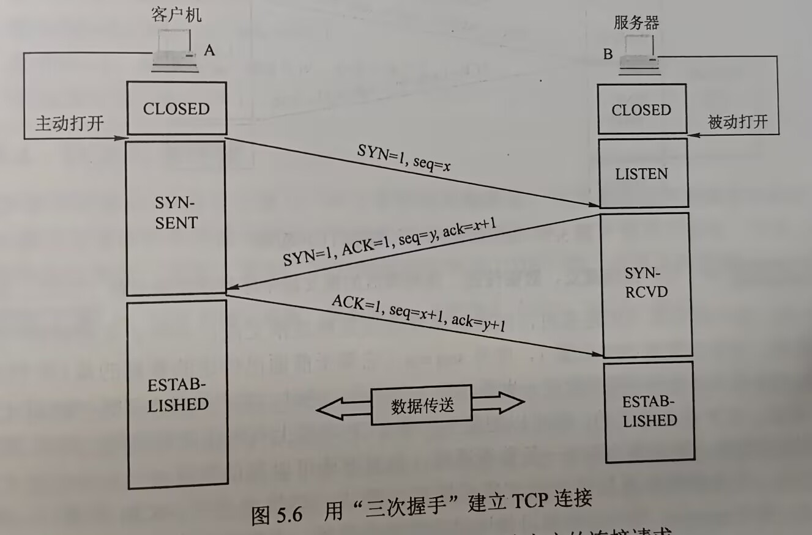

# 第五章 传输层

## 目录
- [第五章 传输层](#第五章-传输层)
  - [目录](#目录)
- [5.1 传输层提供的服务](#51-传输层提供的服务)
  - [5.1.1 传输层的功能](#511-传输层的功能)
    - [应用进程之间的逻辑通信](#应用进程之间的逻辑通信)
    - [复用和分用](#复用和分用)
    - [差错检测](#差错检测)
    - [提供面向连接和无连接的传输协议](#提供面向连接和无连接的传输协议)
  - [5.1.2 传输层的寻址与端口](#512-传输层的寻址与端口)
    - [端口的作用](#端口的作用)
    - [端口号](#端口号)
    - [套接字](#套接字)
  - [考点\&易错点](#考点易错点)
- [5.2 UDP](#52-udp)
  - [5.2.1 UDP数据报](#521-udp数据报)
    - [UDP概述](#udp概述)
    - [UDP首部格式](#udp首部格式)
  - [5.2.2 UDP校验](#522-udp校验)
- [5.3 TCP](#53-tcp)
  - [5.3.1 TCP的特点](#531-tcp的特点)
  - [5.3.2 TCP报文段](#532-tcp报文段)
  - [5.3.3 TCP连接管理](#533-tcp连接管理)
    - [TCP连接建立](#tcp连接建立)
    - [TCP连接的释放](#tcp连接的释放)
    - [对连接和释放的总结](#对连接和释放的总结)
  - [5.3.4 TCP可靠传输](#534-tcp可靠传输)
    - [序号](#序号)
    - [确认](#确认)
    - [重传](#重传)
  - [5.3.5 TCP流量控制](#535-tcp流量控制)
  - [5.3.6 TCP拥塞控制](#536-tcp拥塞控制)
    - [慢开始和拥塞避免](#慢开始和拥塞避免)
    - [快重传和快恢复](#快重传和快恢复)
  - [考点\&易错点](#考点易错点-1)

# 5.1 传输层提供的服务

## 5.1.1 传输层的功能

- 为运行在不同主机上的**进程**之间提供**逻辑通信**
  - 属于面向通信部分的最高层
  - 也是面向用户功能的最底层
  - 为应用程序提供可靠的服务
- 补充
  - 数据链路层提供**链路上相邻节点**之间的逻辑通信
  - 网络层提供**主机**之间的逻辑通信

### 应用进程之间的逻辑通信

- 也称**端到端**的逻辑通信，从传输层来看，通信的真正端点是主机中的进程

### 复用和分用

- 复用：发送方**不同应用进程**都可以使用**同一个传输层协议**传送数据
- 分用：接收方传输层在剥去报文首部后，能把数据正确交付到目的应用进程
- 补充
  - 网络层也有复用分用
  - 网络层复用：发送方不同协议的数据都可被封装成IP数据报发送出去
  - 分用：接收方网络层剥去首部后将数据交付给相应协议

### 差错检测

- 对**首部和数据部分**进行差错检测
  - TCP发现报文段出错，则要求发送方重发
  - UDP发现数据报出错，则直接丢弃

### 提供面向连接和无连接的传输协议

- 使应用程序看见的是两个传输层实体（进程）之间好像有一条端到端的逻辑通信信道
  - 采用TCP时，这种逻辑信道相当于一条全双工的可靠信道
  - 当传输层采用无连接UDP时，这种逻辑通信信道仍是一条不可靠信道

## 5.1.2 传输层的寻址与端口

### 端口的作用

- 标识主机中的应用进程 —— 传输层的服务访问点为”端口号“字段
- 软硬件端口
  - 软件端口，应用层各种协议进程与传输实体进行层间交互的一种地址 —— **传输层**使用
  - 硬件端口，不同硬件设备进行交互的接口

### 端口号

- 根据范围分类

  - 服务器端使用的端口号

    - 熟知端口号0~1023

      |  应用程序  | FTP  | TELNET | SMTP | DNS  | TFTP | HTTP | SNMP |
      | :--------: | ---- | ------ | ---- | ---- | ---- | ---- | ---- |
      | 熟知端口号 | 21   | 23     | 25   | 53   | 69   | 80   | 161  |

      

    - 登记端口号1024~49151 —— 使用这类端口号需要在IANA登记

  - 客户端使用的端口号49152~65535

    - 仅在客户进程运行时才动态选择，也称**1**

### 套接字

- 套接字实际上是一个通信端点

  ​	`套接字(Socket) = (IP地址: 端口号)`

## 考点&易错点

- 背记

| 互联网应用   | TCP/IP应用层协议         | TCP/IP传输层协议 |
| ------------ | ------------------------ | ---------------- |
| 域名解析     | 域名系统（DNS）          | UDP              |
| 文件传送     | 简单文件传送协议（TFTP） | UDP              |
| 路由选择     | 路由信息协议（RIP）      | UDP              |
| IP地址分配   | 动态主机配置协议（DHCP） | UDP              |
| 网络管理     | 简单网络管理协议（SNMP） | UDP              |
| IP多播       | 网际组管理协议（IGMP）   | UDP              |
| 电子邮件     | 简单邮件传送协议（SMTP） | TCP              |
| 远程终端接入 | 远程终端协议（TELNET）   | TCP              |
| 万维网       | 超文本传送协议（HTTP）   | TCP              |
| 文件传送     | 文件传送协议（FTP）      | TCP              |

- IP数据报和UDP数据报的区别
  - IP数据报在网络层须**经过路由器**的存储转发
  - UDP封装成IP数据报后，UDP数据报信息**对路由器不可见**

# 5.2 UDP

## 5.2.1 UDP数据报

### UDP概述

- UDP仅在IP层的数据报服务之上增加了复用、分用和差错检测的功能
- UDP**面向报文**：对于应用层交下来的报文，添加首部后直接向下交付给IP层，一次发送一个报文
  - 易错：若报文太长，UDP交给IP层后可能导致分片，IP层交给数据链路层（MTU较小的话）也会分片
  - **UDP首部字段中长度和校验和都可能会改变**

### UDP首部格式

- 首部8B，4个字段
  - 源端口 —— 不需要时可全0
  - 目的端口
  - 长度
  - 校验和 —— 不想计算时直接全0

## 5.2.2 UDP校验

- 12B伪首部
- 校验包括首部&数据部分 —— UDP被分片时会改变校验和

- 校验和计算方法 —— **小心最后计算完需要取反码**

# 5.3 TCP

## 5.3.1 TCP的特点

- 主要特点
  - 面向连接，是一条逻辑连接
  - TCP一对一
  - 提供可靠交付的服务，保证传送数据无差错、不丢失、不重复且有序
  - 提供全双工通信，两端都设有发送、接收缓存
  - **面向字节流**

## 5.3.2 TCP报文段

- TCP传送的数据单元称为**报文段**

  - 即可用来运载数据
  - 又可用来建立连接、释放连接和应答

- 报文段分为首部和数据两部分

  

  - 源端口和目的端口，各2B
  - 序号，4B，范围为0~$2^{32}-1$，共$2^{32}$个序号
    - TCP连接中传送的字节流中的每个字节都要按顺序编号，该字段指本报文段发送的数据的**第一个字节**的序号
    - 例如一个报文段序号字段值为301，携带100B，表明本报文段的数据的最后一个字节的序号是400，那么下一个报文段的数据序号就从401开始
  - 确认号，4B
    - 期望收到对方下一个报文段的第一个数据字节的序号
    - 若确认号为$N$，则表明到序号$N-1$为止的所有数据都已正确收到
    - 例如，B正确收到了A发送过来的一个报文段，序号字段为501，数据长度200B（序号501~700），这表明B正确收到了A发送的到序号700为止的数据。因此B期望收到A的下一个数据序号为701，于是B在发送给A的确认报文段中把确认号置为701
  - 数据偏移（首部长度），4bit
    - 不是IP数据报分片的那个数据偏移，而是表示首部长度 —— 首部中还有长度不确定的选项字段
    - 指出TCP报文段的数据起始处距离TCP报文段起始处有多远
    - 单位为4B，4位二进制能表示的最大值15，所以TCP首部的最大长度为60B
  - 保留，6bit
    - 保留为今后使用，目前置为0
  - 紧急位URG
    - URG=1时，表明紧急指针字段有效。告诉系统此报文段有紧急数据，应尽快传送（相当于高优先级的数据）。
    - 紧急数据被插入至报文段数据的最前面，而紧急数据后仍是普通数据，因此与首部中紧急指针字段配合使用
  - 确认位ACK
    - 仅当ACK=1时，确认号字段才有效；ACK=0时，确认号无效
    - TCP规定，在连接建立后，所有传送的报文段**都ACK置1**
  - 推送位PSH(Push)
    - 两个应用进程进行交互式通信时，都希望在键入一个命令后立即能收到对方响应，则发送方将PSH置1
    - 接收方TCP收到PSH=1的报文段后，就尽快交付给接收应用进程，而不再等到整个缓存填满了再向上交付
  - 复位位RST(Reset)
    - RST=1时，TCP连接中出现严重差错（如主机崩溃等），必须释放连接并重新建立传输连接
    - 还可用于拒绝一个非法报文段
  - 同步位SYN
    - SYN=1，表示这是一个连接请求或连接接受报文
    - SYN=1, ACK=0时，这是连接请求报文
    - 若同意建立连接，则响应报文中使用SYN=1, ACK=1
  - 终止位FIN(Finish)
    - 用于释放一个连接，FIN=1，表示报文段的发送方数据已发送完毕，并要求释放传输连接
  - 窗口，2B，0~$2^{16}-1$
    - 告诉对方：从本报文段首部中的确认号算起，接收方目前允许对方发送的数据量（1B为单位（
    - 例如：确认号是701，窗口字段是1000，表明发送这个ack=701报文的一方，还有接收1000字节（序号为701~1700）的接收缓存空间
  - 检验和，2B
    - 范围包括首部和数据
    - 计算时，加12B伪首部（只需伪首部协议字段的17改成6，UDP长度字段改成TCP长度，其他计算方法和UDP一样）
  - 紧急指针，2B
    - 仅在URG=1时有意义，指出本报文段中紧急数据的字节数
    - 即使窗口为0，也可以发送紧急数据
  - 选项，长度可变，最长可达40B
    - TCP最初仅规定一种选项：**最大报文段长度**（Maximum Segment Size，MSS）
    - 它是TCP报文段中数据字段的最大长度。
  - 填充，使整个首部长度是4B整数倍

## 5.3.3 TCP连接管理

- TCP**面向连接**，每个TCP连接都有三个阶段：连接建立、数据传送和连接释放
- TCP连接的管理就是使运输连接的建立和释放都能正常进行
- TCP连接建立的过程中，要解决三个问题
  - 使每一方能确知对方的**存在**
  - 允许双方**协商一些参数**（如最大窗口值，是否使用窗口扩大选项，时间戳选项等）
  - 能对**运输实体资源**进行分配
    - 如缓存大小、连接表中的项目等

- TCP把连接作为最基本的抽象，每条TCP连接有两个端点
  - TCP的端点是**套接字**（Socket） —— IP地址:端口
  - 两个端点唯一确定一条TCP连接
  - 同一个IP地址可以有多个不同TCP连接
  - 同一个端口号也可以出现在多个不同的TCP连接
- 连接建立采用客户/服务器模式
  - 主动发起连接建立的称为**客户**
  - 被动等待连接建立的称为**服务器**

### TCP连接建立

- 三次握手

  

  1. 客户机首先向服务器发送连接请求报文段。SYN位置1，同时选择初始序号seq=x
     - **TCP规定**：SYN报文段不能携带数据，但要**消耗一个序号**
     - 客户机进入SYN-SENT状态
  2. 服务器收到请求报文段后，同意建立连接，则发回确认。确认报文SYN=1，ACK=1，确认号ack=x+1，同时选择初始序号seq=y
     - 这同样是SYN报文段，**消耗一个序号**
     - 服务器进入SYN-RCVD状态
  3. 客户机向服务器给出确认。ACK=1，ack=y+1，seq=x+1
     - 客户机进入ESTABLISHED状态

### TCP连接的释放

- 四次挥手 —— 参与TCP连接的两个进程中**任何一个**都能终止该连接

  

  1. 客户机打算关闭连接时，向服务器发送*连接释放报文段*，并停止发送数据，主动关闭TCP连接。FIN=1，seq=u，

     - seq等于前面已传送数据最后一个字节的序号加1

     - FIN报文段即使不携带数据，**也要消耗一个序号**

     - 客户机进入FIN-WAIT-1状态

     - TCP全双工，发送FIN一段不能再发送数据，即关闭其中一条数据通路，**但对方还可以发送**

  2. 服务器收到*连接释放报文段*后即发出确认。ACK=1，ack=u+1，seq=v

     - seq等于前面已传送过的数据的最后一个字节的序号加1
     - 服务器进入CLOSE-WAIT（关闭等待）状态
     - 此时从**客户机到服务器**这个方向的连接释放了，TCP连接处于**半关闭状态**
     - 客户机收到确认后，进入FIN-WAIT-2状态

  3. 若服务器无要向客户机发送的数据，就向其发送连接释放报文段。FIN=1，ACK=1，seq=w

     - 服务器可能还发送了一些数据，必须重复发送上次已发送的确认号ack=u+1
     - 服务器进入LAST-ACK状态

  4. 客户机收到连接释放报文段后，必须发出确认。

     - ACK=1，ack=w+1，seq=u+1
     - 客户机进入TIME-WAIT状态，等待2MSL（Maximum Segment Lifetime，最长报文段寿命）后，进入CLOSED状态
     - 服务器收到确认后直接进入CLOSED状态

- 若服务器收到连接释放请求后不再发送数据，从客户机发出FIN报文段时刻算起

  - 客户机释放连接最短时间位1RTT+2MSL
  - 服务器释放连接最短时间为1.5RTT

- TCP使用一个**保活计时器**，避免客户机突然出现故障，从而导致服务器一直无效等待

  - 服务器每收到一次客户数据，就重置保活计时器
  - 若计时器到期还没收到客户的数据，服务器每隔75s发送一个探测报文段
  - 连续10个探测报文段仍未收到响应，则服务器认为客户机出现故障，关闭连接

### 对连接和释放的总结

- 建立连接
  1. SYN=1, seq=x
  2. SYN=1, ACK=1, seq=y, ack=x+1
  3. ACK=1, seq=x+1, ack=y+1
- 释放连接
  1. FIN=1, seq=u
  2. ACK=1, seq=v, ack=u+1
  3. FIN=1, ACK=1, seq=w, ack=u+1 —— w-v为服务器最后发送的数据长度
  4. ACK=1, seq=u+1, ack=w+1

## 5.3.4 TCP可靠传输

- 使用检验、序号、确认和重传等机制达到这一目的

### 序号

### 确认

- 默认使用**累积确认**，只确认数据流中至第一个丢失字节为止的字节，可减少传输开销
  - 接收方可在合适的时候发送确认
  - 也可在自己有数据要发送时，将确认信息捎带上 —— **捎带确认**

### 重传

- 两种重传会导致TCP对报文段重传：超时和冗余ACK
- 超时
  - 往返时间RTT（Round-Trip Time, RTT）
  - TCP维护一个**加权平均往返时间**RTTS，随新测量RTT样本值的变化而变化
  - **超时计时器**设置的**超时重传时间**（Retransmission Time-Out，RTO）应略大于RTTS
- 冗余ACK（冗余确认）
  - 冗余ACK —— 再次确认某个报文段的ACK
  - 例如A发送序号1、2、3、4、5，2号段在链路丢失，则3、4、5对于B来说就是失序报文段
  - **TCP规定**：每当比期望序号大的失序报文到达时，就发送一个冗余ACK，指明下一个期待字节的序号
  - 这里B发送3个对1号报文段的冗余ACK
  - **TCP规定**：发送方收到对同一个报文段的3个冗余ACK（即总共收到4个确认1），则可认为2号报文段已丢失，发送方A立即对其重传 —— **快速重传**
  - 冗余ACK也被用在拥塞控制中

## 5.3.5 TCP流量控制

- 流量控制：让发送方发送速率不要太快，让接收方来得及接收 —— 速度匹配服务
- 利用滑动窗口实现流量控制
  - 接收方维持**接收窗口**（rwnd）
  - 接收方根据当前接收缓存的大小，动态调整接收窗口的大小 —— 反映接收方的容量
  - 接收方将rwnd放在TCP报文段首部的“窗口”字段
  - 发送方**发送窗口**不能超过接收方给出接收窗口值
  - 
- TCP为每个连接设有一个**持续计时器**，只要发送方收到对方**零窗口通知**，就启动持续计时器。若计时器超时，就发送一个零窗口探测报文段，而对方就在确认这个探测报文段时给出现在的窗口值，若窗口仍为0，则发送方收到确认报文段后就重新设置持续计时器
  - 零窗口通知：即表示窗口长度为0
- 传输层vs数据链路层
  - 数据链路层滑动窗口大小不可变
  - 传输层窗口大小可以动态变化

## 5.3.6 TCP拥塞控制

- **拥塞控制**：防止过多的数据注入网络，保证网络中路由器不致过载
  - 端点无法感知，拥塞仅表现为通信时延的增加
- 拥塞控制vs流量控制
  - 拥塞控制时全局性的过程
  - 流量控制是对通信量的控制
- TCP要求发送方维持一个**拥塞窗口**（cwnd），大小取决于网络的拥塞程度，并动态变化
  - **发送方控制拥塞窗口的原则**：只要网络未出现拥塞，拥塞窗口就再大一些，把更多分组发送出去，提高网络的利用率；只要拥塞，就减小一些，缓解网络出现的拥塞
- **发送窗口**：`发送窗口上限值 = min[rwnd, cwnd]`
  - 假设：数据为单方向传送，对方只传送确认报文；接收方总是有足够大的缓存空间，因而发送窗口的大小由网络的拥塞程度决定
  - 下面采用最大报文段长度**MSS作为拥塞窗口大小的单位**
    - 所以小心基本单位2KB或者什么的

### 慢开始和拥塞避免

cwnd：1 --RTT-> 2 --RTT-> 4 ... sstresh --RTT-> sstresh+1 ...

1. 慢开始算法
   - **慢**：并非指增长慢，而是一开始cwnd小
   - 指数增加
2. 拥塞避免
   - 线性增加
3. 网络拥塞的处理
   - ssthresh = cwnd/2
   - cwnd = 1
   - 迅速减少主机发送量，以便拥塞的路由器能及时处理完

### 快重传和快恢复

- 快重传：发送方收3个冗余ACK，则立即重传该报文段
- 快恢复：发送方连续收到3个冗余ACK时
  - ssthresh = cwnd/2
  - cwnd = cwnd/2
  - cwnd立即开始线性增大
- **快**：绕过cwnd=1的阶段

## 考点&易错点

- TCP和UDP都有伪首部
  - TCP伪首部协议字段为6
  - UDP为17

- TCP报文段首部窗口字段值含义：指明自己接收窗口的值 —— 即要告诉对方最多只能发多少
- TCP传输大量数据时，数据发送的单位是MSS
  - 在建立连接时，会互相告诉MSS的值，并且选择较小的MSS采用
- 零窗口通知 —— 即窗口字段值为0
  - 发送方维护一个 **持续计时器**，若计时器超时，就发送一个零窗口探测报文段
- TCP滑动窗口协议中，规定重传分组最多可以：等于滑动窗口的大小
  - **注意**：窗口中的已发送的分组，如果没触发快重传或者超时重传，那么**不算在可以继续发送的数据序号范围中**
- 小心SYN=1或FIN=1的请求报文，会占用一个seq
- 记一下三次握手四次挥手的状态
  - 三次握手：
    - 客户机CLOSED, SYN-SENT, ESTABLISHED
    - 服务器LISTEN, SYN-RCVD, ESTABLISHED
  - 四次挥手
    - 客户机ESTABLISHED, FIN-WAIT-1, FIN-WAIT-2, TIME-WAIT, CLOSED
    - 服务器ESTABLISHED, CLOSE-WAIT, LAST-ACK, CLOSED
