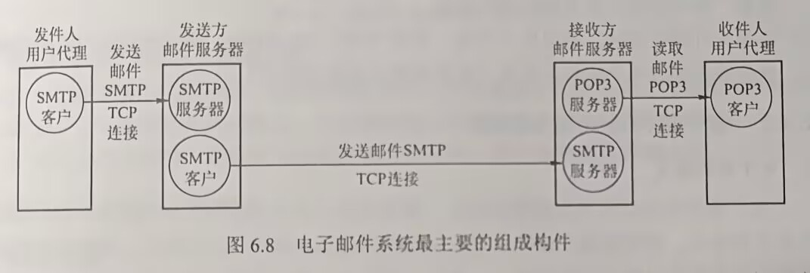
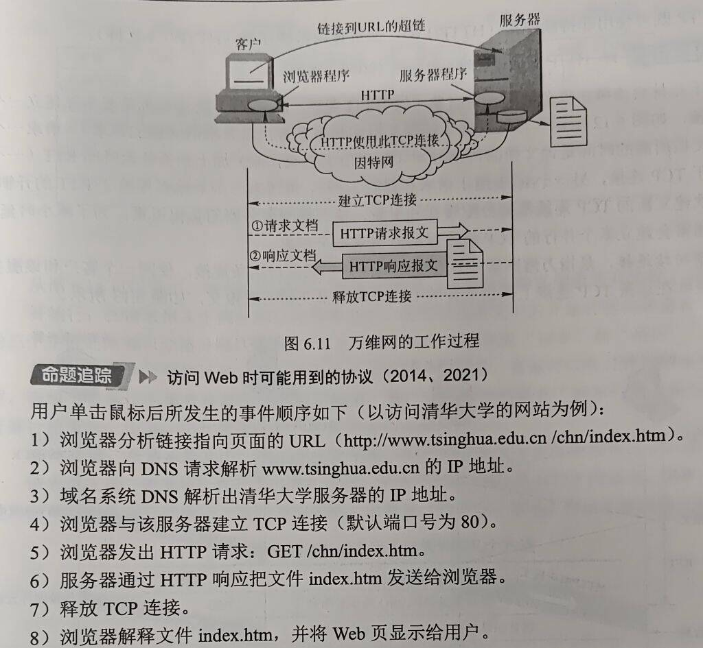
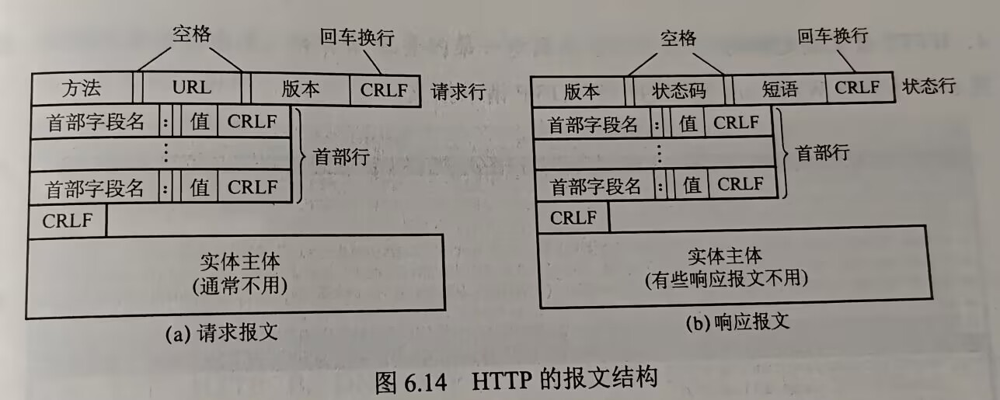

# 第六章 应用层

## 目录

- [第六章 应用层](#第六章-应用层)
  - [目录](#目录)
- [6.1 网络应用模型](#61-网络应用模型)
  - [6.1.1 客户/服务器模型](#611-客户服务器模型)
  - [6.1.2 P2P模型](#612-p2p模型)
- [6.2 域名系统](#62-域名系统)
  - [6.2.1 层次域名空间](#621-层次域名空间)
  - [6.2.2 域名服务器](#622-域名服务器)
    - [根域名服务器](#根域名服务器)
    - [顶级域名服务器](#顶级域名服务器)
    - [权限域名服务器（授权域名服务器）](#权限域名服务器授权域名服务器)
    - [本地域名服务器](#本地域名服务器)
  - [6.2.3 域名解析过程](#623-域名解析过程)
    - [域名解析](#域名解析)
    - [递归查询DNS的工作原理](#递归查询dns的工作原理)
    - [迭代查询工作原理](#迭代查询工作原理)
  - [考点及易错点](#考点及易错点)
- [6.3 文件传输协议](#63-文件传输协议)
  - [6.3.1 FTP的工作原理](#631-ftp的工作原理)
    - [概念及作用](#概念及作用)
    - [工作方式](#工作方式)
  - [6.3.2 控制连接与数据连接](#632-控制连接与数据连接)
    - [控制连接](#控制连接)
    - [数据连接](#数据连接)
  - [考点易错点整理](#考点易错点整理)
- [6.4 电子邮件](#64-电子邮件)
  - [6.4.1 电子邮件系统的组成结构](#641-电子邮件系统的组成结构)
  - [6.4.2 电子邮件格式与MIME](#642-电子邮件格式与mime)
    - [电子邮件格式](#电子邮件格式)
    - [多用途因特网邮件扩展（MIME）](#多用途因特网邮件扩展mime)
  - [6.4.3 SMTP和POP3](#643-smtp和pop3)
    - [SMTP](#smtp)
    - [POP3和IMAP](#pop3和imap)
  - [考点\&易错点](#考点易错点)
- [6.5 万维网](#65-万维网)
  - [6.5.1 WWW的概念与组成结构](#651-www的概念与组成结构)
  - [6.5.2 超文本传输协议](#652-超文本传输协议)
    - [HTTP的操作过程](#http的操作过程)
    - [HTTP的特点](#http的特点)
    - [HTTP页面请求时间分析](#http页面请求时间分析)
    - [HTTP的报文结构](#http的报文结构)
    - [HTTP请求报文中常用的几个方法](#http请求报文中常用的几个方法)
  - [常见应用层协议小结](#常见应用层协议小结)
  - [考点易错点整理](#考点易错点整理-1)

# 6.1 网络应用模型

## 6.1.1 客户/服务器模型

- 服务器：总是打开的主机，服务于许多来自其他客户机的主机请求
- 工作流程
  1. 服务器处于接收请求的状态
  2. 客户机发出服务请求，并等待接收结果
  3. 服务器收到请求，分析请求，进行必要的处理，得到结果并发送给客户机
- 最主要的特征：客户是服务请求方，服务器是服务提供方
- 常见应用：Web、FTP、远程登录和电子邮件等
- 主要特点：
  - 各计算机地位不平等，整个网络的管理工作由少数服务器负责，网络的管理非常集中和方便
  - 客户机相互之间不直接通信
  - 可扩展性不佳 —— 受服务器硬件和网络带宽限制，服务器支持的客户机数量有限

## 6.1.2 P2P模型

- 思想：整个网络中的传输内容不再被保存在中心服务器上，每个结点都同时具有下载、上传的功能，其权利和义务大体对等
- 对等方（Peer），直接相互通信
- 主要优点
  - 减轻服务器计算压力，消除对某个服务器的完全依赖，可以将任务分配到各个节点上，大大提高系统效率和资源利用率
  - 多个客户机直接可以直接共享
  - 可扩展性好
  - 网络健壮性强，单个节点失效不会影响其他部分的节点
- 缺点：
  - 占用较多内存，影响整机速度
  - 对硬盘造成较大损伤
  - 使互联网变得拥塞

# 6.2 域名系统

- 域名系统（Domain Name System，DNS）是因特网使用的命名系统。特定含义主机名 -> 便于机器处理的IP地址

- DNS协议：客户/服务器模型，运行于UDP之上，53号端口
- 概念可分为三部分：
  - 层次域名空间
  - 域名服务器
  - 域名解析器

## 6.2.1 层次域名空间

- 任何一个连接到因特网的主机/路由器，都有一个唯一的层次结构名称，**域名**（Domain Name）
- **域**：是名字空间中一个*可被管理*的划分
  - 域可以划分为子域，子域则可以继续划分，形成顶级域、二级域、三级域etc.
  - 每个域名由**标号序列**组成，各**标号**之间用点(".")隔开
- 注意
  - 标号中英文不区分大小写
  - 标号中除连字符不能使用其他标点符号
  - 每个标号不超过63字符，多标号完整域名不超过255个字符
  - 级别最低域名写左边，级别最高顶级域名写右边
- 顶级域名（Top Level Domain， TLD）分为三类
  - 国家（地区）顶级域名（nTLD）
    - .cn, .us, .uk
  - 通用顶级域名（gTLD）
    - .com, .net, .org, .edu, .gov
  - 基础结构域名（arpa）
    - 用于反向域名解析
- 域名系统中，各级域名由其上一级的域名管理机构管理，顶级域名由因特网名称与数字地址分配机构（ICANN）管理。
  - 国家顶级域名下注册的二级域名均由该国家自行确定
  - 每个组织都可以将它的域再分为一定数量的子域，并将子域委托给其他组织去管理

## 6.2.2 域名服务器

- 域名到IP地址的解析，由运行在**域名服务器**上的程序完成
- 一个服务器管辖（或有权限的）范围称为**区**（小于等于域）
- 每个区设置有相应的**权限域名服务器**，保存该区中所有主机的域名到IP地址的映射
- 每个域名服务器不仅能进行一些解析，还具有连向其他域名服务器的信息 —— 自己不知道时可以去其他地方找。
- 域名服务器按**层次方式**组织

### 根域名服务器

- 最高层次的域名服务器，知道所有的顶级域名服务器的域名和IP地址
- 并不直接将待查询域名直接转换成IP地址，而是告诉**本地域名服务器**下一步应该找哪个顶级域名服务器

### 顶级域名服务器

- 管理在该顶级域名服务器注册的所有二级域名
- 收到DNS查询请求给出相应回答（可能最后结果也可能是下一步查询的域名服务器）

### 权限域名服务器（授权域名服务器）

- 每台主机都必须在权限域名服务器登记
- 许多域名服务器同时充当本地域名服务器和权限域名服务器

### 本地域名服务器

- 本地填写的DNS地址就是本地DNS的地址
- 当一台主机发出DNS查询请求时，这个查询请求报文就发送给该主机的本地域名服务器

## 6.2.3 域名解析过程

### 域名解析

- 含义：域名转化为IP地址的过程，客户端需要域名解析时，通过本机的**DNS客户端**构造一个DNS请求报文，以UDP数据报发送**本地DNS**

- 方式：递归查询和迭代查询
  - 主机向本地域名服务器的查询都采用***递归查询***
  - 本地域名服务器向其他域名服务器采用*递归查询*或*迭代查询*
- **递归查询**：主机询问的本地域名服务器不知道被查询域名的IP地址，则本地域名服务器以**DNS客户**的方式，向根域名服务器继续发出查询请求报文，**而不是让主机自己进行**下一步查询

### 递归查询DNS的工作原理

- 本地域名服务器 -> 根域名服务器，根域名服务器递归向下查询，最后本地域名服务器从根域名服务器得到所需的IP地址
- 给根域名服务器负载过大，实际中几乎不使用

### 迭代查询工作原理

- 主机 -> 本地域名服务器 —— 递归查询
- 本地域名服务器 -> 根域名服务器 —— 迭代查询                                                      
- 根域名服务器收到本地的查询请求时，
  - 要查询的IP地址
  - 或下一步应向哪个顶级域名服务器进行查询
- 然后直到查询完成

## 考点及易错点

- 权限域名服务器：可以将其管辖的主机名转换成主机的IP地址

- 采用迭代查询方式查询`www.abc.xyz.com`，发出DNS查询最多次数是？
  - 本地域名服务器需要迭代地向：
    - 根域名服务器 —— 注意它是给出顶级域名服务器的
    - 顶级域名服务器(.com)
    - 权限域名服务器(.xyz.com)
    - 权限域名服务器(abc.xyz.com)发出查询请求
  - 发出DNS查询请求
- 考：通过超链接请求纯文本Web页
  - 不仅需要考虑DNS请求的RTT
  - 还需要考虑TCP三次握手的RTT —— 在第三次握手报文可以捎带对资源的请求

# 6.3 文件传输协议

## 6.3.1 FTP的工作原理

### 概念及作用

- 文件传输协议（File Transfer Protocol, FTP）
- 提供交互式的访问，允许客户指明文件的类型与格式，并允许文件具有存取权限
- 功能
  - 提供不同种类主机系统之间（**异构**）的文件传输能力
  - 以用户权限管理的方式提供用户对远程FTP服务器上的文件管理能力
  - 以匿名FTP的方式提供公用文件共享的能力

### 工作方式

- FTP采用C/S工作方式，使用TCP可靠的传输服务。一个FTP服务器进程可同时为多个客户进程提供服务
- FTP服务器进程两大部分组成
  - 主进程：接收新的请求
  - 若干从属进程：处理单个请求
- 工作步骤
  - 打开熟知端口21，使客户进程能够连接上
  - 等待客户进程发送连接请求
  - 启动从属进程处理客户进程发来的请求，从属进程对请求处理完毕即终止
  - 回到等待状态，继续接收请求
  - 主进程与从属进程是并发执行的
- FTP服务器需要在整个会话期间保留用户的状态信息。特别是服务器必须把执行的用户账户与控制连接联系起来，服务器必须追踪用户在远程目录树上的当前位置

## 6.3.2 控制连接与数据连接

- FTP工作时使用两个并行的TCP连接
  - 控制连接：服务器端口号21
  - 数据连接：服务器端口号20

### 控制连接

- 服务器监听21号端口，等待客户连接，建立在这个端口上的连接称为**控制连接**用来传输控制信息（如连接请求、传送请求等）
- FTP客户发出的传送请求，通过控制连接发送给服务器端中的控制进程
- 控制进程不用来传输文件，传输文件时可以使用控制连接，因此控制连接在**整个会话期间一直保持打开状态**

### 数据连接

- 服务器端控制进程收到FTP客户发送来的文件传输请求后，创建**数据传送进程**和**数据连接**
  - 数据连接：连接客户端和服务器端的数据传送进程
  - 数据传送进程：实际完成文件的传送，传送完毕后关闭”数据传送连接“并结束运行
- 数据连接有两种传输模式：主动模式PORT和被动模式PASV
  - PORT工作原理：
    - 客户端连接到服务器21端口
    - 登录成功后要读取数据，客户端随机开放一个端口，并发送命令告知服务器
    - 服务器收到PORT命令和端口号后，通过20端口和客户端开放的端口连接，发送数据
  - PASV模式不同之处：
    - 客户端要读取数据时，发送PASV命令到服务器
    - 服务器本地随机开放一个端口，告知客户端
    - 客户端再连接到服务器开放的端口进行数据传输
  - **总结**：
    - 主动模式（默认）：服务器连接到客户端的端口
    - 被动模式：客户端连接到服务器的端口
- FTP使用了一个分离的控制连接，所以成FTP的控制信息是带外（Out-of-band）传送的
  - 使用FTP时，要修改服务器上的文件，就需要先将此文件传送到本地主机
  - 然后将修改后的文件副本传送到原服务器，来回传送耗费很多时间
- 网络文件系统（NFS）
  - 允许进程打开一个远程文件，并能在该文件的某个特定位置开始读写数据
  - 这样NFS可以使得用户只复制一个大文件中的一个很小的片段，而不需要复制整个大文件

## 考点易错点整理

- 问到端口相关的问题
  - 先考虑是PORT方式（如果没特别说明）
    - 服务器端，控制连接使用21号端口，数据连接使用**TCP**的20号端口
    - 客户端：控制连接和数据连接的TCP端口号都是客户端系统**自动分配**
- 从上往下的数据名称
  - 应用层：数据
  - 传输层：数据段
  - 网络层：数据报
  - 数据链路层：数据帧
  - 物理层：比特

# 6.4 电子邮件

## 6.4.1 电子邮件系统的组成结构

- 电子邮件系统有三个最主要的组成构件：用户代理（User Agent）、邮件服务器和电子邮件使用的协议（SMTP、POP3（或IMAP）等）

  

  - 用户代理（UA）：用户与电子邮件系统的接口
    - 用户代理向用户提供一个很友好的接口来发送/接收邮件
    - 撰写、显示和邮件处理的功能
    - 通常用户代理就是运行在PC上的程序
  - 邮件服务器
    - 发送和接收邮件
    - 同时向发件人报告邮件传送的情况（已交付、被拒绝、丢失等）
    - 以C/S模式工作，但它必须能同时充当客户和服务器（两个服务器互相发送邮件时）
  - 邮件发送协议和读取协议
    - 邮件发送协议：SMTP（Push的通信方式）
      - 用户代理/邮件服务器向邮件服务器发送邮件时，SMTP将邮件推送到SMTP服务器
    - 邮件接收协议：POP3（Pull的通信方式）
      - 用户读取邮件时，用户代理向邮件服务器发出请求，拉取用户邮箱中的邮件

- 邮件不会在互联网某个中间服务器落地

## 6.4.2 电子邮件格式与MIME

### 电子邮件格式

### 多用途因特网邮件扩展（MIME）

- SMTP只能传送7位ASCII码文本邮件，且无法传送可执行文件或其他二进制对象
- 提出**MIME**
- 发送的邮件包含非ASCII码数据时，不能直接使用SMTP进行传送，而要通过MIME转换，非ASCII数据 -> ASCII码数据，之后可使用SMTP传送
- MIME主要内容
  - 5个新的邮件首部字段，MIME版本、内容描述、内容标识、传送编码、内容类型
  - 定义许多邮件内容的格式，对多媒体电子邮件的表示方法进行标准或
  - 定义了传送编码，可对任何内容格式进行转换，而不会被邮件系统改变

## 6.4.3 SMTP和POP3

### SMTP

- 简单邮件传输协议（Simple Mail Transfer Protocol, SMTP）
  - 是一种提供可靠且有效的电子邮件传输的协议，控制两个相互通信的SMTP进程交换信息
  - TCP连接、端口号25
- SMTP通信三个阶段
  - 连接建立
    - 发件人邮件发送到发送方邮件服务器的**邮件缓存**中后，SMTP客户每个一定时间对邮件缓存扫描一次
    - 若发现有邮件，就与接收方邮件服务器的SMTP服务器建立TCP连接，使用熟知端口号25
    - 连接建立后，接收方SMTP服务器发出220 Service ready
    - SMTP客户向SMTP服务器发送HELO命令，附上发送方的主机名
    - 接收方邮件服务器因故暂时不能建立连接时，发送方邮件服务器**只能等待一段时间**后再次尝试连接
  - 邮件传送
  - 连接释放

### POP3和IMAP

- 邮局协议（Post Office Protocol，POP）：非常简单但功能有限的邮件读取协议，现在使用POP3
  - 采用客户/服务器模式，在传输层使用TCP，端口号110
  - 接收方用的用户代理必须运行POP客户程序，接收方的邮件服务器运行POP服务器程序
  - 两种工作方式
    - 下载并保留：用户读取邮件后，邮件仍保留在服务器上
    - 下载并删除：邮件一读取就从服务器上删除

- 因特网报文存取协议（IMAP）
  - 为用户提供了创建文件夹、在不同文件夹之间移动邮件，在远程文件夹中查询邮件等联机命令，为此IMAP服务器维护了会话用户的状态信息
  - 允许用户代理只获取报文某些部分，例如只读取一个报文的首部，非常适用于低带宽

## 考点&易错点

- **基于万维网的电子邮件**
  - 用户浏览器与邮件服务器之间的邮件**发送**与**接收**使用HTTP
  - 仅在不同邮件服务器中才使用SMTP
- POP3协议的补充
  - POP3协议在传输层使用明文传输密码，并不对密码进行加密
  - 客户端决定工作方式：下载并保留/下载并删除
  - 一个账号在一个邮件服务器上只能有一个邮件接收目录

# 6.5 万维网

## 6.5.1 WWW的概念与组成结构

- 万维网（World Wide Web，WWW）是一个分布式、联机式的信息存储空间

  - 空间中一样（量词）有用的事物称为一样**资源**，有一个全域**统一资源定位符**（URL）标识
  - 这些资源通过**超文本传输协议**（HTTP）传送给使用者，使用者通过单击链接来获取资源

- 万维网的内核部分由三个标准构成

  - URL：负责标识万维网上各种文档，并使每个文档在整个万维网范围内唯一
  - HTTP：应用层协议，使用TCP，万维网客户程序和服务器程序之间交互必须严格遵守的协议
  - HTML：文档结构的标记语言

- URL相当于一个文件名在网络范围内的扩展

  `<协议>://<主机>:<端口>/<路径>`

  - 协议：使用什么协议获取万维网文档，http、ftp等
  - 主机：主机在因特网中的域名/IP地址
  - 端口和路径有时可省略

- C/S模式工作

  - 浏览器是用户主机上的**万维网客户程序**
  - 万维网文档所驻留的主机则运行服务器程序，这台主机称为**万维网服务器**

- 客户程序向服务器程序发出请求，服务器程序向客户程序送回客户所要的文档

## 6.5.2 超文本传输协议

- HTTP定义了浏览器怎样向万维网服务器请求万维网文档，以及服务器怎样把文档传送给浏览器
- 层次角度上看，HTTP是**面向事务**（Transaction-oriented）的应用层协议，规定浏览器和服务器之间的请求和响应的格式与规则

### HTTP的操作过程

- 实际过程还涉及
  - 应用层 DHCP、DNS和HTTP
  - 传输层UDP和TCP
  - 网络层IP和ARP
  - 数据链路层CSMA/CD或PPP（涉及ISP接入/广域网传输）

### HTTP的特点

- HTTP本身是**无连接的**，通信双方交换HTTP报文之前不需要先建立HTTP连接
- HTTP是**无状态的**
- 使用**Cookie**+数据库来跟踪用户的活动
  - Cookie工作原理
    - 用户初次浏览某个使用Cookie的网站时，该网站服务器就为用户产生唯一的一个Cookie识别码，并以此位索引在后端数据库创建一个项目，记录用户访问该网站的各种信息
    - 服务器->用户的响应报文中添加`Set-cookie`的首部行
    - 用户收到响应后，就会在它管理的特定Cookie文件中添加该服务器的主机名和Cookie识别码
    - 这样用户再次浏览这个网站时，取出网站的识别码，并在请求报文中添加一个Cookie首部行，服务器根据Cookie识别码能从数据库查到活动记录

- HTTP即可使用非持续连接(HTTP/1.0)，又可使用持续连接(HTTP/1.1)

###  HTTP页面请求时间分析

- **非持续连接**：每个网页对象（HTML文本、JPEG图形等等）的传输都需要单独建立一个TCP连接
  - 请求一个万维网文档所需的时间：文档传输时间+2RTT （1个RTT用于建立TCP，1个RTT用于请求和接收文档）
  - 之后每请求一个对象都导致2RTT的开销
- **持续连接**：万维网服务器发送响应后仍保持这条连接，使同一个客户和该服务器可以持续在这条TCP连接上传送后续的HTTP请求报文和连接报文
  - 非流水线：客户收到前一个响应后才能发出下一个请求，服务器发送完一个对象后其TCP连接就处于空闲状态
  
  - 流水线：客户可以连续发出对各个对象的请求，服务器可连续响应，则引用所有对象共经历1RTT延迟

### HTTP的报文结构

- HTTP时面向文本的，报文每个字段都是一些ASCII码传，并且每个字段长度都是不确定的，有两类HTTP报文

  

  - 请求报文：客户向服务器发送的请求报文
  - 响应报文：服务器到客户的回答

- 两种报文都由三个部分组成，格式的区别就是开始行不同

  - **开始行**：请求报文中的开始行称为*请求行*，响应报文中的开始行称为*状态行*。开始行三个字段都以空格分割，最后CR和LF代表回车和换行
  - **首部行**：用来说明浏览器、服务器或报文主体的一些信息。可以有几行也可以不使用。每个首部行中都有首部字段名和它的值，每行结束都要有回车和换行（CR和LF），整个首部行结束后，还有一个空行将首部行与后面的实体主体分开
  - **实体主体**：请求报文中一般不用这个字段，响应报文中也可能没有

### HTTP请求报文中常用的几个方法

| 方法（操作） | 意义                          |
| ------------ | ----------------------------- |
| GET          | 请求读取由URL标志的信息       |
| HEAD         | 请求读取由URL标志的信息的首部 |
| POST         | 给服务器添加信息              |
| PUT          | 指明的URL下存储一个文档       |
| DELETE       | 删除指明的URL所标志的资源     |
| CONNECT      | 用于代理服务器                |

## 常见应用层协议小结

| 应用程序   | FTP数据连接 | FTP控制连接 | TELNET | SMTP | DNS  | TFTP | HTTP | POP3 | SNMP |
| ---------- | :---------: | ----------- | ------ | ---- | ---- | ---- | ---- | ---- | ---- |
| 使用协议   |     TCP     | TCP         | TCP    | TCP  | UDP  | UDP  | TCP  | TCP  | UDP  |
| 熟知端口号 |     20      | 21          | 23     | 25   | 53   | 69   | 80   | 110  | 161  |

## 考点易错点整理

- 从协议分析的角度，WWW服务
  - 向DNS请求域名解析，获取IP地址
  - 获得服务器IP地址，请求建立TCP连接
  - 先获取文本
  - 再根据文本中引用的图片文件URL获取图片
- HTTP中，HEAD方法作用主要是调试，请求不会返回报文
- Cookie由服务器产生，是存储与用户主机中的文本文件
- NAT路由器转换时
  - 若分组的`<源IP:端口>`不在表项中，则直接丢弃分组
- HTTP报文头部
  - Connection：连接方式
    - Close标识非持续连接
    - keep-alive表示持续连接方式
  - Cookie：Cookie号
    - 能够表示客户曾经**访问过**这个服务器
  - Host：目标主机
