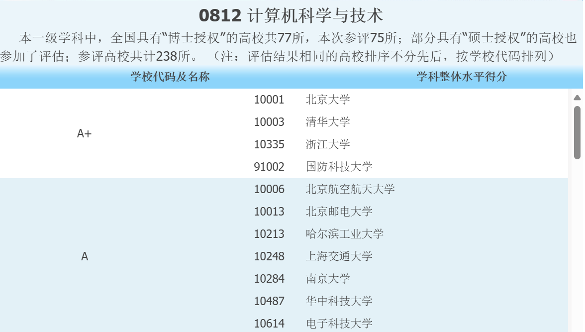

[TOC]

# 2026 CS/人工智能考研院校情况整理

## NJU

### 计算机科学与技术

- [南京大学2025年硕士研究生招生目录](https://yzb.nju.edu.cn/f4/93/c47862a717971/page.htm)
- 学硕76、专硕130
- 专硕353

### 人工智能（专硕）

- 085410人工智能
- 11408
- 25人
  - 智能科学与技术学院

## 国科大UCAC

### 计算所

#### 电子信息（CS专硕）

- 55人（含为南京学院代招18人，推免生16人）
- [招生单位- 中国科学院大学招生信息网](https://admission.ucas.ac.cn/info/ZhaoshengDanweiDetail/9e780c52-baf5-4020-b453-bc4510579559/8013212025)
- [计算所网址](http://www.ict.ac.cn/)

## 哈工深

- 0854计算机专硕
  - 132（不含推免生数）
  - 360~380